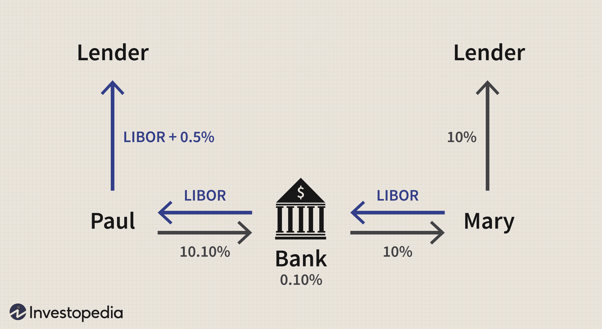

In financial instruments, swap agreements and derivatives have emerged as pivotal tools for managing risk and capitalizing on market opportunities. These financial constructs are particularly significant in algorithmic trading, where speed and precision are crucial. Swap agreements, often utilized to hedge against interest rate or currency fluctuations, involve the exchange of cash flows or financial liabilities between two parties. Derivatives, on the other hand, are financial contracts whose value is tied to an underlying asset, index, or rate, offering both risk management and speculative opportunities.

Algorithmic trading, employing advanced algorithms to execute trades at high speed, integrates swaps and derivatives to enhance risk management and execution efficiency. This synergy allows traders to make informed decisions rapidly, optimizing investment strategies through responsive and dynamic approaches.

Understanding the complex interactions among swap agreements, derivatives, and algorithmic trading enables investors and traders to strengthen their strategic positions within the financial markets. The following discussion will define swap agreements, explore their evolution, and examine their interplay with derivatives and algorithmic trading, ultimately offering insights into their roles and benefits. By mastering these concepts, market participants can optimize their strategies and navigate the complexities of modern financial instruments with greater confidence.

## Table of Contents

## Understanding Swap Agreements

Swap agreements are contracts where two parties exchange cash flows or financial liabilities, and they have become essential instruments in managing financial risks associated with interest rate or currency fluctuations. These contracts emerged in the 1970s in Great Britain as a response to the new challenges faced in the financial markets, evolving from simple currency exchanges into complex global financial instruments. 

The key types of swaps hold different strategic purposes within financial markets. Interest rate swaps are the most conventional form, where two parties agree to exchange interest payment streams based on a specified principal amount. The primary goal is to hedge against interest rate risk or capitalize on anticipated movements in interest rates. For instance, a company paying a variable interest rate on its debt might enter into a swap to exchange this for a fixed-rate payment to stabilize its interest expenses.

Currency swaps facilitate the exchange of principal and interest payments in one currency for principal and interest payments in another. These swaps serve multinational companies looking to manage foreign exchange risk efficiently by aligning cash flows in different currencies without actually changing the physical holdings of currency. This can be particularly useful for companies with operations in multiple countries needing to shield against adverse currency movements.

Commodity swaps involve the exchange of cash flows related to the price of a specific commodity. These swaps are typically used by producers and consumers of commodities to secure a stable income stream, managing risks associated with fluctuations in commodity prices.

A landmark event in the history of swap agreements was the first formal swap contract executed between IBM and the World Bank in 1981. This transaction illustrated the effectiveness of swaps in managing complex, cross-border financial activities. IBM effectively managed its exposure to fluctuating interest rates and different currencies through this swap, paving the way for broader adoption of such instruments in global finance.

Understanding swap agreements is crucial for financial professionals. By grasping the fundamentals, investors and traders can leverage these tools to optimize their financial strategies, making informed decisions that align with their risk management goals and market positioning.

## Derivatives in Financial Markets

Derivatives are financial contracts that derive their value from an underlying asset, index, or rate. These instruments are fundamental components of the global derivatives market, where they play essential roles in both risk management and speculative trading activities. The market offers a variety of derivative products, including futures, options, and swaps, each presenting unique opportunities and inherent risks.

Swaps, a significant subclass of derivatives, are particularly vital for risk management purposes. By engaging in swaps, entities can stabilize cash flows amid market [volatility](/wiki/volatility-trading-strategies), thus ensuring a more predictable financial environment. For instance, [interest rate](/wiki/interest-rate-trading-strategies) swaps involve exchanging cash flows based on differing interest rates, allowing parties to hedge against interest rate fluctuations. Similarly, currency swaps enable compensation against unpredictable foreign exchange movements, serving as a tool for entities operating across multiple currencies.

Apart from risk mitigation, derivatives also serve as speculative tools. Traders can leverage derivatives to gain from anticipated price movements in the underlying assets. Options, for example, grant the right, but not the obligation, to buy or sell an asset at a predetermined price, providing potential gains from volatility without requiring large upfront capital. Futures contracts allow participants to speculate on the future price of an asset, facilitating profit opportunities from both market rises and falls.

The derivative market's complexity and breadth necessitate a thorough understanding of financial markets and instruments. The valuation of derivatives often relies on sophisticated financial models, such as the Black-Scholes model for options pricing, which incorporates factors like volatility, interest rates, and time to expiration. Understanding how these variables affect derivatives' pricing is crucial for market participants. Moreover, regulatory frameworks and market dynamics further complicate derivative trading, demanding a comprehensive grasp of the interplay between market forces and financial instruments.

In essence, derivatives in the financial markets offer mechanisms for risk reduction while presenting avenues for speculative ventures. Mastery of derivative instruments requires both knowledge of underlying assets and proficiency in quantitative financial techniques, enabling effective utilization of these instruments to achieve strategic financial objectives.

## Algorithmic Trading: Integrating Swaps and Derivatives

Algorithmic trading employs sophisticated computational algorithms to automate trade executions, improving both speed and efficiency in financial markets. This approach leverages vast datasets and advanced mathematical models to optimize investment strategies. Integrating swaps and derivatives into [algorithmic trading](/wiki/algorithmic-trading) frameworks significantly bolsters risk management and enhances execution efficiency.

Swaps and derivatives like swaptions introduce complexities that algorithms can efficiently manage by quickly analyzing market data. Through real-time analysis of market conditions, algorithms enable traders to make informed decisions, particularly regarding the optimal pricing and execution of trades involving derivatives. For example, swaptions, which are options on interest rate swaps, require precise valuation to mitigate risk and maximize return.  

Models such as the Black-Scholes and Hull-White are integral in this context, allowing for accurate derivative pricing within algorithmic systems. The Black-Scholes model, known for its use in option pricing, provides a framework for estimating the value of derivatives based on variables like volatility, strike price, and time to maturity. The formula is represented as:

$$
C = S_0 N(d_1) - Xe^{-rt}N(d_2)
$$

where $C$ is the option price, $S_0$ is the current price of the underlying asset, $X$ is the strike price, $t$ is the time to expiration, $r$ is the risk-free rate, and $N$ is the cumulative distribution function of the standard normal distribution. The terms $d_1$ and $d_2$ are calculated as:

$$
d_1 = \frac{\ln(S_0/X) + (r + \sigma^2/2)t}{\sigma \sqrt{t}}
$$
$$
d_2 = d_1 - \sigma \sqrt{t}
$$

The Hull-White model, on the other hand, is pivotal for interest rate derivatives, accommodating complex interest rate movements more flexibly than the existing models, thus suiting swaptions trading.

Integrating these models into algorithmic frameworks allows for rapid and dynamic adjustments to investment strategies. By continuously updating pricing models with current market data, algorithms ensure that investment strategies are not only responsive but also preemptively aligned with potential market shifts. 

Moreover, such integration allows for the seamless orchestration of complex trading activities, where multiple derivatives are managed concurrently across different markets. This dynamic approach provides traders with the agility to exploit market opportunities while maintaining robust risk management, crucial for maintaining competitive advantage in high-frequency trading environments. Understanding and implementing these systems require a thorough grasp of financial models, computational algorithms, and market dynamics, which altogether enable participants to harness the full potential of algorithmic trading with swaps and derivatives.

## Risks and Strategies in Swaption Trading

Swaption trading involves a complex array of risks that need to be effectively managed to capitalize on the myriad opportunities these financial instruments offer. Understanding these risks is paramount for traders and investors aiming to deploy swaptions as part of their trading portfolio.

One of the primary risks associated with swaption trading is market risk. Market risk refers to the potential for financial loss due to adverse price movements in the market. Swaptions, being sensitive to interest rate fluctuations, can lead to significant financial exposure if interest rates move unfavorably. Techniques such as delta hedging and the use of interest rate models can assist traders in mitigating this risk. 

Counterparty risk is another significant concern in swaption trading. This risk arises from the possibility that the counterparty involved in the swaption contract might default on their obligation. To manage counterparty risk, traders often engage in rigorous credit checks and may use collateral agreements to secure transactions. Additionally, the use of central clearing parties can reduce counterparty risk by acting as intermediaries between trading parties.

Liquidity risk pertains to the difficulty in buying or selling swaptions without causing a significant impact on their price. This risk can result in unfavorable price executions and is especially pronounced in times of financial stress when the [liquidity](/wiki/liquidity-risk-premium) dries up. Strategies to manage liquidity risk include ensuring a diversified portfolio and maintaining a portion of assets in highly liquid instruments.

Successful swaption trading strategies often involve careful duration management. Duration management helps traders adjust the sensitivity of their portfolio to interest rate changes. By aligning the duration of swaptions with their market views, traders can better manage interest rate exposure and potential volatility. 

Capital structure optimization is another effective strategy. It involves structuring financial instruments to optimize the cost of capital while minimizing risk. Swaptions provide flexibility in achieving the desired balance by allowing the alteration of interest rate exposure in line with corporate or investment strategies.

Portfolio diversification remains a cornerstone of risk management in swaption trading. By diversifying across various instruments and maturities, traders can mitigate the impact of adverse movements in any single market segment.

Both hedging and speculative strategies can be employed when trading swaptions. Hedging strategies focus on reducing risk exposure, often by offsetting positions in other derivatives or financial securities. Conversely, speculative strategies aim to profit from anticipated market movements. The highly flexible nature of swaptions makes them suitable for customizing strategies to suit specific market views and risk appetites.

Algorithmic trading plays a crucial role in executing swaption strategies effectively. Algorithms can analyze vast amounts of market data to identify trends and patterns, facilitating rapid execution of trades while minimizing human error. The use of algorithmic systems allows for the dynamic adjustment of trading strategies in response to real-time changes in market conditions.

Understanding and mitigating the risks associated with swaption trading is essential for traders looking to optimize their investment outcomes. By implementing robust risk management practices and leveraging advanced trading tools, traders can enhance their ability to benefit from swaption trading in a complex and ever-evolving financial landscape.

## Conclusion

Swap agreements and derivatives are integral components of modern financial markets, offering traders and investors tools for strategic advantage. These financial instruments provide mechanisms to hedge against volatile market conditions, manage risks, and exploit new investment opportunities. With the increasing sophistication of financial markets, the role of these instruments in algorithmic trading becomes more pronounced. Algorithmic trading, characterized by its precision and speed, leverages the flexibility of swaps and derivatives to execute trades rapidly, ensuring efficient investment strategies and risk management.

The effectiveness of trading with swaps and derivatives hinges on a comprehensive understanding of their dynamics. This includes familiarity with different types of swaps, like interest rate and currency swaps, as well as an array of derivatives such as options and futures. A deep grasp of these concepts allows market participants to leverage these tools effectively, optimizing their portfolio performance and maximizing returns.

Navigating the complexities inherent in swaption trading demands a robust knowledge of financial models and an acute awareness of market conditions. Familiarity with financial models such as Black-Scholes or Hull-White is crucial for accurately pricing derivatives, while understanding market trends is key for strategic decision-making. Additionally, solid risk management practices are essential in mitigating risks associated with swaption trading, such as market, counterparty, and liquidity risks.

Mastering swaps and derivatives provides market participants with the agility to optimize their financial strategies and achieve desired investment outcomes. Through strategic application and diligent management, these instruments become not just protective tools but also avenues for generating substantial financial growth. As markets continue to evolve, the importance of these financial instruments in shaping effective and responsive investment strategies cannot be overstated.

## References & Further Reading

[1]: Kolb, R. W., & Overdahl, J. A. (2010). ["Financial Derivatives: Pricing and Risk Management"](https://books.google.com/books/about/Financial_Derivatives.html?id=NJ5mBgAAQBAJ). John Wiley & Sons.

[2]: Hull, J. C. (2012). ["Options, Futures, and Other Derivatives"](https://www.semanticscholar.org/paper/Options%2C-Futures%2C-and-Other-Derivatives-Hull/89bdee500c8623864fc9eb7a471546aa713acc44). Pearson.

[3]: Black, F., & Scholes, M. (1973). ["The Pricing of Options and Corporate Liabilities."](https://www.cs.princeton.edu/courses/archive/fall09/cos323/papers/black_scholes73.pdf) The Journal of Political Economy, 81(3), 637-654.

[4]: Lhabitant, F.-S. (2004). ["Hedge Funds: Quantitative Insights"](https://www.wiley.com/en-us/Hedge+Funds%3A+Quantitative+Insights-p-9780470687772). John Wiley & Sons.

[5]: Hull, J. C., & White, A. (1990). ["Pricing Interest-Rate-Derivative Securities"](https://www.researchgate.net/publication/5217241_Pricing_Interest-Rate-Derivative_Securities). The Review of Financial Studies, 3(4), 573-592.