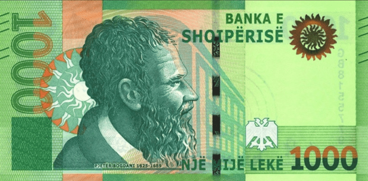

## Table of Contents

## What is the Albanian Lek?

The Albanian Lek is the money used in Albania. It is named after Alexander the Great, who was called "Lekë" in Albanian. The symbol for the Lek is "L", and sometimes "ALL" is used as its code. People in Albania use the Lek to buy things like food, clothes, and other stuff they need.

The Lek first started being used in 1926. Before that, Albania used different kinds of money. The Lek has coins and banknotes. The coins come in small amounts like 1, 5, 10, and 20 Lek. The banknotes are bigger amounts like 100, 200, 500, 1000, and 5000 Lek. The value of the Lek can change compared to other countries' money, like the US dollar or the Euro.

## When was the Albanian Lek first introduced?

The Albanian Lek was first introduced in 1926. Before that, Albania used different types of money. The Lek was named after Alexander the Great, who is called "Lekë" in Albanian.

The Lek comes in coins and banknotes. Coins are used for small amounts like 1, 5, 10, and 20 Lek. Banknotes are used for bigger amounts like 100, 200, 500, 1000, and 5000 Lek. The value of the Lek can change when compared to other countries' money, like the US dollar or the Euro.

## What are the denominations of the Albanian Lek?

The Albanian Lek comes in different amounts, or denominations. For small amounts, there are coins. You can find coins worth 1 Lek, 5 Lek, 10 Lek, and 20 Lek. These coins help people buy things that do not cost a lot of money.

For bigger amounts, there are banknotes. The banknotes come in 100 Lek, 200 Lek, 500 Lek, 1000 Lek, and 5000 Lek. These are used when people need to pay for more expensive things. The value of the Lek can change compared to other countries' money, like the US dollar or the Euro.

## How has the value of the Albanian Lek changed over time?

The value of the Albanian Lek has changed a lot since it was first used in 1926. When the Lek was new, it was worth more than it is now. Over the years, the Lek has lost value compared to other countries' money, like the US dollar and the Euro. This means that people in Albania need more Lek to buy things from other countries. For example, in the 1990s, Albania went through some tough times, and the Lek lost a lot of its value very quickly.

Since then, the Albanian government and banks have worked to make the Lek more stable. They do this by controlling how much money is in the country and by working with other countries' banks. Even though the Lek is still not as strong as some other currencies, it has become more stable over the last few years. This helps people in Albania plan better for the future and know how much their money is worth.

## What are the key factors influencing the Albanian Lek's exchange rate?

The value of the Albanian Lek compared to other countries' money, like the US dollar or the Euro, can change because of many things. One big thing is how well Albania's economy is doing. If Albania is making and selling a lot of things, the Lek might get stronger. But if people in Albania are buying more things from other countries than they are selling, the Lek might get weaker. Also, if people from other countries think Albania's economy is doing well, they might want to buy Lek, which can make it stronger.

Another thing that can change the Lek's value is what the Albanian government and its central bank do. If they decide to print more money, the Lek might lose value because there is more of it around. The central bank can also change interest rates, which is like the cost of borrowing money. If interest rates go up, it might make the Lek stronger because people will want to keep their money in Albania to get more interest. On the other hand, if interest rates go down, the Lek might get weaker. Also, big events around the world, like wars or big changes in other countries' economies, can affect the Lek's value too.

## How does the Albanian Lek impact Albania's trade and economy?

The Albanian Lek is really important for Albania's trade and economy. When the Lek is strong, it can make things that Albania sells to other countries more expensive. This might mean that other countries buy less from Albania. But a strong Lek can also make things that Albania buys from other countries cheaper, which can be good for people in Albania because they can buy more with their money. On the other hand, if the Lek is weak, it can make Albanian products cheaper for other countries to buy, which might help Albania sell more. But it also means that things from other countries cost more in Albania, which can be hard for people there.

The value of the Lek also affects how much money people in Albania can save and invest. If the Lek is stable and people trust it, they might be more likely to save their money in banks or invest in businesses. This can help the economy grow because businesses can use that money to make more things or start new projects. But if the Lek is not stable, people might not want to save or invest because they are worried about losing their money. This can slow down the economy because businesses might not have the money they need to grow. So, keeping the Lek stable is really important for Albania's economy.

## What role does the Bank of Albania play in managing the Lek?

The Bank of Albania is like the boss of the Albanian Lek. It makes sure the Lek stays stable and works well for the country. One big thing the Bank does is decide how much money should be in Albania. If there's too much money, the Lek might lose value, so the Bank tries to keep the right amount. The Bank also sets the interest rates, which is like the cost of borrowing money. If the interest rates go up, people might want to keep their money in Albania to get more interest, which can make the Lek stronger.

Another important job of the Bank of Albania is to watch over the country's banks and make sure they are doing things right. This helps keep the whole money system safe and trustworthy. The Bank also works with other countries' banks to make sure the Lek can be used easily in trade. By doing all these things, the Bank of Albania helps keep the economy running smoothly and makes sure the Lek is a good and stable money for people to use.

## How has the Albanian Lek been affected by historical events such as wars and economic crises?

The Albanian Lek has been affected a lot by big events like wars and economic crises. During World War II, Albania was under different control and its money system changed a lot. After the war, the Lek had to start over and find its place again. In the 1990s, Albania went through a really tough time because of something called the pyramid schemes. These were like fake banks that promised to make people rich but ended up taking their money. When these schemes crashed, people lost a lot of money, and the Lek lost a lot of its value very quickly. This made life hard for many people in Albania.

Since then, the Albanian government and the Bank of Albania have worked hard to make the Lek more stable. They have tried to keep the economy growing and make sure people trust the Lek. Even though the Lek is still not as strong as some other countries' money, it has become more stable over the years. This means that people in Albania can plan better for the future and know how much their money is worth. Big events around the world can still affect the Lek, but the Bank of Albania keeps working to make sure it stays as stable as possible.

## What are the inflation trends in Albania in relation to the Lek?

Inflation in Albania means that prices for things like food, clothes, and other stuff go up over time. The Albanian Lek has seen different levels of inflation over the years. In the 1990s, Albania had very high inflation because of the pyramid schemes that crashed and made the Lek lose a lot of its value. This meant that prices went up very fast, and people's money could buy less and less. The government and the Bank of Albania worked hard to control inflation and make the Lek more stable.

Since then, inflation in Albania has been more under control. The Bank of Albania tries to keep inflation at a level that helps the economy grow without making prices go up too fast. In recent years, inflation has been around 2-3% per year, which is pretty stable. This means that the value of the Lek stays more steady, and people can plan better for the future because they know how much their money will be worth. Even though the Lek is not as strong as some other countries' money, keeping inflation low helps make life more predictable for people in Albania.

## How does the Albanian Lek compare to other currencies in the region?

The Albanian Lek is the money used in Albania, and it is compared to other currencies in the region like the Euro, which is used in many European countries, and the Serbian Dinar, used in Serbia. The Lek is not as strong as the Euro. This means that one Euro can buy more Lek. For example, if you want to buy something from a country that uses the Euro, you will need more Lek to do it. The Lek is also weaker than the Serbian Dinar, but not by as much as it is weaker than the Euro. This affects how much things cost when people in Albania buy from or sell to these countries.

Compared to other currencies in the region, the Lek has been working to stay stable. The Bank of Albania tries to keep the value of the Lek from changing too much. This is important because it helps people in Albania know how much their money is worth and plan for the future. Even though the Lek is not as strong as some other currencies, like the Euro or the Croatian Kuna, it has been more stable in recent years. This stability helps Albania's economy because people trust the Lek more and are more likely to save and invest their money.

## What are the future prospects for the Albanian Lek in the global economy?

The future of the Albanian Lek in the global economy depends on many things. One big thing is how well Albania's economy does. If Albania keeps growing and making more things to sell, the Lek might get stronger. The government and the Bank of Albania are working hard to keep the economy stable and growing. They do this by controlling how much money is around and setting interest rates. If they do a good job, the Lek could become more trusted by other countries, which would help it stay stable or even get stronger.

Another thing that can affect the Lek's future is what happens in the rest of the world. Big events like wars or changes in other countries' economies can make the Lek weaker or stronger. For example, if other countries are doing well and want to buy things from Albania, the Lek might get stronger. But if there are problems around the world, the Lek might get weaker. The Bank of Albania tries to keep the Lek stable by working with other countries' banks. Even though the Lek is not as strong as some other currencies, like the Euro, if Albania keeps working on its economy, the Lek could have a good future in the global economy.

## How do monetary policies in Albania affect the stability and value of the Lek?

Monetary policies in Albania are like the rules and actions the Bank of Albania uses to control the money in the country. These policies can make a big difference in how stable and valuable the Lek is. One important policy is setting interest rates. If the Bank of Albania makes interest rates higher, it can make the Lek stronger because people might want to keep their money in Albania to get more interest. But if interest rates are low, people might take their money out of Albania to find better deals, which can make the Lek weaker. Another policy is controlling how much money is around. If there's too much money, the Lek might lose value because it's not as special. The Bank tries to keep the right amount of money to make the Lek stable.

The Bank of Albania also watches over the country's banks to make sure they are doing things right. This helps keep the whole money system safe and trustworthy, which is good for the Lek. If people trust the banks and the money system, they are more likely to use and keep their money in Lek. The Bank also works with other countries' banks to make sure the Lek can be used easily in trade. By doing all these things, the Bank of Albania helps keep the Lek stable and valuable. Even though the Lek is not as strong as some other countries' money, these policies help make sure it stays useful for people in Albania.

## References & Further Reading

[1]: Knaus, C., & Zeidane, Z. (2020). ["Algorithmic Trading's Impact on FX Markets: Risk and Benefits"](https://www.researchgate.net/publication/378287610_Machine_learning_in_financial_markets_A_critical_review_of_algorithmic_trading_and_risk_management). International Monetary Fund Working Paper.

[2]: Aslam, F., Ahmad, W., & Mišanović, Z. (2022). ["Algorithmic and High-Frequency Trading in Foreign Exchange Markets"](https://papers.ssrn.com/sol3/papers.cfm?abstract_id=3632921). Springer.

[3]: Schwartz, R.A., & Weber, B.W. (2006). ["The Economic Impact of Algorithmic Trading."](https://link.springer.com/book/10.1007/978-3-030-74817-3) CFA Institute Conference Proceedings Quarterly.

[4]: Bank of Albania. ["Central Bank of Albania: Monetary Policy and Exchange Rate Reports."](https://www.bankofalbania.org/Monetary_Policy/) Official Reports on Economic Policies.

[5]: Gjonbalaj, D., & Harou, P. (2021). ["Analysis of Albania's Integration into the Global Economy in the 1990s"](https://pubmed.ncbi.nlm.nih.gov/33782123/) Research Gate.

[6]: Brealey, R.A., Myers, S.C., & Allen, F. (2019). ["Principles of Corporate Finance"](https://archive.org/details/principlesofcor000brea), 13th Edition, McGraw-Hill Education.