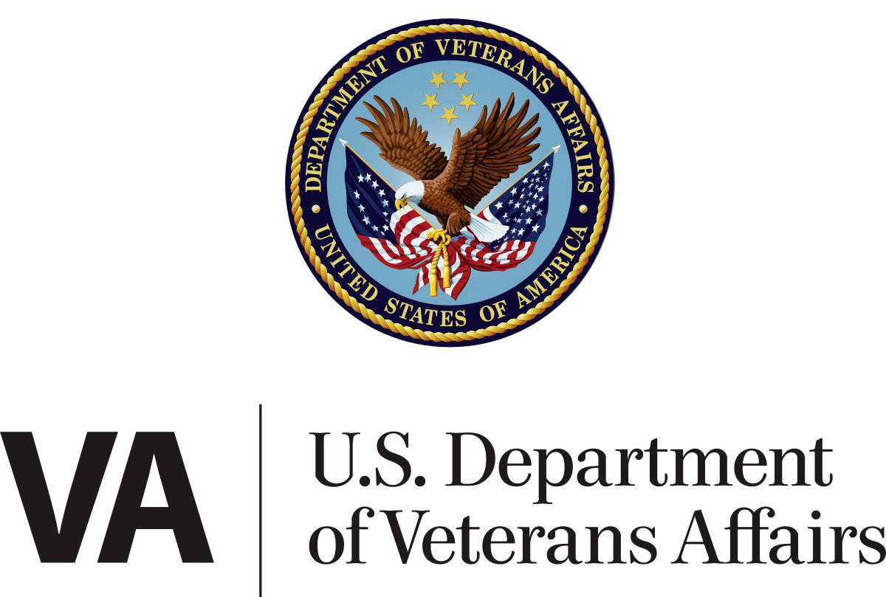

The Veterans Administration, now recognized as the U.S. Department of Veterans Affairs (VA), is a cornerstone institution dedicated to supporting military veterans in the United States. Its inception in 1930, during the turmoil of the Great Depression, marked a significant commitment by the federal government to address the multifaceted needs of returning service members. This era saw a growing acknowledgment of the unique challenges faced by veterans, encompassing healthcare, reintegration into civilian life, and economic stability.

Originally constituted to unify disparate services under one administrative umbrella, the formation of the Veterans Administration was a critical step in systematizing support for veterans. The agency has since evolved to cater comprehensively to various issues affecting veterans, reflecting broader societal changes and the dynamic nature of military service demands.

Today, the Department of Veterans Affairs is a prominent entity within the U.S. government, with a far-reaching impact on millions of veterans. It encompasses an expanded scope of operations, offering extensive healthcare services, financial benefits, educational programs, and burial honors. The VA's primary aim is to facilitate a smooth and successful transition for veterans from military service to civilian life, ensuring that those who have served the nation receive the recognition and support necessary to thrive. This commitment underscores the nation's enduring gratitude and obligation to its veterans, continually driving the VA to refine and enhance its services.

## Table of Contents

## The Origins and Evolution of the Veterans Administration

The need to support U.S. veterans has deep historical roots, dating back to 1636, when the Pilgrims of Plymouth Colony enacted a law ensuring support for disabled soldiers. This foundational principle laid the groundwork for an evolving framework of veteran care in the United States. Throughout the American Revolution, various states provided pensions to disabled soldiers, which later expanded under the federal government's purview during the early 19th century with the establishment of the first federal pension legislation.

By the 20th century, the system of veterans' support had become complex and fragmented, consisting of multiple entities. Recognizing the need for coordination amid the Great Depression, President Herbert Hoover signed Executive Order 5398 in 1930, consolidating the U.S. Veterans Bureau, the Bureau of Pensions, and the National Home for Disabled Volunteer Soldiers into the Veterans Administration (VA). This unification marked a significant shift toward a centralized system designed to efficiently deliver services to veterans.

The transformation continued as the needs of veterans evolved over time, culminating in another pivotal moment in 1988 when President Ronald Reagan elevated the Veterans Administration to a Cabinet-level department, renaming it the Department of Veterans Affairs, effective from March 15, 1989. This change underscored the increasing recognition of the diverse requirements of veterans and the importance of integrating resources to provide comprehensive services. 

The Department of Veterans Affairs has since expanded its mandate to encompass a wide array of services, including healthcare, financial benefits, and memorial affairs, addressing the modern veteran's multifaceted needs. This organizational evolution reflects an enduring commitment to adapting and responding to the changing demographics and service requirements of U.S. veterans.

## Structure and Services Provided by the VA

The United States Department of Veterans Affairs (VA) operates through a structured framework of three primary administrations, each serving distinct functions in supporting veterans: the Veterans Health Administration (VHA), the Veterans Benefits Administration (VBA), and the National Cemetery Administration (NCA).

The Veterans Health Administration (VHA) is tasked with providing comprehensive healthcare services to eligible veterans. It is recognized as one of the most extensive integrated healthcare systems in the United States, delivering a wide array of medical services to millions of veterans. The VHA operates numerous medical centers, outpatient clinics, and specialized care facilities, addressing both physical and mental health needs. Services range from routine medical checkups to complex surgeries and long-term care, including mental health support and rehabilitation. Telehealth services also form a core part of the VHA's offerings, increasing accessibility for veterans residing in remote or underserved areas.

The Veterans Benefits Administration (VBA) focuses on managing a wide range of financial and non-medical benefits for veterans and their families. Key services include disability compensation, pension programs, education and training benefits, and insurance coverage. The VBA also administers the VA Home Loan program, which facilitates veterans in purchasing homes by offering favorable loan terms, such as no down payment, low-interest rates, and reduced closing costs. The educational benefits are significantly enhanced under the Post-9/11 GI Bill, enabling veterans to pursue higher education and vocational training to aid their reintegration into civilian life.

In addition to healthcare and financial benefits, the National Cemetery Administration (NCA) ensures that veterans receive memorial services befitting their service to the nation. The NCA is responsible for maintaining national cemeteries, providing burial and memorial benefits, and preserving the dignity of veterans' final resting places. It offers burial plots, headstones, markers, and presidential memorial certificates to honor veterans and their sacrifice.

Collectively, these three administrations embody the VA's commitment to offering comprehensive support services to veterans, ensuring they receive the healthcare, financial assistance, and honor they deserve throughout and beyond their lifetimes.

## Financial Benefits and Assistance

The Veterans Benefits Administration (VBA) plays a vital role in supporting military veterans through a range of financial benefits designed to aid their transition back to civilian life. One prominent benefit is disability compensation, which provides monthly tax-free financial support to veterans who have disabilities resulting from their military service. This compensation is determined by a disability rating system that assesses the extent of the veteran's injuries or conditions, influencing the monetary amount received.

Education and training are significantly bolstered by the Post-9/11 GI Bill, which offers substantial educational benefits. Eligible veterans can access tuition and fee coverage for college degrees, non-college degree programs, and training programs. Additionally, the GI Bill includes provisions for a monthly housing allowance, funding for [books](/wiki/algo-trading-books) and supplies, and transferability options that allow service members to transfer unused benefits to their spouses or children. This comprehensive support system aims to empower veterans by facilitating further education and thereby enhancing their prospects for successful civilian careers.

The VBA is also responsible for managing life insurance programs tailored to veterans' needs. These programs provide coverage options such as Servicemembers' Group Life Insurance (SGLI) and Veterans' Group Life Insurance (VGLI), ensuring that veterans and their families have financial security in the event of unforeseen circumstances.

Another significant benefit administered by the VBA is the VA Home Loan program. This program provides veterans with the opportunity to purchase homes at favorable terms, including the notable advantage of no required down payment for qualified individuals. The program also offers competitive interest rates and limited closing costs, making homeownership more accessible to veterans. The VA Home Loan program supports veterans in building stable lives by facilitating home ownership, a foundational aspect of civilian life.

Collectively, these financial benefits demonstrate the VA's commitment to providing comprehensive support that addresses the diverse needs of veterans, ensuring their well-being and integration into civilian society.

## Algorithmic Trading and Government Agencies

Algorithmic trading, though not directly associated with the U.S. Department of Veterans Affairs (VA), represents a significant advancement in modern finance, intersecting with government policy and regulatory frameworks. This form of trading utilizes complex algorithms and mathematical models to execute orders at speeds and frequencies impossible for human traders, significantly impacting financial markets globally. The integration of [algorithmic trading](/wiki/algorithmic-trading) within government agencies could enhance not only financial management but also investment strategies, offering a sophisticated approach to public fund management.

Government agencies primarily engage in financial activities that necessitate efficient asset management and allocation of resources. By employing algorithmic trading strategies, such agencies can optimize financial returns on public funds while mitigating risks associated with volatile market conditions. For instance, algorithmic models can be designed to predict market trends using historical data, enabling agencies to make informed decisions regarding asset procurement and liquidation. The strategic implementation of such technology could lead to substantial cost savings and improved resource allocation within the public sector.

Furthermore, exploring how technology supports government operations can broaden the application and effectiveness of tech innovations in public service, potentially benefiting agencies like the VA. Though the core function of the VA does not include trading activities, the principles of algorithmic trading could inform the agency’s broader data management and decision-making processes. For example, data analytics derived from trading algorithms could enhance the VA’s capacity to predict and respond to healthcare demands, optimizing service delivery to veterans.

Additionally, algorithmic trading necessitates robust regulatory frameworks to ensure transparency and prevent market manipulations, a responsibility often held by government agencies. The development and enforcement of these frameworks can lead to more stable and transparent financial systems, which is paramount for maintaining market integrity. Agencies could thus utilize insights gained from regulating algorithmic trading to devise and implement effective oversight mechanisms in other operational domains, enhancing overall governance.

In leveraging such technological advancements, government agencies, including those outside the financial sector like the VA, have the potential to transform operational efficiencies and service offerings. This could ultimately result in improved public service delivery, reflecting a forward-thinking approach to integrating technology across various facets of government operations.

## Innovations and Future Directions for the VA

The U.S. Department of Veterans Affairs (VA) has made significant strides in incorporating technological advancements to enhance the quality and accessibility of care provided to veterans. Among these innovations, the expansion of telehealth services has been particularly impactful, enabling veterans, especially those in remote or underserved areas, to access healthcare services without the need to travel long distances. Telehealth platforms facilitate virtual consultations, follow-ups, and mental health support, ensuring that veterans receive timely medical care from the comfort of their homes.

The VA's adoption of electronic health records (EHR) marks another critical advancement, promoting seamless information sharing across healthcare providers and improving the coordination of patient care. EHR systems streamline administrative tasks, reduce the likelihood of medical errors, and allow for comprehensive management of veterans' health records. This integration supports a more efficient and patient-centric healthcare delivery process.

Research and development efforts in the VA cover a wide array of areas crucial to advancing veteran care. The department focuses extensively on developing cutting-edge prosthetics, recognizing the unique needs of veterans who have experienced limb loss. Enhancements in prosthetic technology, such as more responsive and durable materials, improve mobility and quality of life for affected individuals.

Moreover, the VA is deeply invested in understanding and treating Post-Traumatic Stress Disorder (PTSD) and spinal cord injuries, which are prevalent among veterans. Ongoing research aims to develop new therapeutic strategies and rehabilitation techniques to aid recovery and integration into civilian life. These efforts underscore the VA's commitment to addressing the specific health challenges faced by veterans comprehensively.

Looking to the future, the VA aims to continue leveraging technology to enhance service delivery and adapt to the evolving needs of the veteran population. This includes implementing [artificial intelligence](/wiki/ai-artificial-intelligence) and [machine learning](/wiki/machine-learning) to optimize administrative processes and improve decision-making in clinical settings. By utilizing predictive analytics, the VA can anticipate potential health issues and intervene proactively, further improving the care and services offered to veterans.

In summary, the VA's continuous dedication to technological innovation and research not only improves healthcare delivery but also actively supports veterans' health and well-being. These initiatives ensure that the department remains responsive to the dynamic needs of its population, maintaining its pivotal role in serving those who have served the nation.

## Conclusion

The U.S. Department of Veterans Affairs (VA) continues to uphold its mission of serving and honoring the nation's veterans by evolving its services to meet their changing needs. This evolution is crucial as American society and technology advance, leading the VA to integrate innovative solutions that significantly enhance the quality of life for veterans. The comprehensive programs and services offered by the VA reflect a strong national commitment to those who have served in the Armed Forces.

The VA leverages technology advancements to improve service delivery. For instance, the expansion of telehealth services enables veterans to access healthcare remotely, eliminating geographical barriers and ensuring timely medical consultations. Moreover, the adoption of electronic health records streamlines medical data management, facilitating more efficient and coordinated care.

Research and development efforts within the VA focus on critical areas such as prosthetics, post-traumatic stress disorder (PTSD), and spinal cord injuries. By prioritizing these areas, the VA demonstrates its dedication to advancing veteran care and addressing health issues prevalent amongst veterans. This commitment to innovation ensures that the VA remains proactive in providing state-of-the-art solutions for veteran healthcare challenges.

In conclusion, the VA plays a pivotal role in supporting veterans through its wide-ranging and adaptive programs. These programs are designed not only to meet current needs but also to anticipate future challenges. As society and technology continue to evolve, the VA remains at the forefront, ensuring that veterans receive the support and care they deserve. Through its dedicated efforts, the VA embodies the nation's gratitude and commitment to its veterans, continually striving to improve their lives and honoring their service.

## References & Further Reading

[1]: ["A History of Veterans Affairs"](https://department.va.gov/history/) by the U.S. Department of Veterans Affairs.

[2]: ["The Evolution of U.S. Military Veterans as a Political Force in Postwar America"](https://usafacts.org/topics/veterans/) by Beth J. Asch, RAND Corporation.

[3]: ["Serving America's Veterans: A Reference Handbook"](https://www.amazon.com/Serving-Americas-Veterans-Reference-Contemporary/dp/0313355266) by Barbara Barksdale Clowse.

[4]: Cashion, Barbara G., "History of Veterans' Legislation: From the GI Bill to the Present," *The George Washington Law Review*, 64(2), 1996.

[5]: ["Legacies of War: The United States and the Transformation of Memory"](https://www.jstor.org/stable/10.1525/vs.2015.10.1.155) by Geoffrey M. White. 

[6]: ["Handbook of Veterans' Benefits"](https://benefits.va.gov/benefits/) by Margaret C. Jasper.

[7]: ["Telehealth Services in the United States Veterans Health Administration"](https://telehealth.va.gov/) by the Center for Connected Health Policy.

[8]: ["Prosthetic Design and Development for Veteran Healthcare"](https://www.prosthetics.va.gov/) *Journal of Rehabilitation Research and Development* by the U.S. Department of Veterans Affairs.