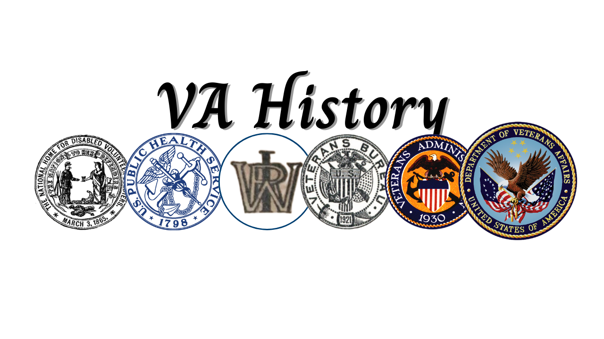

## Table of Contents

## What is the Veterans Administration?

The Veterans Administration, often called the VA, is a part of the United States government. It helps people who have served in the military. The VA gives these veterans different kinds of help, like medical care, money help, and education benefits. It started a long time ago, right after the Civil War, to take care of soldiers who were hurt or sick.

The VA runs many hospitals and clinics all over the country. These places give free or low-cost health care to veterans. The VA also has programs to help veterans find jobs, go to school, and even buy a house. It's important because it shows that the country cares about the people who served to protect it.

## When was the Veterans Administration established?

The Veterans Administration was established on July 21, 1930. Before that, there were different groups helping veterans, but President Herbert Hoover thought it would be better to have one big group to help them all.

So, he signed a law that brought together three smaller groups into one. This new group was called the Veterans Administration, and it was led by a person called a Veterans Administrator. Since then, it has grown a lot and now helps millions of veterans every year.

## What were the initial goals of the Veterans Administration?

When the Veterans Administration was first set up in 1930, its main goal was to bring together different groups that were already helping veterans. Before that, there were three separate groups: the Veterans Bureau, the Bureau of Pensions, and the National Home for Disabled Volunteer Soldiers. By combining these, the new Veterans Administration could help veterans in a more organized way. The idea was to make sure that veterans could get the help they needed more easily, without having to go to different places.

The initial goals of the Veterans Administration were to provide better medical care, financial help, and other services to veterans. This meant running hospitals and clinics where veterans could get treatment for their injuries or illnesses. It also meant giving out money to help veterans who were struggling financially, and helping them find jobs or go to school. The Veterans Administration wanted to make sure that the people who had served their country were taken care of and had the support they needed to live good lives after their service.

## How has the mission of the Veterans Administration evolved over time?

When the Veterans Administration first started in 1930, its main job was to help veterans by bringing together different groups that were already helping them. The goal was to make it easier for veterans to get medical care, money help, and other services they needed. Back then, the focus was on taking care of veterans who were hurt or sick from their time in the military, and helping them with things like finding a job or going to school.

Over the years, the mission of the Veterans Administration has grown and changed. It still focuses on giving veterans good medical care and helping them with money and education, but it now does a lot more. The VA now works on things like mental health support, helping homeless veterans, and even research to find better ways to treat veterans' health problems. The goal is to make sure that all veterans, no matter when they served or what they went through, get the help and support they need to live healthy and happy lives.

## What major legislative changes have impacted the Veterans Administration?

Over the years, many laws have changed how the Veterans Administration works. One big change happened in 1988 when the VA was renamed to the Department of Veterans Affairs, making it a full part of the government with a Cabinet-level leader. This change showed that helping veterans was very important to the country. Another important law was the Veterans' Health Care Eligibility Reform Act of 1996. This law made it easier for more veterans to get health care from the VA, not just those who were hurt or sick from their time in the military.

More recent laws have also made big changes. The Veterans Access, Choice, and Accountability Act of 2014 was passed to help veterans get health care faster. If they had to wait too long or lived too far from a VA hospital, they could go to other doctors and the VA would pay for it. The MISSION Act of 2018 built on this by giving veterans even more choices about where they could get their health care. These laws show how the VA keeps trying to do a better job of helping veterans.

These legislative changes have helped the VA grow and improve its services. They have made it possible for more veterans to get the help they need, and they have shown that the country cares about taking care of its veterans. By making these changes, the VA can keep up with the needs of veterans and make sure they get the best care possible.

## How does the Veterans Administration support veterans' health care?

The Veterans Administration, or VA, helps veterans by giving them health care. They run many hospitals and clinics all over the country where veterans can go for free or low-cost medical care. The VA takes care of all kinds of health problems, from regular check-ups to big surgeries. They also have special programs for things like mental health, where veterans can get help if they are feeling sad or stressed. The VA wants to make sure that veterans can get the medical help they need, no matter where they live or what kind of health problem they have.

The VA also works hard to make sure veterans can get health care quickly. They have rules that say veterans should not have to wait too long to see a doctor. If a veteran has to wait too long or lives too far from a VA hospital, they can go to other doctors and the VA will pay for it. This is because of laws like the Veterans Access, Choice, and Accountability Act and the MISSION Act. These laws help make sure that veterans can get the care they need without waiting too long. The VA is always trying to find new ways to help veterans stay healthy and feel better.

## What benefits does the Veterans Administration provide to veterans?

The Veterans Administration, or VA, helps veterans in many ways. One big way is by giving them health care. The VA runs hospitals and clinics all over the country where veterans can go for free or low-cost medical care. They take care of all kinds of health problems, from regular check-ups to big surgeries. The VA also has special programs for mental health, helping veterans who are feeling sad or stressed. They want to make sure that veterans can get the medical help they need quickly and easily, no matter where they live.

Another way the VA helps veterans is by giving them money help. This can include disability payments for veterans who got hurt or sick while serving in the military. The VA also has programs to help veterans who are having a hard time paying their bills or finding a place to live. They can get help with things like rent or buying a home. The VA also helps veterans go to school or find a job. They offer education benefits like the GI Bill, which can pay for college or training programs. This helps veterans learn new skills and have a better life after their service.

The VA also works to make sure veterans can get help quickly. They have rules that say veterans should not have to wait too long to see a doctor. If a veteran has to wait too long or lives too far from a VA hospital, they can go to other doctors and the VA will pay for it. This is because of laws like the Veterans Access, Choice, and Accountability Act and the MISSION Act. These laws help make sure that veterans can get the care they need without waiting too long. The VA is always trying to find new ways to help veterans stay healthy and feel better.

## How is the Veterans Administration structured organizationally?

The Veterans Administration, now called the Department of Veterans Affairs (VA), is a big part of the U.S. government. It is led by the Secretary of Veterans Affairs, who is chosen by the President. The VA is split into three main parts: the Veterans Health Administration (VHA), the Veterans Benefits Administration (VBA), and the National Cemetery Administration (NCA). Each part has its own leader and works on different things to help veterans. The VHA runs hospitals and clinics, the VBA gives out money and education help, and the NCA takes care of cemeteries for veterans.

The VA also has smaller groups inside these main parts that focus on special things. For example, the VHA has groups that work on mental health, women's health, and helping homeless veterans. The VBA has groups that handle disability payments, education benefits, and home loans. The NCA makes sure that veterans' graves are taken care of and that there are places for veterans to be buried. All these groups work together to make sure veterans get the help they need. The VA also has offices all over the country so veterans can get help no matter where they live.

## What challenges has the Veterans Administration faced historically?

The Veterans Administration has faced many challenges over the years. One big problem has been long wait times for veterans to get health care. Sometimes, veterans had to wait too long to see a doctor, which made them upset and worried. This problem got so bad that the government had to pass new laws, like the Veterans Access, Choice, and Accountability Act, to help fix it. The VA also had trouble keeping up with the growing number of veterans who needed help, especially after big wars like Vietnam and the conflicts in Iraq and Afghanistan.

Another challenge has been making sure that all veterans get the same good care, no matter where they live. Some VA hospitals and clinics were better than others, and this was not fair to veterans who lived far away from the good ones. The VA has tried to fix this by letting veterans go to other doctors if they live too far from a VA hospital. But it's still hard to make sure every veteran gets the best care possible. The VA also has to deal with not having enough money sometimes, which makes it hard to give veterans all the help they need.

## How has the Veterans Administration adapted to modern veterans' needs?

The Veterans Administration has changed a lot to help today's veterans. They know that veterans from recent wars, like Iraq and Afghanistan, have different needs than veterans from older wars. So, the VA has made special programs for things like mental health, because many modern veterans have problems like PTSD. They also help veterans who are homeless, which is a big problem for some veterans today. The VA has made it easier for veterans to get help quickly, with new laws like the MISSION Act, so veterans don't have to wait too long to see a doctor.

The VA also uses new technology to help veterans. They have apps and websites where veterans can make appointments, check their health records, and even talk to doctors online. This is really helpful for veterans who live far away from VA hospitals. The VA also works hard to make sure that women veterans get the care they need, because more women are serving in the military now. By doing all these things, the VA tries to make sure that every veteran, no matter when they served or what they need, can get the help they deserve.

## What role does the Veterans Administration play in veterans' education and employment?

The Veterans Administration helps veterans go to school and find jobs. They have a program called the GI Bill that pays for veterans to go to college or learn new skills. This helps veterans get good jobs after they leave the military. The VA also gives veterans advice and help to find work. They have job fairs and training programs to make it easier for veterans to start a new career.

The VA knows that finding a job can be hard for veterans, so they have special programs to help. They work with businesses to hire veterans and give them the support they need to succeed at work. The VA also helps veterans who want to start their own businesses by giving them money and advice. By doing all these things, the VA makes sure that veterans have the chance to build a good life after their service.

## How does the Veterans Administration collaborate with other government agencies and private organizations?

The Veterans Administration works with other parts of the government to help veterans. They team up with the Department of Defense to make sure veterans can get their health records easily. The VA also works with the Department of Labor to help veterans find jobs. They share information and resources to make sure veterans get all the help they need. The VA also works with the Department of Housing and Urban Development to help homeless veterans find a place to live. By working together, these government groups can do a better job of helping veterans.

The VA also works with private groups to help veterans. They partner with companies and non-profits to give veterans more choices for health care and other services. For example, the VA works with hospitals and clinics that are not part of the VA to make sure veterans can get care quickly. They also work with schools and businesses to help veterans go to college and find good jobs. By working with these private groups, the VA can reach more veterans and give them the support they need to live good lives after their service.

## References & Further Reading

[1]: ["A History of Veterans Affairs"](https://department.va.gov/history/) by the U.S. Department of Veterans Affairs.

[2]: ["The Evolution of U.S. Military Veterans as a Political Force in Postwar America"](https://usafacts.org/topics/veterans/) by Beth J. Asch, RAND Corporation.

[3]: ["Serving America's Veterans: A Reference Handbook"](https://www.amazon.com/Serving-Americas-Veterans-Reference-Contemporary/dp/0313355266) by Barbara Barksdale Clowse.

[4]: Cashion, Barbara G., "History of Veterans' Legislation: From the GI Bill to the Present," *The George Washington Law Review*, 64(2), 1996.

[5]: ["Legacies of War: The United States and the Transformation of Memory"](https://www.jstor.org/stable/10.1525/vs.2015.10.1.155) by Geoffrey M. White. 

[6]: ["Handbook of Veterans' Benefits"](https://benefits.va.gov/benefits/) by Margaret C. Jasper.

[7]: ["Telehealth Services in the United States Veterans Health Administration"](https://telehealth.va.gov/) by the Center for Connected Health Policy.

[8]: ["Prosthetic Design and Development for Veteran Healthcare"](https://www.prosthetics.va.gov/) *Journal of Rehabilitation Research and Development* by the U.S. Department of Veterans Affairs.