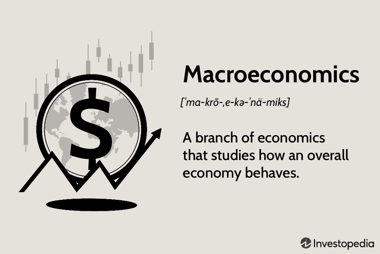

Economic schools of thought constitute the foundational frameworks that have defined economic analysis and policymaking over centuries. These schools encompass a range of theories and methodologies developed to understand and predict the complex behavior of economies. They provide lenses through which economists analyze issues concerning wealth distribution, growth, stability, employment, and inflation. The significance of these schools lies in their profound influence on economic history and policy, offering diverse interpretations of market dynamics and informing government actions.

Macroeconomics, a branch of economics that deals with the performance, structure, and behavior of an economy as a whole, is intrinsically linked to these schools of thought. It concerns itself with national, regional, and global scales, analyzing aggregate indicators such as GDP, unemployment rates, and price indices. Classical economics, for instance, laid the foundation for macroeconomic thought by emphasizing the self-regulating nature of markets. It proposed that free markets, through the mechanism of the invisible hand, naturally lead to equilibrium and optimal resource allocation.



As economic conditions evolved, particularly during periods of upheaval such as the Great Depression, the limitations of classical economics became apparent. This gave rise to new schools, most notably Keynesian economics, which challenged classical assumptions and redefined macroeconomic policy. Keynesian theory argued that total spending in an economy, often referred to as aggregate demand, is the primary driver of economic performance and advocated for active government intervention to mitigate economic fluctuations.

The evolution from classical to contemporary economic theories reflects the continuous refinement of economic analysis as new data, events, and perspectives emerge. Each school of thought carries its own assumptions and priorities, often emphasizing different aspects of economic behavior. For example, monetarism emerged as a critique of Keynesian policies, focusing on the money supply's role in influencing economic activity and inflation.

The interplay between these schools and macroeconomics has shaped modern economics, providing the foundation for both theoretical advancements and practical policy applications. As economic landscapes continue to evolve, these schools of thought remain vital for understanding contemporary economic challenges and developing strategies to address them.

## Table of Contents

## Classical Economics

Classical economics is a school of thought that emerged during the late 18th and early 19th centuries as a response to the growing complexities of industrial economies. Its roots are deeply embedded in the ideas propagated by key figures such as Adam Smith, David Ricardo, and John Stuart Mill, who sought to explain the mechanisms of an economy that was transitioning from feudalism to capitalism.

The core principles of classical economics revolve around the belief in self-regulating markets, where the forces of supply and demand naturally guide the allocation of resources. Adam Smith, often regarded as the father of classical economics, introduced the concept of the "invisible hand" in his seminal work, "The Wealth of Nations" (1776). This metaphor explained how individual pursuit of self-interest inadvertently promotes societal welfare, as market competition leads to efficient outcomes without the need for external intervention.

Classical economists advocated for the idea of laissez-faire, a policy that opposes government intervention in economic affairs beyond what is necessary to maintain property rights and provide public goods. This stems from the belief that markets are most efficient when allowed to operate freely, with minimal state interference. Consequently, classical economic theory argues that economies are inherently capable of achieving full employment through flexible adjustments in wages and prices.

David Ricardo contributed significantly to classical economics through his theory of comparative advantage, which demonstrated that nations can benefit from trade by specializing in the production of goods they can produce most efficiently. This idea laid the groundwork for modern theories of international trade and economic globalization.

The historical context of classical economics was marked by the onset of the Industrial Revolution, which saw rapid advancements in technology, production, and transportation. These changes prompted classical economists to focus on issues such as production and distribution, labor specialization, and capital accumulation.

Classical economics influenced later economic policies and schools of thought in several ways. The tenets of laissez-faire and free markets became foundational principles for neoliberal economic policies in the late 20th century. Moreover, the emphasis on market-based solutions influenced the development of neoclassical economics, which incorporated classical concepts while adding new insights into individual choice and utility.

In summary, classical economics laid the groundwork for understanding the function of competitive markets and the role of prices in coordinating economic activity. Its principles continue to resonate in contemporary economic policy-making and theory, underscoring the enduring impact of its foundational concepts on the field of economics.

## Keynesian Economics

Keynesian Economics emerged prominently during the Great Depression of the 1930s, marking a significant departure from classical economic theories that had dominated until that time. The foundational principles of Keynesian Economics were laid out in John Maynard Keynes's seminal work, "The General Theory of Employment, Interest, and Money," published in 1936. Keynes critiqued classical economics for its inability to effectively address and solve the high unemployment and economic stagnation witnessed during the Great Depression.

A central tenet of Keynesian Economics is the focus on aggregate demand, which Keynes argued is the driving force of economic activity and employment. In Keynesian theory, total spending in the economy, particularly during periods of economic downturn, is critical. Keynes asserted that inadequate overall demand can lead to prolonged periods of high unemployment and idle productive capacity. This perspective led to the argument that government intervention might be necessary to augment aggregate demand through fiscal policy measures such as adjusting public spending and tax policies.

The Keynesian approach contrasts with classical economics by rejecting the notion that markets are always able to self-correct to achieve full employment. Keynes proposed that prices and wages are sticky—meaning they don't respond immediately to changes in supply and demand—thereby preventing markets from clearing. This price and wage rigidity can lead to imbalances that necessitate policy intervention to correct.

Keynesian economics introduced the concept of the multiplier effect, a critical idea which holds that an initial increase in spending (for example, by the government) leads to a larger increase in overall economic output. Mathematically, the multiplier ($k$) is defined as:

$$
k = \frac{1}{1 - MPC}
$$

where $MPC$ is the marginal propensity to consume. If the MPC is 0.8, for instance, the multiplier would be 5, indicating that every dollar of initial spending can lead to a $5 increase in overall economic output.

The impact of Keynesian Economics on macroeconomic policy was profound, influencing a range of fiscal and monetary policies aimed at stabilizing economic cycles. Post-World War II, many Western governments implemented policies inspired by Keynesian thought, using public spending and taxation as tools to regulate economic activity and mitigate the negative effects of recessions.

In modern economic theory, Keynesian principles continue to underpin many policy decisions, especially in times of economic crisis. The global financial crisis of 2007-2008, for example, saw widespread application of Keynesian-inspired stimulus packages worldwide, highlighting the enduring relevance of Keynes's insights into the critical role of aggregate demand in influencing macroeconomic outcomes.

## Monetarism

Monetarism is an economic school of thought that emphasizes the role of governments in managing the economy by regulating the money supply. The principal advocate of monetarism is the economist Milton Friedman, whose theories significantly influenced economic policy during the late 20th century. 

Friedman argued that economic fluctuations are often the result of variations in the money supply, proposing that changes to it have immediate impacts on inflation and national income. Monetarism therefore advocates for a controlled increase in money supply at a rate commensurate with the growth potential of the economy, reflecting a stable and predictable rule rather than discretionary fiscal policies. According to Friedman, a steady, small expansion in the amount of money available to the economy would yield the most stable economic growth and help manage inflationary pressures.

A key distinction between monetarism and Keynesian economics is their differing views on the role of the government and monetary policy. While John Maynard Keynes emphasized the importance of active government intervention to stabilize economic cycles through both fiscal and monetary policy, monetarists argue that the economy is inherently stable and can self-regulate, relying predominantly on a fixed monetary policy rule to manage demand.

Keynesian economics often suggests that during periods of economic downturns, governments should increase spending and run deficits to boost demand. In contrast, monetarism holds that such actions could lead to inflation if they are not aligned with the actual output capacity of the economy. Instead, it promotes targeting the growth rate of the money supply as a primary tool for economic regulation.

This debate played a crucial role in shaping economic policies in the late 20th century, particularly with regard to the conservative turn in economic policymaking during the 1980s. Monetarist ideas were influential in the policies of governments such as those in the United States under President Ronald Reagan and in the United Kingdom under Prime Minister Margaret Thatcher. These administrations implemented policies that reduced the emphasis on fiscal intervention and focused more on monetary control, highlighting the influence of Friedman's theories that stressed the dangers of inflation above all other economic issues.

In conclusion, monetarism fundamentally reshaped the approach to economic policy by prioritizing price stability and reducing the role of government intervention in managing economic fluctuations. Its advocacy for a rules-based approach to regulating the money supply represented a shift from the Keynesian consensus of the mid-20th century, favoring a more controlled and predictable economic policy framework.

## Austrian School

The Austrian School of Economics is a distinctive branch of economic thought that emphasizes the role of individual actions and decisions within free market processes. Emerging in the late 19th century, it has continuously challenged mainstream economic theories through its unique perspective on market dynamics and the functioning of economies.

Central to the Austrian School is the belief in methodological individualism, which posits that social phenomena result from the actions and interactions of individuals. This approach marks a departure from collectivist frameworks that prioritize institutions or groups over the individual. Methodological individualism serves as the foundation for understanding economic processes, asserting that complex market outcomes are the aggregate result of numerous individual decisions.

Another core principle of the Austrian School is the subjective theory of value, which differs from the labor theory of value proposed by classical economists. According to the Austrian perspective, the value of goods and services is determined by the subjective preferences and perceptions of individuals rather than the intrinsic costs of production. This theory underscores the personal and variable nature of value, contrasting with the more objective theories of classical economics.

Key figures in the Austrian School include Carl Menger, the founder, who laid the groundwork with his seminal work "Principles of Economics" in 1871. Menger's ideas on marginal utility and subjective value reshaped economic thought and laid the basis for further developments within the school. Ludwig von Mises, another influential figure, contributed significantly with his work on praxeology—the study of human action—which extends the individualistic approach and highlights purposeful behavior in economic activities.

Friedrich Hayek further expanded Austrian ideas, particularly through his critiques of central planning and government intervention. Hayek argued that decentralized decision-making processes, driven by price signals in a free market, are more efficient at allocating resources than any centrally planned system. His work emphasized the dispersed nature of knowledge in society and the impossibility of central authorities effectively managing complex economic systems.

The Austrian School staunchly critiques central planning, arguing that government intervention distorts natural market rhythms and leads to inefficiencies. Hayek’s famous "knowledge problem" underscores the limitations of central authority's ability to possess the necessary information for effective economic coordination. Austrians assert that central planning often results in misallocation of resources, inefficiencies, and economic cycles of booms and busts.

Through its focus on individualism and skepticism of centralized control, the Austrian School offers a vision of economics that champions personal freedom and market spontaneity. It remains influential, especially in debates surrounding the roles of government and market freedom in promoting economic development and prosperity.

## Macro Economics in Modern Times

Macroeconomics has significantly evolved from its theoretical foundations established by classical, Keynesian, monetarist, and Austrian schools of thought. These historical perspectives laid the groundwork for the modern macroeconomic analysis that permeates policy-making and economic strategies globally.

Initially, macroeconomic thought was primarily theoretical, focusing on modeling economic phenomena and understanding complex systems through frameworks and assumptions. Classical economics, for instance, introduced concepts such as the invisible hand and natural equilibrium. Keynesianism, emerging from the turmoil of the Great Depression, shifted the emphasis to government intervention in stabilizing economic cycles. Monetarism introduced the significance of controlling money supply, while the Austrian school emphasized individual actions within free markets.

In modern times, these theories have transitioned from academic discourse to practical application in policy-making. Governments and institutions now utilize macroeconomic models to predict outcomes, manage economies, and solve real-world problems. For example, Keynesian principles inform fiscal stimulus policies during recessions, emphasizing government expenditure to spur economic growth. Similarly, monetarist ideas have shaped central bank policies worldwide, where controlling inflation through interest rates and monetary supply has become a standard practice.

Global challenges such as financial crises and rapid technological advancements have further influenced macroeconomic thought. The 2008 financial crisis highlighted the limitations of existing economic models, necessitating a reassessment of risk management and regulatory frameworks. As economies grappled with the fallout, macroeconomists emphasized the importance of global coordination and comprehensive policy responses, combining classical, Keynesian, and modern approaches.

Technological changes, particularly the rise of digital currencies, [artificial intelligence](/wiki/ai-artificial-intelligence), and [algorithmic trading](/wiki/algorithmic-trading), have further complicated the macroeconomic landscape. These advancements require updated models that integrate traditional economic theories with new data-driven insights. Big data analytics, [machine learning](/wiki/machine-learning), and complex algorithms now play a critical role in understanding market dynamics and consumer behavior, influencing both policy-making and financial strategies.

Python code, for example, illustrates how modern macroeconomics can leverage technology for data analysis and forecasting. Here's a basic example that demonstrates economic data manipulation using Python:

```python
import pandas as pd
import numpy as np

# Sample economic data
data = {'Year': [2020, 2021, 2022],
        'GDP': [21.43, 22.67, 23.35],
        'Inflation': [1.2, 2.3, 3.0]}

df = pd.DataFrame(data)

# Calculate percentage change in GDP
df['GDP_Change'] = df['GDP'].pct_change() * 100

# Forecast GDP using a simplistic model (constant rate of growth)
forecast_years = [2023, 2024]
gdp_growth_rate = df['GDP_Change'].mean()

for year in forecast_years:
    new_gdp = df.loc[df.index[-1], 'GDP'] * (1 + gdp_growth_rate / 100)
    df = df.append({'Year': year, 'GDP': new_gdp}, ignore_index=True)

print(df)
```

This code performs basic data handling with GDP figures and extrapolates growth using a constant growth rate, exemplifying how macroeconomic forecasts can be conducted.

Conclusively, macroeconomics in modern times is a dynamic integration of historic theories, applied policies, and emerging technological considerations. It continuously adapts to address contemporary challenges, ensuring economic stability and growth in an ever-evolving global environment.

## Algorithmic Trading and Economic Theories

Algorithmic trading refers to the use of computer algorithms to manage trading decisions, execute orders, and manage portfolios across financial markets. Originating in the late 20th century, algorithmic trading has significantly transformed financial markets due to its efficiency and capacity for processing vast data sets. The rise of powerful computing and improvements in financial engineering has enabled traders to capitalize on minuscule fluctuations across assets, often executing trades within microseconds.

Economic theories play a crucial role in shaping algorithmic trading strategies. These theories provide fundamental insights into market behavior and macroeconomic dynamics, which algorithms leverage to predict market movements. For instance, theories related to market efficiency, risk management, and economic cycles assist in the development of models that guide trading decisions. Classical economics' emphasis on free markets and rational actors presents a backdrop for designing algorithms that assume market efficiency, whereas Keynesian theories provide insights into the impact of government intervention and economic cycles on asset prices.

Macroeconomic indicators are integral to the formulation of algorithmic trading strategies. Indicators such as GDP growth rates, inflation figures, and employment [statistics](/wiki/bayesian-statistics) can trigger trading algorithms to make buying or selling decisions. For example, a positive GDP report might increase investor confidence, potentially driving equity prices up, while higher-than-expected inflation rates may lead to increased bond yields as investors anticipate [interest rate](/wiki/interest-rate-trading-strategies) hikes.

Algorithms typically incorporate these indicators through statistical models. For example, algorithms can use regressions to quantify relationships between macroeconomic indicators and asset prices. Python, a preferred programming language for finance, can be used to implement such strategies:

```python
import numpy as np
from sklearn.linear_model import LinearRegression

# Sample data
gdp = np.array([2.3, 2.5, 2.7, 3.0]).reshape(-1, 1)  # GDP growth
stock_prices = np.array([100, 104, 108, 112])  # Stock prices

# Linear regression model
model = LinearRegression().fit(gdp, stock_prices)

# Coefficient and intercept
coefficient = model.coef_
intercept = model.intercept_

# Predict stock price based on future GDP
future_gdp = np.array([3.1]).reshape(-1, 1)
predicted_stock_price = model.predict(future_gdp)
```

Here, a simple linear regression model is trained to predict stock prices based on GDP growth. The model coefficients reflect the sensitivity of stock prices to GDP, an essential insight derived from economic theories.

Furthermore, algorithms are capable of dynamically adjusting trading strategies in response to real-time data. Machine learning techniques enhance this adaptability, allowing algorithms to recognize patterns in historical data and predict future price movements accurately, meeting the demands of modern, fast-paced financial markets.

In summary, algorithmic trading is an intersection of technology and economic theory where macroeconomic indicators are essential inputs for designing sophisticated, data-driven strategies. As financial markets evolve, the integration of economic understanding and advanced computational methods remains pivotal for traders seeking to leverage the power of algorithms.

## Conclusion

Economic schools of thought have consistently shaped the landscape of modern economics, playing a crucial role in both academic discourse and practical applications, such as trading. Each school's doctrines contribute to a broader understanding of how economies function, offering diverse perspectives on managing economic challenges. From the laissez-faire principles of classical economics to the demand-side management emphasized by Keynesian economics, each approach provides insights that fuel the evolution of macroeconomic policies and financial strategies.

Macroeconomics has continually proven vital, both historically and in contemporary settings, by guiding policymakers in their efforts to stabilize economies and promote growth. This historical context underscores the insights gained from classical economics with Adam Smith’s invisible hand and the Keynesian emphasis on government intervention during economic downturns. Theories developed by monetarists like Milton Friedman further illustrate how controlling the money supply can influence economic activity. Meanwhile, Austrian economists argue the merits of market-driven solutions, critiquing excessive government control.

Looking ahead, the future of economic theory must integrate modern financial technologies, such as algorithmic trading. Algorithmic trading systems often rely on macroeconomic indicators to develop sophisticated models that are rooted in these diverse economic theories. These systems harness vast amounts of data to predict market movements, demonstrating the relevance of economic theory in guiding financial decisions. Emerging technologies, including artificial intelligence and machine learning, will likely continue to transform economics. By modeling complex systems and processing dynamic variables, these technologies will facilitate the development of innovative trading strategies and policy applications.

Ultimately, the continued interplay between economic theory and technology will shape the future landscape of both economics and financial markets. As such, the fundamental insights provided by historical and contemporary schools of thought remain indispensable, informing the development of economic policies and market strategies designed to navigate an increasingly complex global economy.

## References & Further Reading

[1]: Smith, A. (1776). ["The Wealth of Nations."](https://www.ibiblio.org/ml/libri/s/SmithA_WealthNations_p.pdf) 

[2]: Keynes, J. M. (1936). ["The General Theory of Employment, Interest, and Money."](https://link.springer.com/book/10.1007/978-3-319-70344-2)

[3]: Friedman, M. (1962). ["Capitalism and Freedom."](https://ctheory.sitehost.iu.edu/resources/fall2020/Friedman_Capitalism_and_Freedom.pdf)

[4]: Menger, C. (1871). ["Principles of Economics."](https://archive.org/details/PrinciplesOfEconomicsCarlMenger)

[5]: Hayek, F. A. (1944). ["The Road to Serfdom."](https://en.wikipedia.org/wiki/The_Road_to_Serfdom)

[6]: Lopez de Prado, M. (2018). ["Advances in Financial Machine Learning."](https://www.amazon.com/Advances-Financial-Machine-Learning-Marcos/dp/1119482089) 

[7]: Jansen, S. (2020). ["Machine Learning for Algorithmic Trading."](https://github.com/stefan-jansen/machine-learning-for-trading) 

[8]: Aronson, D. R. (2006). ["Evidence-Based Technical Analysis: Applying the Scientific Method and Statistical Inference to Trading Signals."](https://www.amazon.com/Evidence-Based-Technical-Analysis-Scientific-Statistical/dp/0470008741)

[9]: Chan, E. P. (2008). ["Quantitative Trading: How to Build Your Own Algorithmic Trading Business."](https://github.com/ftvision/quant_trading_echan_book)