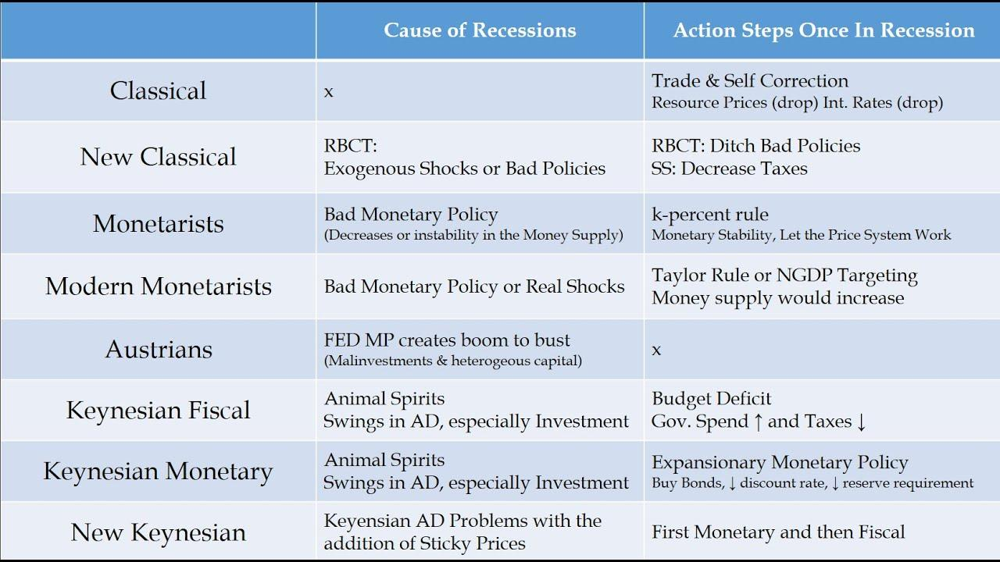

## Table of Contents

## What is macroeconomics and why is it important?

Macroeconomics is the part of economics that looks at the big picture of a country's economy. It studies things like how much a country produces, how many people have jobs, how prices change over time, and how the government manages money. Instead of focusing on individual businesses or people, macroeconomics tries to understand how the whole economy works together.

Understanding macroeconomics is important because it helps us make better decisions about big economic issues. For example, if a government knows that unemployment is high, it can create policies to help more people find jobs. If prices are going up too fast, the government can take steps to control inflation. By studying macroeconomics, leaders can make choices that help the economy grow and keep people's lives stable.

## What are the main differences between macroeconomics and microeconomics?

Macroeconomics and microeconomics are two branches of economics that look at different parts of the economy. Macroeconomics focuses on the big picture, studying things like a country's total production, overall employment levels, and the general price levels. It looks at how these big factors affect the whole economy. For example, macroeconomists might study why unemployment is high across the country or how the government can control inflation.

On the other hand, microeconomics looks at smaller parts of the economy, like individual businesses, households, and markets. It studies how these small units make decisions and how they interact with each other. For instance, microeconomists might look at how a single company decides what to produce or how a consumer chooses what to buy. While macroeconomics is about the forest, microeconomics is about the trees.

Both branches are important and connected. Changes in the big picture (macroeconomics) can affect individual decisions (microeconomics), and the choices made by individuals and businesses can add up to influence the whole economy. Understanding both helps economists and policymakers make better decisions for everyone.

## What is the classical school of thought in macroeconomics?

The classical school of thought in macroeconomics is an old way of thinking about how economies work. It started in the 18th and 19th centuries with economists like Adam Smith and David Ricardo. They believed that economies naturally balance themselves out. For example, if there are too many people without jobs, wages will go down, and then businesses will hire more workers because they can pay them less. This means that, over time, everyone who wants a job can find one, and the economy will keep running smoothly without much help from the government.

Classical economists also thought that prices and wages are flexible, meaning they can go up or down easily. They believed that if the economy is not doing well, it will fix itself without needing the government to step in. They didn't think the government should try to control things like inflation or unemployment because the market would take care of these problems on its own. This way of thinking was very popular until the Great Depression in the 1930s, when people started to question if the economy could really fix itself without help.

## How did the Keynesian school of thought emerge and what are its key principles?

The Keynesian school of thought emerged during the Great Depression in the 1930s. Before this, many economists believed in the classical idea that the economy would fix itself. But during the Great Depression, unemployment was very high and the economy was not getting better on its own. A British economist named John Maynard Keynes wrote a book called "The General Theory of Employment, Interest, and Money" in 1936. In this book, he argued that the government needed to step in to help the economy recover. This new way of thinking became known as Keynesian economics.

Keynes believed that demand was the key to fixing the economy. If people weren't buying enough, businesses would not produce as much, leading to more unemployment. To solve this, Keynes suggested that the government should spend more money, even if it meant running a budget deficit. This extra spending would create jobs and increase demand, helping the economy grow. He also thought that interest rates could be used to control how much people spend and save. Keynesian economics became very popular and influenced many government policies, especially during times of economic trouble.

## What are the major criticisms of Keynesian economics?

Some people don't like Keynesian economics because they think it can cause big problems. They say that if the government spends too much money, it can lead to inflation. When the government borrows money to spend, it can also make interest rates go up, which might slow down the economy instead of helping it. Critics also worry that if the government keeps spending a lot, it might get used to running big deficits, which could lead to a lot of debt that future generations have to pay off. They believe that the government should not try to control the economy so much and that markets should be left alone to fix themselves.

Another criticism is that Keynesian economics might not work the same way in every situation. Some economists say that it's hard to know exactly how much the government should spend or how much it should cut taxes to fix the economy. If the government guesses wrong, it might make things worse instead of better. Also, some people think that Keynesian ideas don't work as well in the long run. They argue that while government spending might help in the short term, it doesn't solve deeper problems in the economy, like why people aren't investing or starting new businesses.

## What is the Monetarist school of thought and who were its key proponents?

The Monetarist school of thought is a way of thinking about the economy that focuses on money and how much of it is in the economy. Monetarists believe that the amount of money in circulation is the most important thing for controlling the economy. They say that if there's too much money, it can lead to inflation, which means prices go up a lot. If there's not enough money, it can cause the economy to slow down. Monetarists think that the government should control the money supply carefully to keep the economy stable. They don't think the government should spend a lot of money to fix the economy, like Keynesians do.

The key proponent of Monetarism was Milton Friedman. He was an economist who wrote a lot about how money affects the economy. Friedman believed that the central bank, like the Federal Reserve in the United States, should increase the money supply at a steady rate to avoid big swings in the economy. He and other Monetarists argued that if the money supply grows too fast or too slow, it can cause big problems. Friedman's ideas became very popular in the 1970s and 1980s, and they influenced how many governments and central banks managed their economies.

## How does the New Classical school differ from the Classical school?

The New Classical school is a more modern way of thinking that builds on the old Classical ideas but adds new things. Like the Classical school, New Classical economists believe that markets work well on their own and that people make smart choices. But they also think about how people expect the future to be. They say that if people think the government will do something, like print more money, they will change what they do now. This means the economy can fix itself faster than the old Classical school thought, because people are always thinking ahead and adjusting.

The big difference between the New Classical school and the Classical school is that the New Classical school uses something called "rational expectations." This means people use all the information they have to make the best guesses about the future. Because of this, New Classical economists believe that government policies might not work the way they're supposed to. If people see the government trying to help the economy, they might act in ways that cancel out what the government is doing. So, New Classical economists think the government should do less and let the market take care of things, just like the Classical school, but for more complicated reasons.

## What is the New Keynesian synthesis and how does it integrate different economic theories?

The New Keynesian synthesis is a way of thinking about the economy that tries to bring together different ideas from other schools of thought. It combines the ideas of Keynesian economics, which says the government should spend money to help the economy, with the ideas of New Classical economics, which says people use all the information they have to make smart choices about the future. The New Keynesian synthesis believes that markets don't always work perfectly, and sometimes the government needs to step in to help. But it also thinks that people's expectations about the future are important and can affect how well government policies work.

This way of thinking helps economists understand how the economy works by looking at both the big picture and the smaller details. It says that prices and wages can be slow to change, which can cause problems in the economy. But it also says that if people think the government will do something, they might change what they do now, which can make government policies less effective. By putting these ideas together, the New Keynesian synthesis helps policymakers figure out the best ways to help the economy grow and keep people's lives stable.

## What role do Rational Expectations play in modern macroeconomic theory?

Rational Expectations are a big idea in modern macroeconomic theory. They mean that people use all the information they have to make the best guesses about what will happen in the future. This idea is important because it says that people's guesses about the future can affect what happens in the economy right now. For example, if people think the government will print more money, they might spend more now, which can make prices go up faster. This idea came from the New Classical school of thought, but it's used in many different ways in modern economics.

In modern macroeconomic theory, Rational Expectations help explain why some government policies might not work the way they're supposed to. If people see the government trying to help the economy, they might change what they do in ways that cancel out the government's plans. This makes it harder for the government to control the economy. But Rational Expectations also help economists understand how the economy can fix itself. If people think the economy will get better, they might start spending and investing more, which can help the economy grow without the government needing to do much.

## How have Real Business Cycle theories influenced macroeconomic policy?

Real Business Cycle (RBC) theories say that ups and downs in the economy are mostly because of changes in technology and other big things that affect how much people can produce. They believe that the economy can fix itself without the government needing to do much. This way of thinking has made some policymakers think twice about trying to control the economy too much. They worry that if the government spends a lot of money or changes interest rates a lot, it might not help and could even make things worse. So, RBC theories have made some people believe that the best thing for the government to do is to let the economy work on its own.

Even though RBC theories have influenced how some people think about the economy, they haven't changed everything. Many policymakers still use ideas from other schools of thought, like Keynesian economics, which says the government should spend money to help the economy. But RBC theories have made more people think about how important technology and other big changes are for the economy. This has led to more focus on things like making it easier for businesses to use new technology and helping people learn new skills. So, while RBC theories haven't completely changed how the government makes policies, they have added new ideas to the mix.

## What is the Austrian school's perspective on macroeconomics and economic cycles?

The Austrian school of thought has a unique way of looking at macroeconomics and economic cycles. They believe that economic ups and downs, or business cycles, are caused by mistakes in the economy, especially when it comes to money and credit. Austrian economists think that when central banks, like the Federal Reserve, mess with the money supply by printing too much money or setting interest rates too low, it can lead to bubbles. These bubbles are times when people think the economy is doing great, but it's actually not sustainable. When the bubble bursts, it causes a recession, which is a time when the economy shrinks and people lose jobs.

Austrian economists also believe that the government should not try to fix these economic cycles by spending a lot of money or changing interest rates. They think that trying to fix the economy this way can make things worse in the long run. Instead, they say the economy should be left alone to fix itself. This means letting businesses fail if they need to and letting prices and wages adjust naturally. Austrian economists believe that if the government stays out of the way, the economy will eventually get back to a healthy state on its own.

## How have recent global economic crises influenced the evolution of macroeconomic thought?

Recent global economic crises, like the 2008 financial crisis and the economic effects of the COVID-19 pandemic, have made economists think harder about how the economy works. These crises showed that the old ways of thinking might not be enough to explain everything. For example, the 2008 crisis made people see that financial markets can be very risky and that the government might need to step in more than some economists thought. It also showed that when big banks fail, it can hurt the whole economy, not just the people who had money in those banks. This led to more focus on how to keep the financial system stable and how to prevent big crashes.

The COVID-19 pandemic also changed how economists think about the economy. It showed that sudden shocks, like a global health crisis, can cause big problems very quickly. Governments around the world had to spend a lot of money to help people and businesses survive. This made some economists question if the old ideas about government spending and deficits were still right. They started thinking more about how to use government money to help the economy recover fast and how to make sure that everyone, not just the rich, can benefit from economic policies. Both crises have pushed economists to keep learning and to be ready for new challenges in the future.

## What is Keynesian Economics?

Keynesian Economics emerged prominently during the Great Depression of the 1930s, marking a significant departure from classical economic theories that had dominated until that time. The foundational principles of Keynesian Economics were laid out in John Maynard Keynes's seminal work, "The General Theory of Employment, Interest, and Money," published in 1936. Keynes critiqued classical economics for its inability to effectively address and solve the high unemployment and economic stagnation witnessed during the Great Depression.

A central tenet of Keynesian Economics is the focus on aggregate demand, which Keynes argued is the driving force of economic activity and employment. In Keynesian theory, total spending in the economy, particularly during periods of economic downturn, is critical. Keynes asserted that inadequate overall demand can lead to prolonged periods of high unemployment and idle productive capacity. This perspective led to the argument that government intervention might be necessary to augment aggregate demand through fiscal policy measures such as adjusting public spending and tax policies.

The Keynesian approach contrasts with classical economics by rejecting the notion that markets are always able to self-correct to achieve full employment. Keynes proposed that prices and wages are sticky—meaning they don't respond immediately to changes in supply and demand—thereby preventing markets from clearing. This price and wage rigidity can lead to imbalances that necessitate policy intervention to correct.

Keynesian economics introduced the concept of the multiplier effect, a critical idea which holds that an initial increase in spending (for example, by the government) leads to a larger increase in overall economic output. Mathematically, the multiplier ($k$) is defined as:

$$
k = \frac{1}{1 - MPC}
$$

where $MPC$ is the marginal propensity to consume. If the MPC is 0.8, for instance, the multiplier would be 5, indicating that every dollar of initial spending can lead to a $5 increase in overall economic output.

The impact of Keynesian Economics on macroeconomic policy was profound, influencing a range of fiscal and monetary policies aimed at stabilizing economic cycles. Post-World War II, many Western governments implemented policies inspired by Keynesian thought, using public spending and taxation as tools to regulate economic activity and mitigate the negative effects of recessions.

In modern economic theory, Keynesian principles continue to underpin many policy decisions, especially in times of economic crisis. The global financial crisis of 2007-2008, for example, saw widespread application of Keynesian-inspired stimulus packages worldwide, highlighting the enduring relevance of Keynes's insights into the critical role of aggregate demand in influencing macroeconomic outcomes.

## References & Further Reading

[1]: Smith, A. (1776). ["The Wealth of Nations."](https://www.ibiblio.org/ml/libri/s/SmithA_WealthNations_p.pdf) 

[2]: Keynes, J. M. (1936). ["The General Theory of Employment, Interest, and Money."](https://link.springer.com/book/10.1007/978-3-319-70344-2)

[3]: Friedman, M. (1962). ["Capitalism and Freedom."](https://ctheory.sitehost.iu.edu/resources/fall2020/Friedman_Capitalism_and_Freedom.pdf)

[4]: Menger, C. (1871). ["Principles of Economics."](https://archive.org/details/PrinciplesOfEconomicsCarlMenger)

[5]: Hayek, F. A. (1944). ["The Road to Serfdom."](https://en.wikipedia.org/wiki/The_Road_to_Serfdom)

[6]: Lopez de Prado, M. (2018). ["Advances in Financial Machine Learning."](https://www.amazon.com/Advances-Financial-Machine-Learning-Marcos/dp/1119482089) 

[7]: Jansen, S. (2020). ["Machine Learning for Algorithmic Trading."](https://github.com/stefan-jansen/machine-learning-for-trading) 

[8]: Aronson, D. R. (2006). ["Evidence-Based Technical Analysis: Applying the Scientific Method and Statistical Inference to Trading Signals."](https://www.amazon.com/Evidence-Based-Technical-Analysis-Scientific-Statistical/dp/0470008741)

[9]: Chan, E. P. (2008). ["Quantitative Trading: How to Build Your Own Algorithmic Trading Business."](https://github.com/ftvision/quant_trading_echan_book)