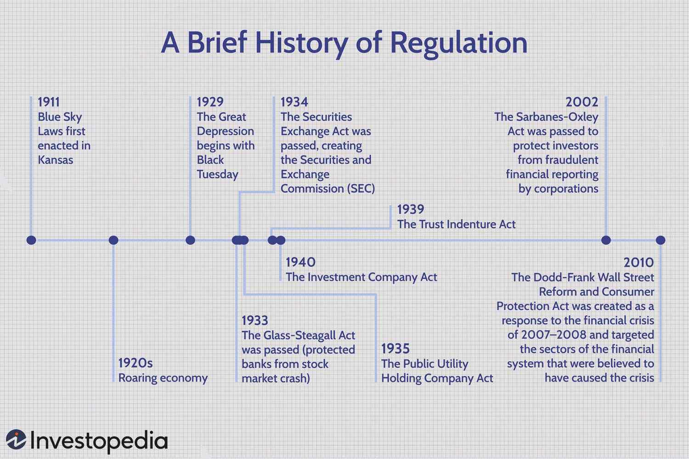

## Table of Contents

## What is the SEC and when was it established?

The SEC, or Securities and Exchange Commission, is a government agency in the United States. Its job is to protect people who invest money in stocks and other securities. The SEC makes sure that companies tell the truth about their businesses and that people who sell investments follow the rules.

The SEC was established on June 6, 1934. This was during the Great Depression, a time when many people lost a lot of money. The government created the SEC to help prevent big financial problems like that from happening again. Since then, the SEC has been working to keep the stock market fair and safe for everyone.

## What was the primary purpose behind the creation of the SEC?

The main reason the SEC was created was to protect people who invest their money. Back in the 1930s, during the Great Depression, a lot of people lost their savings because of bad investments and dishonest practices in the stock market. The government wanted to make sure this wouldn't happen again, so they set up the SEC to watch over the market and make sure everyone played by the rules.

The SEC's job is to make sure companies are honest about their businesses. When companies want to sell stocks or bonds, they have to tell the truth about their finances and what they plan to do with the money. The SEC checks this information to protect investors from being tricked. By doing this, the SEC helps keep the stock market fair and safe for everyone who wants to invest their money.

## What were the key pieces of legislation that led to the formation of the SEC?

The SEC was created because of two important laws passed by the U.S. Congress during the Great Depression. The first law was the Securities Act of 1933. This law said that companies had to tell the truth about their businesses before they could sell stocks or bonds to the public. It was made to stop companies from lying to people and taking their money. The Securities Act of 1933 was a big step in protecting investors.

The second law was the Securities Exchange Act of 1934. This law created the SEC to make sure the rules from the 1933 Act were followed. It also added more rules to keep the stock market honest and safe. The Securities Exchange Act of 1934 gave the SEC the power to watch over the stock exchanges and make sure everyone was playing fair. Together, these two laws helped build a system to protect people who invest their money.

## How did the SEC's role evolve in the decades following its establishment?

After the SEC was set up in 1934, its role grew a lot over the years. At first, the SEC focused on making sure companies told the truth about their businesses and that stock markets followed the rules. But as time went on, the SEC started to do more things. It began to make new rules to keep up with changes in the financial world. For example, as more people started using computers to trade stocks, the SEC made rules about electronic trading to keep it fair and safe.

In the 1970s and 1980s, the SEC got more involved in stopping people from cheating in the stock market. They created special teams to catch people who were doing illegal things with stocks. The SEC also started to pay more attention to big companies that were merging or buying each other. They wanted to make sure these deals were fair and didn't hurt investors. Over the years, the SEC kept adding new rules and watching over more parts of the financial world to protect people's money.

## What significant events or crises prompted major changes in SEC regulations?

One big event that changed SEC rules was the stock market crash of 1987. This crash was so bad that it made the SEC think about new ways to keep the market stable. They created something called "circuit breakers," which are like emergency brakes for the stock market. If the market goes down too fast, trading stops for a while to let things calm down. This was to stop a big crash from getting even worse.

Another big change came after the Enron scandal in 2001. Enron was a big company that lied about its money and went bankrupt. This made a lot of people lose their savings. The SEC saw that they needed to be tougher on companies that weren't honest. So, they made new rules with the Sarbanes-Oxley Act in 2002. This law made companies keep better records and be more honest about their finances. It also made the SEC check companies more closely to protect investors.

The 2008 financial crisis also led to big changes in SEC rules. This crisis started with problems in the housing market and spread to the whole financial system. The SEC realized they needed to watch over more parts of the financial world, like credit rating agencies and hedge funds. They made new rules with the Dodd-Frank Act in 2010. This law gave the SEC more power to keep an eye on risky financial activities and make sure they didn't hurt the economy again.

## Can you explain the major SEC regulations introduced in the 20th century?

In the 20th century, the SEC introduced several important rules to protect people who invest their money. One of the first big rules was the Securities Act of 1933. This law said that companies had to tell the truth about their businesses before they could sell stocks or bonds to the public. It was made to stop companies from lying to people and taking their money. Then, the Securities Exchange Act of 1934 created the SEC itself and gave it the power to watch over the stock market and make sure everyone followed the rules. These two laws were the start of the SEC's work to keep the market fair and safe.

As time went on, the SEC made more rules to keep up with changes in the financial world. In the 1970s and 1980s, the SEC got more involved in stopping people from cheating in the stock market. They created special teams to catch people who were doing illegal things with stocks. After the stock market crash of 1987, the SEC introduced "circuit breakers" to stop big crashes from getting worse. These are like emergency brakes for the stock market that stop trading if the market goes down too fast. By the end of the 20th century, the SEC had grown a lot and was doing more to protect investors and keep the market honest.

## How has the SEC adapted its regulations to address the rise of technology and digital assets?

The SEC has made big changes to keep up with new technology and digital assets like cryptocurrencies. As more people started using the internet to trade stocks, the SEC made rules to make sure electronic trading was fair and safe. They also started watching over new kinds of investments like digital currencies. In 2017, the SEC said that some digital tokens might be considered securities, which means companies selling them have to follow the same rules as other investments. This was to stop people from being tricked by new kinds of money.

The SEC also made rules to protect people who invest in digital assets. They set up special teams to watch over the markets for digital currencies and make sure no one was cheating. In 2021, they made a new group called the Crypto Assets and Cyber Unit to focus on stopping fraud in the digital world. The SEC keeps working to make rules that help keep the market fair and safe, even as new technology changes how people invest their money.

## What are some of the most impactful enforcement actions taken by the SEC?

One of the most impactful enforcement actions by the SEC was against Enron in 2001. Enron was a big company that lied about its money and went bankrupt. This made a lot of people lose their savings. The SEC took action and found out that Enron's leaders had been cheating. This led to new rules with the Sarbanes-Oxley Act in 2002, which made companies be more honest about their finances and helped protect investors from being tricked again.

Another big action was against Bernard Madoff in 2008. Madoff ran a huge Ponzi scheme, where he used new investors' money to pay off old investors, instead of making real investments. When his scheme fell apart, a lot of people lost billions of dollars. The SEC charged Madoff with fraud, and he went to prison. This case showed the SEC needed to do a better job watching over the markets, so they made new rules to stop similar things from happening again.

## How does the SEC coordinate with other regulatory bodies both domestically and internationally?

The SEC works with other groups in the United States to keep the financial world safe and fair. One important group they work with is the Financial Industry Regulatory Authority (FINRA). FINRA helps the SEC by watching over the people and companies that sell investments. They make sure everyone follows the rules. The SEC also works with the Commodity Futures Trading Commission (CFTC), which looks after different kinds of investments like futures and swaps. Together, the SEC and CFTC make sure the whole financial market is safe. They share information and help each other catch people who are breaking the rules.

The SEC also works with groups from other countries to keep the global financial market honest. They talk to regulators in places like Europe and Asia to share information about companies and people who might be breaking the rules. This helps stop fraud and other bad things from spreading across borders. The SEC is part of groups like the International Organization of Securities Commissions (IOSCO), where regulators from around the world work together to make rules that keep the global market safe for everyone. By working together, the SEC helps make sure that people can invest their money safely, no matter where they are.

## What are the current challenges facing the SEC in terms of regulation and enforcement?

The SEC faces many challenges today, especially with new technology and digital money like cryptocurrencies. These new kinds of investments are hard to watch over because they are different from traditional stocks and bonds. The SEC has to make new rules to keep up with these changes, but it's not easy. They need to figure out how to protect people who invest in digital assets without stopping new ideas from growing. Also, the SEC has to deal with more cyber attacks and fraud that happen online. They need to use new technology to catch people who are cheating, but this takes a lot of time and money.

Another big challenge for the SEC is working with other countries. The financial world is global, so the SEC has to work with regulators from other places to stop fraud and other bad things from spreading across borders. This can be hard because different countries have different rules and ways of doing things. The SEC also has to make sure they have enough people and money to do their job well. With so many new kinds of investments and more people using the internet to trade, the SEC needs to keep learning and changing to keep the market fair and safe for everyone.

## How do recent SEC rule changes aim to protect investors and maintain market integrity?

The SEC has been making new rules to keep investors safe and the market fair. One big change is about how companies have to tell the truth about their money. The SEC made a rule called the "Pay Versus Performance" rule, which makes companies show how much they pay their top leaders and how well the company is doing. This helps investors see if the leaders are doing a good job. Another rule is about how companies can buy back their own stocks. The SEC made new rules to stop companies from doing this in a way that tricks investors. These rules help make sure the market is fair and that investors have the right information to make good choices.

The SEC also made changes to help with new kinds of investments like digital money. They made a rule called the "Regulation Best Interest," which says that people who give advice about investments have to put their clients' interests first. This stops advisors from giving bad advice just to make money for themselves. The SEC also started watching over digital currencies more closely. They made a special group to stop fraud in the digital world. These new rules help protect people who invest in new kinds of money and keep the whole market honest and safe.

## What future trends or potential reforms might influence the SEC's regulatory framework?

In the future, the SEC might have to deal with more new technology and digital money like cryptocurrencies. As more people use these new kinds of investments, the SEC will need to make new rules to keep them safe. They might also use more computer programs to watch over the market and catch people who are cheating. This could help the SEC do their job better, but it will also be hard because they have to keep up with fast changes in technology. The SEC might also work more with other countries to stop fraud that happens across borders. This will be important because the financial world is becoming more global.

Another big thing that could change the SEC's rules is how they handle climate change and other big issues. More and more, people want to know how companies are doing with the environment and other social issues. The SEC might make new rules that make companies tell the truth about these things. This would help investors make better choices about where to put their money. The SEC might also need to get more money and people to do their job well. With so many new kinds of investments and more people using the internet to trade, the SEC will need to keep learning and changing to keep the market fair and safe for everyone.

## References & Further Reading

[1]: Hendershott, T., Jones, C. M., & Menkveld, A. J. (2011). ["Does Algorithmic Trading Improve Liquidity?"](https://onlinelibrary.wiley.com/doi/full/10.1111/j.1540-6261.2010.01624.x) American Economic Review, 101(1), 353-357.

[2]: Johnson, B., & Cross, J. (2018). ["Regulating Financial Algorithms."](https://journals.sagepub.com/doi/full/10.1177/23794607241296686) European Business Organization Law Review, 19, 147-175.

[3]: MacKenzie, D. (2014). ["A Sociology of Algorithms: High-Frequency Trading and the Shaping of Markets."](https://uberty.org/wp-content/uploads/2015/11/mackenzie-algorithms.pdf) Economy and Society, 44(1), 112-144.

[4]: Aldridge, I. (2013). ["High-Frequency Trading: A Practical Guide to Algorithmic Strategies and Trading Systems,"](https://www.amazon.com/High-Frequency-Trading-Practical-Algorithmic-Strategies/dp/1118343506) 2nd Edition, Wiley.

[5]: U.S. Securities and Exchange Commission. (2010). ["Concept Release on Equity Market Structure."](https://www.sec.gov/rules-regulations/2010/01/concept-release-equity-market-structure) Release No. 34-61358.