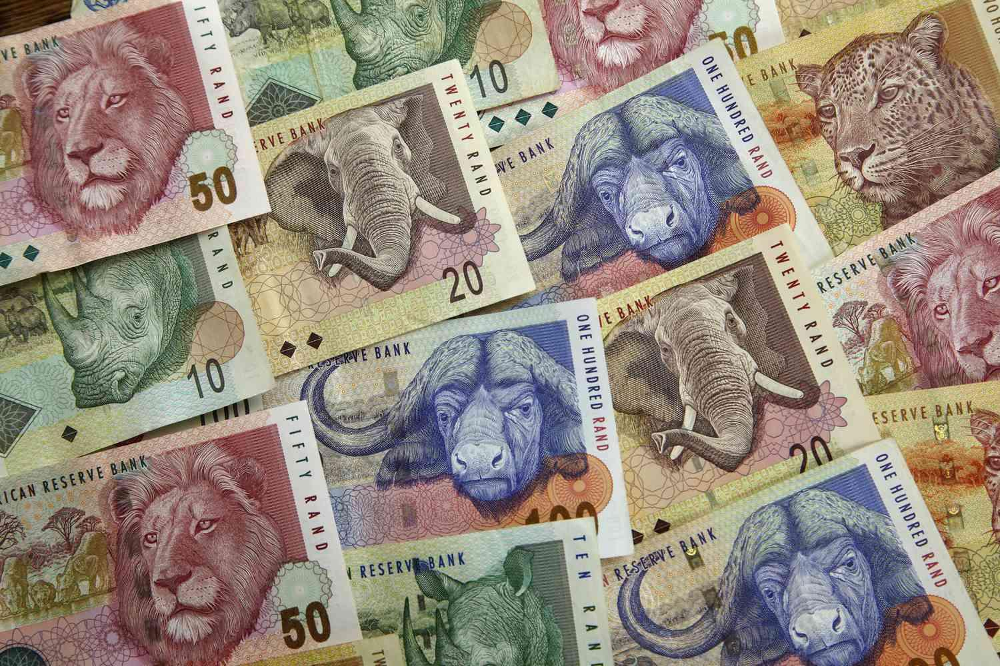

## Table of Contents

## What is the South African Rand?

The South African Rand is the official currency of South Africa. It is used every day by people in South Africa to buy things like food, clothes, and other goods. The symbol for the Rand is "R" and it is divided into 100 cents. The South African Reserve Bank is in charge of the Rand and makes sure it works well in the country's economy.

The Rand was first used in 1961, when South Africa became a republic. Before that, South Africa used the South African pound. The name "Rand" comes from the Witwatersrand, which is a famous area in South Africa known for its gold mines. The value of the Rand can change compared to other currencies, like the US dollar or the Euro, and this can affect the cost of things that South Africa buys from other countries.

## When was the South African Rand first introduced?

The South African Rand was first introduced in 1961. This was the year when South Africa became a republic and decided to have its own currency. Before the Rand, South Africa used the South African pound.

The name "Rand" comes from the Witwatersrand, which is a place in South Africa famous for its gold mines. When the Rand was introduced, it replaced the South African pound at a rate of 2 Rand to 1 pound. This change helped South Africa to have its own money that showed it was a new republic.

## What currency did the South African Rand replace?

The South African Rand replaced the South African pound. Before 1961, people in South Africa used the South African pound for buying things.

In 1961, South Africa became a republic and decided to have its own money. They chose to call the new money the Rand, and it replaced the South African pound at a rate of 2 Rand to 1 pound.

## How has the design of the South African Rand changed over time?

The design of the South African Rand has changed a lot since it started in 1961. At first, the coins showed pictures of animals like the springbok, which is a kind of antelope, and the blue crane, which is a bird. The banknotes had pictures of important people from South Africa's history, like Jan van Riebeeck, who was the first person to start a Dutch settlement in South Africa. Over the years, new designs came out that showed more of South Africa's nature and culture.

In the 1990s, big changes happened to the Rand's design because South Africa got a new government. The new designs wanted to show that South Africa was moving forward and that everyone in the country was important. The banknotes started showing pictures of the "Big Five" animals, which are the lion, elephant, rhino, leopard, and buffalo. They also showed pictures of South Africa's different cultures and people working together. The coins also changed to show more animals and plants from South Africa, and they got new shapes and sizes. These changes helped to make the Rand look more modern and to show what South Africa stands for today.

## What are the different denominations of the South African Rand?

The South African Rand comes in different amounts of money called denominations. For coins, you can find 10 cents, 20 cents, 50 cents, 1 Rand, 2 Rand, and 5 Rand. The 10, 20, and 50 cent coins are smaller and made of copper and nickel, while the 1, 2, and 5 Rand coins are bigger and made of different metals like nickel-plated steel or copper-nickel.

For paper money, or banknotes, there are 10 Rand, 20 Rand, 50 Rand, 100 Rand, and 200 Rand notes. These notes have different colors to help people tell them apart easily. The 10 Rand note is green, the 20 Rand note is brown, the 50 Rand note is red, the 100 Rand note is blue, and the 200 Rand note is orange. These different amounts help people use the right money for what they need to buy.

## How has the value of the South African Rand fluctuated historically?

The value of the South African Rand has gone up and down a lot since it started in 1961. At first, the Rand was worth a lot compared to other currencies like the US dollar. But over time, many things made its value change. In the 1970s and 1980s, South Africa had some big problems because of apartheid, which made people not want to do business with the country. This made the Rand lose value. Also, when the price of gold, which South Africa has a lot of, goes down, the Rand usually loses value too.

After apartheid ended in the early 1990s, the Rand's value started to get better. People around the world were happy that South Africa was changing and they wanted to invest money there. But the Rand still had ups and downs. In the 2000s, the Rand got stronger because South Africa's economy was doing well. But then, in 2008, there was a big financial crisis all over the world, and the Rand lost value again. Since then, the Rand has kept changing, going up and down because of things like the price of gold and what's happening in South Africa's economy.

## What major economic events have impacted the value of the South African Rand?

The value of the South African Rand has been affected by many big events. One of the biggest was apartheid, which was a time when South Africa had laws that separated people by their race. Many countries did not want to do business with South Africa because of these laws, which made the Rand lose value in the 1970s and 1980s. Also, because South Africa has a lot of gold, when the price of gold goes down, the Rand usually loses value too.

When apartheid ended in the early 1990s, the value of the Rand started to get better. People around the world were happy that South Africa was changing and they wanted to invest money there. This helped the Rand to become stronger. But the Rand still had ups and downs. In the 2000s, South Africa's economy was doing well, and the Rand got stronger. But then, in 2008, there was a big financial crisis all over the world, and the Rand lost value again.

Since then, the Rand has kept changing. It goes up and down because of things like the price of gold and what's happening in South Africa's economy. The Rand is also affected by what happens in other countries because South Africa trades with them. So, if other countries have problems, it can make the Rand lose value too.

## How does the South African Reserve Bank influence the Rand's value?

The South African Reserve Bank (SARB) is in charge of the Rand and helps to keep its value steady. One big way they do this is by changing the interest rates. When the SARB raises interest rates, it makes it more expensive for banks to borrow money from them. This can make the Rand stronger because people from other countries might want to invest in South Africa to get the higher interest rates. On the other hand, if the SARB lowers interest rates, it can make the Rand weaker because it's less attractive for foreign investors.

The SARB also buys and sells currencies in the foreign exchange market to help control the Rand's value. If the Rand is getting too weak, the SARB might sell other currencies they have and buy Rands to make it stronger. If the Rand is getting too strong, they might do the opposite. The SARB also keeps an eye on how much money is coming in and out of South Africa, and they can make rules to stop too much money from leaving the country if it's making the Rand weaker. All these things help the SARB to try and keep the Rand's value stable.

## What role has the South African Rand played in regional trade?

The South African Rand is important for trade in the area around South Africa. It is used a lot in countries that are close to South Africa, like those in the Southern African Development Community (SADC). Many of these countries use the Rand for buying and selling things because it is easier than using different currencies. This makes it simpler for businesses in these countries to trade with each other and with South Africa.

The Rand also helps make trade easier because it is a strong and stable currency compared to some other currencies in the region. When countries use the Rand, they don't have to worry as much about their own currency losing value quickly. This stability can make businesses feel more confident about trading with South Africa and other countries that use the Rand. Overall, the Rand helps make trade smoother and more reliable in the region.

## How has the South African Rand been affected by political changes in South Africa?

The South African Rand has been affected a lot by big changes in South Africa's government. When apartheid ended in the early 1990s, the Rand's value started to get better. Before that, many countries did not want to do business with South Africa because of apartheid, which made the Rand lose value. But when apartheid ended, people around the world were happy and wanted to invest money in South Africa. This made the Rand stronger because more money was coming into the country.

However, even after apartheid, the Rand has had ups and downs because of political changes. Sometimes, when there are big changes in the government or if there are problems like corruption, it can make people worried about South Africa's economy. This can make the Rand lose value because investors might take their money out of the country. So, the Rand's value can change a lot depending on what's happening in South Africa's politics.

## What are the key factors affecting the South African Rand's exchange rate today?

The South African Rand's exchange rate today is influenced by many things. One big [factor](/wiki/factor-investing) is the price of commodities like gold and platinum. South Africa has a lot of these, so when their prices go up, the Rand usually gets stronger because more money comes into the country. Another important factor is how South Africa's economy is doing. If the economy is growing and doing well, the Rand tends to be stronger. But if the economy is having problems, the Rand can lose value.

Politics also plays a big role in the Rand's value. If there is a lot of uncertainty or problems in the government, like corruption or big changes, it can make investors worried. When investors are worried, they might take their money out of South Africa, which can make the Rand weaker. On the other hand, if things are stable and the government is doing good things for the economy, the Rand can get stronger. The South African Reserve Bank also affects the Rand by changing interest rates and buying or selling currencies to try and keep the Rand's value steady.

## How does the South African Rand compare to other major African currencies in terms of stability and usage?

The South African Rand is one of the most stable and widely used currencies in Africa. It is used a lot in countries around South Africa, like those in the Southern African Development Community (SADC). This makes it easier for businesses in these countries to trade with each other because they don't have to use different currencies. The Rand is also seen as more stable than many other African currencies because South Africa has a strong economy and a central bank that works hard to keep the Rand's value steady.

Compared to other major African currencies, like the Nigerian Naira or the Kenyan Shilling, the Rand is often more stable. The Naira and the Shilling can lose value quickly because of problems in their countries' economies or politics. The Rand, on the other hand, is affected by things like the price of gold and platinum, which South Africa has a lot of, but it also has a strong central bank that can help keep its value from changing too much. So, while the Rand can go up and down, it is usually more reliable than many other African currencies.

## Can you explain Algorithmic Trading with the South African Rand?

Algorithmic trading involves the use of sophisticated computer algorithms to automate and optimize the trading process, allowing traders to execute trades based on predefined criteria and in response to real-time market conditions. This approach has gained significant traction among traders in the South African Rand (ZAR) market due to its inherent [volatility](/wiki/volatility-trading-strategies) and potential for profit. 

Traders in the ZAR market rely heavily on historical data and predictive analytics to develop robust [algorithmic trading](/wiki/algorithmic-trading) strategies. By analyzing past market behavior, algorithm developers can identify patterns and trends that may predict future price movements. This quantitative analysis often involves time-series forecasting models, such as the ARIMA (AutoRegressive Integrated Moving Average) method, which can model and predict future points in the time series based on its own past values:

$$
X_t = c + \phi_1 X_{t-1} + \phi_2 X_{t-2} + ... + \phi_p X_{t-p} + \epsilon_t + \theta_1 \epsilon_{t-1} + \theta_2 \epsilon_{t-2} + ... + \theta_q \epsilon_{t-q}
$$

Where:
- $X_t$ represents the observed value at time $t$,
- $c$ is a constant,
- $\phi$ represents the autoregressive coefficients,
- $\epsilon_t$ is the error term at time $t$,
- $\theta$ represents the moving average coefficients.

Predictive analytics also incorporates real-time data feeds and [machine learning](/wiki/machine-learning) algorithms that adapt to new information faster than traditional methods. Machine learning models, such as neural networks and regression trees, can be trained on large datasets to detect complex, non-linear relationships in market dynamics.

Advancements in technology have lowered the entry barrier for algorithmic trading, providing traders with more accessible tools to engage in this high-speed environment. The increase in computational power and the availability of sophisticated trading platforms allow traders to implement strategies with precision and efficiency. High-frequency trading ([HFT](/wiki/high-frequency-trading-strategies)) systems, a subset of algorithmic trading, can execute thousands of transactions in fractions of a second, exploiting minute price discrepancies in the ZAR market.

Python is a preferred programming language for implementing trading algorithms due to its simplicity and the vast array of libraries available. Popular libraries such as NumPy and pandas facilitate data manipulation and analysis, while machine learning frameworks like scikit-learn enable sophisticated predictive modeling.

```python
import numpy as np
import pandas as pd
from sklearn.ensemble import RandomForestRegressor

# Load historical ZAR data
data = pd.read_csv('zar_historical_data.csv')
X = data.drop('target', axis=1)
y = data['target']

# Define and train model
model = RandomForestRegressor(n_estimators=100)
model.fit(X, y)

# Predict future trends
future_predictions = model.predict(new_market_data)
```

This hypothetical Python script exemplifies using a Random Forest Regressor to predict ZAR market trends based on historical data.

Algorithmic trading in the ZAR market offers distinct advantages, such as the ability to operate without human emotional interference and the capability to backtest strategies over historical data to foresee potential profitability. However, it also presents challenges, including the need for constant strategy refinement in response to evolving market conditions and the significant resources required to maintain cutting-edge infrastructure.

This synthesis of historical data analysis, predictive modeling, and technological advancement forms the cornerstone for algorithmic trading strategies in the ZAR market, allowing traders to navigate its complexities and seize opportunities.

## References & Further Reading

[1]: Aronson, D. R. (2007). ["Evidence-Based Technical Analysis: Applying the Scientific Method and Statistical Inference to Trading Signals."](https://www.amazon.com/Evidence-Based-Technical-Analysis-Scientific-Statistical/dp/0470008741) John Wiley & Sons.

[2]: de Prado, M. L. (2018). ["Advances in Financial Machine Learning."](https://www.amazon.com/Advances-Financial-Machine-Learning-Marcos/dp/1119482089) Wiley.

[3]: Chan, E. (2009). ["Quantitative Trading: How to Build Your Own Algorithmic Trading Business."](https://github.com/ftvision/quant_trading_echan_book) Wiley.

[4]: "South African Reserve Bank." [SARB Official Website](https://www.resbank.co.za/).

[5]: Jansen, S. (2020). ["Machine Learning for Algorithmic Trading."](https://github.com/stefan-jansen/machine-learning-for-trading) Packt Publishing.

[6]: Investopedia. ["Understanding Algorithmic Trading."](https://www.investopedia.com/terms/a/algorithmictrading.asp)