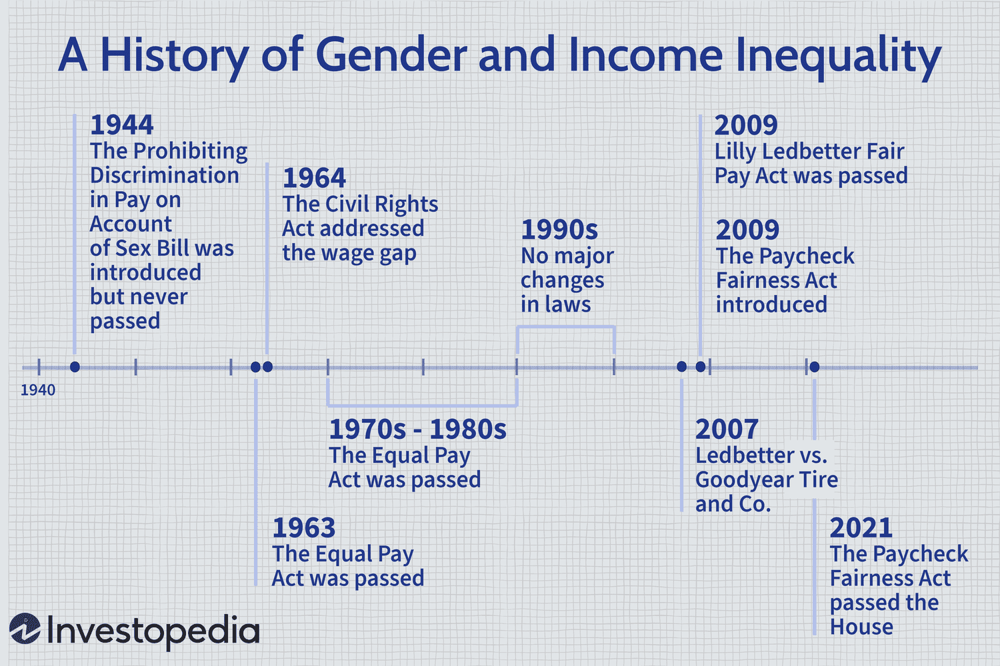

Income inequality and gender inequality represent enduring and significant facets of societal disparities, shaping the socio-economic fabric across the globe. Algorithmic trading, a cornerstone of modern financial systems, further complicates these dynamics, introducing new dimensions to consider when analyzing economic equity. This article explores how these phenomena intersect, highlighting their implications and interconnections within contemporary economic frameworks.

Historically, income inequality can be traced back to the earliest civilizations where wealth and resources were distributed unevenly, influenced by factors such as social class, occupation, and geographical location. Gender inequality, particularly manifested through the gender pay gap, has its roots in historical societal norms and legal structures that limited women's roles in the workforce. Despite advances, significant disparities in wages between men and women persist, amplified by age, race, and geographic factors. Legislative efforts over the decades, such as the Equal Pay Act in the United States, have aimed to reduce these gaps, yet challenges remain in achieving true equality.

The statistical analysis of income and gender inequality provides a comprehensive understanding of these issues on a global scale. Current data underscore stark income disparities both within and between nations, with wealth concentrated in the hands of a few. Similarly, the gender pay gap remains pervasive across different industries and regions, signifying a systemic issue rooted in socio-cultural norms and economic structures. Varied wage disparities are evident when analyzed through the lenses of race and age, revealing complex layers of inequity.

Algorithmic trading, characterized by the use of computer algorithms to execute trades at high speeds and volumes, plays an increasingly prominent role in financial markets. While it offers efficiencies and potential profits, it also raises concerns regarding its impact on wealth distribution. The automated nature of algorithmic trading may exacerbate existing inequalities, potentially favoring those with access to advanced technologies and financial expertise. Gender biases in algorithms, often reflecting broader societal prejudices, may lead to disparate outcomes for male and female traders, further entrenching gender inequality in the financial arena.

This article navigates the challenges and debates surrounding the gender wage gap and income inequality, examining cultural, social, and economic factors that exacerbate these issues. Addressing criticisms and counterarguments, it seeks to elucidate the intricacies involved in measuring and interpreting inequality data, ultimately striving for a nuanced understanding of these complex issues.

By reviewing successful policies and strategies, the article aims to highlight pathways toward economic equality. The integration of innovative technologies and solutions offers new opportunities to address these inequalities, emphasizing the importance of diversity and inclusion within economic policymaking. The pursuit of balanced representation and equitable resource distribution remains a pivotal concern for sustainable societal progress.

In conclusion, the interrelationship between gender and income inequalities, particularly within the context of algorithmic trading, underscores the necessity for focused research, nuanced policy development, and societal transformation. As new economic practices evolve, understanding and addressing these disparities are critical to ensuring an equitable future.

## Table of Contents

## Historical Development of Income and Gender Inequality

Income and gender inequality have deep historical roots, evolving alongside human societies. Understanding these inequalities necessitates examining their origins and developments across different eras.

### Origins of Income Inequality

Income inequality dates back to ancient civilizations, where societal structures often dictated wealth distribution. In Mesopotamia and ancient Egypt, wealth was concentrated among rulers and priests, while the majority lived modestly as farmers or laborers. Similarly, in the Greco-Roman world, slavery and landownership created distinct economic hierarchies that perpetuated inequality. The development of feudal systems in medieval Europe further entrenched wealth disparities, as land-owning nobility held substantial economic power over serfs and peasants.

The industrial revolution marked a significant shift, amplifying income inequality through the rise of industrial capitalists and factory workers. Urbanization and industrialization widened the economic gap, as capital accumulation became central to wealth gain. This era witnessed the emergence of early economic theories addressing inequality, notably Karl Marx's critique of capitalism and Andrew Carnegie's "Gospel of Wealth", advocating for wealth redistribution through philanthropy.

### Historical Progression of the Gender Pay Gap

Gender inequality has similarly deep roots, intertwined with societal roles and expectations. In ancient societies, labor was often divided along gender lines, with men performing trade and military roles while women were relegated to domestic responsibilities, limiting their economic opportunities. This division persisted into the Middle Ages and beyond, with women's work often undervalued and underpaid.

The 20th century brought significant attention to gender disparities with women entering the workforce en masse during World Wars I and II. Despite increased participation, wage gaps persisted due to discriminatory practices and societal norms. The feminist movements of the 1960s and 1970s were pivotal in highlighting gender pay disparities, advocating for equal pay and employment opportunities.

### Legislative Measures to Reduce Inequalities

Efforts to address income and gender inequality gained [momentum](/wiki/momentum) in the mid-20th century, resulting in landmark legislative measures. In the United States, the Equal Pay Act of 1963 sought to eliminate wage disparity based on gender, followed by the Civil Rights Act of 1964 that prohibited employment discrimination.

Internationally, the Convention on the Elimination of All Forms of Discrimination Against Women (CEDAW), adopted by the United Nations in 1979, marked a significant global commitment to gender equality. In Europe, the Treaty of Rome (1957) included provisions for equal pay, which evolved into comprehensive gender equality directives under the European Union framework.

Despite these advances, addressing income and gender inequality remains challenging due to persistent socio-economic and cultural factors. Understanding the historical trajectory of these disparities underscores the complexity and necessity of continued legislative and societal efforts for a more equitable future.

## Statistical Analysis of Income and Gender Inequality

Income inequality has been a persistent issue across the globe, characterized by a significant disparity in the distribution of wealth and income among various populations. The Gini coefficient, a commonly used measure of inequality, reveals stark differences between countries. For instance, as of recent data, countries such as South Africa and Brazil have Gini coefficients above 0.50, indicating higher inequality, whereas nations like Denmark and Slovenia exhibit coefficients around 0.25, representing more equitable income distribution (World Bank, 2021).

### Global Income Inequality Statistics

Income inequality is influenced by various factors, including economic policies, labor market structures, and global economic conditions. Data from the World Inequality Database indicates that the top 1% of earners have consistently captured a growing share of national income in countries such as the United States, China, and India over the past few decades. In the United States, the share of income for the top 1% rose from around 10% in 1980 to over 20% in 2020, underscoring the concentration of wealth amongst the affluent (World Inequality Database).

### Gender Pay Gap by Country and Industry

The gender pay gap remains a critical component of income inequality, with variations noted across different countries and industries. According to the Global Gender Gap Report 2022 by the World Economic Forum, the global gender pay gap stands at approximately 20%, meaning women earn, on average, 80 cents for every dollar earned by men. This gap is more pronounced in regions like South Asia and the Middle East, with disparities of over 30%, whereas Western Europe shows a smaller gap of around 13%.

Industry-specific data reveal that traditionally male-dominated sectors such as technology and finance tend to exhibit larger pay gaps. For example, in the tech industry within the United States, women earn about 83% of what their male counterparts make, while in healthcare and education, the gap narrows significantly (U.S. Bureau of Labor Statistics, 2021).

### Variations in Gender Wage Disparities by Race and Age

The intersection of gender with race and age adds layers to pay disparity analysis. Research by the National Women's Law Center (NWLC) indicates that women of color experience a compounded wage gap. In the United States, Black women earn about 64 cents, and Hispanic women about 57 cents for every dollar earned by white, non-Hispanic men. This disparity not only reflects gender discrimination but also systemic racial biases within the labor market.

Age further affects wage disparities. A study by the American Association of University Women (AAUW) highlights that the gender pay gap widens with age. Younger women (ages 20-24) face a gap of approximately 10%, which can increase to 27% or more for those aged 55-64. This trend is attributed to career interruptions, differences in industry representation, and accumulated biases over women's working lives.

In conclusion, statistical analyses reveal significant and multi-dimensional disparities in income and gender pay across various global contexts. Addressing these inequalities requires targeted policies that consider the intricate interplay of gender, race, and age within different economic frameworks.

## Influence of Algorithmic Trading on Income Inequality

Algorithmic trading, a method that utilizes computer algorithms to automate trading decisions and execute transactions at high speed and frequency, has fundamentally altered the modern financial landscape. By leveraging sophisticated statistical models and algorithms, it allows for rapid decision-making that capitalizes on fleeting market opportunities. In the contemporary financial system, [algorithmic trading](/wiki/algorithmic-trading) accounts for a significant portion of equity trades in major financial markets, enhancing [liquidity](/wiki/liquidity-risk-premium) and reducing transaction costs. However, this technological advancement also raises critical questions about its implications for wealth distribution and potential biases, including gender biases, in its execution and outcomes.

The impact of algorithmic trading on wealth distribution is multifaceted. Proponents argue that algorithmic trading contributes to market efficiency and stability by providing liquidity and narrowing bid-ask spreads. These enhancements can theoretically benefit all market participants, including smaller investors, by facilitating better pricing and trading conditions. However, critics contend that algorithmic trading can exacerbate wealth inequality. High-frequency traders, often possessing superior technology and vast resources, can exploit minuscule price variations, accruing significant profits from short-term trades. Such capabilities are typically accessible only to large financial institutions and sophisticated hedge funds, potentially widening the gap between these entities and smaller, retail investors.

Moreover, the competitive edge achieved through algorithmic trading can lead to an uneven playing field, where those without access to advanced technology and expertise fall behind, contributing to a skewed distribution of financial gains. The consolidation of wealth among a small cohort of technologically advanced traders raises concerns about the equitable distribution of economic benefits in the financial markets.

Investigating potential gender biases in algorithmic trading outcomes is an area of growing interest and concern. Algorithmic systems, when designed without consideration for bias, may reflect or even amplify existing disparities. In finance, where gender inequality persists, there is a risk that algorithms could inadvertently favor male-dominated sectors or trading strategies, thereby perpetuating gender disparities. For instance, if algorithms are trained on historical data from male-dominated markets or lack diverse representation in their development process, they could produce biased outcomes that disadvantage female traders or investors.

To quantify and address such biases, it is essential to assess the data sets and algorithms used in trading systems. Employing fairness-aware algorithms and conducting bias audits can help mitigate these risks. For example, incorporating diverse datasets and using bias detection tools, such as the Adversarial Debiasing technique in [machine learning](/wiki/machine-learning), could improve algorithmic fairness.

In summary, while algorithmic trading plays a crucial role in modern finance by improving market efficiency, its impact on wealth distribution and potential gender biases warrants careful examination. Addressing these challenges requires a multi-pronged approach that includes advancing technology access, ensuring fairness in algorithm design, and promoting inclusive financial practices.

## Challenges and Debates

The debates surrounding the gender wage gap and income inequality are multifaceted, encompassing a variety of perspectives and methodological challenges. One of the primary areas of contention is the extent to which these disparities are a direct result of discrimination versus structural and socio-economic factors. Critics argue that while gender discrimination plays a role, other factors such as differences in work experience, education levels, occupational segregation, and individual career choices significantly contribute to the wage gap.

Socio-economic and cultural factors play a fundamental role in exacerbating income disparities. Historical gender roles often influenced educational and career paths, with women traditionally entering lower-paying professions. This occupational segregation continues to persist, despite increased female workforce participation. Cultural norms and family responsibilities also affect women's career trajectories and earnings potential. Comprehensive parental leave policies and affordable childcare can mitigate these issues, but their availability varies widely between regions.

Cultural perceptions impact economic participation rates. In some societies, gender norms discourage women's engagement in certain high-paying sectors, such as technology or finance. These cultural barriers can affect career advancement opportunities, contributing to income inequality.

Critics of inequality measurement suggest that commonly used metrics, such as the Gini coefficient, may not fully capture the complexity of income distribution. The Gini coefficient, calculated as follows, measures income inequality within a population:

$$
G = \frac{\sum_{i=1}^{n} \sum_{j=1}^{n} |x_i - x_j|}{2n^2 \overline{x}}
$$

where $x_i$ and $x_j$ are individual incomes and $\overline{x}$ is the mean income of the sample.

Alternative measures, like the Palma ratio—which compares the richest 10% to the poorest 40%—argue for a broader context in assessing inequality. Critics argue the focus should be on wealth inequality, including asset accumulation, rather than just income disparities. In evaluating gender disparities, methodologies differ in accounting for part-time or unpaid labor typically undertaken by women, thereby complicating direct wage comparisons.

Moreover, the accuracy of inequality data may be compromised by data limitations, including unreported incomes or informal labor market participation. Longitudinal studies, which track income dynamics over time, offer insights into economic mobility and inequality patterns but are complex and resource-intensive to conduct.

Despite these debates, there is consensus on the importance of policy interventions aimed at reducing both gender and income inequalities. Investments in education, skills development, and inclusive economic policies are pivotal in bridging disparities. Addressing implicit biases and promoting diverse work environments can drive systemic change, ensuring equitable opportunities for all individuals regardless of gender or socio-economic background.

## Closing the Gap: Strategies and Solutions

Efforts to mitigate income and gender inequalities have led to the implementation of numerous policies and strategies worldwide. These initiatives seek to create a more balanced economic environment and incorporate diversity and inclusion into policymaking, which are critical components for achieving equality.

### Successful Policies and Strategies

Policies designed to address income and gender inequalities often revolve around legislative reforms and social programs. Equal pay laws, such as the Equal Pay Act in the United States and the Equality Act in the United Kingdom, aim to eliminate gender-based wage discrimination. These laws have laid the groundwork for reducing the gender pay gap by mandating equal compensation for equal work, although enforcement remains an ongoing challenge.

In addition to legislation, some countries have implemented family-friendly workplace policies, such as parental leave and affordable childcare services, to support gender equality. These measures enable more equitable participation of women in the workforce by addressing work-life balance issues, thereby promoting a more inclusive economic landscape.

Progressive tax systems that redistribute wealth are another method to address income inequality. Countries like Sweden and Denmark employ high tax rates on higher income brackets and use those funds to support public services, thereby narrowing the income disparity.

### Innovative Solutions and Technologies

The advent of technology presents new opportunities for fostering economic equality. Financial technologies, including blockchain and mobile banking, have been pivotal in expanding access to financial services for underserved populations. Blockchain technology, for example, offers transparency and security in financial transactions, which can reduce corruption and promote trust in financial systems.

Furthermore, machine learning and data analytics are being leveraged to identify patterns of inequality and develop data-driven policies. By analyzing large datasets, these technologies can pinpoint disparities and inform targeted interventions to bridge income and gender gaps. For instance, AI-driven platforms that audit organizational pay structures can help identify and correct unjust wage disparities.

### Importance of Diversity and Inclusion in Economic Policymaking

Integrating diversity and inclusion into economic policymaking ensures that the voices of marginalized groups are heard and considered. This inclusion can be achieved through policies that mandate diverse representation in decision-making bodies, thereby enriching the policymaking process with varied perspectives and experiences. 

Moreover, education and workforce training programs focused on underrepresented groups can equip them with the skills necessary to thrive in today's economy. These programs are vital for dismantling structural barriers to employment and fostering a more inclusive labor market.

Policies that prioritize diversity and inclusion not only advance social justice but also enhance economic performance. Numerous studies have shown that diverse teams are more innovative and effective, leading to better organizational outcomes.

In conclusion, a multidimensional approach combining legislative measures, technological innovations, and inclusive policies is key to addressing income and gender inequalities. By harnessing these strategies, societies can progress towards a more equitable economic future for all. Continued attention to these issues will not only support those directly affected but also contribute to broader economic growth and stability.

## Conclusion

This article has navigated the multifaceted landscape of income and gender inequality, showcasing the intricate bond with algorithmic trading in modern finance. The historical journey of income and gender disparities has highlighted how deeply entrenched these issues are, evolving from early civilizations to facing modern-day challenges. Through a detailed statistical analysis, we have observed stark disparities in income levels and gender pay gaps that persist across various countries and industries. Furthermore, these inequalities often intersect with race and age, complicating efforts to achieve equity.

Algorithmic trading, a cornerstone of today's financial system, has been identified as a mechanism that may exacerbate existing economic disparities. Its influence on wealth distribution underscores an urgent need for scrutinizing the algorithms for potential gender biases and ensuring fair representation. The role of socio-economic and cultural factors cannot be overstated, as they continue to exacerbate disparities, demanding critical evaluation and thoughtful policy interventions.

To bridge these gaps, successful policies and strategies, alongside innovative technological solutions, have been highlighted. These initiatives underscore the importance of diversity and inclusion in shaping economic policies aimed at fostering equality.

The need to address gender and income inequalities is paramount, especially in contexts influenced by algorithmic trading. Moving forward, there is a critical call to action for sustained research and robust policy development that positions economic equality at its core. Societal change must be driven by an unwavering commitment to inclusivity, ensuring all voices are heard, and all individuals are afforded equal opportunities in the evolving economic landscape.

## References & Further Reading

[1]: "World Inequality Database." Retrieved from [https://wid.world/](https://wid.world/)

[2]: World Economic Forum. "Global Gender Gap Report 2022." Retrieved from [https://www.weforum.org/reports/global-gender-gap-report-2022/](https://www.weforum.org/publications/global-gender-gap-report-2022/)

[3]: "The Equal Pay Act of 1963." EEOC. Retrieved from [https://www.eeoc.gov/statutes/equal-pay-act-1963](https://www.eeoc.gov/statutes/equal-pay-act-1963)

[4]: National Women's Law Center. "The Wage Gap: The Who, How, Why, and What To Do." Retrieved from [https://nwlc.org/resources/the-wage-gap-the-who-how-why-and-what-to-do/](https://nwlc.org/wp-content/uploads/2019/09/Wage-Gap-Who-how.pdf)

[5]: "Convention on the Elimination of All Forms of Discrimination against Women (CEDAW)." UN Women. Retrieved from [https://www.un.org/womenwatch/daw/cedaw/](https://www.ohchr.org/Documents/ProfessionalInterest/cedaw.pdf)

[6]: "Income Inequality." World Bank. Retrieved from [https://www.worldbank.org/en/topic/inequality/brief/income-inequality](https://documents.worldbank.org/en/publication/documents-reports/documentdetail/959251468176687085/global-income-inequality-by-the-numbers-in-history-and-now-an-overview)

[7]: American Association of University Women (AAUW). "The Simple Truth about the Gender Pay Gap: 2022 Update." Retrieved from [https://www.aauw.org/resources/research/simple-truth/](https://www.aauw.org/resources/research/simple-truth/)

[8]: Lopez de Prado, M. (2018). "Advances in Financial Machine Learning." Wiley. Retrieved from [https://www.wiley.com/en-us/Advances+in+Financial+Machine+Learning-p-9781119482086](https://www.wiley.com/en-us/Advances+in+Financial+Machine+Learning-p-9781119482086)

[9]: Chan, E. P. (2008). "Quantitative Trading: How to Build Your Own Algorithmic Trading Business." Wiley. Retrieved from [https://www.wiley.com/en-us/Quantitative+Trading:+How+to+Build+Your+Own+Algorithmic+Trading+Business-p-9780470284889](https://books.google.com/books/about/Quantitative_Trading.html?id=j70yEAAAQBAJ)