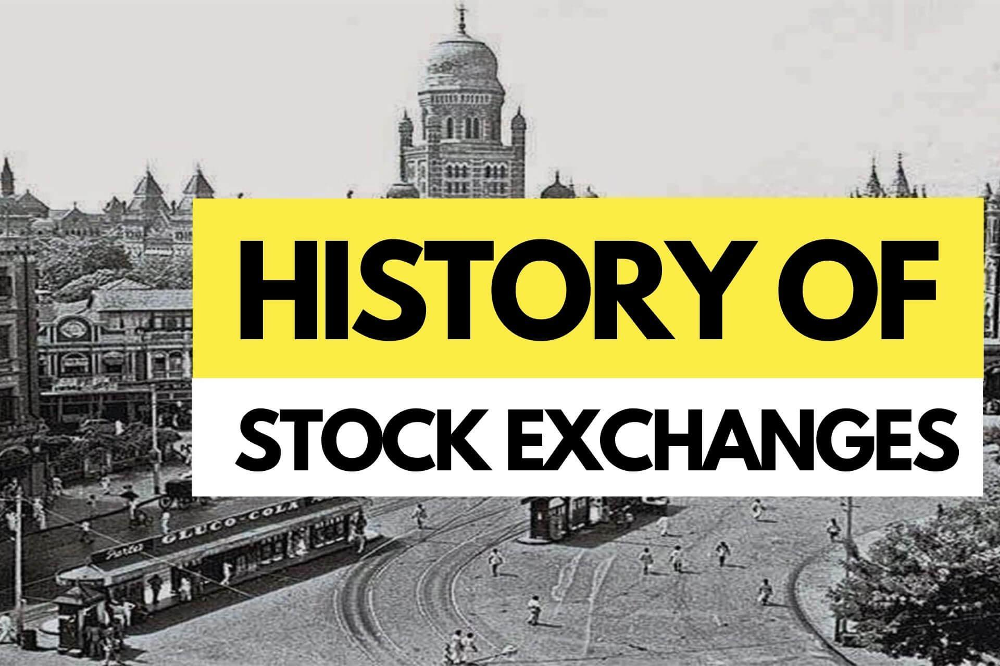

## Table of Contents

## What is a stock exchange?

A stock exchange is a place where people buy and sell shares of companies. These shares represent a small piece of ownership in a company. When you buy a share, you become a part-owner of that company. Stock exchanges help companies raise money by selling shares to the public. This money can be used to grow the business or pay for new projects.

There are many stock exchanges around the world, like the New York Stock Exchange and the Tokyo Stock Exchange. Each exchange has its own rules and lists of companies whose shares can be traded. People can trade shares through brokers, who are like middlemen that help with buying and selling. The price of shares goes up and down based on what people think the company is worth and how well it is doing.

## When and where was the first stock exchange established?

The first stock exchange was established in Amsterdam, Netherlands, in the year 1602. It was called the Amsterdam Stock Exchange. This exchange was set up by the Dutch East India Company, which needed a way to raise money for its trading trips to Asia. The company sold shares to the public, and these shares could be traded at the exchange.

The Amsterdam Stock Exchange was important because it was the first place where people could buy and sell shares in a formal way. Before this, trading was done informally, often in coffee houses or on the street. The Amsterdam Stock Exchange helped make trading more organized and set the stage for modern stock exchanges around the world.

## How did early stock exchanges function?

Early stock exchanges, like the Amsterdam Stock Exchange, were simple but important places where people could buy and sell shares. They worked by having a physical location where traders could come together to trade. In Amsterdam, this was often a building where people would gather to trade shares of the Dutch East India Company. The exchange used a system where traders would shout out their offers to buy or sell shares, and if someone agreed to the price, a trade would happen. This way of trading was called an "open outcry" system.

These early exchanges also had rules to make sure trading was fair. For example, they had set times when trading could happen, and they kept records of all the trades. This helped people trust the exchange and feel safe about buying and selling shares. Over time, these early systems became more organized and led to the modern stock exchanges we have today, where trading can happen electronically and involves many different kinds of financial products.

## What were the major stock exchanges in the 19th century?

In the 19th century, some of the biggest stock exchanges were in Europe and the United States. The London Stock Exchange, which started in 1801, became one of the most important places for trading shares. It helped companies in Britain and around the world raise money. The New York Stock Exchange, which began in 1792, also grew a lot during this time. It became a key place for trading shares of American companies, helping the U.S. economy grow.

Another important stock exchange in the 19th century was the Paris Bourse, which opened in 1808. It was a big deal for trading shares in France and other European countries. The Paris Bourse helped French companies raise money and was a sign of France's growing economy. These exchanges, along with others like the Berlin Stock Exchange, which opened in 1685 but became more important in the 19th century, played a big role in the world's economy by helping companies get the money they needed to grow and do new things.

## How did the stock market crash of 1929 affect stock exchanges?

The stock market crash of 1929, also known as Black Tuesday, had a huge impact on stock exchanges around the world. On October 29, 1929, the prices of shares on the New York Stock Exchange dropped a lot, and many people lost a lot of money. This crash didn't just affect the U.S.; it caused problems for stock exchanges everywhere. Many people lost trust in the stock market and stopped buying shares. This led to less trading on stock exchanges and made it hard for companies to raise money.

The crash was a big part of the start of the Great Depression, which lasted for many years. During the Great Depression, the economy was very bad, and many people were out of work. Stock exchanges didn't trade as much as before, and it took a long time for them to recover. Governments had to make new rules to try to stop such big crashes from happening again. These rules helped make stock exchanges safer and more trusted, but it took many years for the stock market to get back to how it was before the crash.

## What technological advancements have influenced the operation of stock exchanges?

Technology has changed stock exchanges a lot over the years. In the old days, people had to be in the same place to buy and sell shares. They would shout out prices and make deals face-to-face. But with computers and the internet, stock exchanges can now work electronically. This means traders can buy and sell shares from anywhere in the world without needing to be in the same building. It makes trading faster and easier. Now, instead of shouting, traders use computer programs to make trades happen in seconds.

Another big change is the use of algorithms and high-frequency trading. These are computer programs that can make thousands of trades in a very short time. They look at lots of information and make quick decisions about buying and selling shares. This can make the market move very fast. Also, technology has helped make stock exchanges safer. They use computers to keep track of all trades and make sure everything is fair. This helps people trust the stock market more.

## How have regulations and governance of stock exchanges evolved over time?

Over time, the rules for stock exchanges have changed a lot. In the early days, there were not many rules, and trading was often done in a more informal way. But after big problems like the stock market crash of 1929, governments saw the need for better rules to protect people and keep the market fair. In the United States, the government made the Securities and Exchange Commission (SEC) in 1934. This group was set up to make sure that companies told the truth about their business and to stop people from cheating in the stock market. Other countries made similar groups to watch over their stock exchanges.

As time went on, the rules got even stricter. Governments around the world started to work together to make sure that trading was fair no matter where it happened. They made rules about how companies had to share information with the public and how much money people could borrow to buy shares. They also made rules to stop people from using secret information to make money unfairly. Today, stock exchanges are watched closely to make sure they follow these rules. This helps keep the stock market safe and trusted by everyone who uses it.

## What is the role of stock exchanges in global financial markets?

Stock exchanges play a big role in global financial markets. They are places where people from all over the world can buy and sell shares of companies. This helps companies raise money to grow their business or start new projects. When a company sells shares on a stock exchange, it can get money from people who want to invest in the company. This is good for the economy because it helps businesses grow and create jobs.

Stock exchanges also help the world's money move around. They connect investors from different countries, making it easier for money to flow from one place to another. This can help countries that need money to grow their economies. But it can also make the world's economy more connected, which means problems in one country can affect others. Stock exchanges have rules to make sure trading is fair and safe, which helps keep the global financial markets stable and trusted by everyone.

## How have stock exchanges adapted to electronic trading?

Stock exchanges have changed a lot because of electronic trading. Before, people had to be in the same place to buy and sell shares. They would shout out prices and make deals face-to-face. But now, with computers and the internet, traders can buy and sell shares from anywhere in the world. They don't need to be in the same building anymore. This makes trading faster and easier. Instead of shouting, traders use computer programs to make trades happen in seconds.

Electronic trading has also brought new ways of trading, like high-frequency trading. This is when computer programs make thousands of trades very quickly. They look at lots of information and make quick decisions about buying and selling shares. This can make the market move very fast. Also, technology has helped make stock exchanges safer. They use computers to keep track of all trades and make sure everything is fair. This helps people trust the stock market more.

## What are the differences between stock exchanges and over-the-counter markets?

Stock exchanges and over-the-counter (OTC) markets are both places where people can buy and sell shares, but they work in different ways. A stock exchange is a formal place where shares of big companies are traded. It has strict rules and is watched closely by the government to make sure trading is fair. Examples of stock exchanges are the New York Stock Exchange and the London Stock Exchange. When you buy or sell shares on a stock exchange, you do it through a broker, and the prices are set by what people are willing to pay.

On the other hand, an OTC market is less formal and often used for trading shares of smaller companies that are not listed on a big stock exchange. In an OTC market, trading happens directly between buyers and sellers, without a central place like a stock exchange. This means the rules can be less strict, and the government might not watch as closely. The prices in an OTC market can be more flexible because they are set by the people trading, not by a big exchange. Both types of markets help companies raise money, but they serve different needs and have different ways of working.

## How do stock exchanges contribute to economic development?

Stock exchanges help the economy grow by giving companies a way to get money. When a company wants to grow or start new projects, it can sell shares on a stock exchange. People buy these shares because they think the company will do well and the shares will become more valuable. This gives the company the money it needs to expand, hire more people, and make new things. When companies grow, they help the whole economy because they create jobs and make more goods and services for people to use.

Stock exchanges also help the economy by making it easier for money to move around the world. Investors from different countries can buy and sell shares on stock exchanges, which helps money flow from places where there is a lot of it to places where it is needed. This can help countries that are trying to grow their economies. But it also means that problems in one country can affect others. Stock exchanges have rules to make sure trading is fair and safe, which helps keep the global economy stable and trusted by everyone.

## What future trends are expected to impact the operation of stock exchanges?

In the future, technology will keep changing how stock exchanges work. One big trend is the use of [artificial intelligence](/wiki/ai-artificial-intelligence) (AI) and [machine learning](/wiki/machine-learning). These technologies can help make trading faster and more accurate. They can look at lots of information and find patterns that people might miss. This could make the stock market more efficient, but it might also make it harder to predict what will happen next. Another trend is blockchain technology. It could make trading safer and easier to track, which would help stop fraud and make people trust the stock market more.

Another trend that will affect stock exchanges is the focus on making them more fair and open to everyone. Governments and other groups are working on new rules to make sure that everyone has a chance to invest and that big investors don't have too much power. This could mean more people from different backgrounds will start trading on stock exchanges. Also, as the world gets more connected, stock exchanges will need to work together more. This could help money move around the world more easily, but it also means that problems in one country could affect others more quickly.

## References & Further Reading

[1]: Ho, T., & Lee, S. (2004). "The Oxford Guide to Financial Modeling: Applications for Capital Markets, Corporate Finance, Risk Management and Financial Institutions". Oxford University Press.

[2]: Lopez de Prado, M. (2018). ["Advances in Financial Machine Learning"](https://www.amazon.com/Advances-Financial-Machine-Learning-Marcos/dp/1119482089). John Wiley & Sons.

[3]: Aronson, D. R. (2007). ["Evidence-Based Technical Analysis: Applying the Scientific Method and Statistical Inference to Trading Signals"](https://onlinelibrary.wiley.com/doi/book/10.1002/9781118268315). John Wiley & Sons.

[4]: Jansen, S. (2020). ["Machine Learning for Algorithmic Trading"](https://github.com/stefan-jansen/machine-learning-for-trading). Packt Publishing.

[5]: Chan, E. P. (2008). ["Quantitative Trading: How to Build Your Own Algorithmic Trading Business"](https://github.com/ftvision/quant_trading_echan_book). John Wiley & Sons.

[6]: Tse, T., & Barton, R. (2009). "The Efficient Market Hypothesis: Introduction and History". In "The Handbook of Financial Instruments". John Wiley & Sons.

[7]: Geisst, C. R. (2004). "Wall Street: A History: From Its Beginnings to the Fall of Enron". Oxford University Press.

[8]: U.S. Securities and Exchange Commission. (2020). ["Algorithmic Trading in Financial Markets"](https://www.sec.gov/files/Algo_Trading_Report_2020.pdf). 

[9]: Markowitz, H. (1952). "Portfolio Selection". The Journal of Finance, 7(1), 77-91.