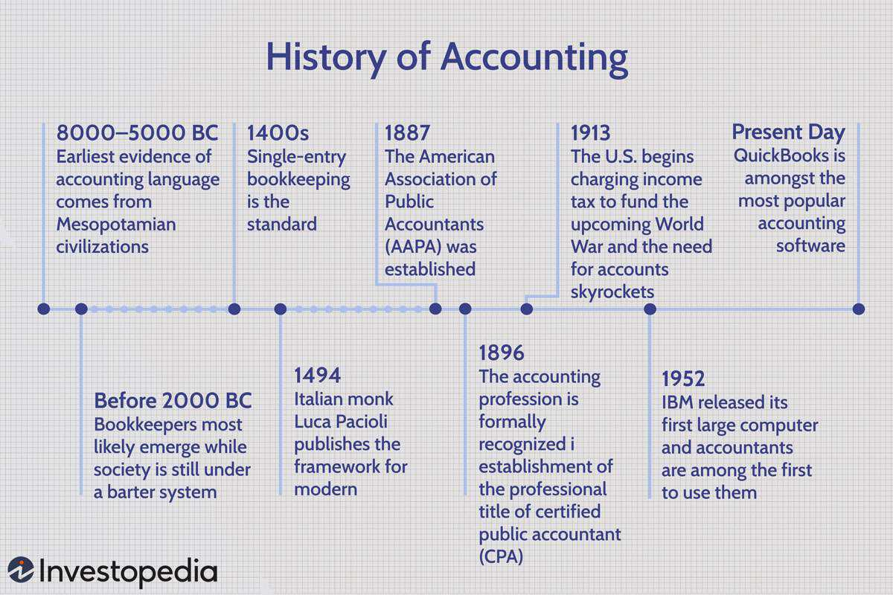

Accounting serves as a critical backbone in the domains of business and finance, offering systematic frameworks for documenting financial transactions, analyzing economic trends, and guiding strategic decision-making. By providing transparency and accuracy, accounting ensures that stakeholders—from investors to regulatory bodies—can confidently gauge an organization’s financial health.

The historical roots of accounting trace back to ancient Mesopotamian civilizations, where rudimentary practices were implemented to record agricultural resources and trade activities. Over centuries, these primitive techniques have evolved, paving the way for sophisticated methodologies like those formalized by Luca Pacioli during the Renaissance period, which laid the foundation for modern accounting practices.



A significant facet of accounting is its terminology, which serves as the lingua franca of finance. Fundamental concepts such as debits, credits, and ledgers form the basis of double-entry bookkeeping, a system introduced to provide a comprehensive view of a company's fiscal standing. Additionally, financial statements—including balance sheets, income statements, and cash flow statements—are indispensable tools for stakeholders aiming to assess profitability, liquidity, and solvency.

Accounting's importance has expanded with the rise of algorithmic trading, where its role extends beyond traditional record-keeping. Accurate and timely financial data is essential for the development and execution of trading algorithms. These algorithms, often designed to capitalize on market inefficiencies, rely on precise input from financial records to perform optimally. Furthermore, accounting metrics like Return on Investment (ROI) and the Sharpe Ratio aid in evaluating trading performance, ensuring informed investment decisions.

In an era of rapid technological advancement, the relevance of accounting continues to grow. Automation and digital transformation in accounting practices facilitate real-time data analysis, further integrating with financial technologies. In this evolving landscape, accounting not only anchors current business operations but also aligns with emerging technologies to enhance efficiency and strategic foresight in the finance sector.

## Table of Contents

## The Origins and Evolution of Accounting

Accounting has a storied history, with evidence pointing to its origins in the ancient civilizations of Mesopotamia. Around 7,000 years ago, Mesopotamians utilized clay tablets to record transactions involving goods such as livestock and grain. This nascent form of accounting was crucial for maintaining records of commerce in a society heavily reliant on trade and agriculture.

In the era of the barter system, bookkeeping emerged as a vital tool for managing exchanges and ensuring fair trades. The transition from barter to currency introduced a need for more sophisticated accounting methods. Currency allowed for a standardized measure of value, simplifying transactions and necessitating advancements in record-keeping practices. As societies began to mint coins and develop monetary economies, accounting practices adapted to provide more accurate and reliable financial records.

The work of Luca Pacioli in the late 15th century marked a significant milestone in accounting's evolution. Known as the "Father of Accounting", Pacioli published "Summa de Arithmetica, Geometria, Proportioni et Proportionalità" in 1494, which included the first known description of double-entry bookkeeping. This system revolutionized accounting by introducing the concept of debits and credits, ensuring that all entries in the accounts were balanced. Double-entry bookkeeping provided a framework for businesses to more accurately track their financial transactions, assess their financial health, and make informed decisions.

With the emergence of corporations and railroads in the United States during the 19th century, bookkeeping underwent a transformation into more formalized accounting practices. The complexity of running large corporations and extensive railroad networks necessitated more advanced accounting systems to handle increased transaction volumes and complex financial dealings. This era witnessed the development of corporate accounting, which included practices such as financial auditing, the creation of standardized financial statements, and regulatory compliance. The industrial growth of the time propelled accounting into a critical role in sustaining economic expansion and ensuring corporate accountability.

In summary, the origins and evolution of accounting are deeply intertwined with the economic and societal advancements of human history. From ancient Mesopotamian tablets to modern corporate accounting, the discipline has continually adapted to meet the changing needs of commerce and industry, laying the foundation for contemporary financial systems.

## Understanding Key Accounting Terminology

Accounting is a structured system of recording, summarizing, and reporting financial transactions. Understanding its terminology is crucial for interpreting financial data accurately. Central to this are debits and credits, which form the foundation of the double-entry bookkeeping system. 

**Debits and Credits**: In accounting, every transaction affects at least two accounts, categorized into debits and credits. Debits, denoted as "Dr," typically increase assets or expenses and decrease liabilities, equity, or income. Conversely, credits, denoted as "Cr," have the opposite effect: they increase liabilities, equity, or income and decrease assets or expenses. This dual aspect of transactions ensures the accounting equation (Assets = Liabilities + Equity) remains balanced. For example, if a company buys equipment for cash, the equipment account (asset) is debited while the cash account (asset) is credited.

**Ledgers**: A ledger, or general ledger, is a complete record of all financial transactions over the life of a company. Detailed logs in subsidiary ledgers for each account roll up into the general ledger, offering a holistic overview of the financial status.

**Financial Statements**: They are crucial for assessing an organization's financial health:

1. **Balance Sheets**: This statement provides a snapshot of a company's financial position at a specific point in time. It lists assets, liabilities, and shareholders' equity, ensuring that Assets = Liabilities + Equity.

2. **Income Statements**: Also known as profit and loss statements, they summarize the revenues, costs, and expenses over a particular period. This statement helps evaluate a company's profitability.

3. **Cash Flow Statements**: These statements offer insight into a company's cash inflows and outflows from operating, investing, and financing activities. They are essential for assessing the company's liquidity and financial flexibility.

**Double-entry Bookkeeping**: This concept, formalized by Luca Pacioli in the 15th century, is the bedrock of modern accounting. Every entry to an account requires a corresponding and opposite entry to a different account, maintaining the balance in the accounting equation.

```python
# Sample Python function for a simple double-entry bookkeeping example
def record_transaction(account_debit, amount_debit, account_credit, amount_credit):
    ledger = {}
    ledger[account_debit] = amount_debit
    ledger[account_credit] = -amount_credit
    return ledger

# Example of purchasing equipment with cash
transaction = record_transaction("Equipment", 5000, "Cash", 5000)
print(transaction)
```

**FIFO and LIFO**: These are methods of inventory valuation that can significantly impact financial reporting and tax obligations:

- **FIFO (First-In, First-Out)**: Assumes that the oldest inventory items are sold first. During periods of rising prices, FIFO results in lower cost of goods sold and higher reported profits.

- **LIFO (Last-In, First-Out)**: Assumes that the most recently purchased inventory items are sold first. In inflationary times, LIFO leads to higher cost of goods sold and lower taxable income due to higher inventory costs being recognized first.

Both approaches have differing implications on financial statements, impacting how stakeholders assess a company's financial health.

Understanding these fundamental and complex accounting concepts empowers individuals to interpret financial data, enabling informed decision-making that aligns with an organization's financial strategies and compliance obligations.

## The Role of Accounting in Algorithmic Trading

Accounting plays a crucial role in [algorithmic trading](/wiki/algorithmic-trading) by ensuring accurate financial record-keeping, which is essential for making informed trading decisions. The precision and reliability of financial records facilitate the development and execution of complex trading algorithms. This accuracy allows traders to evaluate strategies effectively, optimizing their trading systems based on historical and real-time data.

Accurate financial records are fundamental for performance measurement in algorithmic trading. Two key metrics used in this context are Return on Investment (ROI) and the Sharpe Ratio. ROI measures the profitability of trading strategies by comparing gains to initial costs. It is calculated using the formula:

$$
\text{ROI} = \left( \frac{\text{Net Profit}}{\text{Investment Cost}} \right) \times 100
$$

The Sharpe Ratio, on the other hand, evaluates the risk-adjusted return of a trading strategy. It is calculated using the formula:

$$
\text{Sharpe Ratio} = \frac{E[R_p] - R_f}{\sigma_p}
$$

where $E[R_p]$ is the expected return of the portfolio, $R_f$ is the risk-free rate, and $\sigma_p$ is the standard deviation of the portfolio's excess return. A higher Sharpe Ratio indicates better risk-adjusted returns, making it a critical measure for algorithm developers aiming to optimize risk management.

Cost accounting is equally important as it provides insights into managing transaction fees and operational costs associated with algorithmic trading. Transaction fees, often represented as a percentage of the trade value or a flat fee per trade, can significantly impact profitability. Operational costs, including IT infrastructure, data feed expenses, and staffing, must also be accounted for accurately to ensure a comprehensive assessment of trading strategy performance.

Mitigating these costs requires a detailed understanding of cost structures and the ability to project future expenses. It can involve the application of techniques such as Activity-Based Costing (ABC) to allocate costs more precisely to the relevant trading activities. For example, traders can use ABC to determine the exact cost associated with executing a particular algorithm, allowing for targeted cost reduction measures.

Furthermore, integrating cost accounting with performance metrics like ROI and the Sharpe Ratio allows traders to develop a nuanced understanding of both the profitability and cost efficiency of their trading strategies. This integration is facilitated by advancements in technology, which enable the processing of large volumes of financial data with minimal latency, ensuring that accounting systems can keep pace with the rapid execution and analysis of trades typical in algorithmic environments.

## Regulatory Compliance and Taxation in Algorithmic Trading

Algorithmic trading, with its reliance on technology and rapid execution, operates within a complex regulatory environment designed to maintain market integrity and protect investors. Various regulatory bodies, such as the U.S. Securities and Exchange Commission (SEC), the Commodity Futures Trading Commission (CFTC), and the Financial Conduct Authority (FCA) in the UK, oversee algorithmic trading activities to ensure compliance with established financial regulations.

Algorithmic traders must adhere to several key regulations, including those that govern market manipulation, trading transparency, and the prevention of fraudulent activities. The Market Abuse Regulation (MAR) in the European Union, for example, specifically addresses undue market influence and insider trading. Similarly, the SEC's Rule 15c3-5 requires brokers to implement risk management controls, ensuring that algorithms do not circumvent key compliance measures.

Keeping track of tax implications is another critical aspect where accurate accounting plays a vital role. Algorithmic traders must account for capital gains, losses, and the short and long-term tax treatment of their trading activities. Failure to properly document trades and calculate taxes owed can lead to significant penalties. Furthermore, many jurisdictions require the reporting of specific financial transactions, necessitating meticulous accounting practices.

Compliance with regulations like Know Your Customer (KYC) and Anti-Money Laundering (AML) presents notable challenges in algorithmic trading. KYC processes require verification of clients’ identities and understanding their financial activities, while AML regulations focus on detecting and preventing illicit financial flows. Algorithmic trading systems are often designed to execute trades based on pre-defined criteria, which can obscure the transparency required to comply with these regulations.

To manage these challenges, algorithmic traders can implement robust strategies that emphasize both technological integration and rigorous compliance oversight. This includes using automated accounting systems that facilitate real-time transaction tracking and data collection, enhancing the ability to report and audit trades accurately. Incorporating advanced analytics can also be beneficial in identifying suspicious activities, thereby aligning trading practices with AML guidelines.

Furthermore, ongoing training and development for personnel involved in compliance and accounting are essential. This ensures that the organization remains updated with ever-evolving regulations and develops practices that preemptively address new compliance requirements.

In summary, regulatory compliance and taxation are crucial components of algorithmic trading. By utilizing advanced accounting systems and aligning with regulatory expectations, traders can effectively navigate the complexities of algorithmic trading while maintaining rigorous compliance.

## Technological Innovations in Accounting for Algorithmic Trading

Technological innovations have significantly transformed accounting practices in algorithmic trading, particularly with the advent of automated systems capable of processing vast quantities of data and numerous transactions. These systems are crucial, not only for maintaining accurate financial records but also for ensuring the efficiency and reliability of trading operations in an environment characterized by [high frequency](/wiki/high-frequency-trading) and extraordinary volumes.

Automated accounting systems are designed to manage large datasets efficiently, minimizing human error and increasing the speed at which transactions are recorded and processed. This automation is essential for algorithmic trading platforms that execute hundreds or thousands of trades per second. By leveraging sophisticated algorithms, these systems can automatically categorize and record transactions into the appropriate accounts, creating an accurate and up-to-date ledger. This facilitates better oversight and quick response to market changes.

The integration of accounting systems with trading platforms is highly beneficial for seamless data capture. This integration eliminates the need for manual data entry, ensuring that all financial records are updated in real-time as transactions occur. This real-time data capture not only improves accuracy but also enhances the transparency of financial operations. By providing immediate insights into trading performance and financial health, integrated systems allow traders and accountants to make informed decisions swiftly.

Data management and analytics play a pivotal role in the decision-making process within algorithmic trading. With access to comprehensive, real-time data, traders and financial analysts can implement data analytics tools to derive actionable insights and identify patterns or anomalies. These analytics help in performance measurement and strategy optimization. For example, metrics such as the Sharpe Ratio, which measures risk-adjusted return, can be calculated to evaluate the performance of trading strategies. 

In Python, the Sharpe Ratio can be calculated using the following code snippet:

```python
import numpy as np

def calculate_sharpe_ratio(returns, risk_free_rate=0):
    excess_returns = returns - risk_free_rate
    return np.mean(excess_returns) / np.std(excess_returns)

# Example usage:
returns = np.array([0.01, 0.02, 0.015, 0.035, 0.01])  # Example returns
sharpe_ratio = calculate_sharpe_ratio(returns, risk_free_rate=0.005)
print(f"Sharpe Ratio: {sharpe_ratio}")
```

This method of leveraging technology not only supports present trading operations but also lays the groundwork for future advancements. As technology continues to evolve, the integration and capabilities of accounting systems in algorithmic trading are expected to expand, offering even more sophisticated tools for data analysis and decision-making. This evolution will undoubtedly provide trading firms with a competitive edge by enhancing their ability to navigate complex financial landscapes effectively.

## Conclusion

Accounting has long been integral to the framework of commerce and finance, tracing its roots back to ancient Mesopotamian civilizations. Its historical journey, from simple bookkeeping practices during the barter system to sophisticated accounting methods necessitated by the emergence of corporations, underscores its enduring significance. The historical contribution of Luca Pacioli, often referred to as the "Father of Accounting," introduced systematic practices such as double-entry bookkeeping, which remains a cornerstone of accounting today.

Essential accounting terminology like debits, credits, ledgers, and complex concepts such as double-entry bookkeeping, FIFO (First-In, First-Out), and LIFO (Last-In, First-Out) form the foundation for understanding financial transactions and statements. These concepts are indispensable for accurate record-keeping and financial reporting, playing a crucial role in facilitating informed decision-making across industries.

In the context of algorithmic trading, accounting's role is increasingly pivotal. Precise financial record-keeping supports algorithmic strategies by providing the necessary data for performance measurement metrics, including ROI (Return on Investment) and the Sharpe Ratio. These metrics are essential for evaluating the success of trading strategies and ensuring efficient market operations. Furthermore, cost accounting aids in managing transaction fees and operational expenses, crucial for optimizing trading processes.

Looking forward, the intersection of accounting and technology promises transformative potential. Automated accounting systems and seamless integration with trading platforms allow for efficient handling of vast volumes of data and transactions. This technological synergy not only enhances data accuracy but also fosters advanced data management and analytics, driving informed and strategic decision-making. As technology accelerates, accounting is poised to become even more integral, embracing innovations that streamline processes and enhance the strategic capabilities of businesses and financial practitioners alike. The future of accounting lies in its ability to adapt, evolve, and continue underpinning the financial stability and transparency of global markets.

## References & Further Reading

[1]: Pacioli, L. (1494). ["Summa de Arithmetica, Geometria, Proportioni et Proportionalità"](https://archive.org/details/summa-de-arithmetica-geometria-proportioni-et-proportionalita). Venice: Paganino de Paganini.

[2]: Gleeson-White, J. (2012). ["Double Entry: How the Merchants of Venice Created Modern Finance"](https://www.amazon.com/Double-Entry-Merchants-Created-Finance/dp/0393346595). W. W. Norton & Company.

[3]: Lopez de Prado, M. (2018). ["Advances in Financial Machine Learning"](https://www.amazon.com/Advances-Financial-Machine-Learning-Marcos/dp/1119482089). Wiley.

[4]: Jorion, P. (2007). ["Value at Risk: The New Benchmark for Managing Financial Risk"](https://link.springer.com/article/10.1007/s11408-007-0057-3). McGraw-Hill Education.

[5]: Zimmermann, J., Werner, A., & Volmer, P. (2008). ["Accounting for Derivatives: Advanced Hedging Under IFRS"](https://link.springer.com/book/10.1057/9780230582866). Wiley.

[6]: Aronson, D. R. (2007). ["Evidence-Based Technical Analysis: Applying the Scientific Method and Statistical Inference to Trading Signals"](https://onlinelibrary.wiley.com/doi/book/10.1002/9781118268315). Wiley.

[7]: Chan, E. (2009). ["Quantitative Trading: How to Build Your Own Algorithmic Trading Business"](https://github.com/ftvision/quant_trading_echan_book). Wiley.

[8]: Jansen, S. (2020). ["Machine Learning for Algorithmic Trading"](https://github.com/stefan-jansen/machine-learning-for-trading). Packt Publishing.