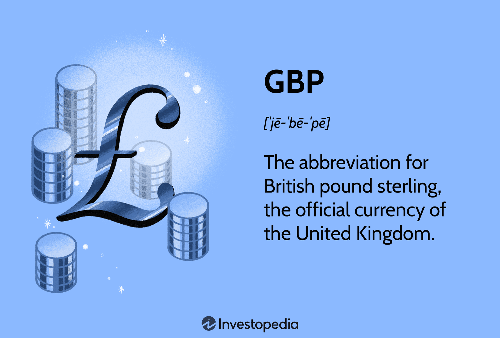

## Table of Contents

## What is the British Pound Sterling?

The British Pound Sterling, often just called the pound, is the official currency of the United Kingdom. It is also used in some other places like the Falkland Islands and Gibraltar. The symbol for the pound is £, and its ISO code is GBP. People sometimes call it "Sterling" because of the silver pennies, called sterlings, that were used a long time ago.

The pound has been around for a very long time, making it one of the oldest currencies still in use. It is divided into 100 pence. You can find pound coins and banknotes in different amounts, like £1, £2, £5, £10, £20, and £50. The value of the pound can change compared to other currencies, like the US dollar or the Euro, and this can affect how much things cost when you travel or buy things from other countries.

## When was the British Pound Sterling first introduced?

The British Pound Sterling was first introduced a long time ago, around the year 760. It started when King Offa of Mercia made silver pennies called sterlings. These pennies were the first form of the pound. The name "pound" comes from the Latin word "libra," which means a pound weight. That's why the pound's symbol is £, which comes from the letter "L" in "libra."

Over time, the pound changed a lot. In the 15th century, the pound started to be used as we know it today, with gold and silver coins. By the 17th century, the Bank of England was created, and it started to issue banknotes. The pound has been the main currency of the United Kingdom ever since, and it's one of the oldest currencies still used today.

## How has the design of the Pound Sterling evolved over time?

The design of the Pound Sterling has changed a lot over the years. In the beginning, around the year 760, the pound was just silver pennies called sterlings. These were small and simple, with a cross on one side and the king's name on the other. As time went on, the pound started to include gold and silver coins. By the 15th century, the pound was made up of different coins like the sovereign, which was a gold coin, and the shilling, which was a silver coin. These coins had more detailed designs, often showing the king or queen and symbols of the country.

In the 17th century, the Bank of England started to issue banknotes. At first, these notes were handwritten and promised to pay the bearer a certain amount of money. Over time, the designs of the banknotes became more complex and included pictures of famous people, like writers and scientists, and important places or events. Today, pound coins and banknotes have very detailed designs. The coins often show the queen on one side and different symbols or images on the other, like the pound coin with the rose, leek, thistle, and shamrock. Banknotes now have advanced security features to stop people from making fake money, and they show famous people and landmarks, like Sir Winston Churchill on the £5 note and Jane Austen on the £10 note.

## What are the key historical events that impacted the value of the Pound Sterling?

The value of the Pound Sterling has changed a lot because of many big events in history. One big event was World War I. During the war, the UK spent a lot of money, which made the pound worth less compared to other currencies. After the war, the UK tried to make the pound worth more again, but it was hard. In 1931, the UK had to leave the gold standard, which means they stopped saying that the pound was worth a certain amount of gold. This made the pound's value change a lot.

Another big event was World War II. The war cost the UK even more money, and the pound's value dropped a lot. After the war, the UK had to deal with a lot of debt and a weak economy. In 1949, the UK made the pound worth less on purpose to help the economy. Then, in 1971, the UK changed to a decimal system, which made money easier to use but also changed how the pound worked. In 1992, the UK left the European Exchange Rate Mechanism, which caused the pound to drop a lot in one day. This day is called Black Wednesday. All these events show how the pound's value has been affected by big things happening in the world.

## How did the Pound Sterling transition from a gold standard to a fiat currency?

The Pound Sterling was on the gold standard for a long time, which meant it was worth a certain amount of gold. This started in the 18th century and helped make trade easier because people knew how much the pound was worth. But during World War I, the UK spent a lot of money and had to print more pounds. This made the pound worth less compared to gold, so in 1931, the UK had to stop using the gold standard. This was a big change because now the pound's value was not tied to gold anymore.

After leaving the gold standard, the Pound Sterling became a fiat currency. This means its value is based on what people think it's worth and what the government says it's worth, not on gold. The UK had to manage the pound's value carefully to keep the economy stable. Over time, the pound's value changed because of big events like World War II and changes in the economy. Today, the pound is still a fiat currency, and its value can go up or down based on many things happening in the world.

## What role did the British Empire play in the global dominance of the Pound Sterling?

The British Empire helped make the Pound Sterling a very important currency all over the world. When the British Empire was big, it had control over many countries and places. This meant that the Pound Sterling was used in a lot of different parts of the world. People in these places used the pound for buying and selling things. Because the British Empire was so powerful, other countries saw the pound as a strong and trustworthy currency. This made the pound important for international trade and helped it become a leading currency.

Even after the British Empire started to get smaller, the Pound Sterling stayed important. The UK had a big economy and was good at trading with other countries. This kept the pound strong and respected. Many countries still used the pound for big deals and kept a lot of their money in pounds. The history of the British Empire made the pound a symbol of strength and trust, which helped it stay a major currency in the world even today.

## How does the Pound Sterling function within the foreign exchange market today?

The Pound Sterling, also known as the British pound, is an important currency in the foreign exchange market today. It is one of the most traded currencies in the world, right after the US dollar and the Euro. People and businesses from different countries buy and sell the pound to trade goods and services, invest in the UK, or travel. The value of the pound can change every day based on things like the UK's economy, interest rates, and big news events. When the pound is strong, it means it can buy more of other currencies. When it is weak, it can buy less.

The foreign exchange market is where all these trades happen. It is a big, global market that never sleeps. Banks, companies, and even regular people can trade currencies here. The pound's value in this market is important for the UK's economy. If the pound is strong, it can make UK goods more expensive for other countries, which might mean fewer exports. But if the pound is weak, UK goods can be cheaper for others to buy, which might help exports. So, the pound's value in the foreign exchange market affects a lot of things, like trade, travel, and investments.

## What are the major economic factors influencing the Pound Sterling's exchange rate?

The value of the Pound Sterling goes up and down because of many things that happen in the economy. One big thing is how well the UK's economy is doing. If the UK's economy is strong and growing, people might want to buy more pounds, which makes the pound worth more. But if the economy is not doing well, like if there are fewer jobs or if companies are not making as much money, the pound might lose value. Another important thing is interest rates. If the Bank of England raises interest rates, it can make the pound more attractive because people can earn more money by saving in pounds. But if interest rates go down, the pound might become less attractive.

Another [factor](/wiki/factor-investing) that affects the pound's value is what's happening in the world. Big news, like political changes or important votes, can make the pound go up or down quickly. For example, when the UK voted to leave the European Union, called Brexit, it made the pound drop a lot because people were worried about what would happen to the UK's economy. Also, how other countries' economies are doing can affect the pound. If the US dollar or the Euro gets stronger, it can make the pound weaker. So, the pound's value is always changing because of all these different things happening in the UK and around the world.

## How have Brexit and other political events affected the Pound Sterling's value?

Brexit had a big impact on the Pound Sterling's value. When the UK voted to leave the European Union in 2016, the pound dropped a lot. People were worried about what would happen to the UK's economy without being part of the EU. The uncertainty made the pound less attractive to investors, causing its value to fall. Even after the vote, as the UK went through the long process of leaving the EU, the pound kept going up and down because of new news and changes in the Brexit plan.

Other political events also affect the pound. For example, when there are big elections or changes in government, the pound can change value quickly. If people think a new government will be good for the economy, the pound might go up. But if they think it will be bad, the pound might go down. Things like trade deals or disagreements with other countries can also make the pound move. All these political happenings show how the pound's value can change because of what's going on in the UK and around the world.

## What are the trading strategies used by investors when dealing with the Pound Sterling?

Investors use different strategies when they trade the Pound Sterling. One common strategy is called "[carry](/wiki/carry-trading) trade." This is when investors borrow money in a currency with low interest rates, like the Japanese yen, and then use that money to buy pounds, which might have higher interest rates. They hope to make money from the difference in interest rates. Another strategy is "[trend following](/wiki/trend-following)." This means investors watch the pound's value over time and try to buy when it's going up and sell when it's going down. They use charts and other tools to see these trends.

Another strategy is "event-driven trading." This is when investors pay close attention to big news or events that can affect the pound, like elections or important economic reports. If they think the news will make the pound go up, they might buy pounds before the news comes out. If they think it will make the pound go down, they might sell pounds or even bet against the pound. All these strategies help investors try to make money from the changes in the pound's value, but they also come with risks because the pound can be hard to predict.

## How does the Bank of England's monetary policy impact the Pound Sterling?

The Bank of England's monetary policy has a big effect on the Pound Sterling. When the Bank of England changes interest rates, it can make the pound go up or down. If the Bank raises interest rates, saving money in pounds becomes more attractive because people can earn more interest. This can make the pound stronger because more people want to buy it. On the other hand, if the Bank lowers interest rates, saving in pounds becomes less attractive, and the pound might get weaker because fewer people want to buy it.

The Bank of England also uses other tools to affect the pound. One tool is called quantitative easing, where the Bank buys bonds to put more money into the economy. This can make the pound weaker because there's more money around. Another tool is talking about what they might do in the future, called forward guidance. If the Bank says it will keep interest rates low for a long time, the pound might go down because people expect less return from saving in pounds. So, the Bank of England's actions and words can move the pound's value a lot.

## What are the future predictions for the Pound Sterling in the global economy?

The future of the Pound Sterling in the global economy can be hard to predict because a lot of things can change. But many people who study the economy think the pound will keep being important. This is because the UK has a strong economy and is good at trading with other countries. Also, the pound is used a lot in the foreign exchange market, so it will likely stay one of the top currencies. However, things like political events, like elections or big votes, and economic changes, like interest rates or inflation, can make the pound go up or down.

Some experts think the pound might get stronger if the UK's economy keeps growing and if interest rates go up. But others worry that if there are more problems with trade or if the world economy has trouble, the pound might get weaker. Things like Brexit and other big changes can also make the pound's value hard to guess. In the end, the pound's future will depend on many things happening in the UK and around the world.

## What is the historical context of the British Pound?

The British pound sterling, commonly referred to as the pound, holds a rich history that traces back to its origins in the early periods of monetary development in England. The pound first emerged as a significant currency unit when England and Scotland unified with the Treaty of Union in 1707, resulting in the formation of the Kingdom of Great Britain. This union necessitated the creation of a cohesive economic framework, thereby formalizing the currency system under which the pound sterling took precedence.

During its historical journey, the British pound encountered numerous economic transformations and global events that shaped its trajectory. Initially, the pound was part of a metal-based currency system, including silver and later gold, that dictated its value. By the 19th Century, the gold standard became pivotal, offering stability and facilitating international trade by pegging the pound's value to a specific quantity of gold. The formula governing this relationship can be expressed as:

$$
\text{Value of Currency} = \frac{\text{Weight of Gold Represented}}{\text{Value per Unit of Gold}}
$$

However, the tumultuous periods of the World Wars witnessed significant fluctuations in the pound’s value. The First World War saw the abandonment of the gold standard, leading to inflation and depreciation. Although the gold standard was briefly reinstated after 1925, the economic turbulence of the Great Depression and the subsequent Second World War prompted another departure from gold-based valuation, transitioning the pound to a fiat currency system. 

In more recent times, the legislative development of Brexit has markedly impacted the pound's valuation. Following the 2016 referendum, where the United Kingdom voted to leave the European Union, the pound experienced significant [volatility](/wiki/volatility-trading-strategies). Initially, the uncertainty surrounding the economic implications of Brexit led to a sharp depreciation against major currencies like the U.S. dollar and the euro. Currency markets responded to these changes with caution as investors adjusted to the evolving political landscape. 

Overall, the evolution of the British pound sterling is a testament to its resilience and adaptability through centuries of economic and geopolitical shifts. From its early beginnings amidst the union of England and Scotland to the unpredictability of modern-day legislative impacts, the pound remains a crucial element of global economic history.

## References & Further Reading

[1]: ["The Handbook of Fixed Income Securities, Chapter 44: Currency Trading"](https://www.mhebooklibrary.com/doi/book/10.1036/9781260473902?contentTab=true) by Frank J. Fabozzi

[2]: Bank for International Settlements. (2019). [Triennial Central Bank Survey of Foreign Exchange and Over-the-counter (OTC) Derivatives Markets in 2019.](https://www.bis.org/statistics/rpfx19.htm)

[3]: ["The New Trading for a Living: Psychology, Discipline, Trading Tools and Systems, Risk Control, Trade Management"](https://www.amazon.com/New-Trading-Living-Psychology-Discipline/dp/1118443926) by Dr. Alexander Elder

[4]: [Bodie, Z., Kane, A., & Marcus, A. J. (2014). "Essentials of Investments."](https://www.mheducation.com/highered/product/essentials-investments-bodie-kane/M9781260772166.html) McGraw Hill Education

[5]: ["A Foreign Exchange Primer"](https://www.amazon.com/Foreign-Exchange-Primer-Shani-Shamah/dp/0470754370) by Shani Shamah

[6]: Moore, M. J., & Roche, M. J. (2010). ["The History of the British Pound vs. the U.S. Dollar."](https://www.torontomu.ca/economics/people/faculty/maurice_roche/) Journal of Economic Perspectives

[7]: Cao, L., & Tay, F. (2001). ["Financial forecasting using support vector machines."](https://link.springer.com/article/10.1007/s005210170010) Neural Computing & Applications

[8]: ["High-Frequency Trading: A Practical Guide to Algorithmic Strategies and Trading Systems"](https://books.google.com/books/about/High_Frequency_Trading.html?id=8QpIsVUMhmEC) by Irene Aldridge