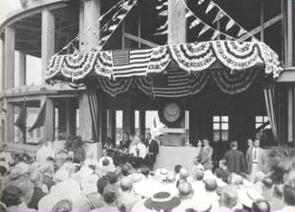

## Table of Contents

## What is the Federal Trade Commission (FTC)?

The Federal Trade Commission (FTC) is a government agency in the United States that helps protect consumers and promote competition in the marketplace. It was created in 1914 to make sure businesses are playing fair and not tricking people. The FTC works to stop unfair business practices and make sure companies follow the rules.

One of the main jobs of the FTC is to stop false advertising. This means they check if companies are telling the truth about their products. If a company lies about what their product can do, the FTC can make them stop and even make them pay money. The FTC also helps protect people's privacy online and makes sure companies are not using people's information in bad ways.

## When was the FTC established?

The Federal Trade Commission (FTC) was established in 1914. This was a time when the government wanted to make sure businesses were treating people fairly. The FTC was created to stop companies from doing things that were not right, like lying about their products or working together to keep prices high.

The main goal of the FTC is to protect consumers and make sure there is fair competition. They do this by watching over businesses and making sure they follow the rules. If a company breaks the rules, the FTC can take action to stop them and make things right for consumers.

## What was the primary purpose behind the creation of the FTC?

The Federal Trade Commission (FTC) was created in 1914 to make sure businesses were treating people fairly. At that time, there were many companies that were not playing by the rules. They would lie about their products or work together to keep prices high. This was not good for consumers, who were often tricked or had to pay too much. The government wanted to stop these unfair practices, so they set up the FTC to watch over businesses and make sure they were doing the right thing.

The main goal of the FTC is to protect consumers and make sure there is fair competition. They do this by checking if companies are telling the truth about their products and services. If a company is caught lying or doing something unfair, the FTC can step in. They can make the company stop what they are doing and even make them pay money to fix the problem. This helps keep the marketplace honest and fair for everyone.

## Who was the first chairman of the FTC and what were his major contributions?

The first chairman of the Federal Trade Commission (FTC) was Joseph E. Davies. He was appointed in 1915, a year after the FTC was created. Davies was a lawyer and businessman who believed strongly in fair competition and protecting consumers. During his time as chairman, he helped set up the FTC and made sure it started working to stop unfair business practices.

One of Davies' major contributions was setting up the FTC's early rules and procedures. He worked hard to make sure the FTC could do its job well. This included starting investigations into companies that were not playing fair. Davies also helped the FTC start its work on false advertising, making sure companies told the truth about their products. His leadership was important in getting the FTC off to a good start and making sure it could protect consumers and promote fair competition.

## How has the role of the FTC evolved since its inception?

Since it was created in 1914, the role of the Federal Trade Commission (FTC) has changed a lot. At first, the FTC focused on stopping big companies from working together to keep prices high and making sure businesses told the truth about their products. Over time, the FTC started to look at more types of unfair business practices. They began to focus on things like false advertising, where companies lie about what their products can do, and protecting people's privacy, especially as more people started using the internet.

Today, the FTC does a lot more than it did in the beginning. It still works to stop unfair business practices and false advertising, but it also looks at how companies use people's personal information. The FTC makes sure companies are not using people's data in bad ways, like selling it without permission. The FTC also works to protect people from scams and fraud, which are big problems in today's world. Overall, the FTC has grown to handle new challenges and keep up with changes in technology and business practices.

## What are some key legislative acts that have influenced the FTC's powers and responsibilities?

Several important laws have changed what the Federal Trade Commission (FTC) can do and what it is responsible for. One big law was the Wheeler-Lea Act of 1938. This law gave the FTC the power to stop false advertising and protect consumers from unfair business practices. Before this law, the FTC could only stop companies from working together to keep prices high. The Wheeler-Lea Act made the FTC's job much bigger and more important.

Another key law was the Magnuson-Moss Warranty Act of 1975. This law made the FTC responsible for making rules about warranties, which are promises companies make about their products. The law helped make sure companies were clear and honest about what they promised. More recently, the Children's Online Privacy Protection Act (COPPA) of 1998 gave the FTC the job of protecting the privacy of children online. This law made sure websites and apps that collect information from kids under 13 years old had to follow strict rules. These laws have all helped the FTC do more to protect consumers and keep businesses honest.

## Can you describe a significant case in the early years of the FTC that set a precedent?

One important case in the early days of the Federal Trade Commission (FTC) was the FTC v. Winsted Hosiery Company in 1922. This case was about false advertising. Winsted Hosiery Company was selling socks and saying they were made of wool. But, the FTC found out that the socks were actually made of cotton. The FTC said that Winsted Hosiery was lying to people, which was not fair.

This case was a big deal because it set a rule that companies could not lie about what their products were made of. It showed that the FTC would take action against companies that used false advertising. After this case, other companies knew they had to be honest about their products, or the FTC would stop them. This helped the FTC show that it was serious about protecting consumers and making sure businesses played fair.

## How does the FTC collaborate with other government agencies to enforce consumer protection and antitrust laws?

The Federal Trade Commission (FTC) works with other government agencies to make sure they can do a good job protecting consumers and keeping businesses honest. One important partner is the Department of Justice (DOJ). The FTC and the DOJ share the job of enforcing antitrust laws, which are rules that stop companies from working together to keep prices high or from becoming too big and powerful. When they find a problem, they decide together who will handle it. This teamwork helps them cover more ground and make sure no company gets away with breaking the rules.

The FTC also works with other agencies like the Consumer Financial Protection Bureau (CFPB) to protect people from unfair financial practices. For example, if a company is lying about a loan or charging too much, the FTC and CFPB might work together to stop it. They share information and resources to make their investigations better and to help more people. By working with other agencies, the FTC can do more to keep the marketplace fair and safe for everyone.

## What are the main divisions within the FTC and what are their specific functions?

The Federal Trade Commission (FTC) has several main divisions, each with its own important job. The Bureau of Consumer Protection works to stop unfair, deceptive, and fraudulent business practices. They look into false advertising, where companies lie about their products, and make sure companies follow rules about privacy and data security. The Bureau of Competition focuses on keeping the marketplace fair by stopping companies from working together to keep prices high or from getting too big and powerful. They investigate mergers and other business deals to make sure they don't hurt competition.

The Bureau of Economics helps the FTC by giving advice and doing research. They use their knowledge to help the FTC understand how businesses work and how their actions affect consumers and competition. The Office of International Affairs helps the FTC work with other countries to protect consumers and promote fair competition around the world. They share information and work together on cases that involve more than one country. Together, these divisions help the FTC do its job of protecting consumers and making sure businesses play fair.

## How has the FTC adapted to the challenges posed by the digital economy and technology?

The Federal Trade Commission (FTC) has made big changes to keep up with the digital economy and new technology. They know that more and more people are shopping and doing things online, so they have started to focus more on protecting people's privacy and data. The FTC checks if companies are being honest about how they use people's information and makes sure they follow rules like the Children's Online Privacy Protection Act (COPPA). This law helps protect kids under 13 when they use websites and apps. The FTC also watches out for scams and fraud that happen online, like when people get tricked into giving away their money or personal information.

Another way the FTC has adapted is by looking at how big tech companies affect competition. They investigate if big tech companies are doing things that make it hard for smaller companies to compete. For example, the FTC looks at mergers and deals between companies to make sure they don't create too much power in one company's hands. By doing this, the FTC helps keep the online marketplace fair for everyone. The FTC also uses new technology and data tools to do their job better, like using algorithms to find patterns in how companies behave and to spot problems faster.

## What are some of the major criticisms and controversies surrounding the FTC's actions and policies?

Some people say the FTC is too slow and doesn't do enough to stop big companies from doing bad things. They think the FTC should be quicker to stop mergers that make companies too powerful and to protect people's privacy online. Critics also say the FTC doesn't have enough money or people to do its job well. This can make it hard for the FTC to keep up with all the new problems that come with technology and the internet.

Another big criticism is that the FTC sometimes seems too friendly with the big companies it is supposed to watch. Some people think the FTC doesn't go after big companies hard enough because it doesn't want to make them mad. This can make people feel like the FTC is not doing its job of protecting consumers and making sure businesses play fair. There have been times when the FTC settled cases with companies for less money than people thought was fair, which made some people upset and question if the FTC was really on their side.

## What future challenges and directions are anticipated for the FTC in regulating modern markets?

The FTC will face many new challenges as the world keeps changing. One big challenge will be keeping up with new technology. More and more people are using the internet and new gadgets, which means the FTC needs to make sure companies are not lying about their products or using people's information in bad ways. The FTC will need to learn about new things like [artificial intelligence](/wiki/ai-artificial-intelligence) and how they can affect people's privacy and fairness in business. They will also need to watch out for new types of scams and fraud that happen online, which can be hard to stop because they change so quickly.

Another challenge for the FTC will be dealing with big tech companies. These companies have a lot of power and can affect how people use the internet and buy things. The FTC will need to make sure these big companies don't stop smaller companies from competing fairly. This means they might need to look at more mergers and deals to make sure they don't create too much power in one company's hands. The FTC will also need to keep working with other countries to protect people and businesses everywhere. By working together, they can make sure the rules are fair and strong no matter where people are.

## References & Further Reading

[1]: Gerber, M. (2019). ["Algorithmic and High-Frequency Trading"](https://assets.cambridge.org/97811070/91146/frontmatter/9781107091146_frontmatter.pdf) by Álvaro Cartea, Sebastian Jaimungal, & José Penalva

[2]: MacKenzie, D. (2022). ["Trading at the Speed of Light: How Ultrafast Algorithms are Transforming Financial Markets"](https://www.amazon.com/Trading-Speed-Light-Algorithms-Transforming/dp/0691211388) by Donald MacKenzie

[3]: Aldridge, I. (2013). ["High-Frequency Trading: A Practical Guide to Algorithmic Strategies and Trading Systems"](https://www.ahmetbeyefendi.com/wp-content/uploads/2020/07/High-Frequency-Trading-Irene-Aldridge.pdf) by Irene Aldridge

[4]: Hasbrouck, J. (2010). ["High Frequency Trading: New Realities for Traders, Markets, and Regulators"](https://books.google.com/books/about/High_frequency_Trading.html?id=pli5oAEACAAJ) by Michael J. McCartney

[5]: Jones, C. M. (2013). ["What Do We Know About High-Frequency Trading?"](https://www.semanticscholar.org/paper/What-Do-We-Know-About-High-Frequency-Trading-Jones/ea4d2e58da6fa48b9fddebbafc8052edf3278484) Columbia Business School Research Paper

[6]: Securities and Exchange Commission. ["The Role of Regulation in Algorithmic Trading"](https://blog.counselstack.com/algorithmic-trading-regulations-compliance-risk-controls/) available at SEC.gov