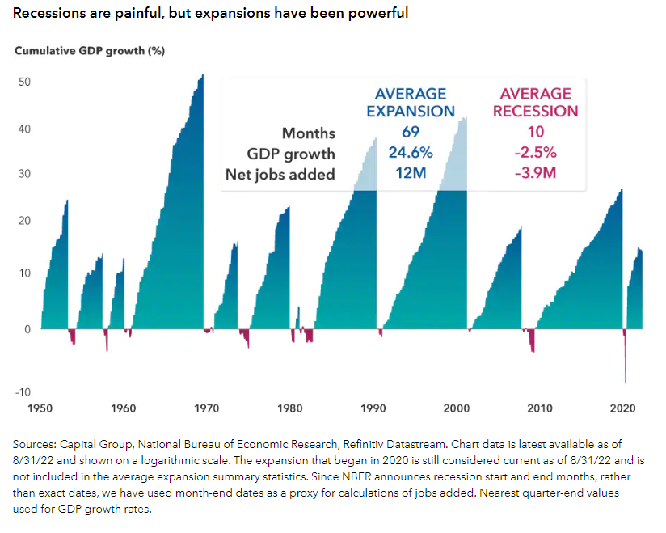

## Table of Contents

## What is a recession?

A recession is when the economy of a country slows down a lot. It usually happens when people and businesses spend less money. During a recession, many people might lose their jobs, and it can be hard for companies to make money. Governments and experts often say a recession is happening if the economy shrinks for two quarters in a row.

Recessions can affect everyone. People might have to be careful with their money and save more. It can be a tough time, but recessions don't last forever. After a while, the economy usually starts to grow again. Governments and banks often try to help by making rules to boost spending and create jobs.

## How is a recession officially defined in the U.S.?

In the U.S., a recession is officially defined by the National Bureau of Economic Research (NBER). The NBER is a group of experts who look at many parts of the economy to decide if a recession is happening. They don't just use one rule, like the economy shrinking for two quarters in a row. Instead, they look at things like how many people have jobs, how much people are spending, and how well businesses are doing.

The NBER looks at the whole economy to see if it's in a downturn. They check if the downturn is deep, lasts a long time, and spreads across many parts of the economy. When they see these signs, they say a recession has started. This way, they can tell when the economy is really struggling and needs help.

## What was the first recorded recession in U.S. history?

The first recorded recession in U.S. history happened in 1784, right after the American Revolutionary War ended. During the war, the economy was focused on making things for the army. When the war ended, the demand for these things dropped a lot. This caused many businesses to struggle because they were not prepared for the sudden change.

This recession lasted until 1787. During these years, many people lost their jobs and it was hard for businesses to make money. The new country was still figuring out how to manage its economy, and this first recession showed how important it was to have a strong plan for times of peace as well as war.

## What are the common causes of recessions in the U.S.?

Recessions in the U.S. often happen because people and businesses stop spending as much money. When people feel unsure about the future, they might save their money instead of buying things. This can lead to businesses selling less, which makes them cut jobs or close down. Another big reason for recessions can be when banks and financial companies make bad decisions, like giving loans to people who can't pay them back. If too many loans go bad, it can cause a financial crisis, making it hard for everyone to borrow money.

Sometimes, big events like wars or natural disasters can cause recessions too. These events can disrupt the economy by destroying businesses or making it hard for goods to be made and sold. Governments might also cause recessions if they make big changes to laws or taxes that affect how much people and businesses can spend. Understanding these causes can help people and leaders try to prevent or lessen the impact of recessions.

## How have U.S. recessions typically affected unemployment rates?

U.S. recessions usually make the unemployment rate go up a lot. When businesses sell less stuff because people are spending less money, they often have to let workers go. This means more people are out of work and looking for jobs. During the Great Recession from 2007 to 2009, the unemployment rate jumped from about 5% to over 10%. This shows how bad a recession can be for people trying to find work.

It can take a long time for the unemployment rate to go back down after a recession. Even when the economy starts to get better, it might take months or years for businesses to start hiring again. People who lose their jobs during a recession might have to wait a while before they find new work. This can be really tough on families and communities, but over time, as the economy recovers, more jobs usually come back.

## What role did the Great Depression play in U.S. economic history?

The Great Depression was a huge economic downturn that started in 1929 and lasted until the late 1930s. It was the worst economic crisis in U.S. history. During this time, many people lost their jobs, and businesses closed down. Banks failed, and people lost their savings. The stock market crashed, and it made everything worse. People had to wait in long lines for food and many families struggled to survive.

The Great Depression changed how the U.S. government worked. It showed that the government needed to help the economy during tough times. President Franklin D. Roosevelt started the New Deal, which was a bunch of programs to help people get jobs and make the economy better. This time also made people think differently about how the government should help its citizens. The lessons from the Great Depression still affect how the U.S. deals with economic problems today.

## How did the 2008 financial crisis lead to a recession?

The 2008 financial crisis started because banks made a lot of risky loans, especially for houses. Many people bought homes they couldn't really afford because banks gave them loans too easily. When people couldn't pay these loans back, the banks lost a lot of money. This made people scared, so they stopped spending and started saving more. When people spend less, businesses sell less, and they have to let workers go. This is how the financial crisis turned into a recession.

The crisis also made it hard for businesses to borrow money from banks. Banks were afraid to lend money because they had lost so much already. Without loans, businesses couldn't grow or even keep running the way they used to. This led to more businesses closing and more people losing their jobs. The 2008 financial crisis showed how problems in the banking system can spread and hurt the whole economy, leading to a big recession.

## What were the economic impacts of the COVID-19 recession?

The COVID-19 recession started in early 2020 when the virus made people stay home and businesses close. This made the economy shrink a lot because people couldn't go to work or spend money like they used to. Many people lost their jobs, especially in places like restaurants and stores. The unemployment rate went up really fast, and it was hard for people to pay their bills. Governments had to help by giving money to people and businesses to keep them going.

Even though the recession was tough, it didn't last as long as some others. By the end of 2020 and into 2021, the economy started to get better as people got vaccines and could go back to work. But the recovery was not the same everywhere. Some businesses, like tech companies, did well, while others, like travel and entertainment, took longer to bounce back. The COVID-19 recession showed how a health crisis can shake up the whole economy and how important it is for governments to step in and help.

## How have government policies aimed to mitigate the effects of recessions?

Governments use different policies to help during recessions. One big way is by spending more money on things like building roads or helping people who lost their jobs. This is called fiscal policy. When the government spends more, it can help businesses stay open and people keep working. Governments might also cut taxes so people have more money to spend. This can help the economy grow again. During the 2008 financial crisis, the U.S. government did both of these things to try to stop the recession from getting worse.

Another way governments help is by changing how banks work. This is called monetary policy. The government can make it easier for people and businesses to borrow money by lowering interest rates. When interest rates are low, people can borrow money to buy houses or start businesses, which helps the economy. The Federal Reserve, which is like the U.S. government's bank, did this during the COVID-19 recession. They made interest rates very low to help the economy recover faster. Both fiscal and monetary policies are important tools that governments use to fight recessions and help people get back on their feet.

## What are the long-term effects of recessions on the U.S. economy?

Recessions can have big effects on the U.S. economy that last a long time. When a recession happens, many people lose their jobs and businesses close down. This can make people feel unsure about the future, so they might save more money and spend less. This change in how people spend can stick around even after the recession is over. It can take a long time for the economy to get back to how it was before, and some businesses might never come back. This can lead to slower growth in the economy for years after the recession ends.

Another long-term effect is on how people think about money and jobs. After a recession, people might be more careful with their money and less likely to take risks. This can make it harder for new businesses to start up and grow. Also, people who lose their jobs during a recession might have a hard time finding new ones, even after the economy gets better. This can lead to higher unemployment for a long time. Governments and banks often learn from past recessions and try to make new rules to stop them from happening again, but it's hard to predict and control everything in the economy.

## How do international factors influence U.S. recessions?

International factors can have a big impact on U.S. recessions. When other countries have economic problems, it can make it harder for U.S. businesses to sell their stuff abroad. If people in other countries are not buying as much, U.S. companies might have to sell less or even close down. This can lead to more people losing their jobs in the U.S. Also, if the value of the U.S. dollar changes a lot compared to other countries' money, it can make things more expensive for U.S. businesses that need to buy stuff from other places. This can make it harder for them to make money and can help cause a recession.

Another way international factors can affect U.S. recessions is through global events like wars or natural disasters. These events can disrupt the supply of things the U.S. needs, like oil or electronics. If these supplies get messed up, it can make prices go up and make it harder for U.S. businesses to keep running. Also, if big countries like China or Europe have a recession, it can spread to the U.S. because the world's economies are all connected. When one big economy struggles, it can make it harder for the U.S. economy to keep growing, and this can lead to a recession.

## What predictive models are used to forecast potential recessions in the U.S.?

Economists use different models to try to predict if a recession might happen in the U.S. One common model looks at something called the yield curve. The yield curve shows the difference between the interest rates on short-term and long-term government bonds. When the yield curve "inverts," which means short-term rates are higher than long-term rates, it often means a recession might be coming soon. This has been a good sign in the past, but it's not perfect. Economists also look at other things like how much people are spending, how many jobs are being created, and how well businesses are doing to make their predictions.

Another model economists use is called the Leading Economic Index (LEI). The LEI is made up of ten different parts of the economy, like how many new homes are being built, how many people are applying for unemployment, and how much new orders businesses are getting. When the LEI goes down for a few months in a row, it can be a sign that a recession is coming. These models help economists and policymakers get ready for a possible downturn, but they can't predict everything. The economy is very complicated, and sometimes things happen that no one expects.

## References & Further Reading

[1]: ["This Time is Different: Eight Centuries of Financial Folly"](https://www.amazon.com/This-Time-Different-Centuries-Financial/dp/0691152640) by Carmen M. Reinhart and Kenneth S. Rogoff.

[2]: Bernanke, B. S. (2009). ["The Great Recession: Lessons for Macroeconomic Policy"](https://www.federalreserve.gov/newsevents/speech/bernanke20090113a.htm). Brookings Institution.

[3]: Lo, A. W. (2012). ["Adaptive Markets: Financial Evolution at the Speed of Thought"](https://archive.org/details/adaptivemarketsf0000loan) by Andrew W. Lo.

[4]: Baker, S. R., Bloom, N., & Davis, S. J. (2016). ["Measuring Economic Policy Uncertainty"](https://academic.oup.com/qje/article/131/4/1593/2468873). The Quarterly Journal of Economics, 131(4), 1593-1636.

[5]: Shiller, R. J. (2000). ["Irrational Exuberance"](https://press.princeton.edu/books/paperback/9780691173122/irrational-exuberance) by Robert J. Shiller.

[6]: Barro, R. J. (2006). ["Rare Disasters and Asset Markets in the Twentieth Century"](https://www.jstor.org/stable/25098810). The Quarterly Journal of Economics, 121(3), 823-866.