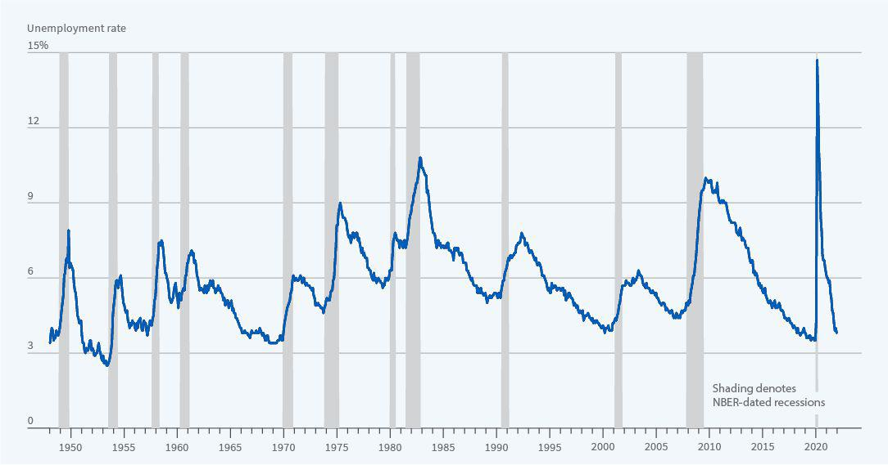

Economic recessions are pivotal events that reshape the financial landscape of any nation, significantly influencing economic policies and strategies. The United States, with its complex economic framework, has experienced numerous recessions throughout its history. These recessions have played a critical role in molding the nation’s economic policies, contributing to the development of various financial strategies designed to mitigate future downturns. By analyzing these historical occurrences, this article aims to provide a comprehensive understanding of the causes and effects of past U.S. recessions.

The examination also highlights the role of algorithmic trading during these economic downturns. Algorithmic trading, which involves the use of computer algorithms to automate trading decisions, has become increasingly relevant in modern financial markets. Its impact during recessions can be both stabilizing and destabilizing, depending on how algorithms respond to volatile market conditions. Understanding the interplay between economic recessions and algorithmic trading is vital for developing effective financial strategies that can better prepare us for future financial challenges.



Analyzing historical economic patterns helps policymakers and businesses make informed decisions. By recognizing the factors that contributed to past recessions, we can anticipate potential risks and implement measures to safeguard economic stability. As a result, this exploration is not only a reflection on past experiences but also a proactive approach to handling possible economic adversities in the future.

## Table of Contents

## Understanding Recessions

Recessions represent significant declines in economic activity that impact multiple sectors of the economy. During these periods, several key indicators typically exhibit a downward trend. Gross Domestic Product (GDP), a primary measure of economic performance, often declines as demand for goods and services decreases. This contraction results in reduced economic output, which is reflected in diminished GDP figures.

Income levels also tend to fall during recessions. As businesses face declining revenues, they often implement cost-cutting measures that can include wage reductions or laying off employees. This leads to rising unemployment rates, another hallmark of recessions. Increased unemployment reduces consumer purchasing power, further depressing income levels and economic activity.

In addition to GDP, income, and employment, sales across various sectors typically reduce during recessions. Consumers and businesses alike tighten their spending in response to economic uncertainty, leading to decreased sales in retail, manufacturing, and other industries. This reduction in spending can perpetuate the economic downturn, as lower sales result in further business contraction and potential job losses.

The official designation of a recession in the United States falls under the purview of the National Bureau of Economic Research (NBER). The NBER defines a recession as a significant decline in economic activity that spreads across the economy, lasts more than a few months, and is visible in GDP, income, employment, industrial production, and wholesale-retail sales [statistics](/wiki/bayesian-statistics).

While the duration of recessions can vary, they generally last from several months to over a year. Although recessions are common and are considered part of the business cycle, their management is crucial. If not addressed with effective fiscal and monetary policies, recessionary periods can extend and lead to prolonged economic challenges, causing structural shifts and potentially enduring impacts on the economy.

## Causes of U.S. Recessions

Recessions are periods marked by a significant decline in economic activity, and their causes are multifaceted. In the United States, financial crises have historically served as pivotal triggers for such downturns. For instance, the financial crisis of 2008 was initiated by the collapse of major financial institutions, which in turn was precipitated by the bursting of the housing bubble and the rampant proliferation of high-risk mortgage-backed securities. This demonstrates how systemic vulnerabilities within the financial sector can unleash widespread economic turmoil.

High inflation is another key [factor](/wiki/factor-investing) that can precipitate recessions. Inflation erodes purchasing power, leading to decreased consumer spending and increased costs for businesses. The oil embargo of the 1970s exemplifies how supply-side inflationary shocks can lead to economic downturns. During this period, the oil embargo imposed by OPEC nations led to skyrocketing oil prices, resulting in stagflation—a phenomenon characterized by stagnant economic growth and high inflation—thereby inducing a recession.

Supply chain disruptions are also influential in triggering recessions, as evidenced by historical events where unexpected bottlenecks and interruptions in the supply of goods and services have caused cascading effects on the economy. These disruptions lead to shortages, increased costs, and delays in production and distribution, affecting overall economic stability.

Monetary policy plays a crucial role in the context of recessions, particularly with regard to the tightening of interest rates. Central banks often raise interest rates to curb inflation, but these measures can inadvertently slow down economic activity by increasing the cost of borrowing. This was the case in several recessions, where preemptive tightening of monetary policy, in efforts to control inflation, inadvertently stifled economic growth and precipitated a downturn. An understanding of these triggers provides insights into the complexity of recessions, highlighting the need for finely balanced fiscal and monetary policies to mitigate potential economic challenges.

## Effects of Recessions on the Economy

Recessions profoundly impact various facets of the economy, manifesting primarily through increased unemployment, reduced consumer spending, and constrained access to credit. When an economy enters a recession, businesses often respond by reducing their workforce to manage lower demand for products and services, which consequently leads to a surge in unemployment rates. This rise in unemployment reduces disposable income for a significant portion of the population, subsequently decreasing consumer spending, a critical driver of economic growth.

Moreover, during a recession, access to credit becomes limited as financial institutions tighten lending standards due to the increased risk of default. This credit constraint affects not only consumers but also businesses, which may find it challenging to secure the necessary funding for operations and expansion. As a result, businesses typically curtail investments, heightening the slowdown in economic growth. Investment cutbacks can include delaying or canceling planned capital expenditures, research and development initiatives, and expansion projects, which further suppress economic activity.

In severe recessions, the economy may undergo long-term structural changes, with certain industries adapting differently to the new economic conditions. For example, industries such as manufacturing and construction might experience prolonged downturns, while others like technology and e-commerce could see growth due to shifts in consumer behavior. These structural adjustments can result in mismatches in the labor market, where skills demanded by growing industries do not align with the skills of the unemployed workforce, thereby prolonging high unemployment rates even post-recession.

Additionally, recessions can influence governmental fiscal policies and central bank monetary strategies, as policymakers implement measures to stimulate the economy, such as tax cuts, increased public spending, and lowering interest rates. While these policies aim to boost economic activity, their effectiveness can vary based on the recession's causes and severity, leaving some long-term impacts on governmental fiscal health and economic inequality.

Overall, the ripple effects of a recession can have lasting consequences on economic growth, employment, income distribution, and industrial composition, emphasizing the need for resilient policy frameworks to mitigate their adverse impacts.

## Algorithmic Trading and Recessions

Algorithmic trading, commonly referred to as algo trading, employs automated software systems to execute trades in financial markets. This approach offers both potential benefits and risks, especially pronounced during periods of economic recessions.

One of the primary benefits of algo trading is its ability to stabilize financial markets through enhanced [liquidity](/wiki/liquidity-risk-premium) provision and increased price efficiency. Algorithms are designed to execute trades at high speed, often capitalizing on minor price discrepancies. This rapid execution aids in maintaining liquidity in the market, which is crucial during recessions when market participants may become risk-averse, leading to reduced trading activities. By ensuring a steady stream of buy and sell orders, well-designed algorithms can mitigate some of the [volatility](/wiki/volatility-trading-strategies) associated with panic selling or buying, thus supporting more stable market conditions.

However, the stabilizing capacity of [algorithmic trading](/wiki/algorithmic-trading) is contingent upon the robust calibration of these algorithms. During times of economic stress, poorly designed or misaligned algorithms can exacerbate market volatility. This phenomenon occurs when algorithms, not adequately equipped to handle sudden market shocks, execute large volumes of trades based on outdated or erroneous data. Such scenarios can lead to rapid price swings and, in extreme cases, flash crashes, where market prices plunge sharply within short timeframes. The infamous flash crash of May 6, 2010, is a case in point, where high-frequency trading algorithms contributed to a drastic and swift market decline.

To counteract these risks, ongoing research and development are crucial for improving algorithmic responses to unusual market conditions. Advances in [machine learning](/wiki/machine-learning) and [artificial intelligence](/wiki/ai-artificial-intelligence) have the potential to create more adaptive algorithms capable of recognizing and reacting to unprecedented market events with greater precision.

Ultimately, algorithmic trading during recessions offers significant potential for market stabilization. Still, it necessitates meticulous oversight and regular refinement to ensure that these technologies do not inadvertently amplify financial instability.

## Historical Context: The Great Depression and Great Recession

The Great Depression of the 1930s and the Great Recession of 2007-2009 are two of the most significant economic downturns in U.S. history, each characterized by severe contractions that highlight vulnerabilities within the financial and economic systems.

The Great Depression began with the stock market crash of October 1929, leading to a catastrophic economic collapse. Key causes included a combination of factors such as excessive speculation during the 1920s, bank failures, and a lack of consumer confidence, resulting in a dramatic decline in both industrial production and employment. The unemployment rate soared to approximately 25%, and GDP fell by nearly 30% during the most acute years of the Depression. The societal impact was profound, with widespread poverty and a shift in public policy priorities. In response, landmark financial reforms were enacted, including the establishment of the Federal Deposit Insurance Corporation (FDIC) and the Securities and Exchange Commission (SEC), which were designed to stabilize the banking system and regulate the stock market.

In contrast, the Great Recession of 2007-2009 was triggered by the collapse of the housing bubble, fueled by subprime mortgage lending and the proliferation of complex financial derivatives. Major financial institutions came under stress, leading to a severe credit crunch and a global financial crisis. Unemployment peaked at about 10%, while GDP contracted by approximately 4.3%. The societal impacts were far-reaching, causing millions of Americans to lose their homes and jobs, leading to increased scrutiny on financial practices and regulatory oversight. In response to the crisis, significant financial reforms were introduced, such as the Dodd-Frank Wall Street Reform and Consumer Protection Act, aimed at increasing transparency, reducing risks in the financial system, and protecting consumers from abusive financial services practices.

Both the Great Depression and Great Recession underscore the critical need for robust financial regulations and policies to prevent excessive risk-taking that can precipitate severe economic disruptions. The lessons learned from these downturns continue to inform economic policy and regulatory frameworks, emphasizing the importance of maintaining financial stability and protecting against systemic risks.

## Algorithmic Trading in Modern Financial Markets

Algorithmic trading, often referred to as algo trading, has fundamentally transformed modern financial markets by enabling rapid trade execution and minimizing human errors. At its core, algorithmic trading utilizes pre-programmed instructions accounting for variables such as timing, price, and quantity to execute orders at speeds and frequencies that would be impossible for a human trader. This technological advancement has made significant contributions to both the efficiency and complexity of financial markets.

One of the primary benefits of algorithmic trading is its ability to maintain liquidity in markets. By continuously executing trades, algorithms help stabilize prices and buffer markets against excessive fluctuations. This characteristic is particularly crucial during economic downturns when traditional liquidity providers might have reduced market participation. Algorithmic trading can provide the necessary liquidity that helps prevent large price swings and creates a more stable trading environment.

The impact of algorithmic trading on market efficiency is substantial. Algorithms can process vast amounts of data to identify optimal trading opportunities, thus improving price efficiency. An efficient market, wherein prices reflect all available information, reduces [arbitrage](/wiki/arbitrage) opportunities and narrows bid-ask spreads, which, in turn, lowers transaction costs for all market participants.

As financial markets evolve, so too must algorithmic trading strategies. The future of algo trading involves continuous refinement to enhance the algorithms' predictive capabilities and responsiveness to market conditions. With advancements in artificial intelligence and machine learning, algorithms are becoming increasingly adept at analyzing complex datasets, identifying patterns, and making more informed trading decisions.

Algorithmic traders employ sophisticated models to predict market movement. For example, they may use a time-series analysis to forecast future prices based on historical data. A simple example in Python to illustrate fitting a time-series model could look like this:

```python
import pandas as pd
from statsmodels.tsa.arima.model import ARIMA

# Load historical price data
data = pd.read_csv('market_data.csv')
prices = data['Close']

# Fit an ARIMA model
model = ARIMA(prices, order=(5, 1, 0))
model_fit = model.fit()

# Forecast future prices
forecast = model_fit.forecast(steps=10)
print(forecast)
```

This example demonstrates how traders can model price movements and forecast future price points, aiding in decision-making processes.

Another area where algorithmic trading is poised to evolve is in its ability to react to unforeseen events. Anomalies and black swan events pose challenges to existing algo systems, which may be based on historical data patterns. As such, the future of algorithmic trading will likely include the development of more adaptive systems that can respond in real-time to new, unanticipated information, thereby enhancing the resilience and robustness of financial markets.

In conclusion, algo trading is a crucial component of modern financial systems, contributing to improved market efficiencies and stability. As technology continues to advance, so too will the capabilities of these trading systems, offering ever-increasing accuracy and adaptability to future market conditions.

## Conclusion

Understanding past recessions provides crucial insights that aid investors, businesses, and policymakers in making informed decisions during economic downturns. By analyzing historical economic patterns, stakeholders can better anticipate the potential impacts of future recessions, enabling them to devise strategies to mitigate adverse effects. For instance, recognizing the common triggers of past recessions, such as financial crises and inflation spikes, allows for the development of preventative measures and more resilient economic policies.

Algorithmic trading, with its capability for rapid execution and data-driven decision-making, presents significant opportunities to manage market volatility during recessions. However, the effectiveness of algorithmic systems depends heavily on their design and calibration. Poorly designed algorithms can amplify market instability, particularly during periods of economic stress. Therefore, ensuring rigorous oversight and continuous improvement of algorithmic strategies is imperative to balancing their potential benefits with the risks of exacerbating financial downturns.

As economic landscapes evolve, ongoing research and innovation in financial strategies and technologies are essential to equip markets against future challenges. This involves not only refining algorithmic trading systems but also exploring new financial instruments and risk management techniques. By continually adapting to the changing dynamics of global markets, economic actors can foster greater stability and resilience, ultimately contributing to a healthier financial ecosystem.

## References & Further Reading

[1]: ["This Time is Different: Eight Centuries of Financial Folly"](https://www.amazon.com/This-Time-Different-Centuries-Financial/dp/0691152640) by Carmen M. Reinhart and Kenneth S. Rogoff.

[2]: Bernanke, B. S. (2009). ["The Great Recession: Lessons for Macroeconomic Policy"](https://www.federalreserve.gov/newsevents/speech/bernanke20090113a.htm). Brookings Institution.

[3]: Lo, A. W. (2012). ["Adaptive Markets: Financial Evolution at the Speed of Thought"](https://archive.org/details/adaptivemarketsf0000loan) by Andrew W. Lo.

[4]: Baker, S. R., Bloom, N., & Davis, S. J. (2016). ["Measuring Economic Policy Uncertainty"](https://academic.oup.com/qje/article/131/4/1593/2468873). The Quarterly Journal of Economics, 131(4), 1593-1636.

[5]: Shiller, R. J. (2000). ["Irrational Exuberance"](https://press.princeton.edu/books/paperback/9780691173122/irrational-exuberance) by Robert J. Shiller.

[6]: Barro, R. J. (2006). ["Rare Disasters and Asset Markets in the Twentieth Century"](https://www.jstor.org/stable/25098810). The Quarterly Journal of Economics, 121(3), 823-866.