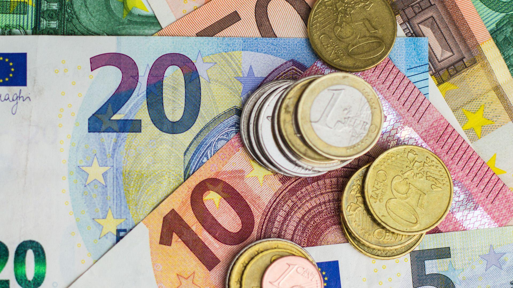

The Euro (€) stands as one of the world's most significant currencies, not only serving as the official currency for many European Union countries but also playing a pivotal role in the global economy. Introduced in 1999, the Euro was conceived as a means to unify and strengthen Europe's economic landscape by facilitating seamless trade and financial transactions among member states. As of today, the Euro is the official currency of 20 EU countries, collectively known as the Eurozone, which constitutes a major economic bloc with substantial influence on international trade and finance.

The Eurozone countries include Austria, Belgium, Cyprus, Estonia, Finland, France, Germany, Greece, Ireland, Italy, Latvia, Lithuania, Luxembourg, Malta, the Netherlands, Portugal, Slovakia, Slovenia, and Spain. These countries have adopted the Euro to not only streamline economic interactions among themselves but also to enhance their economic stature globally. The European Central Bank (ECB) is tasked with managing monetary policy for the Eurozone, aiming to maintain price stability and financial cohesion among its diverse economies.



In parallel to these developments in currency unification, financial markets have witnessed a revolutionary transformation through the advent and growing prevalence of algorithmic trading. Algorithmic trading refers to the use of computer programs and algorithms to execute trades at high speed and volume, based on predefined criteria. It has become an indispensable element in modern financial markets due to its ability to enhance efficiency, reduce transaction costs, and mitigate human error. Algorithms analyze vast datasets to identify market trends and execute trades at optimum timing, often far surpassing human capabilities.

This article aims to provide an in-depth exploration of the Euro's evolution as a currency and its impact on the Eurozone and global economies. It also examines the crucial role of algorithmic trading in contemporary financial markets, particularly focusing on strategies employed in trading currencies such as the Euro. By understanding the historical context and current advancements, the article seeks to inform readers on the opportunities and challenges presented by algorithmic trading, emphasizing the importance of continuous learning and adaptation in the rapidly evolving trading environment.

## Table of Contents

## The Evolution of the Euro

The Euro (€) is the official currency of the Eurozone, a monetary union consisting of 20 of the 27 European Union (EU) member states. The concept of a single European currency dates back to post-war Europe, with the aim of fostering economic stability and integration across the continent. The Euro's creation was an unprecedented achievement in international economics and is considered one of the most significant economic integrations in modern history.

### Historical Background of the Euro: From Concept to Implementation

The idea of a unified European currency emerged in the aftermath of World War II as European countries sought to solidify cooperation and avoid further conflict. The Treaty of Rome (1957) laid the groundwork for European economic integration, but it wasn't until the 1970s that the concept gained traction. The Werner Report (1970) was one of the first proposals advocating for Economic and Monetary Union (EMU).

The path to the Euro was further paved with the signing of the Maastricht Treaty in 1991, which outlined the criteria for EMU and established a timeline for the launch of the common currency. Convergence criteria, including limits on national budget deficits and debt, were set to ensure fiscal discipline among member states. The European Central Bank (ECB) and the European System of Central Banks were also established to manage the currency and monetary policy.

The Euro was introduced in non-physical form on January 1, 1999, with the likes of accounting and electronic transfers, before physical banknotes and coins entered circulation on January 1, 2002.

### Key Milestones in the Establishment of the Eurozone

Several milestones mark the Euro's journey:

1. **1992**: The Maastricht Treaty is signed, setting the framework for the EMU and establishing fiscal criteria for members.
2. **1999**: The Euro is introduced in electronic form, replacing the ECU (European Currency Unit) as the accounting currency.
3. **2002**: Euro banknotes and coins are introduced, replacing national currencies in participating countries.
4. **2004-2007**: Several EU countries, including Slovenia, Cyprus, and Malta, adopt the Euro after joining the EU.
5. **2010-2012**: The Eurozone debt crisis prompts economic reforms and the establishment of financial assistance mechanisms like the European Stability Mechanism (ESM).

### Impacts of the Euro on European and Global Economies

The Euro has played a pivotal role in simplifying trade and economic transactions across Europe, reducing exchange rate [volatility](/wiki/volatility-trading-strategies) among member countries. By promoting price transparency, it facilitated competition and increased market efficiency, potentially lowering consumer prices.

Internationally, the Euro has emerged as one of the most traded currencies, second only to the US Dollar in foreign exchange markets. This status has amplified the Eurozone's influence in global economic affairs and central banking.

However, the Euro has also exposed challenges, particularly during the sovereign debt crisis, where economic disparities and lack of fiscal integration among member states became apparent. Economic policies in several countries needed to be realigned to stabilize the currency.

### Current Status and Future Prospects of the Euro

Currently, the Euro is used by approximately 340 million Europeans in 20 countries, making it a cornerstone of the EU's economic framework. Despite facing challenges such as economic disparities and political skepticism in various regions, the Euro remains a symbol of European integration.

Looking forward, the Eurozone aims to strengthen fiscal policies and enhance financial stability. Ongoing discussions focus on establishing a banking union and deeper economic coordination among member states to mitigate risks associated with economic shocks.

In conclusion, the Euro, as it stands today, is a testament to European economic unity and continues to evolve amidst changing economic circumstances and political landscapes. Its future depends on resolving existing challenges while advancing integration and economic cohesion across the continent.

## Eurozone: Countries and Economic Dynamics

The Eurozone, officially known as the Euro Area, is a monetary union of 20 European Union (EU) member states that have adopted the euro (€) as their primary currency and sole legal tender. The Eurozone was established to enhance economic stability and integration among European countries, with the euro being introduced as physical currency in January 2002. The member countries as of 2023 are Austria, Belgium, Cyprus, Estonia, Finland, France, Germany, Greece, Ireland, Italy, Latvia, Lithuania, Luxembourg, Malta, Netherlands, Portugal, Slovakia, Slovenia, Spain, and the recent addition, Croatia.

### Economic Benefits and Challenges within the Eurozone

The Eurozone aims to provide numerous economic advantages, such as eliminating currency exchange costs and fluctuations among member states, tightening trade and investment relationships, and ensuring stable pricing. These measures enhance the economic efficiency of the participating countries by fostering a single, integrated market. With a large and robust economic bloc, member states can often negotiate more favorable trade agreements with non-European countries and have a more substantial influence in international economic forums.

However, the Eurozone also faces numerous challenges. One of the most significant is the lack of a centralized fiscal policy, which results in differentiated economic performances across member states. Countries with weaker economies or higher public debt, such as Greece, have experienced economic crises that pose risks to the stability of the entire Eurozone. Additionally, monetary policy is uniform across the Eurozone, which can be problematic when addressing national economic issues requiring specific interventions.

### Role of the European Central Bank in Managing the Euro

The European Central Bank (ECB) is the institution responsible for managing the euro and shaping monetary policy within the Eurozone. The ECB aims to maintain price stability by keeping inflation rates below, but close to, 2% over the medium term. This objective is pursued via various monetary policy tools, such as setting key interest rates and conducting open market operations.

One significant aspect of the ECB's role is its ability to influence the exchange rate and consequently the global competitiveness of Eurozone exports. By controlling interest rates, the ECB indirectly affects the euro's value, which plays a crucial role in international trade dynamics. Additionally, the ECB participates in maintaining the financial stability of the Eurozone by providing [liquidity](/wiki/liquidity-risk-premium) support to banks during times of economic stress.

### Impacts of Economic Policies on Eurozone Countries

The economic policies and regulations enacted within the Eurozone have a profound impact on member countries. As part of the Stability and Growth Pact, EU member states are required to maintain budgetary discipline by keeping their budget deficit below 3% of GDP and national debt below 60% of GDP, although these rules are occasionally flexed during economic downturns.

These policies aim to prevent fiscal indiscipline from threatening the euro's stability. However, they can also constrain national governments' abilities to pursue independent fiscal policies tailored to their specific economic contexts. For instance, during the European sovereign debt crisis, strict austerity measures were imposed on countries like Greece and Spain, leading to severe social and economic repercussions.

Overall, the Eurozone represents both a significant economic integration effort and a complex financial landscape characterized by shared benefits and challenges. A unified approach to monetary policy, combined with diverse national economic needs, creates ongoing dynamics that require careful management and collaboration among member states.

 to Algorithmic Trading

Algorithmic trading, often referred to as algo trading, is the use of computer algorithms to automate trading processes. It involves the execution of trades based on predefined criteria, which may include timing, price, or the [volume](/wiki/volume-trading-strategy) of trade. The primary goal of [algorithmic trading](/wiki/algorithmic-trading) is to leverage the speed and precision of computer systems to execute orders that human traders may not be able to manage effectively due to the complexity or timing constraints. By automating complex trading strategies, algorithmic trading is capable of making decisions and executing orders at speeds significantly faster than human traders, thereby providing a competitive edge.

The importance of algorithmic trading in financial markets cannot be overstated. It has brought about increased market efficiency, offering tighter bid-ask spreads, reduced transactional costs, and improved liquidity. The automation of trading processes leads to the minimization of human errors, ensuring more strategic execution of trades based on quantitative data analysis. Additionally, algorithmic trading enables traders to backtest their strategies on historical data, adding a layer of robustness and validation before real-world application.

Several technological advancements have facilitated the growth and sophistication of algorithmic trading. High-frequency trading ([HFT](/wiki/high-frequency-trading-strategies)) platforms have evolved, allowing algorithms to execute thousands of trades in mere seconds. Improvements in computing power, network latency, and data analytics have further enhanced the ability to process large volumes of financial data in real-time. Algorithmic trading systems now routinely incorporate elements of [artificial intelligence](/wiki/ai-artificial-intelligence) and [machine learning](/wiki/machine-learning) to adapt to changing market conditions, optimize strategies, and predict future price movements more accurately.

When comparing algorithmic trading to traditional trading methods, several distinctions emerge. Traditional trading relies heavily on human decision-making and intuition, often based on qualitative factors and traders' personal experience. In contrast, algorithmic trading is data-driven and systematic, with decisions made based on quantitative models and statistical analyses. While humans excel at understanding contextual nuances and non-quantifiable factors affecting markets, algorithms outperform in environments requiring rapid decision-making and the ability to exploit minute price disparities. Additionally, traditional trading may be susceptible to emotional biases and psychological pressures, whereas algorithmic trading, being rule-based, operates devoid of human emotion, executing trades purely based on logical parameters.

In conclusion, as technological capabilities continue to advance, the role of algorithmic trading in modern financial markets will likely expand further. Its efficiency, coupled with the continuous integration of AI and machine learning, promises to redefine trading dynamics, offering traders sophisticated tools to optimize performance and competitiveness.

## Algorithmic Trading Strategies for Eurozone Currencies

Algorithmic trading has transformed the landscape of currency trading, particularly within the Eurozone. By deploying sophisticated algorithms, traders can execute large volumes of trades efficiently and with precision. This section outlines popular algorithmic trading strategies for Euro trading, the advantages and challenges of using these strategies, historical successes, and the impact of technological advancements.

### Popular Algorithmic Trading Strategies

1. **Trend Following**: This strategy aims to capitalize on the momentum of an asset's price movement. Traders utilize algorithms to identify and exploit trends in currency pairs by following moving averages or other momentum indicators. For instance, moving average crossovers can signal when to buy or sell a Euro pair based on historical price data.

2. **Statistical Arbitrage**: Algorithms identify pricing inefficiencies between correlated currency pairs. Euro trading often involves exploiting small price differentials between currencies such as EUR/USD and EUR/GBP. Python libraries, such as `pandas` and `numpy`, are often used to perform statistical analysis and execute trades based on mean reversion principles.

3. **Market Making**: Aimed at providing liquidity to the market, this strategy involves continuously quoting bid and ask prices. Algorithms automatically adjust these quotes based on market conditions, allowing traders to earn profits from the spread. Market makers in Eurozone currencies provide stability and depth to the marketplace.

4. **Mean Reversion**: This strategy assumes that the price of a currency will revert to its mean or average price over time. By forecasting deviations and corrections, algorithms are programmed to buy undervalued Euros and sell overvalued ones. This can be modeled using statistical tests and regression analysis.

5. **Machine Learning-Based Algorithms**: With advances in AI, machine learning algorithms are increasingly used to predict market movements. Neural networks and reinforcement learning models analyze large datasets to make informed trading decisions, adapting to new patterns and trends in Euro trading.

### Benefits and Challenges

**Benefits**:
- **Efficiency and Speed**: Algorithms can execute trades in milliseconds, much faster than human traders, capitalizing on brief market opportunities.
- **Reduction of Emotional Bias**: Automated systems eliminate the emotional decision-making associated with manual trading, enabling more consistent performance.
- **Backtesting and Optimization**: Trading strategies can be rigorously tested against historical data, allowing for optimization and refinement before live deployment.

**Challenges**:
- **Market Volatility**: Algorithms must adapt to sudden market changes, such as those caused by geopolitical events affecting the Eurozone.
- **Complexity and Costs**: Developing sophisticated trading models entails significant expertise and financial resources, often limiting accessibility to larger institutions.
- **Regulatory Compliance**: Adhering to ever-evolving regulatory standards across Eurozone countries requires robust compliance mechanisms.

### Case Studies and Examples

One notable example is the deployment of high-frequency trading strategies during periods of relatively low volatility in the Euro market. Firms like Virtu Financial and Citadel Securities have successfully utilized cutting-edge algorithms to both minimize risk and optimize hedge positions, yielding substantial returns.

### Technological Advancements

Recent technological advancements have revolutionized Euro trading strategies:

- **High-Performance Computing**: Enhanced processing speeds facilitate complex computations and real-time data analysis, essential for executing algorithmic trades quickly.
- **Cloud Computing**: Offers scalable resources and storage solutions for extensive backtesting and strategy development.
- **APIs and Streaming Data**: Access to real-time market data through APIs allows algorithms to analyze a constant stream of information, enabling more informed trading decisions.

In summary, the integration of technology into algorithmic trading has bolstered the efficiency and effectiveness of strategies for Eurozone currencies. As computational capabilities continue to advance, traders are poised to exploit new opportunities within an increasingly dynamic market landscape.

## Risk Management in Algorithmic Trading

Risk management in algorithmic trading is a crucial aspect of [forex](/wiki/forex-system) trading to maintain profitability while minimizing potential losses. Effective risk management involves a combination of strategies, tools, and techniques tailored to the specific needs and goals of traders engaging in automated transactions within the forex market.

### Overview of Risk Management Strategies for Forex Trading

Risk management strategies in forex trading are designed to mitigate financial losses and capitalize on profitable opportunities. Common strategies include setting stop-loss orders, which automatically initiate the sale of a currency position when it reaches a pre-determined price, thereby limiting potential losses. Another strategy is diversification, which involves spreading investments across different currency pairs to reduce exposure to a single currency's volatility. Position sizing, which determines the amount of capital allocated to a particular trade based on the trader's risk tolerance, is also essential for effective risk management.

### Tools and Techniques for Managing Risk in Algorithmic Trading

Various tools and techniques are available to manage risk in algorithmic trading. These include risk assessment tools that evaluate the potential impact of market movements on existing positions and automated alerts that notify traders of significant market changes. Additionally, algorithmic traders often use volatility indicators, such as the Average True Range (ATR) or Bollinger Bands, to assess the market's volatility and adjust their strategies accordingly.

Another critical tool is the use of risk management software, which integrates with trading platforms to provide real-time analytics and risk exposure reports. This software often includes features such as scenario analysis, which evaluates the effects of different market conditions on a trader's portfolio, and Value at Risk (VaR) calculations, which estimate the potential loss in value of a portfolio over a specified period for a given confidence interval.

### Importance of Backtesting and Model Validation

Backtesting involves simulating a trading strategy using historical market data to assess its effectiveness before deploying it in live trading. This process allows traders to evaluate the performance of their algorithms under various market conditions and make necessary adjustments to enhance their profitability. Model validation is equally important as it ensures that the trading model is robust, reliable, and capable of performing well in real-world conditions. Validation techniques include stress testing, which evaluates how the model performs under extreme market scenarios, and cross-validation, which assesses the model's predictive accuracy by dividing the data into different subsets for training and testing.

### Regulatory Considerations and Ethical Implications

Algorithmic trading in forex markets is subject to regulatory oversight aimed at protecting market integrity and preventing unfair trading practices. Traders must adhere to regulations set by financial authorities, such as the European Securities and Markets Authority (ESMA) or the Commodity Futures Trading Commission (CFTC) in the United States, which may include requirements for transparency, reporting, and capital adequacy.

Ethically, algorithmic traders must consider the potential impact of their strategies on market volatility and liquidity. High-frequency trading algorithms, for instance, can contribute to market disruptions and exacerbate volatility. Traders must ensure that their algorithms are designed and tested to avoid manipulative activities, such as quote stuffing or layering, which can unfairly affect market conditions.

In conclusion, effective risk management in algorithmic forex trading involves a comprehensive approach that includes well-defined strategies, advanced analytical tools, thorough [backtesting](/wiki/backtesting), and compliance with regulatory and ethical standards. By prioritizing risk management, traders can enhance their chances of achieving sustainable profitability in the dynamic forex market.

## Future Trends in Eurozone Algorithmic Trading

The landscape of algorithmic trading within the Eurozone is undergoing substantial transformation, driven by technological advancements and shifting regulatory frameworks. As these changes continue to unfold, several trends are expected to shape the future of Eurozone algorithmic trading.

**Expected Developments in Algorithmic Trading Technologies**

Technological innovation is at the forefront of algorithmic trading advancements. Key developments include the increasing speed and efficiency of trade execution, largely due to improvements in hardware and software systems. High-frequency trading (HFT) systems now benefit from reduced latency through the use of cutting-edge technology like FPGA (Field-Programmable Gate Array) and ASIC (Application-Specific Integrated Circuit) hardware solutions. These advancements allow algorithms to process data and execute trades in microseconds, a crucial aspect in modern trading environments where price changes happen rapidly.

Additionally, the use of cloud computing is becoming more prevalent, offering scalable and flexible resources that enhance algorithmic trading capabilities. With cloud platforms, traders can deploy complex algorithms without significant infrastructure investments, allowing for more sophisticated trading strategies and quicker adaptation to market changes.

**Potential Impacts of Regulatory Changes on Algorithmic Trading**

Regulatory shifts present both challenges and opportunities for algorithmic trading in the Eurozone. The Markets in Financial Instruments Directive II (MiFID II), implemented by the European Union in 2018, mandated greater transparency and accountability in trading practices. Future regulatory developments are likely to further emphasize transparency, aiming to minimize systemic risks and protect market integrity.

Traders may need to adapt algorithms to comply with evolving regulations, such as incorporating features that ensure adherence to pre-trade and post-trade transparency requirements. Moreover, regulations focused on limiting market volatility may influence the design and deployment of certain high-frequency trading strategies. As a result, traders and firms must maintain robust compliance frameworks to navigate these regulatory landscapes effectively.

**Emerging Trends in Trading Strategies for Currency Pairs Involving Euro**

One significant trend is the increasing focus on multi-currency strategies, where algorithms are designed to trade multiple currency pairs simultaneously, leveraging correlations and [arbitrage](/wiki/arbitrage) opportunities. For instance, if the EUR/USD and EUR/GBP pairs show particular correlation patterns, algorithms can exploit these relationships to devise profitable strategies.

Another emerging trend is the use of sentiment analysis in trading strategies. By analyzing large volumes of data from social media, news, and other information sources, algorithms can gauge market sentiment and incorporate these insights into trading decisions. This approach enables traders to anticipate market movements triggered by geopolitical events or economic announcements impacting the Euro.

**Integration of AI and Machine Learning in Algorithmic Trading Solutions**

Artificial Intelligence (AI) and Machine Learning (ML) are increasingly integral to algorithmic trading strategies. These technologies offer advanced data processing capabilities, enabling algorithms to learn from historical data and improve over time through pattern recognition and predictive analytics.

Machine learning models, including neural networks and decision trees, can efficiently analyze vast datasets to identify complex patterns and derive actionable insights. Moreover, [reinforcement learning](/wiki/reinforcement-learning) techniques are applied to optimize trading strategies based on continuous feedback loops. These methodologies increase the adaptability of algorithms to evolving market conditions, leading to enhanced performance.

A simple example of implementing a machine learning model in trading can be illustrated through the use of Python, employing libraries such as Scikit-Learn:

```python
from sklearn.model_selection import train_test_split
from sklearn.ensemble import RandomForestClassifier
import pandas as pd

# Load historical trading data
data = pd.read_csv('eurusd_data.csv')

# Define features and target variable
features = data[['feature1', 'feature2', 'feature3']]
target = data['target']

# Split data into training and testing sets
X_train, X_test, y_train, y_test = train_test_split(features, target, test_size=0.2, random_state=42)

# Initialize and train the machine learning model
model = RandomForestClassifier(n_estimators=100, random_state=42)
model.fit(X_train, y_train)

# Make predictions
predictions = model.predict(X_test)

# Evaluate model performance
accuracy = model.score(X_test, y_test)
print(f"Model Accuracy: {accuracy:.2f}")
```

In conclusion, the future of Eurozone algorithmic trading is characterized by rapid technological progress, evolving regulatory frameworks, innovative trading strategies, and the integration of AI and machine learning. These developments are poised to redefine how algorithmic traders operate, offering both challenges and opportunities in a dynamic and competitive market environment.

## Conclusion

In conclusion, the Euro has emerged as a pivotal force in both European and global markets, playing a critical role since its inception. Its evolution from concept to widespread adoption has profoundly influenced the economic dynamics within the Eurozone and beyond. The European Central Bank continues to steer the economic policies affecting member countries and global trade, highlighting the Euro's enduring significance.

Algorithmic trading has also transformed financial markets, offering efficient and data-driven solutions to currency trading, especially within the Eurozone. Harnessing algorithmic strategies in trading Eurozone currencies provides numerous advantages such as speed, precision, and the ability to process vast amounts of data. However, these benefits come with challenges, including managing risk and navigating regulatory landscapes.

Looking forward, the future of the Euro appears promising as it continues to adapt in the dynamic global economy. Similarly, algorithmic trading offers substantial opportunities for innovation, particularly with the integration of artificial intelligence and machine learning. Traders are encouraged to continuously enhance their knowledge and adapt to evolving market conditions, staying abreast of regulatory changes and technological advancements.

For those interested in delving deeper into these topics, a wealth of resources is available for further exploration. The integration of cutting-edge technology in trading strategies and the ongoing economic and political developments in the Eurozone warrant ongoing study and understanding. Continuous learning is essential for anyone deeply engaged in trading and financial analysis, ensuring preparedness for the challenges and opportunities that lie ahead.

## References & Further Reading

[1]: ["The Euro: The First Decade"](https://www.amazon.com/Euro-First-Decade-European-Commission/dp/927909842X) by European Central Bank

[2]: ["The Euro and the Battle of Ideas"](https://press.princeton.edu/books/hardcover/9780691172927/the-euro-and-the-battle-of-ideas) by Markus Brunnermeier, Harold James, and Jean-Pierre Landau

[3]: Lopez de Prado, Marcos. ["Advances in Financial Machine Learning."](https://www.amazon.com/Advances-Financial-Machine-Learning-Marcos/dp/1119482089) Wiley, 2018.

[4]: ["Quantitative Trading: How to Build Your Own Algorithmic Trading Business"](https://www.amazon.com/Quantitative-Trading-Build-Algorithmic-Business/dp/1119800064) by Ernest P. Chan

[5]: European Commission. ["Economic and Monetary Union and the Euro."](https://economy-finance.ec.europa.eu/economic-and-monetary-union_en)

[6]: ["European Sovereign Debt Crisis: Overview, Analysis, and Timeline of Major Events"](https://blogs.cfainstitute.org/investor/2011/11/21/european-sovereign-debt-crisis-overview-analysis-and-timeline-of-major-events/) by Investopedia

[7]: Stefan Jansen. ["Machine Learning for Algorithmic Trading: Predictive Models to Extract Signals from Market and Alternative Data for Systematic Trading Strategies with Python."](https://github.com/stefan-jansen/machine-learning-for-trading) Packt Publishing, 2020.

[8]: De Grauwe, Paul. ["The Economics of Monetary Union"](https://www.amazon.com/Economics-Monetary-Union-14th-Grauwe/dp/0192849778) by Oxford University Press. 

[9]: Narang, Rishi K. ["Inside the Black Box: A Simple Guide to Quantitative and High-Frequency Trading."](https://www.amazon.com/Inside-Black-Box-Quantitative-Frequency/dp/1118362411) Wiley, 2012.

[10]: ["Market Microstructure and the Profitability of Algorithmic Trading"](https://nurp.com/wisdom/market-microstructure-and-algorithmic-trading/) by the CFA Institute Research Foundation