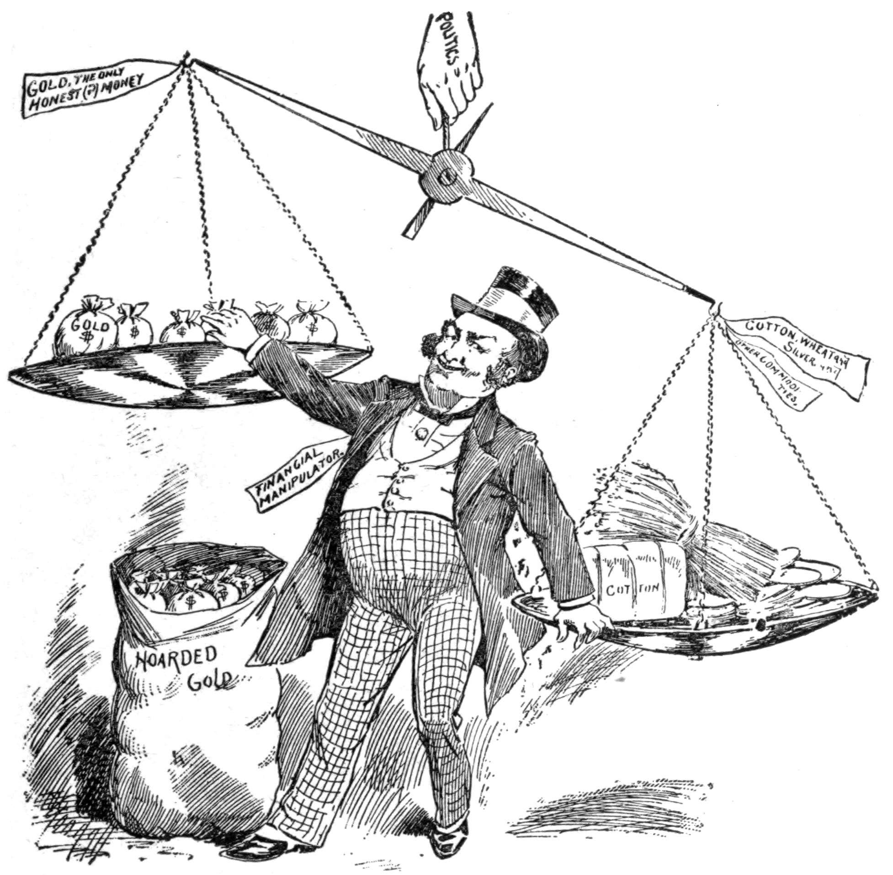

## Table of Contents

## What is hoarding in commodities?

Hoarding in commodities means when people or companies buy and keep a lot of a product without using or selling it right away. They do this because they think the price of the product will go up later. For example, someone might buy a lot of wheat and store it, hoping to sell it for more money when wheat becomes scarce.

This can cause problems because it can make the product harder to find for others who need it. If many people hoard a commodity, it can lead to shortages and higher prices. Governments sometimes make rules to stop hoarding because it can hurt the economy and make life harder for regular people who just want to buy things they need.

## Why do people hoard commodities?

People hoard commodities mainly because they think the price will go up later. If they believe a product like oil or sugar will become more expensive, they buy a lot of it now and keep it stored away. They hope to sell it later at a higher price and make a profit. This is common in markets where prices can change a lot, like with food or energy products.

Another reason people hoard is because they are worried about not being able to get the commodity in the future. This can happen during times of crisis, like a war or a natural disaster, when people think supplies might run out. They buy extra to make sure they have enough for themselves, which can lead to shortages for everyone else. Hoarding can create a cycle where more people start hoarding because they see others doing it, making the situation worse.

## What are the most commonly hoarded commodities?

People often hoard food and water. These are basic things everyone needs to live. During emergencies like hurricanes or pandemics, people might buy extra food like rice, canned goods, and bottled water. They do this because they are worried they won't be able to get these things later. Hoarding food and water can lead to empty shelves in stores, making it hard for others to find what they need.

Another commonly hoarded commodity is fuel, like gasoline. People might fill up extra containers with gas if they think there will be a shortage. This can happen during storms or if there's a problem with oil supplies. Hoarding fuel can cause long lines at gas stations and make it difficult for everyone to get the gas they need for their cars or generators.

Some people also hoard things like toilet paper and medicine. Toilet paper became famous for being hoarded during the early days of the COVID-19 pandemic. People bought a lot of it because they were scared of running out. Medicine, especially important ones like insulin or painkillers, can be hoarded by people who need them regularly or by those who think they might not be able to get them later. Hoarding these items can lead to shortages and make life harder for people who really need them.

## How does hoarding affect commodity prices?

When people hoard commodities, it can make the prices go up. This happens because when a lot of people buy and keep a product, there is less of it left for others. If there is less of something, the price usually goes up because more people are trying to buy the same thing. For example, if many people start hoarding sugar, the stores might run out of sugar quickly. Then, the price of sugar can go up because everyone still wants to buy it, but there is not enough to go around.

Hoarding can also make prices go up because it can make people think there will be a shortage. When people see others hoarding, they might start to worry and buy more than they need too. This can create a cycle where more and more people hoard, making the shortage worse and pushing prices even higher. For instance, if people start hoarding gasoline because they think there will be a shortage, more people might start filling up extra containers, which can lead to long lines at gas stations and higher prices at the pump.

## What are the economic impacts of hoarding commodities?

Hoarding commodities can mess up the economy. When people hoard things like food or fuel, it can make prices go up because there is less of the product for everyone else. This can hurt people who can't afford to pay more. It can also make businesses struggle because they can't get the things they need to make their products or keep their stores stocked. If a lot of people start hoarding, it can lead to shortages, which can make the economy unstable and cause problems for everyone.

Governments sometimes have to step in to stop hoarding because it can be bad for the economy. They might make rules to limit how much people can buy or store. This can help keep prices from going too high and make sure everyone can get what they need. But if hoarding gets out of control, it can lead to panic and make people lose trust in the economy. This can slow down business and make it harder for the economy to grow.

## How can one identify hoarding in the commodity market?

You can spot hoarding in the commodity market by looking at how quickly products are selling out and how prices are changing. If a lot of people are buying up a commodity very fast, and it's hard to find on store shelves, that might mean people are hoarding it. For example, if everyone is buying all the rice in the stores and there's none left, that's a sign that hoarding might be happening. Also, if the price of a commodity suddenly goes up a lot, it could be because people are hoarding it and making it scarce.

Another way to identify hoarding is by watching the news and reports about the commodity market. If there are stories about people stockpiling things like fuel or medicine, that's a clue that hoarding is going on. Sometimes, government officials or experts will talk about hoarding and try to stop it. They might say there are limits on how much you can buy, or they might warn people not to hoard. If you hear about these kinds of rules or warnings, it's a good sign that hoarding is affecting the market.

## What are the legal implications of hoarding commodities?

Hoarding commodities can get people into legal trouble. Many countries have laws that say you can't buy and keep too much of certain things, like food or fuel, especially during emergencies. If you break these laws, you might have to pay a fine or even go to jail. Governments make these rules to make sure everyone can get what they need and to stop prices from going too high because of hoarding.

Sometimes, the government will set limits on how much you can buy of a certain product. If you buy more than that limit, you could be breaking the law. For example, during a big storm, the government might say you can only buy 10 gallons of gas at a time. If you buy more than that, you could get in trouble. These rules are there to keep things fair and make sure there's enough for everyone.

## What strategies can be used to prevent hoarding?

Governments can use rules to stop hoarding. They can set limits on how much people can buy of things like food, gas, or medicine. This helps make sure everyone can get what they need. During emergencies, like a big storm or a health crisis, the government might tell stores to only let people buy a little bit at a time. This can help stop people from buying too much and leaving nothing for others. If someone breaks these rules and hoards too much, they might have to pay a fine or face other punishments.

Another way to prevent hoarding is by making sure there is enough of everything. If people know they can always get what they need, they won't feel like they have to buy a lot and keep it. Stores can keep their shelves full and have good ways to get more products quickly. The government can also help by making sure there are no big problems with supplies. When people feel safe and know they can buy things when they need them, they are less likely to hoard.

## How do government policies address commodity hoarding?

Governments use rules to stop people from hoarding commodities. They might say you can only buy a certain amount of things like food, gas, or medicine. This helps make sure everyone can get what they need. If someone buys too much and breaks these rules, they might have to pay a fine or face other punishments. During big problems like storms or health crises, the government might tell stores to only let people buy a little bit at a time. This stops people from buying too much and leaving nothing for others.

Another way governments deal with hoarding is by making sure there is enough of everything. If people know they can always get what they need, they won't feel like they have to buy a lot and keep it. Stores can keep their shelves full and have good ways to get more products quickly. The government can also help by making sure there are no big problems with supplies. When people feel safe and know they can buy things when they need them, they are less likely to hoard.

## What role do speculators play in commodity hoarding?

Speculators are people who buy things like food or oil because they think the price will go up later. They want to make money by selling these things at a higher price. When speculators hoard commodities, they buy a lot and keep it stored away. This can make the price go up because there is less of the product for everyone else. If a lot of speculators start hoarding, it can lead to shortages and make it hard for regular people to buy what they need.

Governments sometimes make rules to stop speculators from hoarding too much. They might say you can only buy a certain amount of a product. This helps make sure there is enough for everyone. But if speculators think the price will go up a lot, they might still try to hoard, even if it's against the rules. This can cause problems in the market and make prices go up even more.

## How does hoarding impact global commodity supply chains?

Hoarding can mess up global commodity supply chains a lot. When people in one country start hoarding things like food or fuel, it can make it hard for other countries to get what they need. This is because the supply of these things is connected all over the world. If one place is buying up a lot, there might not be enough left to send to other places. This can lead to shortages and higher prices everywhere, not just where the hoarding is happening.

Governments and businesses try to fix these problems by making rules and finding new ways to get supplies. They might limit how much people can buy or find new places to get the things they need. But it's not easy, and it can take time to fix the supply chain. Hoarding can make the whole system unstable and cause a lot of stress for everyone who depends on these global supply chains.

## What are the long-term effects of commodity hoarding on market stability?

Hoarding commodities can make the market unstable for a long time. When people hoard things like food or fuel, it can lead to shortages and higher prices. This can make people lose trust in the market because they don't know if they will be able to get what they need. If this keeps happening, businesses might have a hard time planning and making sure they have enough supplies. This can slow down the economy and make it harder for everyone to get what they need at a fair price.

Governments and businesses try to fix these problems by making rules and finding new ways to get supplies. But if hoarding keeps happening, it can be hard to keep the market stable. People might start hoarding more because they are worried about shortages, which can make the problem worse. Over time, this can lead to a cycle of hoarding and shortages that is hard to break. It can take a long time for the market to get back to normal and for people to feel safe buying what they need without worrying about running out.

## References & Further Reading

[1]: Kaufman, P. J. (2013). ["Trading Systems and Methods"](https://onlinelibrary.wiley.com/doi/book/10.1002/9781119202561). Wiley.

[2]: Kaminski, K. M. (2018). ["Commodity Trading Advisors: Risk, Performance Analysis, and Selection"](https://books.google.com/books/about/Commodity_Trading_Advisors.html?id=7B3cApqdAyEC). Wiley.

[3]: Gomber, P., Arndt, B., Lutat, M., & Uhle, T. (2011). ["High-frequency trading"](https://papers.ssrn.com/sol3/papers.cfm?abstract_id=1858626). Journal of Management Information Systems, 27(2), 233-260.

[4]: De Long, J. B., Shleifer, A., Summers, L. H., & Waldmann, R. J. (1990). ["Positive Feedback Investment Strategies and Destabilizing Rational Speculation."](https://www.nber.org/papers/w2880) Journal of Finance.

[5]: Lyons, R. K. (2001). ["The Microstructure Approach to Exchange Rates."](https://direct.mit.edu/books/monograph/2004/The-Microstructure-Approach-to-Exchange-Rates) MIT Press.

[6]: Pirrong, C. (2009). ["The Economics of Commodity Trading Firms."](https://www.bauer.uh.edu/spirrong/economics-commodity-trading-firms.pdf) Trafigura Discussion Paper Series.

[7]: MacKenzie, D. (2018). ["Material Markets: How Economic Agents are Constructed"](https://books.google.com/books/about/Material_Markets.html?id=rP7Ohf0aqH4C). Oxford University Press.

[8]: Filimonov, V., & Sornette, D. (2012). ["Quantifying Reflexivity in Financial Markets: Toward a Prediction of Flash Crashes."](https://link.aps.org/doi/10.1103/PhysRevE.85.056108) Physical Review E.