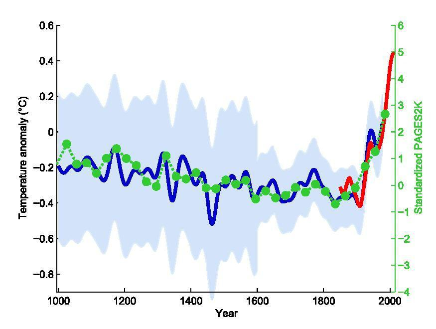

## Table of Contents

## What is a hockey stick chart in the context of investing?

A hockey stick chart in investing shows a sudden and sharp increase in a company's growth or stock price after a long period of slow or steady growth. It looks like a hockey stick, with the long handle representing the slow growth and the blade showing the rapid increase. This type of chart is often used to illustrate the potential of a company or investment that is expected to take off quickly.

Investors and analysts watch for hockey stick charts because they can signal a big opportunity. For example, a new technology company might have slow growth at first while it develops its product. But once the product is ready and starts selling well, the company's growth can shoot up very quickly. This pattern can be exciting but also risky, as it's hard to predict when or if the rapid growth will happen.

## How does a hockey stick chart visually represent investment growth?

A hockey stick chart shows investment growth in a way that looks like a hockey stick. The long handle of the stick represents a time when the investment grows slowly or stays the same. This part can last for a long time, and it might not look like much is happening. But then, something changes, and the growth starts to shoot up quickly. This sudden increase is shown by the blade of the hockey stick, which goes up steeply.

This chart is useful because it helps people see when a big change happens. For example, a company might be working on a new product for years without making much money. But once the product is ready and people start buying it, the company's value can grow very fast. The hockey stick chart makes it easy to see this pattern, showing investors where the slow growth turns into rapid growth.

## What are the key phases of a hockey stick chart?

A hockey stick chart has two main phases. The first phase is called the "handle." This part of the chart is long and flat, showing a time when growth is slow or not happening much. It can last for a long time, like when a company is working on something new but not making much money yet. This slow growth can make people think nothing big will happen.

Then comes the second phase, called the "blade." This part of the chart shoots up quickly, showing a sudden big increase in growth. It happens when something changes, like a new product starts selling well or a company gets a lot more customers. This fast growth can make the company's value go up a lot in a short time. People watch for this phase because it can mean a big opportunity to make money.

## Can you explain the significance of the 'blade' and 'shaft' in a hockey stick chart?

The 'shaft' of a hockey stick chart is the long, flat part at the bottom. It shows a time when things are growing slowly or not much is happening. This can last a long time, like when a company is working on a new idea but not making much money yet. People might think nothing big will happen during this time because the growth is so slow.

Then, the 'blade' of the chart is the part that shoots up quickly. It shows a sudden big increase in growth. This happens when something changes, like a new product starts selling well or a company gets a lot more customers. The 'blade' is important because it can mean a big opportunity for investors to make money. People watch for this part of the chart because it shows when things start to take off fast.

## What types of investments are commonly associated with hockey stick growth patterns?

Investments that often show hockey stick growth patterns are usually in new or growing industries. These can be things like tech startups, especially those working on new technology or apps. For example, a company making a new smartphone app might not make much money at first while they build it. But once the app is ready and people start using it a lot, the company can grow very fast.

Another type of investment that can have a hockey stick pattern is in biotech companies. These companies work on new medicines or treatments. It takes a long time to test and make sure the medicine works, so at first, growth is slow. But if the medicine is successful and gets approved, the company's value can go up quickly. People who invest in these companies are looking for that big jump in growth after the slow start.

## How can investors identify potential hockey stick growth opportunities?

Investors can spot potential hockey stick growth opportunities by looking at companies in new or growing industries. These might be tech startups working on new apps or software, or biotech companies developing new medicines. These companies often start with slow growth while they are building their product or doing research. Investors should watch for signs that the company is about to launch something big or get important approvals, because that's when the growth can take off quickly.

Another way to find these opportunities is by keeping an eye on market trends and news. If a new technology or product is getting a lot of attention, it might be a sign that a company in that area could see a big jump in growth soon. Investors should also look at the company's financials and see if they are investing a lot in research and development. This can be a clue that they are working on something that could lead to a hockey stick growth pattern.

## What are the risks associated with investing in assets that show a hockey stick pattern?

Investing in assets that show a hockey stick pattern can be risky. The main risk is that the sudden growth might not happen. Companies can spend a long time and a lot of money trying to develop new products or technologies. If these don't work out or take longer than expected, the company might not see the big jump in growth that investors are hoping for. This can lead to the investment losing value instead of growing.

Another risk is that the market might already expect the growth, making the stock price high even before the growth happens. If the growth doesn't meet these high expectations, the stock price can drop quickly. This is called a "correction," and it can happen when investors realize the growth won't be as big or fast as they thought. So, even if the company does start to grow, the investment might not make as much money as expected because the price was already too high.

## How does the timing of investment impact the potential returns from a hockey stick chart?

The timing of when you invest in a company with a hockey stick chart can make a big difference in how much money you might make. If you invest early, during the slow growth part of the chart called the "handle," you might buy the stock at a lower price. If the company then goes on to have the big growth shown in the "blade" of the chart, your investment could go up a lot. This is because you bought in before everyone else realized how big the company could get.

But, if you wait too long and only invest after the growth has already started, you might not make as much money. By then, the stock price could be higher because more people know about the company's success. Also, if you invest right before the growth happens but it doesn't happen as fast or as big as expected, you could lose money. So, getting the timing right is important, but it's also hard because no one knows for sure when the growth will start.

## What historical examples illustrate the hockey stick chart in investing?

One good example of a hockey stick chart in investing is the story of Amazon. When Amazon first started, it was just a website that sold [books](/wiki/algo-trading-books). For a long time, it didn't make much money and grew slowly. This was the "handle" part of the hockey stick. But then, Amazon started selling more things like electronics and clothes, and they also started services like Amazon Prime. Suddenly, their growth shot up very fast. This was the "blade" part of the chart. People who invested in Amazon early, during the slow growth time, made a lot of money when the company took off.

Another example is Netflix. At first, Netflix was a company that sent DVDs to people's homes through the mail. It grew slowly and didn't make a lot of money. This was the "handle" of the hockey stick. But then, Netflix started streaming movies and TV shows online. This changed everything. More and more people started using Netflix, and the company's growth went up very quickly. This was the "blade" of the chart. Investors who bought Netflix stock before the streaming service became popular saw their investments grow a lot.

## How can technical analysis be used to predict or confirm a hockey stick pattern?

Technical analysis can help investors spot and confirm a hockey stick pattern by looking at charts and using different tools. One way to do this is by watching for a long period of slow or flat growth on a stock's price chart. This is the "handle" of the hockey stick. Investors can use moving averages, like the 50-day or 200-day moving average, to see if the stock price is staying steady or moving slowly. If the price stays below these averages for a long time, it might be a sign that the handle part of the hockey stick is happening.

Once the slow growth part is spotted, investors can then look for signs that the growth is about to take off. This is the "blade" of the hockey stick. They can use tools like the Relative Strength Index (RSI) to see if the stock is starting to get overbought, which can happen when the price starts to rise quickly. Another tool is [volume](/wiki/volume-trading-strategy) analysis. If the trading volume starts to go up a lot when the price starts to rise, it can be a sign that more people are buying the stock and the growth is real. By using these technical analysis tools, investors can try to predict when a hockey stick pattern might happen and confirm it when it does.

## What are the psychological factors that can influence the formation of a hockey stick chart?

The formation of a hockey stick chart can be influenced by people's feelings and thoughts. During the slow growth part, which is the handle of the hockey stick, investors might feel unsure or not very excited about the company. They might think the company is not doing well because it's not growing fast. This can make them not want to invest, or even sell their shares. But some investors might see the slow growth as a chance to buy the stock at a low price, hoping for a big jump later.

Then, when the company starts to do well and the growth shoots up, which is the blade of the hockey stick, people's feelings can change a lot. They might get very excited and start buying the stock quickly, thinking they can make a lot of money. This excitement can make the price go up even faster. But if the growth doesn't keep going as fast as people hoped, they might get scared and start selling, which can make the price go down. So, how people feel can really affect whether a hockey stick chart happens and how long it lasts.

## How do macroeconomic factors contribute to the emergence of hockey stick growth in investments?

Macroeconomic factors can play a big role in making a hockey stick growth pattern happen in investments. Things like the overall health of the economy, interest rates, and government policies can affect how well a company does. For example, if the economy is doing well and people have more money to spend, a company might start selling a lot more of its products. This can lead to the sudden growth that makes the blade of the hockey stick. Also, if the government gives money or tax breaks to certain industries, like tech or green energy, it can help those companies grow faster and create a hockey stick pattern.

On the other hand, if the economy is not doing well, it can be harder for a company to grow quickly. High interest rates can make it more expensive for companies to borrow money to grow, which can slow down the handle part of the hockey stick. But if the economy suddenly gets better or if there's a big change in policy, like a new law that helps a certain industry, it can lead to the fast growth of the blade. So, watching these big economic factors can help investors guess when a hockey stick pattern might happen.

## References & Further Reading

[1]: Bergstra, J., Bardenet, R., Bengio, Y., & Kégl, B. (2011). ["Algorithms for Hyper-Parameter Optimization."](https://proceedings.neurips.cc/paper/2011/file/86e8f7ab32cfd12577bc2619bc635690-Paper.pdf) Advances in Neural Information Processing Systems 24.

[2]: ["Advances in Financial Machine Learning"](https://www.amazon.com/Advances-Financial-Machine-Learning-Marcos/dp/1119482089) by Marcos Lopez de Prado

[3]: ["Evidence-Based Technical Analysis: Applying the Scientific Method and Statistical Inference to Trading Signals"](https://www.amazon.com/Evidence-Based-Technical-Analysis-Scientific-Statistical/dp/0470008741) by David Aronson

[4]: ["Machine Learning for Algorithmic Trading"](https://github.com/stefan-jansen/machine-learning-for-trading) by Stefan Jansen

[5]: ["Quantitative Trading: How to Build Your Own Algorithmic Trading Business"](https://www.amazon.com/Quantitative-Trading-Build-Algorithmic-Business/dp/1119800064) by Ernest P. Chan