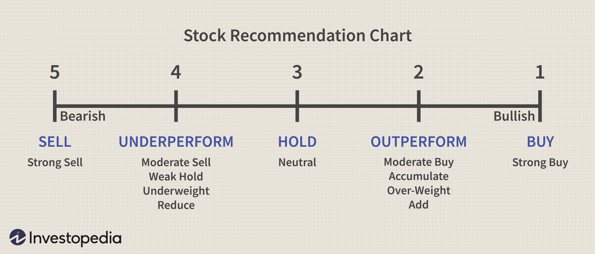

In the world of stock trading and investment, understanding analyst recommendations is key to making informed decisions. Analysts provide insights through various recommendations such as buy, sell, and hold. Each recommendation guides investors in aligning their strategies with market conditions, aiming to optimize returns. Hold recommendations, in particular, serve as a valuable tool, indicating that a stock is expected to perform on par with the market. These recommendations suggest stability and prompt investors to maintain their current positions unless a significant change in market conditions occurs.

Algorithmic trading has emerged as a significant advancement in incorporating analyst recommendations into trading strategies. By employing complex algorithms, these systems process large datasets to swiftly adapt trading strategies based on changes in analyst ratings, including hold recommendations. This integration allows for enhanced decision-making, helping investors manage risks and capitalize on potential opportunities more effectively.



Whether you are new to stock trading or an experienced investor, understanding the nuances of analyst recommendations, particularly hold ratings, can provide a strategic advantage. By aligning investment tactics with these insights, traders can better navigate market uncertainties and work towards achieving their financial objectives.

## Table of Contents

## What is a Hold Recommendation?

A hold recommendation is a financial analyst's advisory suggesting that investors should neither buy nor sell a particular stock at the present moment. This recommendation implies that the stock is expected to perform in line with the general market, suggesting neither significant outperformance nor underperformance in the near term.

When analysts issue a hold recommendation, they indicate that a stock's perceived value is reasonably reflected in its current market price. This contrasts with more definitive buy or sell recommendations. A buy recommendation indicates that the stock is likely undervalued and expected to ascend, thus encouraging investors to purchase. Conversely, a sell recommendation suggests the stock is overvalued or poised to decrease, advising investors to divest.

Investors receiving a hold recommendation are generally encouraged to maintain their current stock positions. This guidance holds unless future market conditions prompt a reassessment of the stock's potential or if additional information emerges that could alter the stock's anticipated stability. The underlining message is one of risk management and the avoidance of impulsive trading decisions that could be driven by temporary market fluctuations or speculative movements.

While a hold recommendation is not as favorable as encouragement to buy, it is more advantageous than a suggestion to sell. It signifies relative confidence in the stability of the stock within its sector, albeit without expectations for rapid gains. This type of recommendation encourages a patient approach while observing market trends and economic indicators that could affect the stock's future performance. Investors need to stay informed and continuously evaluate whether retaining such positions aligns with their broader investment objectives and risk tolerance.

## Understanding the Role of Holds in Investment Strategies

Hold recommendations are often regarded as a signal of stability in the volatile world of stock trading. They serve as a strategic pause for investors, suggesting that the current market conditions may not warrant aggressive actions such as buying or selling. The essence of a hold recommendation lies in its implicit prediction: the stock is expected to perform on par with the broader market or its industry counterparts in the near term.

This neutral stance provides investors with the flexibility to maintain their existing positions while awaiting additional market data or company updates that could alter the trajectory of the stock. For instance, if a stock is under a hold recommendation and the overall market sentiment shifts favorably, the investor might benefit from continued dividend income without the need for immediate capital shifts. Conversely, if market conditions deteriorate, the hold recommendation offers the opportunity to reassess the portfolio without the disadvantages of hastily liquidating assets.

The calculus behind hold recommendations involves a complex interplay of financial indicators, industry trends, and economic forecasts. Analysts, when issuing a hold recommendation, evaluate factors such as a company's earnings potential, competitive position, and macroeconomic influences. These elements collectively shape the forecast that the stock's future price movements will mirror the market's broader fluctuations.

For investors, integrating hold recommendations into their investment strategy necessitates a balancing act. It involves weighing the anticipated stability against personal financial objectives and risk tolerance. For instance, an investor with a high risk aversion may prioritize preserving capital and opt to hold despite limited growth potential. Conversely, those seeking aggressive growth might interpret a hold as a cue to explore alternative investments.

Such strategic decisions underscore the importance of aligning hold recommendations with individualized investment plans. By considering market conditions, industry trends, and personal financial goals, investors can effectively leverage the guidance provided by hold recommendations to navigate the dynamic financial landscape.

## Algorithmic Trading and Hold Recommendations

Algorithmic trading leverages sophisticated algorithms to integrate analyst ratings, such as hold recommendations, into trading strategies. These algorithms provide a systematic approach to parsing and interpreting vast datasets, allowing for rapid response to changes in stock ratings. This ability to quickly adapt to new information is crucial in the highly dynamic landscape of financial markets.

The process begins with data acquisition, where algorithms collect real-time information from various sources, including market feeds, financial reports, and analyst ratings. Hold recommendations are particularly important as they indicate that a stock is expected to perform similarly to the market average. This insight allows algorithms to assess market conditions more accurately, balancing between over-performing and under-performing stocks.

Once data is acquired, advanced [machine learning](/wiki/machine-learning) models, such as neural networks or decision trees, are employed to interpret these recommendations within the broader market context. These models can identify patterns and trends that may not be immediately apparent to human traders. For example, a decision tree might help in identifying scenarios where hold recommendations have historically preceded market shifts, enabling the algorithm to preemptively adjust positions.

Python, with its extensive libraries like NumPy, pandas, and TensorFlow, is commonly used in developing these algorithmic systems. Consider a Python snippet that demonstrates how hold recommendations might be incorporated into a trading strategy:

```python
import pandas as pd
from sklearn.ensemble import RandomForestClassifier

# Sample dataset containing analyst ratings and stock performance
data = pd.DataFrame({
    'rating': ['buy', 'hold', 'sell', 'hold', 'buy'],
    'stock_performance': [1, 0, -1, 0, 1]  # 1 = outperform, 0 = neutral, -1 = underperform
})

# Convert categorical ratings to numerical values
data['rating'] = data['rating'].map({'buy': 1, 'hold': 0, 'sell': -1})

# Model to predict future stock performance based on ratings
model = RandomForestClassifier()
model.fit(data[['rating']], data['stock_performance'])

# Predict future performance of a stock with a 'hold' recommendation
future_rating = pd.DataFrame({'rating': [0]})
predicted_performance = model.predict(future_rating)

print(f"Predicted stock performance: {predicted_performance[0]}")
```

In this example, the model uses past analyst ratings and corresponding stock performances to predict future outcomes. This predictive capability is vital for maintaining an effective risk management strategy, enabling algorithms to position portfolios in advance of potential market movements.

By incorporating hold ratings, [algorithmic trading](/wiki/algorithmic-trading) systems efficiently manage risk and exploit market opportunities. Adjustments in trading strategies based on holds can smooth out the portfolio's [volatility](/wiki/volatility-trading-strategies), ensuring that investments are aligned with prevailing market conditions. This nuanced approach to trading decisions underscores the evolving sophistication of algorithmic trading in contemporary financial markets.

## Benefits and Risks of Holding Stocks

Holding stocks can be a crucial component of a successful investment strategy, as it allows investors to benefit from both dividend payouts and the potential for long-term price appreciation. Dividends are payments made by a corporation to its shareholders, usually derived from profits. By holding stocks, investors can receive these periodic payouts, which can be reinvested to purchase more shares, aiding in the growth of their investment portfolio. Additionally, over the long term, stocks have historically appreciated in value, providing the opportunity for substantial capital gains. This appreciation is typically driven by factors such as company growth, economic expansion, and inflationary trends, which can lead to an increase in stock prices.

Despite these benefits, holding stocks also comes with inherent risks. The most prominent risk is exposure to market volatility. Stock markets can be highly unpredictable, with prices fluctuating due to changes in economic conditions, geopolitical events, or company-specific news. Such volatility can lead to sudden declines in stock value, impacting the overall value of an investor's portfolio. This risk is particularly pronounced during market downturns, where even fundamentally strong stocks may suffer significant price declines.

Investors must carefully consider these risks and benefits when deciding whether to hold stocks, especially during unstable market periods. A balanced approach is vital, where potential gains are weighed against potential losses. Diversification, which involves spreading investments across various asset classes, can mitigate some risks, but investors must still remain vigilant and adaptable. Understanding their own risk tolerance and financial goals can help investors decide when it’s advantageous to hold stocks or seek alternative investment opportunities.

## Real-World Impacts of Analyst Ratings

Analyst ratings play a pivotal role in shaping stock performance, notably affecting major companies such as Coca-Cola and Starbucks. These ratings, typically classified into categories such as 'buy', 'hold', and 'sell', serve as essential guides for investors navigating the stock market's complexities.

When an analyst upgrades a stock, for example from 'hold' to 'buy', it often signifies improved financial outlook or future growth prospects for the company. This positive shift can significantly alter investor sentiment, leading to increased demand for the stock and consequently driving its price upward. Conversely, a downgrade can diminish investor confidence, triggering a sell-off that pressures the stock's price downward. 

The impact of these changes is not merely theoretical. For instance, Coca-Cola has experienced fluctuations in its stock price following analyst upgrades or downgrades. Such movements reflect the market's sensitivity to professional assessments, as new information prompts investors to reevaluate their positions.

Starbucks offers another illustration of this phenomenon. When analysts express optimism about its earnings potential or strategic initiatives, upgrades can lead to upward trends in stock price, enhancing market dynamics. Conversely, adverse ratings can lead to declines, emphasizing the importance of these evaluations in influencing trading activity.

Understanding the real-world impacts of analyst ratings enables investors to better anticipate market reactions. By closely monitoring rating changes, they can adjust their strategies, either capitalizing on positive [momentum](/wiki/momentum) or mitigating risks associated with negative outlooks. This awareness helps in aligning investment decisions with prevailing market conditions and enhances the ability to achieve desired financial outcomes.

## Conclusion

Hold recommendations play a crucial role in investment strategies by providing guidance during periods of market uncertainty. They help investors navigate complex market conditions, advising them to maintain their current positions while awaiting more definitive signals. This approach can be particularly beneficial when market trends are unclear or volatile, suggesting stability and patience as core components of a prudent investment strategy.

Algorithmic trading further enhances the potential to leverage hold recommendations by utilizing sophisticated data analysis. These algorithms analyze massive datasets and react swiftly to any changes in analyst ratings, including hold recommendations. This capability allows traders to optimize their trading decisions by continuously adjusting strategies in response to evolving market conditions. For instance, algorithms may weigh the probability that a hold-rated stock will either outperform or underperform against its historical performance and the broader market indices. This data-driven approach can help balance risks and maximize potential returns by quickly identifying market trends and anomalies.

Investors are encouraged to incorporate analyst ratings, such as hold recommendations, into their broader investment plans. This incorporation should be aligned with personal financial goals and risk tolerance. By understanding the nuances of hold recommendations and utilizing algorithmic trading tools, investors can achieve a more balanced and informed approach to stock trading. Thus, while hold recommendations offer a snapshot of stability in uncertain markets, the strategic use of technology and a clear understanding of personal investment objectives are essential for optimizing investment outcomes.

## References & Further Reading

[1]: Bergstra, J., Bardenet, R., Bengio, Y., & Kégl, B. (2011). ["Algorithms for Hyper-Parameter Optimization."](https://dl.acm.org/doi/10.5555/2986459.2986743) Advances in Neural Information Processing Systems 24.

[2]: ["Advances in Financial Machine Learning"](https://www.amazon.com/Advances-Financial-Machine-Learning-Marcos/dp/1119482089) by Marcos Lopez de Prado

[3]: ["Evidence-Based Technical Analysis: Applying the Scientific Method and Statistical Inference to Trading Signals"](https://www.amazon.com/Evidence-Based-Technical-Analysis-Scientific-Statistical/dp/0470008741) by David Aronson

[4]: ["Machine Learning for Algorithmic Trading"](https://github.com/stefan-jansen/machine-learning-for-trading) by Stefan Jansen

[5]: ["Quantitative Trading: How to Build Your Own Algorithmic Trading Business"](https://www.amazon.com/Quantitative-Trading-Build-Algorithmic-Business/dp/1119800064) by Ernest P. Chan