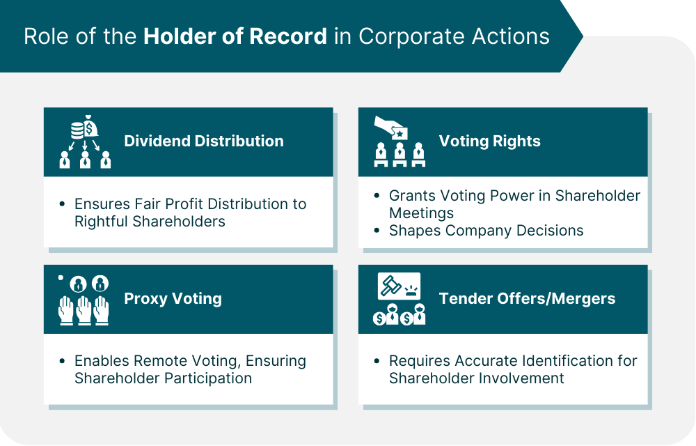

## Table of Contents

## What is a Holder of Record?

A Holder of Record is a person or entity officially listed as the owner of a company's stock or other securities. This record is kept by the company or its transfer agent. Being a Holder of Record means that you are recognized as the legal owner of those shares on the company's books. This is important because it determines who gets to vote at shareholder meetings and who receives dividends.

Sometimes, people buy stocks through brokers, and the broker holds the shares in a "street name." In these cases, the broker is the Holder of Record, not the individual investor. However, the investor still has the rights to the shares, like voting and receiving dividends. The broker just acts as the middleman. Knowing who the Holder of Record is helps companies communicate important information to their shareholders.

## How does one become a Holder of Record?

To become a Holder of Record, you need to buy shares directly from the company or through a direct stock purchase plan. When you do this, your name gets put on the company's list of shareholders. This list is called the "record" and it shows who owns the shares. Companies keep this record to know who to send important information to, like meeting notices and dividend payments.

If you buy shares through a broker, things work a bit differently. The broker will usually hold your shares in what's called a "street name." This means the broker's name goes on the company's record instead of yours. But don't worry, you still own the shares and get all the benefits, like voting rights and dividends. The broker just acts as a middleman between you and the company. If you want to be a Holder of Record yourself, you can ask your broker to transfer the shares into your name, but this might take some extra steps and time.

## What is the significance of being a Holder of Record?

Being a Holder of Record means you are officially listed as the owner of a company's stock. This is important because it gives you certain rights. For example, you get to vote at shareholder meetings. These meetings are where big decisions about the company are made. Also, if the company pays dividends, you will get them directly because your name is on the company's list of shareholders.

Sometimes, people buy stocks through a broker, and the broker holds the shares in a "street name." In this case, the broker is the Holder of Record, not you. But you still own the shares and get the same benefits, like voting rights and dividends. The broker just acts as a middleman. If you want to be a Holder of Record yourself, you can ask your broker to transfer the shares into your name, but it might take some extra steps.

## Can the status of Holder of Record change, and if so, how?

Yes, the status of Holder of Record can change. It happens when you sell your shares or if the shares are transferred to someone else. When you sell your shares, your name gets taken off the company's list of shareholders, and the new owner's name gets put on. If you want to transfer your shares to someone else, like a family member, you need to tell the company or the transfer agent, and they will update their records.

If you bought your shares through a broker and they are held in a "street name," you can ask the broker to change the records so that your name is listed as the Holder of Record. This might take some time and paperwork, but it means you will be directly on the company's list. Also, if a company does a stock split or a merger, the records might need to be updated to reflect the new number of shares or the new company's name.

## What are the rights associated with being a Holder of Record?

Being a Holder of Record gives you some important rights. One big right is that you can vote at shareholder meetings. These meetings are where big decisions about the company are made, like choosing the board of directors or approving big changes. When you're a Holder of Record, you get to have a say in these decisions.

Another right is that you can get dividends directly from the company. If the company makes a profit and decides to share it with shareholders, they send the money to the people on their list. Being a Holder of Record means you'll get these payments without any middleman. If you bought your shares through a broker and they are held in a "street name," you still get these rights, but the broker might handle the voting and dividend payments for you.

## How does the concept of Holder of Record apply to different types of securities?

The concept of Holder of Record applies to different types of securities, like stocks, bonds, and mutual funds. When you own stocks, being a Holder of Record means your name is on the company's list of shareholders. This gives you rights like voting at shareholder meetings and getting dividends directly from the company. If you own bonds, being a Holder of Record means you are listed as the owner of those bonds, which means you get interest payments directly from the issuer. For mutual funds, being a Holder of Record means you are listed as an owner of the fund's shares, and you get any distributions or dividends the fund pays out.

Sometimes, people buy securities through a broker, and the broker holds them in a "street name." This means the broker's name is on the record instead of yours. But you still own the securities and have the same rights, like voting and getting payments. The broker just acts as a middleman. If you want to be the Holder of Record yourself, you can ask your broker to transfer the securities into your name, but it might take some extra steps and time.

## What is the process for verifying a Holder of Record?

To verify a Holder of Record, you need to check the company's official list of shareholders. This list is kept by the company or its transfer agent. If you want to know if someone is a Holder of Record, you can contact the company directly and ask them to check their records. They will look up the person's name and see if they are listed as an owner of the company's stock or other securities.

If the shares are held in a "street name" through a broker, the process is a bit different. In this case, the broker is listed as the Holder of Record on the company's list. To verify if someone owns those shares, you would need to contact the broker. The broker can check their records to confirm that the person owns the shares, even though the broker's name is on the company's list. This way, you can make sure the right person is recognized as the owner of the securities.

## How do companies use the Holder of Record information for corporate actions?

Companies use the Holder of Record information to manage important corporate actions like shareholder meetings, dividend payments, and stock splits. When a company needs to hold a shareholder meeting, they use the list of Holders of Record to send out meeting notices and voting materials. This makes sure that only the official owners of the stock get to vote on big decisions, like choosing the board of directors or approving big changes to the company.

For dividend payments, the company looks at the list of Holders of Record to see who should get the money. If the company decides to pay out profits to shareholders, they send the dividends directly to the people on their list. This way, the right people get their share of the company's earnings. If there's a stock split or a merger, the company updates the Holder of Record list to reflect the new number of shares or the new company's name, making sure the records stay accurate and up-to-date.

## What are the legal implications of being a Holder of Record?

Being a Holder of Record means you are legally recognized as the owner of a company's stock or other securities. This gives you certain legal rights, like the right to vote at shareholder meetings. These meetings are important because they are where big decisions about the company are made. If you are a Holder of Record, you get to have a say in these decisions. Also, if the company pays dividends, you have a legal right to receive them directly from the company.

If you buy shares through a broker and they are held in a "street name," the broker is listed as the Holder of Record, not you. But you still have the same legal rights to the shares, like voting and getting dividends. The broker just acts as a middleman between you and the company. If you want to be the Holder of Record yourself, you can ask your broker to transfer the shares into your name. This might take some extra steps, but it means you will be directly on the company's list and have full legal ownership.

## How does the role of a Holder of Record interact with proxy voting?

When you are a Holder of Record, you have the right to vote at shareholder meetings. But sometimes, you might not be able to go to the meeting yourself. That's where proxy voting comes in. Proxy voting lets you give someone else the power to vote for you. This person is called a proxy. As a Holder of Record, you can fill out a proxy form and tell the proxy how you want to vote on different issues. The proxy then goes to the meeting and votes for you, just like you told them to.

If you bought your shares through a broker and they are held in a "street name," the broker is the Holder of Record, not you. But you still get to vote. The broker will send you a proxy form, and you can fill it out to tell them how you want to vote. The broker then votes on your behalf at the shareholder meeting. This way, even if you're not the Holder of Record, you still have a say in the company's decisions through proxy voting.

## What are the technological systems used to manage Holder of Record data?

Companies use special computer systems to keep track of who owns their stock. These systems are called shareholder management systems or transfer agent systems. They store all the important information about who the Holders of Record are, like their names, how many shares they own, and when they bought the shares. These systems make it easy for companies to send out important notices, like when there's a shareholder meeting or when dividends are paid. They also help keep the records up to date when shares are bought or sold.

Sometimes, companies use online platforms where shareholders can log in and see their own records. These platforms let you check how many shares you own, see your voting rights, and even vote online if there's a meeting coming up. They make it easier for shareholders to stay informed and take part in the company's decisions without having to go through a lot of paperwork. These systems are important because they help make sure everything is done correctly and fairly for all shareholders.

## How do international regulations affect the definition and mechanism of a Holder of Record?

International regulations can change how companies keep track of who owns their stock. Different countries have their own rules about what it means to be a Holder of Record. For example, some countries might require companies to keep a special list of shareholders, while others might let brokers hold shares in a "street name." These rules can affect how shareholders get to vote and receive dividends, and they can make it harder for companies to manage their records if they have shareholders from many different places.

Even though the basic idea of a Holder of Record is the same everywhere, the details can be different because of these international rules. Companies that do business in many countries need to follow all these different rules. This means they might need to use special systems to keep track of shareholders in different countries. It can be a lot of work, but it's important to make sure everyone who owns stock gets treated fairly, no matter where they live.

## References & Further Reading

[1]: Lopez de Prado, M. (2018). ["Advances in Financial Machine Learning."](https://www.amazon.com/Advances-Financial-Machine-Learning-Marcos/dp/1119482089) John Wiley & Sons.

[2]: Chan, E. (2009). ["Quantitative Trading: How to Build Your Own Algorithmic Trading Business."](https://github.com/ftvision/quant_trading_echan_book) John Wiley & Sons.

[3]: Jansen, S. (2020). ["Machine Learning for Algorithmic Trading."](https://github.com/stefan-jansen/machine-learning-for-trading) Packt Publishing.

[4]: Aronson, D. R. (2007). ["Evidence-Based Technical Analysis: Applying the Scientific Method and Statistical Inference to Trading Signals."](https://onlinelibrary.wiley.com/doi/book/10.1002/9781118268315) John Wiley & Sons.

[5]: Menkveld, A. J. (2013). ["High Frequency Trading and the New Market Makers."](https://papers.ssrn.com/sol3/papers.cfm?abstract_id=1722924) Journal of Financial Markets, 16(4), 712-740.