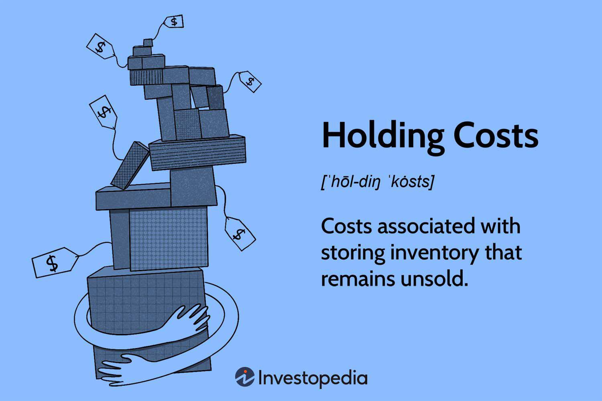

Inventory management plays a pivotal role in determining a company's profitability and operational efficiency. It involves the systematic administration of processes such as ordering, storing, and utilizing a company's inventory to ensure that the right quantity of the right product is available at the right time. Central to this administration are inventory costs, which include holding costs and carrying costs. These costs, representing the expenses associated with unsold goods, can significantly impact an organization's financial health and operational decisions. As such, understanding and managing these costs are key to enhancing inventory management effectiveness.

Holding costs, also known as carrying costs, encompass both the tangible and intangible expenses related to warehousing and maintaining inventory. These costs include storage fees, insurance, depreciation, taxes, and the opportunity costs of capital tied up in inventory. Effective inventory management strategies aim to minimize these expenses without compromising service levels, thereby enhancing a company's overall profitability.

Furthermore, algorithmic trading (algo trading) has emerged as a domain where optimized inventory strategies can confer distinct advantages. Algo trading utilizes advanced algorithms to execute trades at speeds and volumes impractical for human traders, offering superior precision and efficiency. The efficiency gained from optimized inventory management can significantly influence trading strategies and capital allocation decisions. By reducing inventory carrying costs, companies can allocate more resources toward automated trading activities, enhancing their market responsiveness and investment returns.

This article investigates the convergence of inventory management and algo trading, providing insights into strategic cost management and optimization that drive profitability and operational excellence.

## Table of Contents

## Understanding Inventory Costs

Inventory costs are crucial to effective inventory management, representing the financial burdens associated with maintaining and managing unsold goods within a company. Understanding these costs is vital for effective financial planning and operational efficiency. Generally, inventory costs are divided into two primary categories: holding costs and carrying costs.

Holding costs, also referred to as carrying costs, represent the expenses incurred for storing and maintaining unsold inventory over a given period. These costs include both tangible and intangible elements essential for a company's strategic planning. Tangible costs encompass warehousing expenses, such as rent, utilities, and equipment, used to store the inventory. Additionally, insurance and taxes are part of the tangible expenses, as the company must protect its inventory against possible damages or losses. Furthermore, depreciation of inventory items over time, especially for goods with a fixed shelf-life or technology subject to obsolescence, forms another tangible component.

On the other hand, intangible elements include opportunity costs arising from capital tied up in inventory. These costs represent the potential returns on investment that the capital could have generated if deployed elsewhere in the business. Opportunity costs can significantly impact a company's bottom line, as the money invested in unsold inventory could otherwise be utilized to expand operations, invest in new projects, or enhance trading activities.

From a financial perspective, the formula to calculate the carrying cost percentage can be represented as:

$$
\text{Carrying Cost \%} = \left( \frac{\text{Total Carrying Costs}}{\text{Average Inventory Value}} \right) \times 100
$$

This formula helps businesses quantify the financial burden imposed by inventory costs and assess their overall financial health. By analyzing these components, companies can implement effective strategies to minimize these costs and improve their operational efficiency and profitability. Consequently, understanding inventory costs is not only imperative for cost reduction but also plays a pivotal role in ensuring a company's long-term sustainability and growth.

## Components of Inventory Holding Costs

Holding costs, also known as carrying costs, encompass various expenses associated with storing unsold inventory. These costs are crucial for any organization as they directly impact business profitability and operational efficiency. Here are the primary components of inventory holding costs:

1. **Storage Costs:** These are the expenses incurred for warehousing inventory. They include rent, utilities, and maintenance of storage facilities. Effective space utilization and warehouse optimization strategies can significantly reduce these costs.

2. **Insurance:** Businesses often insure their inventory to protect against losses from theft, damage, or disasters. The cost of insurance premiums is a crucial component of carrying costs. Companies must balance adequate coverage with cost-efficiency to manage these expenses effectively.

3. **Depreciation:** Inventory items, particularly those with a shelf life or those susceptible to obsolescence, tend to lose value over time. Depreciation is an accounting method to allocate the cost of tangible assets over their useful life, impacting the balance sheet and financial statements.

4. **Taxes:** In some jurisdictions, companies must pay taxes on the value of held inventory. Inventory taxes can pose a significant burden, especially for businesses with substantial stock levels. Timely inventory turnover can help in reducing these costs.

5. **Opportunity Costs:** While not a direct expense, opportunity costs represent the potential benefits lost when capital is tied up in inventory rather than invested elsewhere, such as in more lucrative ventures or projects that could yield higher returns.

Understanding and monitoring these components are essential for minimizing excess storage, reducing financial burdens, and enhancing overall profitability. Companies implement various strategies, including inventory turnover optimization, just-in-time (JIT) inventory systems, and advanced forecasting, to effectively manage and reduce holding costs.

## The Impact of Inventory Costs on Warehouse Management

Effective warehouse management plays a critical role in reducing inventory carrying costs, impacting both a company's operational efficiency and financial health. Inventory carrying costs encompass various expenses associated with storing unsold goods, including storage costs, labor, insurance, depreciation, and opportunity costs. By optimizing warehouse management, organizations can significantly minimize these expenses, leading to enhanced profitability.

One of the primary strategies for reducing inventory carrying costs is optimizing storage solutions. This involves arranging the warehouse layout to maximize space utilization and improve accessibility. For instance, adopting a systematic approach to storing goods, such as implementing a ranking system based on product demand, allows for quick access and reduces unnecessary movement. This optimization not only lowers labor costs but also minimizes the risk of errors in inventory handling.

Improving inventory turnover is another effective method for managing carrying costs. High inventory turnover signifies efficient utilization of assets, translating to reduced storage times and costs. Businesses can enhance turnover by aligning stock levels with market demand, ensuring products move quickly through the warehouse. Techniques such as Just-In-Time (JIT) inventory systems and demand forecasting using predictive analytics are beneficial in maintaining optimal stock levels. These methods help reduce excess inventory and the associated holding costs.

Incorporating technology is paramount in modern warehouse management. Automation solutions like warehouse management systems (WMS) streamline inventory tracking and data collection, providing real-time insights into stock levels and management efficiency. Moreover, technologies such as barcode scanning and Radio Frequency Identification (RFID) devices enhance accuracy in inventory recording and retrieval, reducing errors and labor costs associated with manual processes. Integration of advanced analytics further aids in predictive decision-making, aiding in effective resource allocation.

Implementing these strategies ensures the efficient use of warehouse space, reducing the labor force required for inventory management and minimizing operational errors. As a result, businesses not only cut down on carrying costs but also improve their overall operational efficiency, providing a competitive edge and contributing to sustainable profitability.

## Algorithmic Trading and Inventory Costs

Algorithmic trading utilizes sophisticated algorithms and high-speed computing to automate trading decisions, significantly enhancing trading precision and execution speed. This technological advancement enables traders and investors to efficiently handle vast quantities of financial data and quickly respond to market conditions, outperforming traditional trading methods. The integration of [algorithmic trading](/wiki/algorithmic-trading) with efficient inventory management presents a substantial opportunity for cost savings and resource optimization.

Efficiency in inventory management directly impacts trading strategies and capital allocation. Precise management of inventory carrying costs allows companies to free up capital that could otherwise be tied up in unsold or underutilized stock. By optimizing inventory turnover rates and reducing excess inventory, companies can allocate more resources towards algorithmically driven trading activities. This reallocation enables businesses to invest in technological infrastructure, data analysis tools, and other essential resources that support sophisticated trading strategies.

Effective inventory management can also mitigate risks associated with market [volatility](/wiki/volatility-trading-strategies). Carrying costs, which encompass expenses such as warehousing, insurance, and opportunity costs, can drain financial resources if not properly managed. By streamlining inventory levels and employing cost-effective storage solutions, companies can lower these expenses, thus releasing additional capital for trading activities.

Moreover, the reduction of inventory carrying costs contributes to enhanced capital efficiency. By maintaining lean inventory levels, businesses can achieve a higher return on investment (ROI) in their trading operations. The capital saved from minimized inventory expenses can be redirected towards algorithmic trading, allowing firms to execute a higher [volume](/wiki/volume-trading-strategy) of trades and explore diversified trading strategies.

In conclusion, the synergy between algorithmic trading and optimized inventory management offers significant advantages to companies seeking to enhance their financial agility and profitability. By focusing on reducing inventory carrying costs, organizations can maximize their available capital, leading to improved trading performance and increased competitive advantage in financial markets.

## Strategies for Reducing Inventory Carrying Costs

Adopting strategies to reduce inventory carrying costs is essential for enhancing a company's operational efficiency and profitability. Implementing Just-In-Time (JIT) inventory systems is one critical approach. JIT systems minimize inventory levels by aligning production schedules with customer demand. This approach reduces storage needs and lowers the risk of holding obsolete inventory, leading to significant cost savings.

Predictive analytics is another powerful tool for optimizing inventory management. By analyzing historical data and using [machine learning](/wiki/machine-learning) algorithms, companies can forecast demand more accurately and align their inventory levels accordingly. This reduces overstocking and ensures that resources are allocated effectively across the supply chain.

Dropshipping presents another strategy for minimizing carrying costs. In this model, products are shipped directly from the supplier to the customer, eliminating the need for the retailer to hold inventory. This significantly decreases warehousing costs and mitigates the risks associated with unsold goods.

Regular audits are crucial for maintaining optimal inventory levels. These audits should assess not only the physical inventory but also the processes and technologies in place. By identifying inefficiencies or discrepancies, companies can make informed decisions to refine their inventory management practices further.

Optimizing vendor contract terms is also vital. Negotiating favorable terms, such as extended payment periods or flexible order quantities, can reduce financial burdens and provide better cash flow management. Companies should also consider strategic partnerships that allow for shared risks and benefits, ultimately reducing inventory-related expenses.

By adopting these strategies, organizations can enhance their operational efficiency and improve their bottom line. The integration of these approaches into an organization's inventory management system paves the way for reduced costs and increased profitability, ensuring sustained competitive advantage in the market.

## Conclusion

Inventory carrying costs are integral to the financial and operational wellness of a company. Proper oversight and reduction of these costs directly correlate with heightened profitability and streamlined efficiency. By ensuring that inventory levels are precisely managed, businesses can avoid unnecessary expenditures associated with storing, insuring, and maintaining products that remain unsold. This optimization not only frees up capital that could be more effectively used elsewhere but also reduces waste and improves turnover rates.

Moreover, the integration of advanced inventory management with algorithmic trading strategies presents an opportunity for companies to achieve superior investment returns. The automation and precision offered by algorithmic trading can be mirrored in inventory management, potentially leading to a more synchronized and responsive supply chain. For instance, predictive analytics can forecast market trends, aligning inventory levels with anticipated demand, thereby reducing the likelihood of overstocking or stockouts.

The symbiotic relationship between effective inventory management and algo trading is particularly notable. By minimizing inventory carrying costs, businesses can allocate a greater portion of their resources to trading activities, enabling them to capitalize on market opportunities with enhanced agility and accuracy. Furthermore, reduced carrying costs improve a company's balance sheet, making more funds available for strategic investments that can drive growth and competitiveness.

In conclusion, a strategic focus on reducing inventory carrying costs, coupled with the technical advantages of algorithmic trading, provides a robust framework for elevating a company's operational efficiency and financial performance. As businesses continue to adapt to a rapidly changing market environment, leveraging these insights could prove crucial in securing a competitive edge.

## References & Further Reading

Investopedia provides a comprehensive overview of holding costs, which are a key component of inventory management. This resource details the various expenses associated with storing unsold goods, including storage, insurance, and opportunity costs. It also explains how these costs impact a company's financial planning and guides strategies for minimizing them. This foundational understanding is crucial for businesses seeking to optimize inventory costs and improve profitability.

Books on inventory management, such as "Inventory Management Explained" by David J. Piasecki, offer in-depth insights into different inventory management techniques and their impact on operational efficiency. These resources highlight the importance of understanding carrying costs and the role of technology in modern inventory systems. Similarly, "Algorithmic Trading: Winning Strategies and Their Rationale" by Ernie Chan explores the integration of algo trading strategies with inventory management, showcasing the potential for enhanced financial returns through optimized resource allocation.

Academic articles often provide case studies and empirical analyses that support the relationship between effective inventory management and algo trading. For example, studies may highlight how algorithmic trading can benefit from streamlined inventory processes, resulting in more capital available for trading activities. These case studies help illustrate the real-world applications and advantages of combining these two disciplines.

Online resources such as the Inventory Management Review and the Algo Trading Group offer current news, updates, and community discussions on best practices in both fields. These platforms serve as valuable resources for professionals looking to stay informed about the latest trends, tools, and techniques that can aid in reducing inventory carrying costs while enhancing trading performance.

By leveraging a combination of reputable [books](/wiki/algo-trading-books), articles, and online resources, businesses can effectively manage inventory costs and gain a competitive edge in algorithmic trading.

