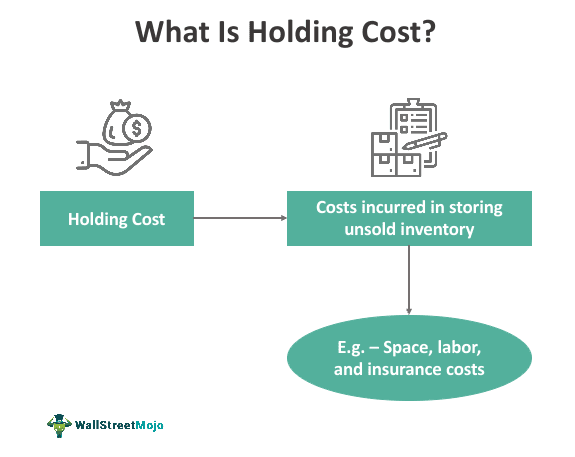

## Table of Contents

## What are holding costs?

Holding costs are the expenses a business has to pay to keep inventory or property. These costs can include things like rent for storage space, insurance to protect the inventory, and the cost of the money tied up in the inventory, which is called the cost of capital. If a business has a lot of inventory, holding costs can be a big expense.

Businesses try to keep holding costs low because they want to make more profit. One way to do this is by managing inventory carefully, so they don't have too much stock sitting around. Another way is by finding cheaper places to store things or by negotiating better deals on insurance. Keeping an eye on holding costs helps businesses stay healthy and make more money.

## Why are holding costs important in inventory management?

Holding costs are important in inventory management because they affect how much money a business makes. When a business keeps a lot of inventory, it has to pay more for things like storage space, insurance, and the money tied up in the inventory. If these costs are too high, the business might not make as much profit as it could. So, it's important for businesses to keep an eye on holding costs and try to keep them as low as possible.

By managing holding costs well, a business can make better decisions about how much inventory to keep. If a business knows how much it costs to hold onto inventory, it can decide whether it's better to order more or less stock. This helps the business avoid having too much inventory that just sits around and costs money. Good inventory management means balancing the need to have enough stock to meet customer demand with the need to keep holding costs down.

## What are the main components of holding costs?

Holding costs are made up of several parts that businesses need to think about. One big part is the cost of the space where the inventory is kept. This could be rent for a warehouse or the cost of using a part of a store to store extra stock. Another part is insurance, which protects the inventory from damage or theft. Businesses also need to think about the cost of the money they have tied up in inventory, called the cost of capital. This is the money they could have used for something else if they didn't have it sitting in stock.

Another important part of holding costs is the cost of handling and managing the inventory. This includes the time and effort it takes to keep track of what's in stock, move items around, and make sure everything is organized. There can also be costs for things like utilities, like electricity and heating, if the inventory needs special conditions to stay good. All these parts together make up the total holding costs, and businesses need to keep an eye on them to make sure they're not spending too much money on keeping inventory.

## How do holding costs impact a business's profitability?

Holding costs can make a big difference in how much profit a business makes. When a business has a lot of inventory, it has to pay for things like storage space, insurance, and the money tied up in the inventory. These costs add up and can eat into the money the business makes from selling its products. If the holding costs are too high, the business might not make as much profit as it could, because it's spending a lot of money just to keep the inventory.

To keep profits up, businesses need to manage their inventory carefully. This means making sure they don't have too much stock sitting around, which would increase holding costs. By keeping holding costs low, a business can use more of its money to grow or invest in other areas. Good inventory management helps a business balance having enough stock to meet customer demand with keeping holding costs down, which leads to more profit at the end of the day.

## What is the difference between holding costs and carrying costs?

Holding costs and carrying costs are often used to mean the same thing in business. They are the expenses a business has to pay to keep inventory or property. These costs can include things like rent for storage space, insurance to protect the inventory, and the cost of the money tied up in the inventory, which is called the cost of capital. So, in simple terms, holding costs and carrying costs are just different names for the same set of expenses.

However, some people might use the term "carrying costs" a bit more broadly. They might include other expenses like the cost of handling and managing the inventory, utilities for special storage conditions, and even the risk of the inventory becoming outdated or damaged. But even with these small differences, the main idea is the same: both holding costs and carrying costs are about the money a business spends to keep its inventory, and keeping these costs low is important for making more profit.

## How can a business calculate its holding costs?

To calculate holding costs, a business needs to add up all the expenses it has to pay to keep its inventory. This includes the cost of the space where the inventory is stored, like rent for a warehouse or storage area. It also includes insurance to protect the inventory from damage or theft. Another big part is the cost of capital, which is the money the business could have used for something else if it wasn't tied up in inventory. To find this, the business looks at how much money it has in inventory and what it could have earned if it had invested that money elsewhere.

On top of these, there might be other costs like handling and managing the inventory, which includes the time and effort to keep track of stock and move items around. There could also be costs for utilities, like electricity and heating, if the inventory needs special conditions to stay good. To get the total holding costs, the business adds up all these different expenses. By knowing this number, the business can see how much it costs to keep inventory and make better decisions about how much stock to keep, which helps keep profits up.

## What strategies can be used to minimize holding costs?

One way to minimize holding costs is by managing inventory carefully. This means keeping just enough stock to meet customer demand without having too much sitting around. Businesses can use tools like inventory management software to keep track of what's in stock and what's selling. This helps them order the right amount of products at the right time, so they don't have extra inventory that costs money to store. Another strategy is to negotiate better deals on storage space and insurance. By shopping around and talking to different providers, a business might find cheaper options that can help lower holding costs.

Another approach is to improve how quickly products move from the warehouse to the customer. This can be done by speeding up the order fulfillment process or by using just-in-time inventory systems, where products are ordered and received just as they're needed. This way, the business doesn't have to keep a lot of stock on hand, which reduces the cost of holding onto inventory. Additionally, businesses can look at their product lines and see if there are items that don't sell well. By getting rid of slow-moving products, they can focus on items that turn over quickly, which also helps keep holding costs down.

## How do holding costs vary across different industries?

Holding costs can be very different from one industry to another because each industry has its own special needs and ways of doing things. For example, in the food industry, holding costs can be high because food can go bad quickly. Businesses in this industry need to keep their inventory moving fast and may need special storage like refrigerators, which adds to the cost. On the other hand, in the car industry, holding costs might be lower because cars don't spoil, but they still need a lot of space to store, and that space can be expensive.

In the electronics industry, holding costs can be high because technology changes fast, and products can become outdated quickly. Businesses need to sell their stock before it loses value, which means they might have to pay more for storage and insurance to protect their inventory. In contrast, in the furniture industry, holding costs might be lower because furniture doesn't go bad and can be stored for longer periods. But, the cost of the space to store large items like furniture can still be a big expense. Each industry has to think about its own unique holding costs and find ways to manage them to keep profits up.

## What role does technology play in managing holding costs?

Technology helps businesses manage holding costs by making it easier to keep track of inventory. With tools like inventory management software, businesses can see exactly what they have in stock and how fast it's selling. This helps them order just the right amount of products, so they don't have too much inventory sitting around, which saves money on storage and other holding costs. Technology also makes it easier to speed up the order fulfillment process, so products move from the warehouse to the customer faster. This means businesses don't have to keep as much stock on hand, which also helps keep holding costs down.

Another way technology helps is by giving businesses better data to make decisions. With real-time data and analytics, businesses can see patterns in how their inventory is moving and make smarter choices about what to order and when. This can help them avoid overstocking slow-moving items and focus on products that sell quickly. Technology can also help businesses find better deals on storage and insurance by making it easier to compare different options. By using technology to manage inventory better, businesses can keep their holding costs low and make more profit.

## How do economic factors influence holding costs?

Economic factors can have a big impact on holding costs. When the economy is doing well, businesses might see more demand for their products, which means they need to keep more inventory on hand. This can lead to higher holding costs because they need more storage space and might have to pay more for insurance. On the other hand, if the economy is not doing well, businesses might see less demand, so they might not need to keep as much inventory. This can help lower holding costs, but it also means they might not be selling as much, which can hurt their profits.

Interest rates are another economic [factor](/wiki/factor-investing) that can affect holding costs. When interest rates are high, the cost of capital goes up, which means it costs more for businesses to keep money tied up in inventory. This can make holding costs higher. When interest rates are low, the cost of capital goes down, which can help keep holding costs lower. Businesses need to keep an eye on these economic factors and adjust how much inventory they keep to manage their holding costs and stay profitable.

## What are some advanced techniques for optimizing holding costs?

One advanced technique for optimizing holding costs is using predictive analytics. This means using data and computer programs to guess what customers will want in the future. By looking at past sales and other information, businesses can order just the right amount of inventory. This way, they don't have too much stock sitting around, which saves money on holding costs. Predictive analytics can also help businesses know when to put items on sale or get rid of them before they become old and less valuable.

Another technique is using automation in warehouses. Robots and machines can move and sort inventory faster and more accurately than people. This means products can get to customers quicker, so businesses don't need to keep as much inventory on hand. Automation can also help keep track of what's in stock in real-time, which makes it easier to order the right amount of products. By using automation, businesses can lower their holding costs and make their warehouse operations more efficient.

## How can holding costs be integrated into broader supply chain management strategies?

Holding costs are a big part of supply chain management because they affect how much money a business makes. When a business thinks about its supply chain, it needs to look at all the steps it takes to get products from the maker to the customer. This includes how much inventory to keep at each step. By keeping an eye on holding costs, a business can make better choices about how much stock to have in different places. If holding costs are too high, the business might decide to keep less inventory in its warehouses and focus on moving products faster through the supply chain. This way, the business can save money on storage, insurance, and the cost of having money tied up in inventory.

One way to use holding costs in supply chain management is by working closely with suppliers and customers. A business can share information about how much inventory it has and what it expects to sell. This helps suppliers know when to send more products and helps customers know when to expect their orders. By working together, everyone in the supply chain can help keep holding costs low. For example, if a supplier can send products just as they're needed, the business doesn't have to keep as much stock on hand. This makes the whole supply chain more efficient and helps the business make more profit by keeping holding costs down.

## What is Understanding Inventory Costs?

Inventory costs are crucial to effective inventory management, representing the financial burdens associated with maintaining and managing unsold goods within a company. Understanding these costs is vital for effective financial planning and operational efficiency. Generally, inventory costs are divided into two primary categories: holding costs and carrying costs.

Holding costs, also referred to as carrying costs, represent the expenses incurred for storing and maintaining unsold inventory over a given period. These costs include both tangible and intangible elements essential for a company's strategic planning. Tangible costs encompass warehousing expenses, such as rent, utilities, and equipment, used to store the inventory. Additionally, insurance and taxes are part of the tangible expenses, as the company must protect its inventory against possible damages or losses. Furthermore, depreciation of inventory items over time, especially for goods with a fixed shelf-life or technology subject to obsolescence, forms another tangible component.

On the other hand, intangible elements include opportunity costs arising from capital tied up in inventory. These costs represent the potential returns on investment that the capital could have generated if deployed elsewhere in the business. Opportunity costs can significantly impact a company's bottom line, as the money invested in unsold inventory could otherwise be utilized to expand operations, invest in new projects, or enhance trading activities.

From a financial perspective, the formula to calculate the carrying cost percentage can be represented as:

$$
\text{Carrying Cost \%} = \left( \frac{\text{Total Carrying Costs}}{\text{Average Inventory Value}} \right) \times 100
$$

This formula helps businesses quantify the financial burden imposed by inventory costs and assess their overall financial health. By analyzing these components, companies can implement effective strategies to minimize these costs and improve their operational efficiency and profitability. Consequently, understanding inventory costs is not only imperative for cost reduction but also plays a pivotal role in ensuring a company's long-term sustainability and growth.

## References & Further Reading

Investopedia provides a comprehensive overview of holding costs, which are a key component of inventory management. This resource details the various expenses associated with storing unsold goods, including storage, insurance, and opportunity costs. It also explains how these costs impact a company's financial planning and guides strategies for minimizing them. This foundational understanding is crucial for businesses seeking to optimize inventory costs and improve profitability.

Books on inventory management, such as "Inventory Management Explained" by David J. Piasecki, offer in-depth insights into different inventory management techniques and their impact on operational efficiency. These resources highlight the importance of understanding carrying costs and the role of technology in modern inventory systems. Similarly, "Algorithmic Trading: Winning Strategies and Their Rationale" by Ernie Chan explores the integration of algo trading strategies with inventory management, showcasing the potential for enhanced financial returns through optimized resource allocation.

Academic articles often provide case studies and empirical analyses that support the relationship between effective inventory management and algo trading. For example, studies may highlight how [algorithmic trading](/wiki/algorithmic-trading) can benefit from streamlined inventory processes, resulting in more capital available for trading activities. These case studies help illustrate the real-world applications and advantages of combining these two disciplines.

Online resources such as the Inventory Management Review and the Algo Trading Group offer current news, updates, and community discussions on best practices in both fields. These platforms serve as valuable resources for professionals looking to stay informed about the latest trends, tools, and techniques that can aid in reducing inventory carrying costs while enhancing trading performance.

By leveraging a combination of reputable [books](/wiki/algo-trading-books), articles, and online resources, businesses can effectively manage inventory costs and gain a competitive edge in algorithmic trading.

