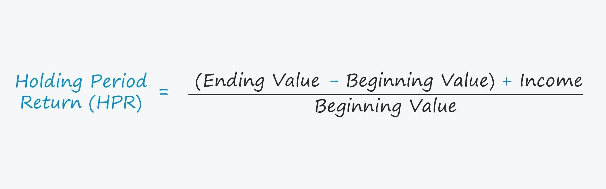

## Table of Contents

## What is the holding period in investments?

The holding period in investments is the length of time an investor owns an asset before selling it. It can range from a few seconds in the case of day trading to several decades for long-term investments like retirement accounts. The holding period is important because it affects how an investment is taxed and can influence the overall return on the investment.

Different holding periods can lead to different tax treatments. In many countries, assets held for a shorter period are taxed at a higher rate than those held for a longer period. For example, in the United States, assets held for less than a year are subject to short-term capital gains tax, which is typically higher than the long-term capital gains tax applied to assets held for more than a year. Understanding the holding period can help investors plan their investment strategy and potentially reduce their tax liability.

## Why is the holding period important for investors?

The holding period is important for investors because it affects how much tax they have to pay on their investments. If an investor sells an asset quickly, they might have to pay a higher tax rate on any profit they make. This is called short-term capital gains tax. But if they hold onto the asset for a longer time, usually more than a year, they can pay a lower tax rate, known as long-term capital gains tax. Knowing this can help investors decide when to sell their investments to save on taxes.

Also, the holding period can impact how much money an investor makes overall. Some investments grow more over time, so holding them longer can lead to bigger returns. Other investments might be better to sell quickly if their value goes up fast. By understanding the holding period, investors can plan better and choose the right time to buy and sell their assets to make the most money.

## How do you calculate the holding period for an investment?

To calculate the holding period for an investment, you need to know the date when you bought the investment and the date when you sold it. You then subtract the purchase date from the sale date to find out how many days, months, or years you held the investment. For example, if you bought a stock on January 1st and sold it on June 30th of the same year, your holding period would be six months.

The holding period can be important for tax purposes. In many places, if you hold an investment for less than a year, any profit you make is taxed at a higher rate, called short-term capital gains tax. But if you hold it for more than a year, you might pay a lower long-term capital gains tax. Knowing your holding period helps you plan when to sell your investments to possibly pay less in taxes.

## What is the difference between short-term and long-term holding periods?

The main difference between short-term and long-term holding periods is how long you keep an investment before you sell it. A short-term holding period is usually when you hold an investment for less than a year. A long-term holding period is when you hold it for more than a year.

This difference matters because it affects how much tax you have to pay on any profit you make from selling the investment. If you sell something after holding it for a short time, you might have to pay a higher tax, called short-term capital gains tax. But if you hold it for a long time, you could pay a lower tax, called long-term capital gains tax. Knowing whether your holding period is short-term or long-term can help you decide when to sell your investments to save on taxes.

## How does the holding period affect tax implications for investments?

The holding period of an investment can change how much tax you have to pay when you sell it. If you sell an investment after holding it for less than a year, you might have to pay a higher tax. This is called short-term capital gains tax. It's usually the same as your regular income tax rate, which can be high. But if you hold the investment for more than a year before selling, you can pay a lower tax. This is called long-term capital gains tax, and it's usually less than what you'd pay for short-term gains.

Knowing about the holding period can help you plan your investments better. If you think you might want to sell something soon, you might want to wait until you've held it for over a year to save on taxes. This can make a big difference in how much money you keep after paying taxes. So, understanding the holding period can help you make smarter choices about when to buy and sell your investments.

## Can the holding period influence investment strategy?

Yes, the holding period can influence how you plan your investments. If you know that holding an investment for more than a year can save you money on taxes, you might decide to keep your investments longer. This can change your whole investment strategy. Instead of buying and selling quickly, you might choose to hold onto your investments for a longer time to get a lower tax rate on any profits you make.

This knowledge can also help you decide which investments to pick. Some investments might be better for short-term gains, while others might grow more over time and be better for long-term holding. By thinking about the holding period, you can choose investments that fit your tax strategy and help you make more money in the end.

## What are common methods to track the holding period of investments?

One common way to track the holding period of your investments is by using a spreadsheet. You can write down the date you bought each investment and the date you sold it. Then, you can easily see how long you held each investment by subtracting the purchase date from the sale date. This method is simple and helps you keep all your investment information in one place.

Another way is to use investment tracking apps or software. Many apps let you enter the details of your investments and automatically calculate the holding period for you. These tools can also remind you when you are close to the one-year mark, which is important for deciding when to sell to get the best tax benefits. Using an app can make tracking easier and less likely to have mistakes.

Some investors also keep a physical or digital journal where they note down the dates of buying and selling investments. This can be as simple as writing in a notebook or using a note-taking app on your phone. While this method might take a bit more work, it helps you stay organized and keeps a record of your investment decisions over time.

## How does the holding period impact the calculation of returns on investment?

The holding period can change how you figure out the returns on your investment. If you hold an investment for a short time, like a few months, you might see quick gains or losses. You calculate the return by taking the difference between the selling price and the buying price, then dividing that by the buying price. For short holding periods, these returns can be big, but they can also be risky because prices can change a lot in a short time.

If you hold an investment for a longer time, like several years, the way you calculate returns might be different. You might use something called the annualized return, which shows how much your investment grows each year on average. This can be helpful because it gives you a better idea of how well your investment did over time, not just at the end. Holding an investment for a long time can smooth out the ups and downs of the market, making your returns more steady and possibly easier to predict.

## What are the considerations for adjusting the holding period based on market conditions?

When deciding how long to keep an investment, it's important to look at what's happening in the market. If the market is going up fast, you might want to sell your investments sooner to make a quick profit. This is called taking advantage of a bull market. But if the market starts to go down, or if it's very unsure, you might want to hold onto your investments longer. This can help you wait out the bad times and maybe sell when the market gets better. By watching the market, you can change your holding period to try and make the most money.

On the other hand, if you think the market will keep going up for a long time, holding your investments for a longer period might be better. This way, you can let your investments grow over time and maybe pay less in taxes. But if you see the market starting to change or if there's a lot of news that could affect your investments, you might want to sell them sooner. It's all about trying to guess what the market will do next and adjusting your holding period to match those guesses.

## How do different types of investments (stocks, bonds, real estate) affect the holding period strategy?

Different types of investments like stocks, bonds, and real estate can change how long you want to hold onto them. Stocks can be very up and down, so some people buy and sell them quickly to try and make money from these changes. This is called short-term trading. But other people might hold stocks for a long time, hoping the company will grow and the stock price will go up over many years. Bonds are usually seen as safer and more steady, so people often hold them for longer periods, like until they mature. Real estate is different because it can take a long time to buy and sell, so most people hold onto it for years or even decades, hoping the value will go up over time.

The holding period for each type of investment can also be affected by what you want to achieve with your money. If you need money soon, you might choose stocks for short-term gains. But if you're saving for something far in the future, like retirement, you might pick bonds or real estate to hold for a long time. Knowing how each type of investment works can help you decide how long to keep them, and this can make a big difference in how much money you make in the end.

## What advanced techniques can be used to optimize the holding period for maximizing returns?

To optimize the holding period for maximizing returns, one advanced technique is called tax-loss harvesting. This means selling investments that have lost value to offset the taxes you owe on investments that have gained value. By carefully timing when you sell these losing investments, you can reduce your tax bill and keep more of your profits. Another technique is using stop-loss orders, which automatically sell your investment if it drops to a certain price. This can help you limit your losses and decide when to sell based on market changes, not just time.

Another advanced method is dollar-cost averaging, where you invest a fixed amount of money at regular intervals, no matter what the market is doing. This can help you buy more shares when prices are low and fewer when prices are high, smoothing out the ups and downs over time. Finally, using technical analysis can help you decide when to buy and sell based on patterns in stock prices and trading volumes. By understanding these patterns, you can adjust your holding period to take advantage of short-term trends or hold for the long term if the trends suggest steady growth.

## How do regulatory changes impact the optimal holding period for different investment vehicles?

Regulatory changes can change how long you want to keep your investments. If the government changes the tax rules, it might make short-term investments more or less attractive. For example, if the tax on short-term gains goes up, you might decide to hold your investments for more than a year to pay less tax. Or, if new rules make it easier to invest in certain things, like real estate, you might decide to hold those investments longer because they become more profitable or less risky.

Also, changes in rules about how long you have to hold certain investments can affect your strategy. If the government says you need to hold a bond for a certain time to get a tax benefit, you might decide to keep it that long. On the other hand, if new rules make it harder to quickly buy and sell stocks, you might choose to hold them for a longer time to avoid extra costs or red tape. Keeping an eye on these changes can help you make better choices about when to buy and sell your investments.

## What is the Calculation of Holding Period?

A holding period begins the day following the acquisition of an asset and continues until the day the asset is sold. This duration is critical in evaluating the performance and tax implications of investments. Accurately measuring the holding period is essential for informed financial planning and strategic investment decision-making.

Calculating the holding period return (HPR) is a fundamental technique in assessing investment performance over time. The HPR indicates the total return earned on an asset during the holding period. The formula to calculate the holding period return is:

$$

\text{HPR} = \frac{\text{Income} + (\text{End of Period Value} - \text{Initial Value})}{\text{Initial Value}}
$$

In this formula, "Income" refers to any cash flows received from the asset during the holding period, such as dividends or interest. "End of Period Value" is the asset's value at the conclusion of the holding period, and "Initial Value" is the asset's value at the time of acquisition. This equation helps investors determine the overall profitability and effectiveness of their investments over specific durations.

To implement the calculation of holding period return in Python, one might use the following code snippet:

```python
def calculate_holding_period_return(income, initial_value, end_of_period_value):
    return (income + (end_of_period_value - initial_value)) / initial_value

# Example Usage
income = 100  # Income from the investment
initial_value = 1000  # Initial investment amount
end_of_period_value = 1200  # Value of the investment at the end of the period

hpr = calculate_holding_period_return(income, initial_value, end_of_period_value)
print(f"Holding Period Return: {hpr:.2%}")
```

This code provides a straightforward method for calculating the holding period return, enabling investors to quantify the total return on their assets efficiently. By understanding and applying such measures, investors can make more informed decisions, optimize their portfolio strategies, and align their investments with their financial objectives.

## References & Further Reading

[1]: Internal Revenue Service. (2022). [Topic No. 409 Capital Gains and Losses](https://www.irs.gov/taxtopics/tc409). 

[2]: Bergstra, J., Bardenet, R., Bengio, Y., & Kégl, B. (2011). ["Algorithms for Hyper-Parameter Optimization."](https://dl.acm.org/doi/10.5555/2986459.2986743) Advances in Neural Information Processing Systems 24.

[3]: ["Advances in Financial Machine Learning"](https://www.amazon.com/Advances-Financial-Machine-Learning-Marcos/dp/1119482089) by Marcos Lopez de Prado

[4]: ["Evidence-Based Technical Analysis: Applying the Scientific Method and Statistical Inference to Trading Signals"](https://www.amazon.com/Evidence-Based-Technical-Analysis-Scientific-Statistical/dp/0470008741) by David Aronson

[5]: ["Machine Learning for Algorithmic Trading"](https://github.com/PacktPublishing/Machine-Learning-for-Algorithmic-Trading-Second-Edition) by Stefan Jansen

[6]: ["Quantitative Trading: How to Build Your Own Algorithmic Trading Business"](https://books.google.com/books/about/Quantitative_Trading.html?id=j70yEAAAQBAJ) by Ernest P. Chan