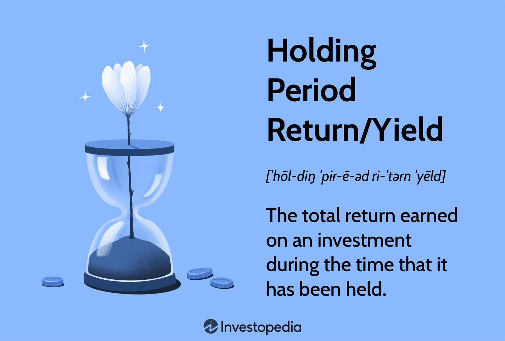

## Table of Contents

## What is the holding period return (HPR)?

The holding period return (HPR) is a way to measure how much money you've made or lost on an investment over a certain period of time. It looks at the total return from the time you buy an investment until the time you sell it. To calculate HPR, you take the income you earned from the investment, like dividends or interest, and add it to any increase in the investment's value. Then, you divide that total by the original amount you paid for the investment.

For example, if you bought a stock for $100 and sold it later for $120, and you also received $5 in dividends during that time, your HPR would be calculated as follows: HPR = (120 - 100 + 5) / 100 = 25%. This means your investment grew by 25% over the time you held it. HPR is useful because it gives you a clear picture of your investment's performance, whether you held it for a day, a year, or longer.

## How do you calculate the holding period return?

To calculate the holding period return (HPR), you need to know three things: the income you got from the investment, the price you sold it for, and the price you bought it for. First, add the income you received, like dividends or interest, to the difference between the selling price and the buying price. Then, divide that total by the original amount you paid for the investment. The result is your HPR, which shows you the percentage gain or loss on your investment.

For example, let's say you bought a stock for $100 and sold it later for $120. During the time you owned the stock, you also received $5 in dividends. To find the HPR, you would add the $5 in dividends to the $20 gain from the stock price increase ($120 - $100), which gives you $25. Then, you divide $25 by the original $100 purchase price, which equals 0.25 or 25%. So, your holding period return is 25%, meaning your investment grew by 25% over the time you held it.

## What is the difference between holding period return and yield?

Holding period return (HPR) and yield are both ways to measure how well an investment is doing, but they look at different things. HPR tells you the total return on your investment from the time you buy it until you sell it. It includes any money you get from the investment, like dividends or interest, plus any increase in the investment's value. For example, if you buy a stock, hold it for a year, and then sell it, the HPR would show you the total percentage gain or loss over that year.

Yield, on the other hand, focuses only on the income part of your investment. It's usually shown as a percentage of the investment's current price. For example, if you own a bond that pays $50 in interest each year and the bond's current price is $1,000, the yield would be 5%. Yield doesn't take into account any changes in the investment's price, so it's a simpler measure that just looks at the income you're getting from the investment.

## Can you explain the concept of yield in the context of investments?

Yield in the context of investments is all about the money you get back from your investment over a certain time, usually a year. It's shown as a percentage of what the investment is worth now. So, if you have a bond that pays you $50 every year and the bond is worth $1,000, the yield would be 5%. Yield is really useful because it helps you see how much income you're getting from your investment without worrying about changes in its price.

For example, if you own stocks that pay dividends, the yield tells you how much those dividends are worth compared to the price of the stock. If a stock costs $100 and pays $4 in dividends each year, the yield is 4%. Yield is a simple way to compare different investments based on the income they give you, which can be important if you're looking for regular money from your investments.

## How does the holding period affect the calculation of return and yield?

The holding period is the length of time you keep an investment before selling it. This period can change how you figure out the return and yield. For the holding period return (HPR), the length of time you hold the investment doesn't change the way you calculate it, but it does affect the total return you see. If you hold an investment for a short time, like a few days, the HPR might be small because there's less time for the investment to grow or for you to get income from it. But if you hold it for a longer time, like a year, the HPR can be bigger because you have more time to earn income and see the investment's value go up.

For yield, the holding period can also make a difference, but in a different way. Yield is usually figured out based on the income you get from the investment over a year, no matter how long you hold it. If you hold an investment for less than a year, you might need to adjust the yield to see what it would be over a full year. For example, if you get a dividend after holding a stock for six months, you would double that dividend to find out what the yearly yield would be. So, while the holding period doesn't change the basic way you calculate yield, it can affect how you think about the yield over time.

## What are the common types of yield, and how are they calculated?

There are several types of yield that people use to understand how well their investments are doing. The most common one is the dividend yield, which shows how much money you get from dividends each year compared to the price of the stock. To calculate it, you take the yearly dividend and divide it by the stock's current price. For example, if a stock pays $2 in dividends every year and its price is $50, the dividend yield is 4%. Another type is the bond yield, which tells you how much interest you get from a bond each year compared to what you paid for it. To find the bond yield, you divide the yearly interest by the bond's price. If a bond pays $50 in interest each year and you bought it for $1,000, the yield is 5%.

Another important type of yield is the current yield, which is similar to bond yield but can be used for any investment that pays income. It's calculated by dividing the yearly income by the investment's current market price. If you have a stock that pays $3 in dividends each year and its current price is $60, the current yield is 5%. Lastly, there's the yield to maturity (YTM) for bonds, which is more complicated. It takes into account not just the yearly interest but also the bond's price, how long until it matures, and the amount you get back when it matures. It's a way to see the total return you can expect if you hold the bond until it matures. Calculating YTM often needs a special formula or a financial calculator, but it gives you a fuller picture of what you might earn from the bond over time.

## How do taxes impact the holding period return and yield?

Taxes can make a big difference in how much money you actually get to keep from your investments. When you figure out your holding period return (HPR), you usually don't think about taxes at first. But when you sell your investment, you might have to pay capital gains tax on the money you made. If you held the investment for a short time, you might pay a higher tax rate than if you held it for a longer time. This tax can make your actual return smaller than what you calculated before taxes. So, when you're thinking about how well your investment did, you need to remember that taxes can take a bite out of your profits.

Taxes also affect yield, especially if you're looking at the money you get from dividends or interest. When you get dividends from stocks or interest from bonds, you might have to pay taxes on that income. This means the yield you see on paper might not be the same as what you actually get to keep after paying taxes. For example, if a stock has a 4% dividend yield, but you have to pay 20% tax on those dividends, the after-tax yield would be lower. So, when you're comparing different investments based on their yield, it's important to think about how taxes might change the amount of money you actually get to keep.

## What role does inflation play in adjusting holding period return and yield?

Inflation is the rise in prices over time, which means your money can buy less in the future than it can now. When you look at your holding period return (HPR), you want to know how much your investment grew. But if inflation was high while you held your investment, the money you made might not be worth as much as you think. To get a better idea of your real return, you can adjust your HPR for inflation. You do this by taking your HPR and subtracting the inflation rate over the same time. This gives you the "real" HPR, which shows you how much your investment actually grew after accounting for the fact that prices went up.

Inflation also affects yield, which is the income you get from your investment each year. If you're looking at the yield from dividends or interest, you need to think about inflation too. The yield you see might look good, but if inflation is high, the money you're getting might not go as far as you need it to. To see the real value of your yield, you can adjust it for inflation. You take the yield and subtract the inflation rate to find the "real" yield. This helps you understand how much income your investment is really giving you, after prices have gone up.

## How can holding period return and yield be used to compare different investment options?

Holding period return (HPR) and yield are important tools that help you compare different investments. HPR shows you the total percentage gain or loss on your investment from the time you buy it until you sell it. It includes any income you get, like dividends or interest, plus any increase in the investment's value. When you compare the HPR of different investments, you can see which one grew the most over the time you held it. This helps you decide if one investment did better than another, even if you held them for different lengths of time.

Yield, on the other hand, focuses just on the income part of your investment, like dividends or interest, and shows it as a percentage of the investment's current price. This makes it easy to see how much money you're getting from your investment each year. When you compare the yield of different investments, you can tell which one gives you more income. This is especially useful if you're looking for investments that provide regular money, like dividends from stocks or interest from bonds. By looking at both HPR and yield, you can get a full picture of how well your investments are doing and make better choices about where to put your money.

## What are the limitations of using holding period return and yield for investment analysis?

Using holding period return (HPR) and yield to look at investments has some problems. HPR only tells you how much money you made or lost over the time you held the investment, but it doesn't say anything about how risky the investment was. Two investments might have the same HPR, but one could be much riskier than the other. Also, HPR doesn't take into account things like inflation or taxes, which can make your real return a lot smaller than what HPR shows. So, while HPR is good for seeing how much you made, it doesn't give you the whole story about the investment.

Yield is also limited because it only looks at the income part of your investment, like dividends or interest. It doesn't tell you anything about how the price of the investment might go up or down. This means you might think an investment is good because it has a high yield, but if the price of the investment goes down a lot, you could still lose money. Also, yield doesn't consider inflation or taxes, which can change how much money you actually get to keep. So, while yield is helpful for seeing how much income you're getting, it's not enough by itself to decide if an investment is a good choice.

## How do advanced investors use holding period return and yield in portfolio management?

Advanced investors use holding period return (HPR) and yield to help them manage their portfolios by looking at how well their investments are doing. They use HPR to see the total return on each investment over the time they held it. This helps them figure out which investments made them the most money and which ones didn't do so well. By comparing the HPR of different investments, they can decide if they should keep, sell, or buy more of certain investments. They also think about how long they held each investment because a high HPR over a short time might be different from a high HPR over a long time.

Yield is another tool advanced investors use to manage their portfolios. They look at the yield to see how much income they're getting from their investments each year. This is important if they want to live off the money their investments make. By comparing the yield of different investments, they can choose the ones that give them the most income. But they also know that yield doesn't tell the whole story. They think about things like inflation and taxes, which can make the real income they get smaller than what the yield shows. By using both HPR and yield, along with other measures, advanced investors can make smarter choices about their portfolios.

## Can you discuss the impact of reinvestment on holding period return and yield calculations?

Reinvestment can change the way you figure out your holding period return (HPR) and yield. When you reinvest the money you get from your investment, like dividends or interest, you're putting that money back into the investment. This can make your investment grow faster because you're earning returns on the reinvested money too. For HPR, if you reinvest your dividends or interest, you might see a higher return because you're adding to your investment over time. So, when you calculate HPR, you need to think about how much you reinvested and how that changed the value of your investment by the time you sold it.

For yield, reinvestment can also make a difference. Normally, yield just looks at the income you get from your investment each year. But if you reinvest that income, the yield you see might not be the same as the yield you would get if you took the money out. When you reinvest, you're not just getting the same income each year; you're also growing your investment. So, to figure out the real yield, you need to think about how reinvesting changes the total income you get over time. This can make the yield calculation a bit more complicated, but it gives you a better idea of how your investment is really doing.

## What is the importance of understanding investment yield?

Investment yield is a fundamental concept in finance that quantifies the earnings generated and realized on an investment over a specific period. It encompasses both income components such as dividends and interest payments, as well as capital gains realized when the value of an asset appreciates. This metric serves as a definitive indicator of the return on investment, offering a clear perspective on the performance of different financial assets.

Yield is typically expressed as a percentage of the initial investment or current market value. The formula for calculating the yield on an investment generally takes the form:

$$
\text{Yield} = \left( \frac{\text{Income} + \text{Capital Gains}}{\text{Investment Value}} \right) \times 100
$$

where 'Income' refers to periodic cash flows like dividends or interest, and 'Capital Gains' signifies the increase in the asset's market value.

The importance of investment yield lies in its ability to facilitate comparison across various investment opportunities. It provides investors with a straightforward way to assess the profitability of assets with differing characteristics and time horizons. For instance, bonds primarily generate returns through interest payments, while stocks might offer returns through both dividends and capital appreciation.

A thorough understanding of how to compute and interpret yield is crucial for making informed investment decisions. Investors must not only consider the yield itself but also the context in which it is realized. For example, a high yield might indicate a lucrative investment, but it may also signal higher risk or [volatility](/wiki/volatility-trading-strategies). Conversely, a lower yield could reflect stability and lower risk, depending on the asset class and market conditions. 

In practice, investors often compare nominal yields to real yields, which adjust for inflation, thereby offering a more accurate representation of purchasing power gained. The real yield is calculated using the formula:

$$
\text{Real Yield} = \frac{1 + \text{Nominal Yield}}{1 + \text{Inflation Rate}} - 1
$$

Additionally, yields can be calculated on a pre-tax or post-tax basis, depending on the investor's objectives and tax circumstances.

Implementing effective yield analysis empowers investors to gauge the relative value of investments, align their portfolios with financial goals, and adjust their strategies in response to evolving market dynamics. Understanding this metric is, therefore, an essential component in the toolkit of both novice and experienced investors.

## What is Holding Period Return: A Key Metric?

Holding period return (HPR) is a financial metric that measures the total return earned from holding an investment over a defined period. It encompasses all income streams from the investment, such as dividends, interest, and any changes in the investment's value, including capital gains or losses. As such, HPR provides a comprehensive view of an investment's performance, making it a valuable tool for investors seeking to evaluate and compare the profitability of various investment opportunities over differing time frames.

The formula for calculating the holding period return is:

$$
\text{HPR} = \frac{(P_{\text{end}} + D - P_{\text{begin}})}{P_{\text{begin}}}
$$

where:
- $P_{\text{end}}$ is the ending price of the investment,
- $P_{\text{begin}}$ is the beginning price of the investment,
- $D$ is the total income received during the holding period (e.g., dividends, interest).

This metric is instrumental in analyzing the profitability of an investment over different time horizons. By calculating the HPR for different periods, investors can assess not only the absolute gains but also the investment's efficiency relative to the time it was held. This can prove especially beneficial when comparing investments of varying durations, providing a normalized metric to facilitate decision-making.

The significance of HPR lies in its ability to reflect the true performance of an investment by capturing all forms of returns realized during the investment period. This can aid investors in making informed decisions regarding portfolio adjustments or evaluating the effectiveness of past investment strategies. Moreover, when paired with other financial metrics, HPR can help decode broader market trends and investment risks. 

In summary, understanding and utilizing holding period return grants investors a critical advantage in maximizing their investment potential and optimizing their strategies for better financial outcomes.

## How can one leverage HPR and financial analysis in algorithmic trading?

Algorithmic trading is a method of executing trades in financial markets using computer programs and algorithms. This approach enables investors and traders to process and execute trades based on predetermined criteria, significantly enhancing the speed and efficiency of market operations. By integrating holding period return (HPR) and financial analysis, [algorithmic trading](/wiki/algorithmic-trading) systems can optimize performance, ensuring better alignment with investment goals and market conditions.

One of the primary advantages of algorithmic trading is its ability to capitalize on small price fluctuations within the market through rapid decision-making and execution. Algorithms can analyze vast amounts of data and execute trades at speeds unattainable by human traders, allowing them to benefit from short-lived opportunities that might otherwise go unnoticed. This is particularly useful in high-frequency trading environments, where the speed of execution is crucial.

Algorithmic trading strategies are typically developed by first defining a set of rules or criteria for trade execution. These rules can be based on a variety of factors, including price, timing, [volume](/wiki/volume-trading-strategy), and other technical indicators derived from financial analysis. By leveraging financial analysis techniques, traders can identify trends, patterns, and anomalies that may suggest profitable trading opportunities.

The role of holding period return in algorithmic trading is significant, as it provides a metric for evaluating the profitability of potential trades. By calculating the HPR for different trading scenarios, algorithmic models can be fine-tuned to emphasize strategies that maximize returns over specified periods. Mathematically, HPR for a given investment is calculated as:

$$
HPR = \frac{\text{Ending Value} - \text{Beginning Value} + \text{Income}}{\text{Beginning Value}}
$$

Where:
- Ending Value is the final value of the investment
- Beginning Value is the initial value of the investment
- Income includes any dividends or interest earned during the holding period

Incorporating historical HPR data into algorithmic models allows for more accurate predictions of future performance, improving the reliability and efficiency of the trading strategy.

Real-world applications of algorithmic trading demonstrate its versatility and effectiveness. For example, quantitative funds utilize complex algorithms to assess and execute trades across multiple asset classes, achieving efficient portfolio management and risk mitigation. Retail traders also benefit from algorithmic systems by automating their trading strategies on platforms like MetaTrader or NinjaTrader, enhancing their ability to act on insights derived from technical analysis.

The benefits of algorithmic trading include reduced emotional interference in trading decisions, improved order entry speed, and the ability to backtest strategies using historical data. As computational power and data availability continue to grow, algorithmic trading will likely become even more sophisticated, further integrating advanced financial analytics and [artificial intelligence](/wiki/ai-artificial-intelligence) techniques to refine strategies.

In summary, algorithmic trading effectively leverages holding period return and financial analysis to create robust trading strategies that optimize performance in financial markets. Its capacity for rapid execution and data-driven decision-making provides traders with a powerful tool to navigate complex market dynamics, promising considerable advantages in both speed and accuracy.

## What are some case studies and examples?

In the exploration of investment yield analysis, holding period return, and algorithmic trading, examining real-world case studies provides invaluable insights. These examples highlight how these financial concepts apply across diverse market conditions and strategies, helping investors understand the practical integration into their trading decisions.

### Case Study 1: Investment Yield in a Volatile Market

Consider an investor who purchased shares in a technology company at the beginning of a fiscal year, with the stock price initially at $50 per share. By the year's end, the stock price rose to $70, and the investor received a dividend of $2 per share. To calculate the investment yield, the formula used is:

$$
\text{Investment Yield} = \left(\frac{\text{Capital Gains} + \text{Income}}{\text{Initial Investment}}\right) \times 100
$$

Given that the capital gain is $20 ($70 - $50) and the income from dividends is $2, the investment yield calculation would be:

$$
\text{Investment Yield} = \left(\frac{20 + 2}{50}\right) \times 100 = 44\%
$$

This substantial yield emphasizes the potential profitability even in a market characterized by volatility, demonstrating how investment yields can provide clarity on returns relative to initial investments.

### Case Study 2: Holding Period Return across Different Timeframes

An investor buys a rental property for $200,000, which they hold for five years. Throughout the holding period, the property generates an annual rental income of $10,000 and appreciates to a sale price of $250,000 at the end of year five. The holding period return (HPR) is calculated as:

$$
\text{HPR} = \left(\frac{\text{Total Income} + \text{Increase in Value} - \text{Initial Investment}}{\text{Initial Investment}}\right) \times 100
$$

Here, the total income over five years is $50,000, and the increase in property value is $50,000 ($250,000 - $200,000). The HPR calculation is:

$$
\text{HPR} = \left(\frac{50,000 + 50,000}{200,000}\right) \times 100 = 50\%
$$

This example illustrates the impact of holding period length on investment evaluation, showing how consistent income and capital appreciation contribute to substantial returns.

### Case Study 3: Algorithmic Trading for Speed and Precision

An asset management firm employs an algorithmic trading strategy to capitalize on short-term price discrepancies in the foreign exchange market. Using a Python-based algorithm, the firm sets conditions for trade execution when currency price deviations exceed a specific threshold. Below is a simplified Python structure used for such a strategy:

```python
import numpy as np

def execute_trade(price_data, threshold=0.5):
    trades = []
    for i in range(1, len(price_data)):
        price_change = (price_data[i] - price_data[i-1]) / price_data[i-1]
        if np.abs(price_change) > threshold:
            trades.append((i, 'buy' if price_change < 0 else 'sell'))
    return trades

price_data = [1.1000, 1.1020, 1.0950, 1.1070, 1.1005]  # Example prices
trades = execute_trade(price_data)
print(f"Trades executed: {trades}")
```

In this case, trades are executed based on precise computations of price changes, enabling the firm to optimize its strategies by swiftly adjusting positions to leverage minute price movements.

### Conclusion of the Case Studies

These case studies accentuate the importance of understanding and applying investment yield analysis, holding period return, and algorithmic trading. Whether navigating market volatility, assessing returns over different durations, or implementing high-frequency trading strategies, these concepts are integral to making informed and strategically sound investment decisions. By examining these real-life scenarios, investors can enhance their ability to translate theoretical knowledge into practical application, realizing the benefits tailored to their investment objectives and risk appetite.

## References & Further Reading

[1]: Bergstra, J., Bardenet, R., Bengio, Y., & Kégl, B. (2011). ["Algorithms for Hyper-Parameter Optimization."](https://papers.nips.cc/paper/4443-algorithms-for-hyper-parameter-optimization) Advances in Neural Information Processing Systems 24.

[2]: ["Advances in Financial Machine Learning"](https://www.amazon.com/Advances-Financial-Machine-Learning-Marcos/dp/1119482089) by Marcos Lopez de Prado

[3]: ["Evidence-Based Technical Analysis: Applying the Scientific Method and Statistical Inference to Trading Signals"](https://www.amazon.com/Evidence-Based-Technical-Analysis-Scientific-Statistical/dp/0470008741) by David Aronson

[4]: ["Machine Learning for Algorithmic Trading"](https://github.com/stefan-jansen/machine-learning-for-trading) by Stefan Jansen

[5]: ["Quantitative Trading: How to Build Your Own Algorithmic Trading Business"](https://www.amazon.com/Quantitative-Trading-Build-Algorithmic-Business/dp/1119800064) by Ernest P. Chan