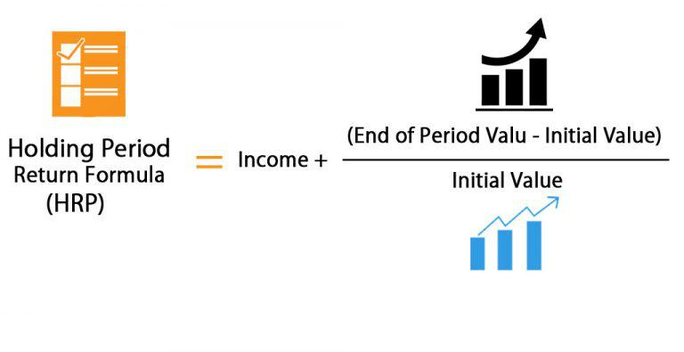

In the ever-evolving world of financial markets, understanding key concepts such as investment yield, holding period return, financial analysis, and algorithmic trading is essential. These components form the groundwork for making informed investment decisions and crafting profitable strategies in an increasingly complex market landscape. This article seeks to explore these pivotal elements in depth, highlighting their interconnections and practical applications for both novice and seasoned investors.

Investment yield serves as a fundamental indicator of an investment’s performance, capturing the earnings generated over a specific period. It includes returns from dividends, interest, and capital gains. Understanding how investment yield is calculated and interpreted is critical, as it allows investors to compare various investment opportunities effectively, aiding in the selection of options that align with their financial goals.



A key measure of investment success is the holding period return (HPR), which encompasses the total return earned from holding an investment over a designated timeframe. This metric provides valuable insights into the profitability of investments, accommodating comparison across different durations. Calculating HPR and discerning its significance are pivotal steps in evaluating investment outcomes.

The role of financial analysis techniques in evaluating investment returns cannot be underestimated. These methods facilitate a thorough examination of financial statements, market trends, and future performance predictions. By employing tools such as ratio analysis, trend analysis, and cash flow analysis, investors can gain deeper insights into the potential profitability of their investments, enhancing decision-making processes.

Algorithmic trading represents a modern approach to trading that utilizes pre-programmed instructions to execute trades at high speeds and volumes. Leveraging insights from HPR and financial analysis, algorithmic trading optimizes trading performance by capitalizing on minute market fluctuations. The development and fine-tuning of these strategies are crucial for achieving better returns, showcasing the symbiotic relationship between human analysis and technological execution.

By the conclusion of this article, readers will have acquired a comprehensive understanding of how investment yield, holding period return, financial analysis, and algorithmic trading are integral to modern investment strategies. These components not only facilitate greater investment efficacy but also exemplify the transformative impact of technology and data analytics on finance industry practices.

## Table of Contents

## Understanding Investment Yield and Its Importance

Investment yield is a fundamental concept in finance that quantifies the earnings generated and realized on an investment over a specific period. It encompasses both income components such as dividends and interest payments, as well as capital gains realized when the value of an asset appreciates. This metric serves as a definitive indicator of the return on investment, offering a clear perspective on the performance of different financial assets.

Yield is typically expressed as a percentage of the initial investment or current market value. The formula for calculating the yield on an investment generally takes the form:

$$
\text{Yield} = \left( \frac{\text{Income} + \text{Capital Gains}}{\text{Investment Value}} \right) \times 100
$$

where 'Income' refers to periodic cash flows like dividends or interest, and 'Capital Gains' signifies the increase in the asset's market value.

The importance of investment yield lies in its ability to facilitate comparison across various investment opportunities. It provides investors with a straightforward way to assess the profitability of assets with differing characteristics and time horizons. For instance, bonds primarily generate returns through interest payments, while stocks might offer returns through both dividends and capital appreciation.

A thorough understanding of how to compute and interpret yield is crucial for making informed investment decisions. Investors must not only consider the yield itself but also the context in which it is realized. For example, a high yield might indicate a lucrative investment, but it may also signal higher risk or [volatility](/wiki/volatility-trading-strategies). Conversely, a lower yield could reflect stability and lower risk, depending on the asset class and market conditions. 

In practice, investors often compare nominal yields to real yields, which adjust for inflation, thereby offering a more accurate representation of purchasing power gained. The real yield is calculated using the formula:

$$
\text{Real Yield} = \frac{1 + \text{Nominal Yield}}{1 + \text{Inflation Rate}} - 1
$$

Additionally, yields can be calculated on a pre-tax or post-tax basis, depending on the investor's objectives and tax circumstances.

Implementing effective yield analysis empowers investors to gauge the relative value of investments, align their portfolios with financial goals, and adjust their strategies in response to evolving market dynamics. Understanding this metric is, therefore, an essential component in the toolkit of both novice and experienced investors.

## Holding Period Return: A Key Metric

Holding period return (HPR) is a financial metric that measures the total return earned from holding an investment over a defined period. It encompasses all income streams from the investment, such as dividends, interest, and any changes in the investment's value, including capital gains or losses. As such, HPR provides a comprehensive view of an investment's performance, making it a valuable tool for investors seeking to evaluate and compare the profitability of various investment opportunities over differing time frames.

The formula for calculating the holding period return is:

$$
\text{HPR} = \frac{(P_{\text{end}} + D - P_{\text{begin}})}{P_{\text{begin}}}
$$

where:
- $P_{\text{end}}$ is the ending price of the investment,
- $P_{\text{begin}}$ is the beginning price of the investment,
- $D$ is the total income received during the holding period (e.g., dividends, interest).

This metric is instrumental in analyzing the profitability of an investment over different time horizons. By calculating the HPR for different periods, investors can assess not only the absolute gains but also the investment's efficiency relative to the time it was held. This can prove especially beneficial when comparing investments of varying durations, providing a normalized metric to facilitate decision-making.

The significance of HPR lies in its ability to reflect the true performance of an investment by capturing all forms of returns realized during the investment period. This can aid investors in making informed decisions regarding portfolio adjustments or evaluating the effectiveness of past investment strategies. Moreover, when paired with other financial metrics, HPR can help decode broader market trends and investment risks. 

In summary, understanding and utilizing holding period return grants investors a critical advantage in maximizing their investment potential and optimizing their strategies for better financial outcomes.

## Financial Analysis Techniques Utilized in Evaluating HPR

Financial analysis techniques are instrumental in evaluating the holding period return (HPR) by offering a structured approach to analyzing financial statements, assessing market trends, and forecasting future performance. These techniques help investors understand an investment's viability and potential profitability by providing clarity in comparing different investments. Key methods include ratio analysis, trend analysis, and cash flow analysis, each contributing uniquely to assessing HPR.

Ratio analysis involves calculating various financial ratios from the data provided in financial statements. This method helps investors evaluate a company's operational efficiency, [liquidity](/wiki/liquidity-risk-premium), profitability, and solvency. For instance, profitability ratios like the return on equity (ROE) or return on assets (ROA) are critical in understanding how well a company generates profits relative to its equity or assets, directly influencing the investment's yield and, consequently, its HPR. Other important ratios include the current ratio and quick ratio, which assess a company's liquidity position, and the debt-to-equity ratio, which evaluates financial leverage.

Trend analysis examines historical financial data to identify patterns or trends over time. By analyzing trends, investors can predict future financial performance based on past behavior. This method is particularly valuable for assessing HPR as it helps investors understand how their investment might perform under similar future market conditions. For example, if a stock has demonstrated consistent growth in earnings and stock value, an investor might expect that this trend will continue, positively impacting the HPR.

Cash flow analysis is another critical aspect utilized in evaluating HPR. It focuses on assessing the inflow and outflow of cash within a business. By understanding cash flows, investors can gauge the financial health and stability of an investment. For instance, positive free cash flow indicates that a company generates more cash than it consumes, suggesting strong potential for future earnings distribution in the form of dividends or reinvestment opportunities, both of which enhance HPR.

These financial analysis techniques provide essential tools for evaluating an investment's overall performance and profitability, ultimately aiding investors in making informed decisions. By interpreting financial statements ingeniously through ratio analysis, recognizing trends that can forecast future performance, and examining cash flow patterns, investors are better prepared to assess the potential HPR of various investment opportunities. Moreover, integrating such analyses into the decision-making process enhances accuracy and confidence in investment choices.

## Algorithmic Trading: Leveraging HPR and Financial Analysis

Algorithmic trading is a method of executing trades in financial markets using computer programs and algorithms. This approach enables investors and traders to process and execute trades based on predetermined criteria, significantly enhancing the speed and efficiency of market operations. By integrating holding period return (HPR) and financial analysis, [algorithmic trading](/wiki/algorithmic-trading) systems can optimize performance, ensuring better alignment with investment goals and market conditions.

One of the primary advantages of algorithmic trading is its ability to capitalize on small price fluctuations within the market through rapid decision-making and execution. Algorithms can analyze vast amounts of data and execute trades at speeds unattainable by human traders, allowing them to benefit from short-lived opportunities that might otherwise go unnoticed. This is particularly useful in high-frequency trading environments, where the speed of execution is crucial.

Algorithmic trading strategies are typically developed by first defining a set of rules or criteria for trade execution. These rules can be based on a variety of factors, including price, timing, [volume](/wiki/volume-trading-strategy), and other technical indicators derived from financial analysis. By leveraging financial analysis techniques, traders can identify trends, patterns, and anomalies that may suggest profitable trading opportunities.

The role of holding period return in algorithmic trading is significant, as it provides a metric for evaluating the profitability of potential trades. By calculating the HPR for different trading scenarios, algorithmic models can be fine-tuned to emphasize strategies that maximize returns over specified periods. Mathematically, HPR for a given investment is calculated as:

$$
HPR = \frac{\text{Ending Value} - \text{Beginning Value} + \text{Income}}{\text{Beginning Value}}
$$

Where:
- Ending Value is the final value of the investment
- Beginning Value is the initial value of the investment
- Income includes any dividends or interest earned during the holding period

Incorporating historical HPR data into algorithmic models allows for more accurate predictions of future performance, improving the reliability and efficiency of the trading strategy.

Real-world applications of algorithmic trading demonstrate its versatility and effectiveness. For example, quantitative funds utilize complex algorithms to assess and execute trades across multiple asset classes, achieving efficient portfolio management and risk mitigation. Retail traders also benefit from algorithmic systems by automating their trading strategies on platforms like MetaTrader or NinjaTrader, enhancing their ability to act on insights derived from technical analysis.

The benefits of algorithmic trading include reduced emotional interference in trading decisions, improved order entry speed, and the ability to backtest strategies using historical data. As computational power and data availability continue to grow, algorithmic trading will likely become even more sophisticated, further integrating advanced financial analytics and [artificial intelligence](/wiki/ai-artificial-intelligence) techniques to refine strategies.

In summary, algorithmic trading effectively leverages holding period return and financial analysis to create robust trading strategies that optimize performance in financial markets. Its capacity for rapid execution and data-driven decision-making provides traders with a powerful tool to navigate complex market dynamics, promising considerable advantages in both speed and accuracy.

## Case Studies and Examples

In the exploration of investment yield analysis, holding period return, and algorithmic trading, examining real-world case studies provides invaluable insights. These examples highlight how these financial concepts apply across diverse market conditions and strategies, helping investors understand the practical integration into their trading decisions.

### Case Study 1: Investment Yield in a Volatile Market

Consider an investor who purchased shares in a technology company at the beginning of a fiscal year, with the stock price initially at $50 per share. By the year's end, the stock price rose to $70, and the investor received a dividend of $2 per share. To calculate the investment yield, the formula used is:

$$
\text{Investment Yield} = \left(\frac{\text{Capital Gains} + \text{Income}}{\text{Initial Investment}}\right) \times 100
$$

Given that the capital gain is $20 ($70 - $50) and the income from dividends is $2, the investment yield calculation would be:

$$
\text{Investment Yield} = \left(\frac{20 + 2}{50}\right) \times 100 = 44\%
$$

This substantial yield emphasizes the potential profitability even in a market characterized by volatility, demonstrating how investment yields can provide clarity on returns relative to initial investments.

### Case Study 2: Holding Period Return across Different Timeframes

An investor buys a rental property for $200,000, which they hold for five years. Throughout the holding period, the property generates an annual rental income of $10,000 and appreciates to a sale price of $250,000 at the end of year five. The holding period return (HPR) is calculated as:

$$
\text{HPR} = \left(\frac{\text{Total Income} + \text{Increase in Value} - \text{Initial Investment}}{\text{Initial Investment}}\right) \times 100
$$

Here, the total income over five years is $50,000, and the increase in property value is $50,000 ($250,000 - $200,000). The HPR calculation is:

$$
\text{HPR} = \left(\frac{50,000 + 50,000}{200,000}\right) \times 100 = 50\%
$$

This example illustrates the impact of holding period length on investment evaluation, showing how consistent income and capital appreciation contribute to substantial returns.

### Case Study 3: Algorithmic Trading for Speed and Precision

An asset management firm employs an algorithmic trading strategy to capitalize on short-term price discrepancies in the foreign exchange market. Using a Python-based algorithm, the firm sets conditions for trade execution when currency price deviations exceed a specific threshold. Below is a simplified Python structure used for such a strategy:

```python
import numpy as np

def execute_trade(price_data, threshold=0.5):
    trades = []
    for i in range(1, len(price_data)):
        price_change = (price_data[i] - price_data[i-1]) / price_data[i-1]
        if np.abs(price_change) > threshold:
            trades.append((i, 'buy' if price_change < 0 else 'sell'))
    return trades

price_data = [1.1000, 1.1020, 1.0950, 1.1070, 1.1005]  # Example prices
trades = execute_trade(price_data)
print(f"Trades executed: {trades}")
```

In this case, trades are executed based on precise computations of price changes, enabling the firm to optimize its strategies by swiftly adjusting positions to leverage minute price movements.

### Conclusion of the Case Studies

These case studies accentuate the importance of understanding and applying investment yield analysis, holding period return, and algorithmic trading. Whether navigating market volatility, assessing returns over different durations, or implementing high-frequency trading strategies, these concepts are integral to making informed and strategically sound investment decisions. By examining these real-life scenarios, investors can enhance their ability to translate theoretical knowledge into practical application, realizing the benefits tailored to their investment objectives and risk appetite.

## Conclusion

Investment yield and holding period return (HPR) are crucial metrics for assessing the performance of investments. Investment yield provides insights into the earnings generated from an investment, encompassing dividends, interest, and any capital gains. Meanwhile, HPR offers a comprehensive measure by considering both income streams and changes in asset value over a given period. These metrics enable investors to compare financial products and measure investment success effectively.

Financial analysis tools play a vital role in interpreting investment yield and HPR, enabling investors to make sense of these metrics in the broader context of financial health and market trends. Techniques such as ratio analysis, trend analysis, and cash flow analysis equip investors with the capability to evaluate the potential profitability of investments, thus supporting more strategic decision-making. These tools assist in unpacking complex financial statements and predicting future performance, making the metrics actionable.

Algorithmic trading represents a sophisticated application of these financial insights. By employing computer programs to execute trades based on predefined criteria, it leverages the precise data encapsulated by investment yield and HPR to optimize trading decisions. This approach allows for rapid response to market changes, enhancing the potential for profit through timely order execution. Algorithms can analyze vast datasets and identify subtle market inefficiencies, thus optimizing trading strategies for better returns.

The integration of investment yield, HPR, and financial analysis into algorithmic trading strategies exemplifies the intersection of finance and technology. As technology advances, these concepts are being utilized more effectively, opening the door to greater accuracy in predicting and capitalizing on market movements. Investors who harness these powerful tools can enhance their trading performance and financial outcomes, moving towards more informed and profitable investment strategies. Advancements in data analytics and [machine learning](/wiki/machine-learning) continue to reshape how financial markets are navigated, promising a future filled with new opportunities and nuanced strategies for market participants.

## References & Further Reading

[1]: Bergstra, J., Bardenet, R., Bengio, Y., & Kégl, B. (2011). ["Algorithms for Hyper-Parameter Optimization."](https://papers.nips.cc/paper/4443-algorithms-for-hyper-parameter-optimization) Advances in Neural Information Processing Systems 24.

[2]: ["Advances in Financial Machine Learning"](https://www.amazon.com/Advances-Financial-Machine-Learning-Marcos/dp/1119482089) by Marcos Lopez de Prado

[3]: ["Evidence-Based Technical Analysis: Applying the Scientific Method and Statistical Inference to Trading Signals"](https://www.amazon.com/Evidence-Based-Technical-Analysis-Scientific-Statistical/dp/0470008741) by David Aronson

[4]: ["Machine Learning for Algorithmic Trading"](https://github.com/stefan-jansen/machine-learning-for-trading) by Stefan Jansen

[5]: ["Quantitative Trading: How to Build Your Own Algorithmic Trading Business"](https://www.amazon.com/Quantitative-Trading-Build-Algorithmic-Business/dp/1119800064) by Ernest P. Chan