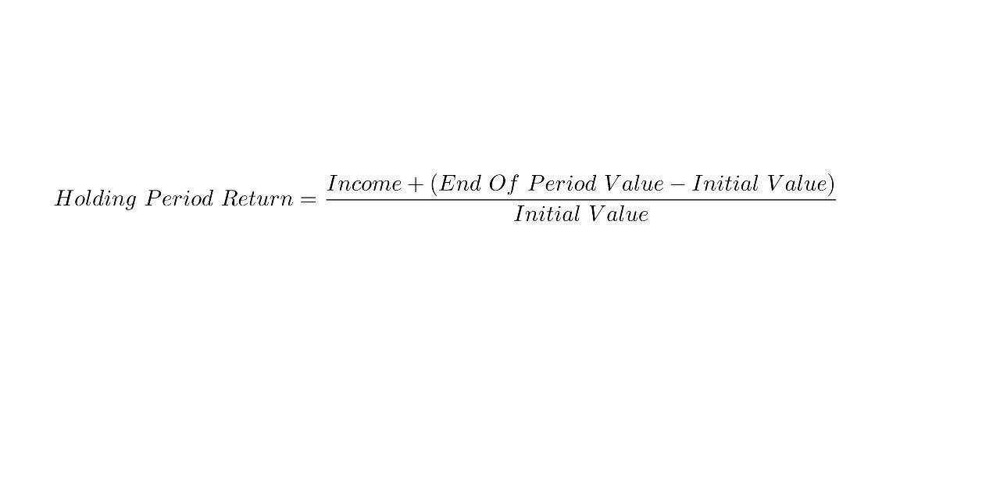

## Table of Contents

## What is a holding period in investing?

A holding period in investing is the length of time an investor holds onto an investment before selling it. It's like how long you keep a toy before deciding to trade it for another one. This period can be short, like a few days or weeks, or it can be long, like several years or even decades. The holding period is important because it can affect how much money you make or lose from your investment.

The length of the holding period can also change how your investment is taxed. In many places, if you hold an investment for a longer time, you might pay less in taxes when you sell it. For example, in the United States, if you hold a stock for more than a year, you might pay a lower tax rate on any profit you make. This is why some investors choose to hold onto their investments for a longer time, hoping to save on taxes and possibly see their investment grow more over time.

## Why are holding periods important for investors?

Holding periods are important for investors because they help decide how much money they might make or lose. If an investor keeps an investment for a short time, they might make a quick profit or lose money fast. But if they hold it for a longer time, the investment might grow more, and they could make more money in the end. This is like planting a seed; the longer you wait, the bigger the plant might grow.

Also, holding periods can change how much tax an investor has to pay. In many countries, if you hold an investment for a longer time, you might pay less tax when you sell it. For example, in the United States, if you keep a stock for more than a year, you might pay a lower tax on any money you make from selling it. So, some investors choose to hold onto their investments longer to save on taxes and hopefully see their investment grow more over time.

## How do holding periods affect tax implications?

Holding periods can change how much tax you pay on your investments. If you hold an investment for a short time, you might have to pay more in taxes when you sell it. This is called short-term capital gains tax, and it's usually higher. For example, in the United States, if you sell a stock you've owned for less than a year, you'll pay your regular income tax rate on any profit you make.

On the other hand, if you hold an investment for a longer time, you might pay less in taxes. This is called long-term capital gains tax, and it's usually lower than the short-term rate. In the United States, if you sell a stock you've owned for more than a year, you'll pay a lower tax rate on your profit. This is why many investors choose to hold onto their investments for at least a year, to save on taxes and possibly see their investment grow more over time.

## What is the difference between short-term and long-term holding periods?

The difference between short-term and long-term holding periods is how long you keep an investment before selling it. A short-term holding period is when you hold an investment for a short time, like a few days, weeks, or less than a year. This is like buying a toy and then quickly trading it for another one. Investors who do this are often trying to make a quick profit, but it can also mean they might lose money fast if the investment doesn't do well.

A long-term holding period is when you keep an investment for a longer time, like more than a year, or even several years or decades. It's like planting a seed and waiting for it to grow into a big plant. Investors who hold onto their investments for a long time are usually hoping to see their investment grow more over time. They might also pay less in taxes when they sell it, because long-term capital gains tax rates are usually lower than short-term rates.

## How can holding periods impact investment strategies?

Holding periods can shape how investors plan their strategies. If someone likes to buy and sell quickly, they might focus on short-term holding periods. This means they'll look for investments that can make money fast, like trading stocks or buying and selling things that change in price a lot. These investors need to watch the market closely and be ready to make quick decisions. But this can be risky because prices can go up and down a lot in a short time.

On the other hand, if an investor prefers to hold onto investments for a long time, they might choose long-term holding periods. They'll look for things that might grow slowly but steadily over time, like stocks in big, stable companies or real estate. These investors don't need to watch the market every day. They can wait patiently for their investments to grow. Plus, they might pay less in taxes when they sell because long-term capital gains tax rates are usually lower. This strategy can be less stressful but still needs careful planning to pick the right investments.

## What are common holding periods for different types of investments?

Different types of investments often have different common holding periods. For stocks, short-term traders might hold them for just a few days or weeks, trying to make quick profits from small price changes. Day traders might even buy and sell stocks within the same day. On the other hand, long-term investors might hold stocks for many years or even decades, believing that the companies will grow over time and increase the value of their shares.

For bonds, the holding period can depend on the type of bond. Short-term bonds, like Treasury bills, might be held for a few months to a year. Long-term bonds, like 30-year Treasury bonds, are usually held until they mature, which can be many years. Real estate investments often have long holding periods too, with investors holding properties for several years to benefit from rental income and property value increases. Each type of investment has its own typical holding period, and investors choose based on their goals and how long they're willing to wait for returns.

## How do holding periods influence investment risk and return?

Holding periods can change how risky an investment is and how much money you might make. If you hold an investment for a short time, it can be more risky because prices can go up and down a lot in a short time. But if you're lucky, you might make a quick profit. This is like trying to catch a fast-moving ball; it's hard but if you do it right, you can win big. Short-term investments need a lot of watching and quick decisions, so they can be stressful.

On the other hand, if you hold an investment for a long time, it can be less risky because you have more time for the investment to grow. It's like planting a seed and waiting for it to grow into a big plant. Long-term investments might not make you money fast, but they can grow slowly and steadily. Plus, you might pay less in taxes when you sell because long-term capital gains tax rates are usually lower. So, the length of time you hold an investment can really affect how much risk you take and how much money you might make.

## Can holding periods be used to measure investor behavior?

Yes, holding periods can be used to measure investor behavior because they show how long people are willing to keep their investments. If someone keeps their investments for a short time, it might mean they like to take risks and try to make quick money. They might be watching the market a lot and making fast decisions. This kind of investor might be more active and ready to change their investments often.

On the other hand, if someone holds their investments for a long time, it might mean they are more patient and looking for steady growth. They might not check the market every day and are okay with waiting for their investments to grow slowly over time. This can tell us that the investor is more focused on long-term goals and less worried about short-term changes in the market.

## What are the psychological factors affecting holding period decisions?

People's feelings can really affect how long they keep their investments. If someone is scared of losing money, they might sell their investment quickly, even if it's not the best time. This fear can make them hold onto their investments for a short time. On the other hand, if someone feels confident and patient, they might keep their investment for a long time, hoping it will grow more. They might not worry about small changes in the market and focus on their long-term goals.

Another feeling that can change how long someone holds an investment is the fear of missing out. If people see others making quick money, they might want to do the same and sell their investments too soon. This can lead to short holding periods. Also, if someone really believes in a company or an idea, they might hold onto their investment for a long time, even if the market goes up and down. This belief can help them stay calm and keep their investment for many years.

## How do market conditions influence optimal holding periods?

Market conditions can change how long it's best to hold onto an investment. When the market is going up and everything seems to be doing well, people might feel good about holding their investments for a short time. They might think they can make quick money by buying and selling fast. But if the market starts to go down or becomes unsure, people might want to hold their investments longer. They might think it's safer to wait and see if things get better before selling.

On the other hand, if the market is really up and down a lot, people might choose to hold their investments for a longer time. They might not want to sell when prices are low and hope to wait until things get better. But if the market is calm and steady, people might feel okay about holding their investments for a shorter time. They might think it's easier to predict what will happen next and make quick decisions. So, the way the market is doing can really change how long people think is best to keep their investments.

## What advanced techniques can be used to optimize holding periods?

To make the best choice about how long to keep an investment, some people use special methods. One way is to use something called technical analysis. This means looking at charts and numbers to see how an investment has been doing in the past. By studying these patterns, people can try to guess when might be a good time to sell. Another way is to use something called algorithmic trading. This is when computers use math to decide when to buy and sell investments. These computers can look at a lot of information very quickly and make choices based on what they find.

Another method is called dollar-cost averaging. This means putting money into an investment little by little over time, instead of all at once. This can help because it spreads out the risk. If the price goes down, you can buy more with the same amount of money. If the price goes up, you still have some money left to buy more later. This way, you don't have to worry so much about picking the perfect time to buy or sell. By using these special methods, people can try to make smarter choices about how long to hold onto their investments.

## How do regulatory changes impact holding period strategies?

When the rules about investing change, it can affect how long people decide to keep their investments. If the government makes new laws about taxes, it might make people want to hold onto their investments for a longer or shorter time. For example, if the tax on selling investments after a year goes down, more people might choose to keep their investments for at least a year to pay less tax. But if the tax on selling investments quickly goes up, people might hold onto their investments for a shorter time to avoid paying more tax.

Also, if the rules about what you can and can't do with your investments change, it can make people change their plans. If new rules make it harder to buy and sell investments quickly, people might decide to hold onto their investments for a longer time. On the other hand, if new rules make it easier to trade, more people might start buying and selling their investments more often. So, when the rules change, people have to think about how it will affect their money and adjust their plans accordingly.

## What are Holding Periods and How Do We Understand Them?

A 'holding period' represents the time span during which a trade remains active in the financial markets before it is closed. In [algorithmic trading](/wiki/algorithmic-trading), holding periods vary greatly, contingent upon the strategy deployed. Ultra-short-term trades, characteristic of high-frequency trading ([HFT](/wiki/high-frequency-trading-strategies)), may have holding periods in the microsecond range. This requires sophisticated systems capable of executing transactions in less time than the blink of an eye. Conversely, strategies that aim to capture longer-term trends may hold positions for days or even weeks, focusing on broader market movements rather than minute-to-minute fluctuations.

The determination of optimal holding periods is essential for minimizing risks and maximizing returns. Holding periods must align with the trader's objectives and the characteristics of the strategy employed. Short holding periods generally rely on recognizing and exploiting micro-level price movements, while longer holding periods often target macroeconomic trends or sectoral shifts.

To identify the ideal holding period, quantitative analysts and traders often employ statistical and mathematical models. These models can include [backtesting](/wiki/backtesting) historical data to determine which holding period historically yields the best outcomes in terms of returns and risk-adjusted performance. For example, the Sharpe ratio, which measures the risk-adjusted return, can be an indicator to analyze the impact of different holding periods:

$$
\text{Sharpe Ratio} = \frac{E[R_p - R_f]}{\sigma_p}
$$

where $E[R_p]$ is the expected return of the portfolio, $R_f$ is the risk-free rate, and $\sigma_p$ is the standard deviation of the portfolio's excess return.

Determining these periods often involves balancing act, because short holding periods can yield high transaction costs, while long holding periods might expose trades to greater market risk and [volatility](/wiki/volatility-trading-strategies).

Implementing optimal holding periods also requires careful consideration of transaction costs, including both explicit costs, such as commissions and taxes, and implicit costs, like market impact. Advanced algorithmic trading systems use complex algorithms to optimize trade execution by minimizing slippage and maximizing fill rates, ensuring that the holding period positively contributes to the overall success of the trading strategy.

Ultimately, the selection of holding periods should be a dynamic process, constantly adapted to market conditions, regulatory changes, and technological advancements to consistently achieve trading objectives.

## References & Further Reading

[1]: Chan, E. P. (2009). ["Algorithmic Trading: Winning Strategies and Their Rationale."](https://github.com/ftvision/quant_trading_echan_book) Wiley.

[2]: Van Vliet, B. (2007). ["Building Automated Trading Systems: With an Introduction to Visual C++."](https://books.google.com/books/about/Building_Automated_Trading_Systems.html?id=zQLpvF_xRw0C) Academic Press.

[3]: Aldridge, I. (2013). ["High-Frequency Trading: A Practical Guide to Algorithmic Strategies and Trading Systems."](https://www.amazon.com/High-Frequency-Trading-Practical-Algorithmic-Strategies/dp/1118343506) Wiley.

[4]: Lopez de Prado, M. (2018). ["Advances in Financial Machine Learning."](https://www.amazon.com/Advances-Financial-Machine-Learning-Marcos/dp/1119482089) Wiley.

[5]: Jansen, S. (2018). ["Machine Learning for Algorithmic Trading: Predictive models to extract signals from market and alternative data for systematic trading strategies with Python."](https://www.amazon.com/Machine-Learning-Algorithmic-Trading-alternative/dp/1839217715) Packt Publishing.