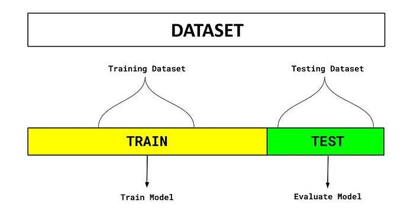

## Table of Contents

## What is holdout data in machine learning?

Holdout data in machine learning is a portion of the dataset that is set aside and not used during the training of a model. This data is kept separate so that it can be used to test the model's performance after training is complete. By using holdout data, you can get a more accurate idea of how well your model will perform on new, unseen data, which is important for understanding its real-world effectiveness.

The process of using holdout data usually involves splitting the entire dataset into two parts: the training set and the holdout set, often called the test set. The model is trained on the training set, and then its performance is evaluated on the holdout set. This helps to prevent overfitting, where a model might perform well on the training data but poorly on new data. By checking the model's performance on the holdout data, you can make sure it generalizes well to new situations.

## Why is holdout data important in the model training process?

Holdout data is important in the model training process because it helps us check if our model works well on new data. When we train a model, we use a part of our data called the training set. But if we only use this data, the model might learn it too well and not work well with new data. This is called overfitting. By using holdout data, which is a separate part of our data that the model has never seen during training, we can see how the model performs on new, unseen examples. This gives us a better idea of how the model will work in real life.

Using holdout data also helps us make our model better. After we train the model on the training set, we can test it on the holdout set to see where it makes mistakes. We can then go back and adjust the model to fix these mistakes. This process of training, testing, and adjusting helps us create a model that not only works well on the data we have but also on new data we might get in the future. This way, we can trust our model to make good predictions or decisions when it's used in the real world.

## How do you split a dataset into training and holdout data?

Splitting a dataset into training and holdout data is an important step in machine learning. To do this, you take your whole dataset and divide it into two parts. Usually, you use a bigger part for training and a smaller part for testing. A common way to split the data is to use 70-80% for training and the rest for testing. This split helps make sure your model learns well from the training data and can be checked on the holdout data to see how it will work with new data.

You can split the data randomly or use a method called stratified sampling, which makes sure each part of the data has the same mix of different types of data. For example, if you're working with data about different kinds of animals, you want both the training and holdout sets to have a similar number of each kind of animal. This helps make sure your model is tested fairly. To do the split, you can use tools like Python's scikit-learn library, which has functions to help you split your data easily and correctly.

Here's a simple example of how you might split your data using Python and scikit-learn:

```python
from sklearn.model_selection import train_test_split

# Assume 'X' is your feature data and 'y' is your target data
X_train, X_test, y_train, y_test = train_test_split(X, y, test_size=0.2, random_state=42)

# Now X_train and y_train are your training data, and X_test and y_test are your holdout data
```

This code splits your data into 80% training and 20% holdout, which is a common split. The `random_state` makes sure you get the same split every time you run the code, which is helpful for repeating your experiments.

## What is the typical percentage of data used for holdout?

The typical percentage of data used for holdout, or the test set, is often around 20% to 30% of the total dataset. This means that if you have a dataset with 1000 samples, you might use 700 to 800 samples for training and keep 200 to 300 samples for testing. Using this split helps make sure your model learns well from the training data but still has enough new data to test how well it will work on unseen examples.

Sometimes, the exact percentage can change depending on how much data you have and what you are trying to do. If you have a lot of data, you might use a smaller percentage for the holdout set, like 10% or 15%. But if you have less data, you might need to use a larger percentage, like 30% or even 40%, to make sure your test set is big enough to give a good idea of how your model will work in the real world. The key is to find a balance that lets your model learn well but also gives you a good way to check its performance.

## Can holdout data be used for both validation and testing?

Holdout data is usually split into two parts: one for validation and one for testing. The validation part is used during the training process to help tune the model and make it better. You might try different settings or change how the model works, and then check how well it does on the validation data. This helps you pick the best way to set up your model. The testing part, on the other hand, is used after you've finished tuning the model. You use it to see how well your final model works on new data it hasn't seen before.

Sometimes, people use the same holdout data for both validation and testing, but this isn't the best way to do it. If you use the same data for both, you might end up making your model too good at working with that specific data, which is called overfitting. It's better to keep the validation and testing data separate. This way, you can be sure your model will work well on new data in the real world. If you have enough data, it's a good idea to split it into three parts: training, validation, and testing. This helps you build a model that works well and can be trusted.

## What are the potential problems with using holdout data?

Using holdout data can have some problems. One big issue is if you don't have enough data. If your dataset is small, splitting it into training and holdout sets can leave you with too little data to train a good model or to get a good idea of how well it works. This can make your model less accurate because it hasn't seen enough examples to learn from.

Another problem is if the holdout data isn't a good match for the training data. This can happen if you split your data randomly and end up with different kinds of data in each set. For example, if your data is about different types of animals, you want both sets to have a similar mix of animals. If they don't, your model might not work well when tested because it was trained on different kinds of data than it's being tested on.

Lastly, using the same holdout data for both validation and testing can lead to overfitting. If you keep using the same data to check and improve your model, it might get too good at working with that specific data but not do well on new data. It's better to have separate sets for validation and testing to make sure your model works well in the real world.

## How does the size of the holdout set affect model performance?

The size of the holdout set can really affect how well your model performs. If the holdout set is too small, it might not give you a good idea of how your model will work with new data. This is because a small holdout set might not have enough examples to show all the different kinds of data your model might see in the real world. For example, if you're working with data about animals and your holdout set only has a few types of animals, your model might seem to work well but then fail when it sees other types of animals.

On the other hand, if the holdout set is too big, you might not have enough data left for training. This can make your model less accurate because it hasn't seen enough examples to learn from. Finding the right balance is important. A common split is to use 70-80% of your data for training and 20-30% for the holdout set. This way, your model gets enough data to learn well, and you still have enough data to test it properly.

## What is the difference between holdout data and cross-validation?

Holdout data and cross-validation are two different ways to check how well a machine learning model works. Holdout data means you take your whole dataset and split it into two parts: one part for training the model and the other part for testing it. You train your model on the training data and then see how well it does on the test data, which it hasn't seen before. This helps you understand if your model will work well on new data. A common way to split the data is to use 70-80% for training and 20-30% for testing.

Cross-validation is a bit different. Instead of just splitting the data once, you split it many times in different ways. The most common type is called k-fold cross-validation. Here, you divide your data into k equal parts, or "folds." You then train your model k times, each time using a different fold as the test set and the rest of the data for training. After all the rounds, you take the average of how well your model did on all the test sets. This gives you a better idea of how your model will work because it's been tested on all parts of your data. Cross-validation is good when you don't have a lot of data, because it makes sure every piece of data is used for both training and testing.

## How can you ensure that your holdout data is representative of the overall dataset?

To make sure your holdout data is a good match for your whole dataset, you can use a method called stratified sampling. This means you split your data in a way that keeps the same mix of different types of data in both your training and holdout sets. For example, if your data is about different types of animals, you want both sets to have the same number of dogs, cats, and birds. This way, your model gets trained on a variety of data and your holdout set will test it fairly on similar kinds of data.

Another way to check if your holdout data is representative is by looking at the data's features and making sure they are spread out evenly. You can do this by checking the mean, median, and other stats of your data to see if they are similar in both the training and holdout sets. If you find big differences, you might need to split your data again to make it more even. By taking these steps, you can be more sure that your model will work well on new data because your holdout set is a good sample of your whole dataset.

## What strategies can be used to prevent overfitting when using holdout data?

One way to prevent overfitting when using holdout data is to make sure you have enough data for both your training and holdout sets. If your dataset is small, you might not have enough data to train your model well and still have a good holdout set to test it. A common way to split the data is to use 70-80% for training and 20-30% for testing. This helps your model learn from a lot of data but still leaves enough to check how well it works on new data. If you find your model is overfitting, you can try using a smaller training set or a bigger holdout set to see if that helps.

Another strategy is to use a method called cross-validation instead of just one holdout set. Cross-validation splits your data into many parts and tests your model on each part, one at a time. This way, every piece of your data gets used for both training and testing, which can give you a better idea of how your model will work on new data. For example, in k-fold cross-validation, you split your data into k parts, train your model k times, and each time use a different part as the test set. This helps prevent overfitting because your model is tested on all parts of your data, not just one holdout set.

Lastly, you can use techniques like regularization to prevent overfitting. Regularization adds a penalty to your model's complexity, which can stop it from fitting the training data too closely. There are different types of regularization, like L1 and L2 regularization. L2 regularization, for example, adds a term to your model's loss function that is proportional to the square of the model's weights. This can be written as $$ \text{Loss} + \lambda \sum_{i=1}^{n} w_i^2 $$, where $$ \lambda $$ is a hyperparameter that controls how much the model is penalized for having large weights. By using regularization, you can make your model simpler and less likely to overfit the training data.

## How do advanced techniques like stratified sampling improve the use of holdout data?

Advanced techniques like stratified sampling help make sure that the holdout data is a good match for the whole dataset. When you use stratified sampling, you split your data so that both your training and holdout sets have the same mix of different types of data. For example, if your data is about different kinds of animals, you want both sets to have the same number of dogs, cats, and birds. This way, your model gets trained on a variety of data, and your holdout set will test it fairly on similar kinds of data. By doing this, you can be more sure that your model will work well on new data because your holdout set is a good sample of your whole dataset.

Using stratified sampling can also help prevent overfitting. Overfitting happens when a model learns the training data too well and doesn't work well on new data. By making sure your holdout set is a good match for your training set, you can get a better idea of how your model will work in the real world. This is because your holdout set will have the same mix of data as your training set, so it will test your model on the same kinds of examples it was trained on. This helps you see if your model is just memorizing the training data or if it's learning patterns that will work on new data too.

## What are the best practices for managing and using holdout data in large-scale machine learning projects?

In large-scale machine learning projects, it's important to manage and use holdout data carefully to make sure your model works well on new data. One good practice is to use stratified sampling when you split your data into training and holdout sets. This means you make sure that both sets have the same mix of different types of data. For example, if your data is about different types of animals, you want both sets to have the same number of dogs, cats, and birds. By doing this, your model will be trained on a variety of data, and your holdout set will test it fairly on similar kinds of data. This helps prevent overfitting, where your model might learn the training data too well but not work well on new data.

Another best practice is to use cross-validation along with holdout data. Instead of just using one holdout set, you can split your data into many parts and test your model on each part, one at a time. This is called k-fold cross-validation. In k-fold cross-validation, you split your data into k parts, train your model k times, and each time use a different part as the test set. This way, every piece of your data gets used for both training and testing, which can give you a better idea of how your model will work on new data. By combining cross-validation with a final holdout set, you can tune your model well and still have a separate set to test its performance on new data.