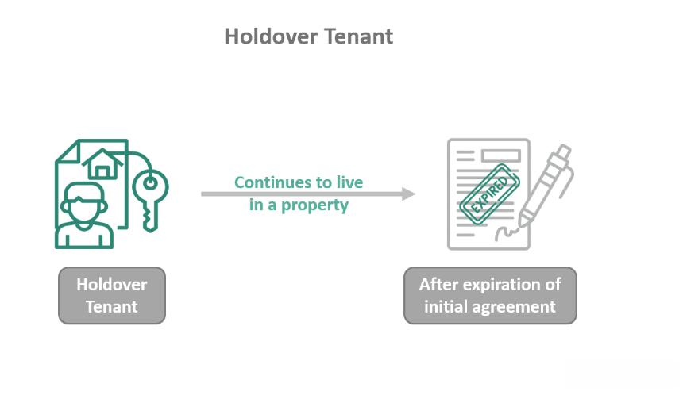

In today's real estate and trading landscapes, navigating the complexities of lease termination, holdover tenants, tenant rights, and algo trading can be daunting. These topics intersect in unexpected ways, affecting property owners, renters, and investors alike. Lease termination involves concluding a rental agreement, often leading to unique challenges if tenants remain beyond the agreed period, becoming holdover tenants. This status influences both legal rights and financial responsibilities for both tenants and landlords, often requiring keen legal insight to manage effectively.

Simultaneously, in the financial sector, algo trading revolutionizes how trading is conducted, using advanced algorithms and software to make real-time decisions, which often yield better outcomes in volatile markets. As property investment often involves substantial capital, understanding the financial dynamics of algo trading can be beneficial for investors seeking to optimize returns and hedge risks.



This article seeks to demystify these terms and offer insights into what each entails and their implications in your financial and legal decisions. By comprehending the rights and regulations related to tenancy and trading, stakeholders can better protect their interests. Whether you are a tenant, landlord, or investor, understanding these concepts can help protect your interests. Stay informed and strategically proactive in both areas can enhance financial security and opportunities for growth. Let's explore the details.

## Table of Contents

## Lease Termination and Holdover Tenants

Lease termination marks the conclusion of a rental agreement and outlines the procedures that a tenant must follow to vacate a property. A lease agreement may specify a fixed term or be open-ended, and its termination can occur naturally at the end of this term or be initiated by either party under stipulated conditions such as breach of contract or mutual agreement.

Upon the conclusion of a lease, some tenants may become 'holdover tenants' by remaining in the property without a formal extension or renewal of the contract. This situation, often referred to as 'tenancy at sufferance,' results when the tenant continues to occupy the premises without the landlord's explicit consent or a new lease agreement.

Understanding the rights and options available at the termination stage is essential for both tenants and landlords. For tenants, it is crucial to recognize that staying beyond the lease term without agreement can lead to legal consequences, including possible eviction. Landlords, on the other hand, must determine whether to accept the holdover situation, potentially converting it into a month-to-month tenancy, or to initiate eviction proceedings.

Holdover tenancy can escalate into legal actions if not appropriately managed. Landlords usually have two primary options: they may begin eviction procedures to reclaim the property or change the dynamic by accepting rent, which could imply consenting to a month-to-month tenancy. This latter approach can offer flexibility but may also require a new contractual understanding to avoid ambiguity in rental terms.

Lease agreements typically contain specific clauses that describe the procedures upon expiration. A common provision allows for the lease to transition into a month-to-month arrangement automatically if neither party provides notice of termination by a set deadline. This provision gives tenants continued residency while granting landlords time to negotiate new terms or to prepare for different tenancy arrangements.

Both parties should carefully review the original lease agreement for any holdover terms and remain informed about local laws governing rental agreements. These laws can vary significantly by jurisdiction, affecting the legal framework within which landlords and tenants must operate during the lease termination and holdover process.

## Legal Rights of Holdover Tenants

A holdover tenant exists in a legal condition known as "tenancy at sufferance," which occurs when a tenant continues to occupy a property after their lease has expired, without the landlord's explicit permission. In this situation, tenants have limited rights compared to those with a valid lease agreement. The options available to landlords include initiating eviction proceedings or accepting rent from the holdover tenant. Accepting rent may effectively create a new, albeit informal, month-to-month lease agreement, subject to the terms under which the rent is accepted.

The specific rights and obligations of holdover tenants can vary widely depending on jurisdictional legislation and the clauses included in the original lease agreement. For instance, some regions may allow landlords to increase rent for holdover periods, or impose other penalties to discourage overstaying. Therefore, it is crucial for tenants to familiarize themselves with the relevant state or local regulations to understand potential implications they may face as holdover tenants.

For landlords, it is vital to take prompt action regarding holdover situations to avoid any potential legal or financial complications. This typically involves providing the tenant with clear notice about the intention to reclaim the property and proceeding with eviction if necessary. The notification often must adhere to specific legal formats and timelines to be considered valid in court.

In summary, both parties must understand their rights and responsibilities when a tenancy at sufferance arises, as the legal landscape can significantly impact how these situations are resolved. Knowledge of local laws and careful communication between tenant and landlord can mitigate misunderstandings and help to resolve holdover tenancies amicably.

## Navigating Tenancy and Trader's Rights

Understanding your rights as a tenant or landlord is crucial in avoiding legal pitfalls. Tenant laws are designed to encapsulate the interests of both parties, often establishing comprehensive frameworks for renegotiation, leasing terms, or eviction processes. These laws serve as a protective mechanism, ensuring that the rights of both tenants and landlords are acknowledged and respected.

For landlords, being well-versed in tenant laws aids in drafting robust lease agreements, understanding the legal justifications for evictions, and knowing the proper procedures for holding tenants accountable while maintaining legal integrity. Each tenancy agreement should ideally address contingencies — such as breach of contract or property damages — while also detailing the mechanisms for conflict resolution. Tenant insurance can further protect landlords by safeguarding against unforeseen damages caused by tenants.

Similarly, in trading, knowledge of rights and regulations is imperative to prevent financial mishaps. Algorithmic trading, a facet of modern financial markets, involves using computer algorithms to automate trading decisions. Familiarity with the regulatory frameworks governing [algorithmic trading](/wiki/algorithmic-trading) is essential to ensure compliance with financial laws and to protect investments from malpractices or technical glitches. Traders are advised to stay informed about changing regulations and updates from securities commissions, which may issue new guidelines to address market [volatility](/wiki/volatility-trading-strategies) or technological advancements.

Being informed about tenant protection statutes is advantageous for tenants, as it allows them to advocate effectively for their rights, especially in scenarios of lease disputes or unjust eviction attempts. These statutes govern issues like rent control, property maintenance standards, and fair eviction policies, thereby offering tenants a safety net.

For traders, understanding algorithmic trading regulations is crucial for several reasons. Firstly, these regulations dictate the ethical boundaries and operational limits within which algorithms must function. Secondly, they stipulate safeguards against market manipulation, ensuring a fair trading environment. Compliance with these regulations not only protects traders from legal repercussions but also enhances market stability.

In summary, both the real estate and trading sectors require a thorough understanding of applicable laws and regulations to secure financial interests and foster an environment of mutual respect and integrity. Whether dealing with tenancy issues or navigating the digital marketplace of trading, stakeholders are encouraged to continuously educate themselves about their rights and obligations to avert potential legal and financial risks.

## Algo Trading: The Digital Marketplace

Algorithmic trading, commonly referred to as algo trading, employs computer algorithms to execute trading decisions automatically in financial markets. This method brings significant advantages, such as enhanced speed and efficiency, often resulting in superior outcomes compared to manual trading, especially in the fast-paced trading environment. By utilizing predefined criteria and historical data, these algorithms make real-time, high-[volume](/wiki/volume-trading-strategy) trades that humans cannot efficiently manage due to constraints in manual processing speed and decision-making capacity.

To effectively engage in algo trading, traders must possess a deep understanding of market trends, data analysis, and the software tools used to implement these algorithms. An essential component of algorithmic trading involves the analysis of market data streams for pattern recognition—a task that leverages statistical and mathematical models to forecast price movements and optimize trade execution.

For instance, consider a simple moving average crossover strategy. In this scenario, buy signals are generated when a short-term moving average crosses above a long-term moving average, and sell signals are activated when the reverse occurs. This strategy can be implemented with a few lines of Python code:

```python
import numpy as np
import pandas as pd

def generate_signals(data, short_window=40, long_window=100):
    signals = pd.DataFrame(index=data.index)
    signals['price'] = data['Close']

    signals['short_mavg'] = data['Close'].rolling(window=short_window, min_periods=1).mean()
    signals['long_mavg'] = data['Close'].rolling(window=long_window, min_periods=1).mean()

    signals['signal'] = 0.0
    signals['signal'][short_window:] = np.where(signals['short_mavg'][short_window:] > signals['long_mavg'][short_window:], 1.0, 0.0)

    signals['positions'] = signals['signal'].diff()

    return signals

# Assuming 'data' is a DataFrame with historical price data
signals = generate_signals(data)
```

As rules and regulations govern trading activities, understanding the regulatory framework is pivotal in algo trading. Violations can incur significant penalties or suspensions, similar to the legal issues faced in real estate when ignoring tenant laws, such as those related to holdover tenancies. Thus, it is vital to align algorithmic strategies with current legal standards and ethical considerations.

Engaging in algorithmic trading without adequate knowledge is as risky as entering the property rental market without understanding the nuances of tenant agreements. The volatility and unpredictability of financial markets demand that traders continually update their strategies and regulatory knowledge. By maintaining a rigorous understanding of both the technical and regulatory aspects of algo trading, participants can ensure disciplined and potentially successful trading outcomes.

## Integrating Knowledge: Real Estate and Trading

Real estate and financial trading, though distinct in their operations, often intersect in investment opportunities. This intersection is rooted in the shared foundation of capital growth and value preservation. Real estate offers tangible assets that provide potential for rental income, appreciation, and tax advantages. Conversely, financial trading, particularly with advancements in algorithmic trading, allows for rapid execution of trades and potentially high returns in liquid markets.

Investors aiming to diversify and optimize their portfolios can benefit greatly from integrating knowledge of both sectors. Understanding real estate trends, such as housing market cycles, interest rates, and geographic growth, can inform better decisions in equity trades related to real estate investment trusts (REITs) or construction companies. Conversely, insights gained from financial market analysis, like risk assessment and hedging strategies, can enhance real estate investment decisions, particularly in volatile economic periods.

A comprehensive approach to investing in both areas demands a solid understanding of the legal and market dynamics. In real estate, this includes familiarity with property rights, lease agreements, and zoning laws. For trading, it involves knowledge of trading regulations, market analytics, and the technical aspects of algorithmic trading systems. Staying informed about these elements allows investors to create a strategic execution plan that accounts for market fluctuations and regulatory changes, ensuring investments are both compliant and profitable.

Stakeholders in either industry should remain proactive in acquiring timely information and insights to adapt to rapidly shifting markets. By leveraging technology, such as data analytics and forecasting models, investors can better anticipate trends and make more informed decisions. This proactive approach not only maximizes opportunities but also reduces risks by enabling timely responses to market signals.

The integration of real estate expertise with financial trading acumen offers a competitive advantage in today's diversified market economies. It allows investors to identify unique opportunities that might not be visible through a single-industry perspective. By drawing upon the strengths of both sectors, investors can foster a more resilient and dynamic investment strategy, thereby enhancing their overall financial growth potential.

## Conclusion

Mastering the interplay between tenant laws and algo trading strategies offers multiple avenues for financial growth. Both domains necessitate a comprehensive understanding of agreements, legalities, and market dynamics. The alignment of tenant laws with algorithmic trading strategies requires a holistic approach, considering both the protection of legal rights in real estate and the strategic execution of trades in financial markets. Staying informed about legal stipulations in lease agreements and regulatory requirements in trading ensures that individuals can navigate these landscapes efficiently.

For tenants and landlords, understanding the specifics of lease termination and the rights of holdover tenants can alleviate potential legal disputes and promote harmonious landlord-tenant relationships. This knowledge not only aids in protecting interests but also facilitates negotiations, ultimately fostering more secure living and investment arrangements.

In the trading sector, staying updated with the latest algorithmic strategies and compliance with financial regulations can significantly enhance investment outcomes. The rapid evolution of market conditions requires traders to adapt by leveraging advanced tools and data analytics to secure profitable opportunities.

Whether you're leasing a property or executing trades, leveraging expertise allows for informed decision-making. This approach enables stakeholders to optimize returns while minimizing risks associated with real estate investments and trading activities. As the markets evolve, continuous education is crucial for mastering the nuances of property and finance sectors. By consistently updating knowledge and skill sets, individuals can position themselves advantageously within these interconnected domains, ensuring sustained financial success and growth.

## References & Further Reading

[1]: Stack, G. (2013). ["The complexities of holdover tenancies: Legal issues and implications."](https://www.supermoney.com/encyclopedia/holdover-tenant) Journal of Real Estate Literature.

[2]: Hull, J. C. (2018). ["Risk Management and Financial Institutions."](https://books.google.com/books/about/Risk_Management_and_Financial_Institutio.html?id=1J1QDwAAQBAJ) Wiley Finance.

[3]: Lopez de Prado, M. (2018). ["Advances in Financial Machine Learning."](https://www.amazon.com/Advances-Financial-Machine-Learning-Marcos/dp/1119482089) Wiley Finance.

[4]: Chan, E. P. (2008). ["Quantitative Trading: How to Build Your Own Algorithmic Trading Business."](https://github.com/egorpe/EPChan-QuantitativeTrading/blob/master/example7_6.m) Wiley Trading.

[5]: Jansen, S. (2018). ["Machine Learning for Algorithmic Trading."](https://github.com/stefan-jansen/machine-learning-for-trading) Packt Publishing.

[6]: Malhotra, M. D. (2006). ["The Legal and Regulatory Framework for Algorithmic Trading."](https://www.scirp.org/reference/referencespapers?referenceid=2975053) Journal of Trading.

[7]: Simpson, S. (2015). ["The Landlord's Legal Guide to Tenant Rights: Understanding Your Obligations."](https://tish.law/2024/11/04/navigating-landlord-tenant-disputes-legal-rights-and-responsibilities/) Morgan James Publishing.