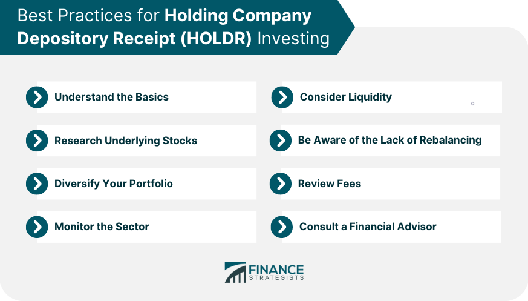

## Table of Contents

## What are Holding Company Depository Receipts (HOLDRs)?

Holding Company Depository Receipts, often called HOLDRs, are a type of investment product that lets you own a basket of stocks in a specific industry. They are similar to exchange-traded funds (ETFs), but instead of owning a small piece of a fund that owns many stocks, with HOLDRs, you directly own shares of the companies in the basket. This means you can see exactly which companies you are invested in and how much of each one you own.

HOLDRs were created by Merrill Lynch and were popular in the early 2000s. They are traded on stock exchanges just like individual stocks, making them easy to buy and sell. However, they are less common now because ETFs have become more popular. If you own HOLDRs, you can also choose to take the actual shares of the companies in the basket instead of holding the receipt, which gives you more control over your investments.

## How do HOLDRs differ from other investment vehicles like ETFs and mutual funds?

HOLDRs are different from ETFs and mutual funds because they let you own shares of specific companies directly, instead of owning a piece of a fund that holds many stocks. When you buy a HOLDR, you get a receipt that represents ownership of the actual shares in the basket. This means you can see and control exactly which companies you own and in what proportions. On the other hand, ETFs and mutual funds pool money from many investors to buy a diversified portfolio of stocks, bonds, or other assets, and you own a portion of the entire fund, not the individual securities.

Another key difference is that HOLDRs are less flexible than ETFs and mutual funds. With ETFs and mutual funds, the fund managers can buy and sell securities within the fund to adjust to market changes or rebalance the portfolio. HOLDRs, however, have a fixed basket of stocks that doesn't change unless the companies in the basket merge, go bankrupt, or get taken over. This fixed nature can be a benefit if you want to invest in a specific set of companies, but it can also be a limitation if you want more flexibility in your investments.

## What sectors or industries do HOLDRs typically represent?

HOLDRs usually focus on specific industries or sectors, like technology, pharmaceuticals, or energy. This means if you buy a HOLDR, you're investing in a group of companies that all work in the same field. For example, a technology HOLDR might include big tech companies like Microsoft, Intel, and Cisco.

Even though HOLDRs are less common now, they still exist in sectors like semiconductors, oil, and biotechnology. These HOLDRs give investors a way to put their money into a particular industry without having to pick individual stocks. It's like getting a basket of stocks from one area of the market all at once.

## How are HOLDRs created and who manages them?

HOLDRs are created by a financial company, like Merrill Lynch, which picks a group of companies from a specific industry. They then put these companies into a basket and create receipts that represent ownership of the shares in that basket. When you buy a HOLDR, you're buying one of these receipts, which gives you a direct stake in the companies in the basket. The creation process involves setting up the basket and then issuing the receipts, which are traded on stock exchanges just like regular stocks.

The management of HOLDRs is different from other investment products like ETFs or mutual funds. Unlike those, HOLDRs don't have active managers who buy and sell stocks to change the basket. Once the basket is set, it stays the same unless something big happens, like a company in the basket gets bought out or goes bankrupt. This means the financial company that created the HOLDR doesn't need to do much managing after it's set up. They just make sure the receipts keep trading on the stock exchange.

## What are the benefits of investing in HOLDRs?

Investing in HOLDRs can be a good choice if you want to put your money into a specific industry without having to pick each company yourself. When you buy a HOLDR, you get a basket of stocks from that industry, like tech or energy. This means you can spread your money across several big companies in one go, which can be less risky than putting all your money into one stock. Plus, because HOLDRs trade on the stock market like regular stocks, you can easily buy and sell them whenever you want.

Another benefit of HOLDRs is that you can see exactly which companies you own and in what amounts. Unlike ETFs or mutual funds, where you own a piece of a big pool of stocks, with HOLDRs, you directly own shares of the companies in the basket. This can give you more control over your investments. If you want, you can even take the actual shares out of the basket instead of holding the receipt, which lets you manage your investments the way you want.

## What are the potential risks associated with HOLDRs?

One big risk with HOLDRs is that they don't change much. Once the basket of companies is set, it stays the same unless something big happens, like a company goes bankrupt or gets bought out. This means if one of the companies in the basket does badly, it can drag down the whole HOLDR, and there's nothing you can do about it. If you had an ETF or a mutual fund, the managers could change the stocks to try and do better, but with HOLDRs, you're stuck with what you've got.

Another risk is that HOLDRs focus on just one industry. If you put all your money into a HOLDR that's all about tech stocks, and then the tech industry has a bad year, your investment could lose a lot of value. It's like putting all your eggs in one basket. This can be riskier than spreading your money across different industries, which is what you can do with ETFs and mutual funds. 

Lastly, HOLDRs are not as popular as they used to be, so they might not be as easy to buy and sell as other investments. If fewer people are trading them, it can be harder to find someone to buy your HOLDR when you want to sell it, and the price might not be as good as you hoped. This can make HOLDRs less liquid than other investments, which means it might take longer to turn them into cash if you need to.

## How can an investor buy or sell HOLDRs?

Buying or selling HOLDRs is a lot like trading regular stocks. You just need to have a brokerage account, which is like a special bank account for buying and selling investments. Once you have that set up, you can use your broker's trading platform to find the HOLDR you want. You type in the symbol for the HOLDR, decide how many shares you want to buy or sell, and then hit the buy or sell button. The trade happens quickly, and you'll see the HOLDRs show up in your account.

One thing to keep in mind is that HOLDRs might not be as easy to trade as other investments because they're not as popular anymore. This means there might be fewer people buying and selling them, which can make it harder to find someone to trade with. If you want to sell your HOLDRs, you might have to wait a bit longer or accept a lower price than you hoped for. But if you're okay with that, trading HOLDRs can still be a good way to invest in a specific industry.

## What are the tax implications of investing in HOLDRs?

When you invest in HOLDRs, you need to think about taxes. If you make money from your HOLDRs by selling them for more than you paid, you have to pay capital gains tax. How much tax you pay depends on how long you held the HOLDRs. If you held them for less than a year, it's a short-term capital gain, and you pay regular income tax on it. If you held them for more than a year, it's a long-term capital gain, and the tax rate is usually lower.

HOLDRs can also give you dividends, which are payments from the companies in the basket. These dividends are usually taxed as regular income, but there's a special rule called the qualified dividend rate that can make the tax lower if the dividends meet certain rules. Also, if you decide to take the actual shares out of the HOLDR basket instead of holding the receipt, that could be a taxable event too. You might have to pay taxes on any gains as if you sold the HOLDRs at that time. It's a good idea to talk to a tax advisor to understand all the tax rules for your specific situation.

## How do HOLDRs handle dividends and other corporate actions?

When companies in a HOLDR basket pay dividends, those dividends get passed on to you, the investor. The dividends are usually paid out in cash, just like if you owned the stocks directly. But remember, you'll have to pay taxes on those dividends, usually as regular income, unless they qualify for a lower tax rate.

If a company in the HOLDR basket does something big, like a merger, a buyout, or goes bankrupt, it can change the HOLDR. For example, if a company gets bought out, it might be replaced with cash or another company's stock. If a company goes bankrupt, it might be removed from the basket. These changes can affect the value of your HOLDR, so it's good to keep an eye on what's happening with the companies in the basket.

## What is the historical performance of HOLDRs compared to the broader market?

HOLDRs have had a mixed history when compared to the broader market. In the early 2000s, when they were more popular, some HOLDRs did really well, especially those focused on booming sectors like technology. For example, the Semiconductor HOLDR did very well during the tech boom. But when the market went down, like during the dot-com crash, HOLDRs in those sectors lost a lot of value too. This shows that HOLDRs can be a bit riskier because they focus on one industry and don't change much.

Over time, as ETFs became more popular, fewer people started trading HOLDRs. This made them less liquid, which means it was harder to buy and sell them quickly. Because of this, their performance started to lag behind the broader market more often. While some HOLDRs might still do well if their industry is doing great, overall, they tend to be more up and down compared to a diversified investment like an S&P 500 index fund. So, if you're thinking about investing in HOLDRs, it's good to know they can be a bit of a rollercoaster ride.

## How have regulatory changes affected the availability and structure of HOLDRs?

Regulatory changes have made it harder to create and keep HOLDRs around. A big rule change happened in 2009 when the SEC, which is like the rule maker for the stock market, said that new HOLDRs couldn't be made anymore. This was because they wanted to make sure investors were protected and that the market was fair. So, after that, no new HOLDRs could be made, and the ones that were already there started to get less popular and harder to trade.

Even though no new HOLDRs can be made, the ones that are still around have to follow new rules too. For example, they have to tell investors more about what's in the basket and how it's doing. This is to make sure everyone knows what they're getting into. Because of these rules and because ETFs became more popular, HOLDRs are not as common anymore, and they might not be as easy to buy and sell as other investments.

## What advanced strategies can be used with HOLDRs for portfolio optimization?

One advanced strategy for using HOLDRs in portfolio optimization is sector rotation. This means you move your money from one industry to another based on which one you think will do better in the future. Since HOLDRs focus on specific industries, you can buy a HOLDR in a sector you think will grow and sell it when you think another sector will do better. This can help you make more money if you guess right about which industries will do well. But remember, it's a bit risky because if you guess wrong, you could lose money.

Another strategy is using HOLDRs for targeted exposure. If you want to invest more in a certain industry without changing your whole portfolio, you can add a HOLDR that focuses on that industry. This way, you can keep your other investments the same but still get more involved in the industry you think will do well. It's like adding a special ingredient to your investment recipe to make it better. Just be careful because if that industry does badly, it could hurt your portfolio.

## How can algo trading be integrated with HOLDRs in a hypothetical scenario?

Despite the discontinuation of HOLDRs, considering their potential integration with algorithmic trading provides valuable lessons for modern finance. Algorithmic trading relies on computer algorithms to execute trades by leveraging efficient data analysis, speed, and precision. Implementing algorithmic trading within the constraints of HOLDRs could have enhanced trading efficiency and improved investment returns. 

Algorithms bring the capability to automate the analysis of the stocks underlying HOLDRs. For instance, they can process large volumes of financial data to identify optimal buy/sell signals. In the absence of human bias, algorithmic strategies could discern patterns and correlations within individual sectors represented by HOLDRs. This automation leads to refined trading strategies based on quantifiable insights, facilitating timely decision-making.

Portfolio allocation is pivotal in investment strategies, yet HOLDRs were characterized by a static composition. Algorithmic trading could have dynamically adjusted portfolio allocations to align with market conditions. Within the constraints of HOLDRs, algorithms might have utilized techniques like rebalancing permitted by corporate actions. This dynamic allocation involves optimizing weighting adjustments for better returns, even within the predefined structure of HOLDRs.

Risk management also stands to benefit from algorithmic integration. Real-time risk assessments and management strategies can be automated by algorithms to protect investments against market [volatility](/wiki/volatility-trading-strategies). By leveraging historical performance data, algorithms can simulate future scenarios and apply predictive analytics to forecast potential market trends. This proactive approach would enable HOLDR investors to anticipate risks and mitigate losses.

Through algorithmic integration, strategies such as mean-variance optimization and trend analysis could have been employed for HOLDRs. Algorithms might use historical data to calculate expected returns ($\text{E}(R_i)$) and variances in stock prices, applying formulas like:

$$
\text{Minimize: } \frac{1}{2} \mathbf{w}^T \mathbf{\Sigma} \mathbf{w} - \mathbf{r}^T \mathbf{w}
$$

Where $\mathbf{w}$ represents the weight vector of stocks, $\mathbf{\Sigma}$ is the covariance matrix of returns, and $\mathbf{r}$ is the expected return vector. Although HOLDRs' static nature limits direct reallocation, algorithms can provide scenarios for optimal weight distributions within existing constraints.

Exploring a hypothetical integration aids in understanding how algorithmic trading can revolutionize similar investment vehicles. The lessons drawn underscore the transformative potential of algorithms in refining strategies, even for static instruments like HOLDRs. This understanding is crucial for developing flexible, efficient trading systems in today's dynamic markets.

## References & Further Reading

[1]: ["Exchange-Traded Funds and HOLDRs™"](https://www.morningstar.com/funds/what-is-an-etf-morningstars-etf-guide) - A detailed explanation of the history and characteristics of HOLDRs and their transition to ETFs.

[2]: ["The Innovator's Solution: Creating and Sustaining Successful Growth"](https://www.amazon.com/Innovators-Solution-Creating-Sustaining-Successful/dp/1422196577) by Clayton M. Christensen and Michael E. Raynor - This book provides insights into innovation in the financial industry and the evolution of investment vehicles.

[3]: Aldridge, I. (2013). ["High-Frequency Trading: A Practical Guide to Algorithmic Strategies and Trading Systems"](https://www.amazon.com/High-Frequency-Trading-Practical-Algorithmic-Strategies/dp/1118343506) - This book discusses the development of algorithmic trading and its application in modern financial markets.

[4]: ["Algorithmic Trading and DMA: An introduction to direct access trading strategies"](https://www.amazon.com/Algorithmic-Trading-DMA-introduction-strategies/dp/0956399207) by Barry Johnson - A comprehensive guide to understanding and implementing algorithmic trading strategies.

[5]: ["The ETF Book: All You Need to Know About Exchange-Traded Funds"](https://www.amazon.com/ETF-Book-About-Exchange-Traded-Funds/dp/0470537469) by Richard A. Ferri - This book covers the evolution from HOLDRs to ETFs and offers insights into the benefits and mechanics of ETFs.