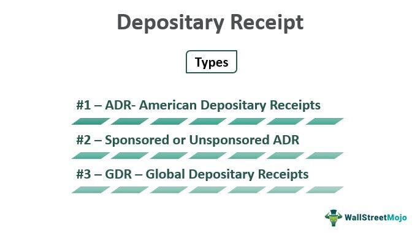

In the digital age, algorithmic trading has become integral to financial markets by enabling the automation of trading strategies. Algorithmic trading refers to the use of computer algorithms to execute trades, capitalizing on speed and precision unattainable by human traders. This approach allows market participants to process large volumes of data and execute trades based on pre-set criteria, significantly enhancing efficiency and reducing human error.

In this context, Holding Company Depository Receipts (HOLDRs) served as an important instrument for gaining diversified exposure across various industrial sectors. Introduced by Merrill Lynch, HOLDRs were a novel form of security that bundled a fixed portfolio of stocks from a specific industry into a single, tradable entity. This structure provided investors a straightforward method to diversify their holdings without managing each stock individually—a precursor to more sophisticated investment tools developed later.

Although HOLDRs have been discontinued in favor of exchange-traded funds (ETFs), they offer valuable insights into the historical development of diversified investment products. HOLDRs highlighted the need for diverse investment tools, leading to the creation of ETFs, which expanded upon the concept by offering greater flexibility and dynamic portfolio management.

The rise of algorithmic trading reflects the broader trend toward automation and efficiency in financial markets. Understanding HOLDRs helps frame the progression from static to more dynamic investment solutions, demonstrating how financial instruments have evolved alongside technological advancements. As algorithmic trading continues to grow, insights from past instruments like HOLDRs provide a foundation for developing new strategies within the automated trading landscape, which aims to optimize returns and manage risks more effectively.

## Table of Contents

## What are Holding Company Depository Receipts (HOLDRs)?

Holding Company Depository Receipts (HOLDRs) were a class of financial securities introduced by Merrill Lynch that provided investors with the ability to invest in a basket of stocks representative of a particular sector or industry. This innovative investment tool facilitated diversification for investors without the need to individually purchase each company's stock within a specific sector.

HOLDRs were distinctive in their construction when compared to Exchange-Traded Funds (ETFs). Unlike ETFs, which actively manage and frequently update their portfolios to maintain index fidelity, HOLDRs maintained a static composition of stocks. This fixed assembly meant that once a HOLDR was established, its portfolio remained unchanged unless impacted by significant corporate actions such as mergers or acquisitions. Consequently, investors were ensured direct ownership of the underlying stocks in the basket, including the attendant voting rights and dividend entitlements.

The valuation of HOLDRs was inherently tied to the market values of the constituent securities within the HOLDR. As the prices of the underlying stocks fluctuated on the stock exchanges, so did the value of the HOLDR, reflecting the collective performance of the securities it represented.

Despite their innovative nature and popularity, HOLDRs were discontinued in 2011. However, their contribution was critical in the historical progression toward more versatile financial instruments, such as ETFs, that offer greater flexibility and adaptability. HOLDRs demonstrated a significant step in financial innovation, illustrating a method by which sector-based diversification could be packaged into a single tradable security. This laid pivotal groundwork for the modern diversified investment vehicles that are prevalent in today's financial markets.

## Mechanism and Structure of HOLDRs

HOLDRs (Holding Company Depository Receipts) provided a streamlined approach for investors seeking sector-specific exposure by aggregating shares from different companies within a particular industry. These were financial instruments structured such that when an investor accumulated a designated number of shares from selected companies, these shares would be deposited into a trust. In return, the trust would issue depository receipts representing an ownership interest in the underlying stocks. These depository receipts were tradable on major stock exchanges like ordinary shares, thereby simplifying market access and [liquidity](/wiki/liquidity-risk-premium) for investors.

Each HOLDR represented a fixed portfolio of stocks, determined at the inception of the HOLDR. The portfolio composition was generally static, ensuring that the basket of stocks remained consistent over time. However, changes to the stock composition could occur due to corporate actions such as mergers or acquisitions, affecting the makeup of the underlying assets. Despite this rigidity, one of the appealing features of HOLDRs was the ability they provided investors to exercise voting rights and receive dividends directly from the held companies, similar to possessing individual stocks. 

Furthermore, HOLDRs granted investors the flexibility to take actual possession of the underlying shares through a process known as 'unwrapping.' This process allowed investors to convert the depository receipts back into individual stock ownership, enhancing control over their investment portfolios. The fixed nature of HOLDRs demanded that investors possess solid market knowledge and strategic planning skills, as the static composition meant that the HOLDRs did not automatically adjust to shifting market conditions or opportunities, a feature addressed in more modern investment vehicles like Exchange-Traded Funds (ETFs).

In conclusion, while HOLDRs were innovative for their time, allowing for simplified and sector-specific stock exposure, they required a strategic approach due to their non-dynamic structure. This inherent rigidity highlighted the necessity for investor foresight and adaptation, particularly in volatile market environments.

## Algorithmic Trading and Its Advantages

Algorithmic trading, commonly referred to as algo trading, utilizes computer algorithms to execute trades at high speeds and optimal prices based on pre-established criteria. These algorithms are designed to minimize human intervention and potential errors, enabling rapid execution of trades on a broad scale. By doing so, they significantly enhance the efficiency and effectiveness of trading operations.

The utilization of [algorithmic trading](/wiki/algorithmic-trading) provides significant advantages by quickly analyzing large volumes of data. This swift analysis empowers traders with improved decision-making capabilities and leads to more favorable trade outcomes. Algo trading systems can leverage a variety of strategies, such as statistical [arbitrage](/wiki/arbitrage), [trend following](/wiki/trend-following), and mean reversion, which allow them to quickly adapt to dynamic market conditions.

1. **Statistical Arbitrage**: This involves the use of quantitative techniques to identify pricing inefficiencies between related financial instruments. The strategy seeks to capture profits from these inefficiencies before the market corrects them. 

2. **Trend Following**: Algorithms designed for trend following recognize and follow the momentum of an asset's price movement. These algorithms buy when prices are trending upwards and sell during downtrends, capitalizing on the continuation of an asset's price momentum.

3. **Mean Reversion**: This strategy is based on the premise that asset prices revert to their mean value over time. Algorithms identify when an asset's price deviates significantly from its historical average and execute trades anticipating a return to this average.

With the discontinuation of HOLDRs, algorithmic trading has shifted its focus towards exchange-traded funds (ETFs) and a diverse array of financial products. These instruments' flexibility and transparency enhance their appeal to investors who deploy algorithm-driven trading strategies. As a result, algorithmic trading continues to play a critical role in modern financial markets, driving innovation, and offering investors an array of tactical options for managing their portfolios.

## Integrating Algo Trading with HOLDRs: A Hypothetical Scenario

Despite the discontinuation of HOLDRs, considering their potential integration with algorithmic trading provides valuable lessons for modern finance. Algorithmic trading relies on computer algorithms to execute trades by leveraging efficient data analysis, speed, and precision. Implementing algorithmic trading within the constraints of HOLDRs could have enhanced trading efficiency and improved investment returns. 

Algorithms bring the capability to automate the analysis of the stocks underlying HOLDRs. For instance, they can process large volumes of financial data to identify optimal buy/sell signals. In the absence of human bias, algorithmic strategies could discern patterns and correlations within individual sectors represented by HOLDRs. This automation leads to refined trading strategies based on quantifiable insights, facilitating timely decision-making.

Portfolio allocation is pivotal in investment strategies, yet HOLDRs were characterized by a static composition. Algorithmic trading could have dynamically adjusted portfolio allocations to align with market conditions. Within the constraints of HOLDRs, algorithms might have utilized techniques like rebalancing permitted by corporate actions. This dynamic allocation involves optimizing weighting adjustments for better returns, even within the predefined structure of HOLDRs.

Risk management also stands to benefit from algorithmic integration. Real-time risk assessments and management strategies can be automated by algorithms to protect investments against market [volatility](/wiki/volatility-trading-strategies). By leveraging historical performance data, algorithms can simulate future scenarios and apply predictive analytics to forecast potential market trends. This proactive approach would enable HOLDR investors to anticipate risks and mitigate losses.

Through algorithmic integration, strategies such as mean-variance optimization and trend analysis could have been employed for HOLDRs. Algorithms might use historical data to calculate expected returns ($\text{E}(R_i)$) and variances in stock prices, applying formulas like:

$$
\text{Minimize: } \frac{1}{2} \mathbf{w}^T \mathbf{\Sigma} \mathbf{w} - \mathbf{r}^T \mathbf{w}
$$

Where $\mathbf{w}$ represents the weight vector of stocks, $\mathbf{\Sigma}$ is the covariance matrix of returns, and $\mathbf{r}$ is the expected return vector. Although HOLDRs' static nature limits direct reallocation, algorithms can provide scenarios for optimal weight distributions within existing constraints.

Exploring a hypothetical integration aids in understanding how algorithmic trading can revolutionize similar investment vehicles. The lessons drawn underscore the transformative potential of algorithms in refining strategies, even for static instruments like HOLDRs. This understanding is crucial for developing flexible, efficient trading systems in today's dynamic markets.

## The Legacy of HOLDRs and Evolution of Investment Vehicles

HOLDRs (Holding Company Depository Receipts) were financial instruments that played a pivotal role in shaping the landscape of investment vehicles, heralding the transition from static investment models to more dynamic and flexible alternatives, such as Exchange-Traded Funds (ETFs). Introduced by Merrill Lynch, HOLDRs provided a means for investors to gain exposure to specific sectors through a basket of stocks, maintaining a static composition unless affected by corporate actions like mergers and acquisitions. Despite their eventual phase-out in favor of ETFs, HOLDRs offered valuable insights into creating diversified investment portfolios without the need to purchase individual stocks.

ETFs have emerged as the evolutionary successor to HOLDRs, addressing the limitations found in their predecessors. Unlike HOLDRs, ETFs offer greater flexibility, transparency, and efficiency. For instance, ETFs can be traded at market value throughout the trading day, just like stocks, and are subject to lower expense ratios compared to traditional mutual funds. Their inherent liquidity and flexibility allow investors to respond more swiftly to market changes, a trait that HOLDRs, with their rigid structure, could not offer.

The evolution from HOLDRs to ETFs is part of a broader narrative driven by technological advancements and the adoption of algorithmic trading strategies. These strategies have streamlined transactions by employing computer algorithms to execute trades based on predetermined criteria, thereby minimizing human error and improving execution speeds. As a result, financial markets have become more efficient, enabling investors to optimize their portfolios by harnessing vast amounts of data instantaneously.

HOLDRs, therefore, serve as an instructive case study in the financial industry's shift from static investment instruments to more adaptable and efficient products. Their legacy underscores the importance of innovation and adaptability in an ever-evolving market environment. For investors and professionals in the finance sector, understanding the transition from HOLDRs to ETFs offers critical lessons in appreciating the capabilities of modern investment vehicles that capitalize on contemporary trading technologies.

As the market continues to evolve, recognizing the contributions of past instruments like HOLDRs becomes essential in contextualizing the advancements and benefits of current solutions. The progress from HOLDRs to ETFs illustrates the continuous pursuit of more flexible, efficient investment options driven by technological advancements and regulatory adaptations. This historical perspective not only enriches our understanding of financial innovation but also inspires ongoing efforts to develop more effective investment strategies and products.

## Conclusion

HOLDRs, although no longer traded, mark a significant milestone in the evolution of investment products. They played a foundational role in shaping today’s diversified financial tools, contributing to the development of more dynamic vehicles like Exchange-Traded Funds (ETFs). Algorithmic trading has revolutionized the management and execution of financial products, facilitating increased efficiency and improved potential returns through advanced data analysis and strategic automation. This technological progression underscores the importance of understanding HOLDRs' functionality and contemplating their potential integration with modern trading technologies.

As market dynamics and trading technologies continuously evolve, maintaining awareness of historical and current trends is crucial for informed investment decision-making. The progress observed from static products like HOLDRs to more flexible, efficient investment solutions exemplifies how financial innovations can adapt to changing conditions. Lessons learned from the structure and utility of HOLDRs inspire ongoing advancements in the development of new and enhanced investment vehicles, designed to meet the needs of modern investors and seamlessly integrate with cutting-edge algorithmic strategies. This continuous improvement aims to foster more responsive and sophisticated approaches to investment, reflecting the ever-evolving landscape of financial markets.

## References & Further Reading

[1]: ["Exchange-Traded Funds and HOLDRs™"](https://www.morningstar.com/funds/what-is-an-etf-morningstars-etf-guide) - A detailed explanation of the history and characteristics of HOLDRs and their transition to ETFs.

[2]: ["The Innovator's Solution: Creating and Sustaining Successful Growth"](https://www.amazon.com/Innovators-Solution-Creating-Sustaining-Successful/dp/1422196577) by Clayton M. Christensen and Michael E. Raynor - This book provides insights into innovation in the financial industry and the evolution of investment vehicles.

[3]: Aldridge, I. (2013). ["High-Frequency Trading: A Practical Guide to Algorithmic Strategies and Trading Systems"](https://www.amazon.com/High-Frequency-Trading-Practical-Algorithmic-Strategies/dp/1118343506) - This book discusses the development of algorithmic trading and its application in modern financial markets.

[4]: ["Algorithmic Trading and DMA: An introduction to direct access trading strategies"](https://www.amazon.com/Algorithmic-Trading-DMA-introduction-strategies/dp/0956399207) by Barry Johnson - A comprehensive guide to understanding and implementing algorithmic trading strategies.

[5]: ["The ETF Book: All You Need to Know About Exchange-Traded Funds"](https://www.amazon.com/ETF-Book-About-Exchange-Traded-Funds/dp/0470537469) by Richard A. Ferri - This book covers the evolution from HOLDRs to ETFs and offers insights into the benefits and mechanics of ETFs.