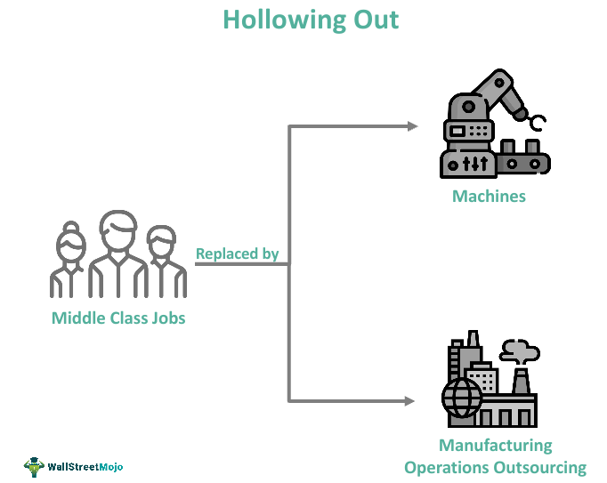

Algorithmic trading, also known as algo trading, involves using computer algorithms to automate trading decisions. These decisions traditionally fell within the purview of human traders, but the evolution of technology and financial expertise has transformed algorithmic trading into a pivotal element of modern financial markets. By enabling the execution of vast numbers of trades with high precision and speed, algorithmic trading has redefined conventional trading methods.

The proliferation of algorithmic trading has coincided with a growing discussion about the concept of 'hollowing out' in financial roles. 'Hollowing out' describes the gradual elimination of certain traditional job roles due to the increasing prevalence of automation. In the context of algorithmic trading, this term highlights the transition away from roles reliant on intuition and experience towards those requiring a deep understanding of technology and quantitative methods.



As algorithmic trading systems evolve, they increasingly substitute the need for human decision-making with advanced algorithms. These systems leverage complex mathematical models and statistical analysis to react to market data more effectively than human traders. This shift raises concerns regarding the reduced need for traditional trading skills, replaced by a demand for proficiency in programming, data analysis, and quantitative modeling.

The following parts of this article will examine the mechanisms and implications of 'hollowing out' in algorithmic trading, providing insights into how these changes affect financial market roles and the broader industry landscape.

## Table of Contents

## Understanding Hollowing Out in Algo Trading

Hollowing out, in the context of algorithmic trading, signifies the progressive reduction of traditional job roles within the financial sector due to the advent and proliferation of automation. This phenomenon is characterized by a shift from human-centered decision-making processes to ones dominated by automated trading systems and complex algorithms. The increase of these technologies has precipitated a transformation in the skills required within the industry, favorably biasing competencies in technology and data analysis over traditional trading skills.

Human decision-making in financial markets, once guided by experience and intuition, is increasingly being usurped by algorithmic systems. These systems leverage complex mathematical models and rapid data processing capabilities to execute trades at a speed and frequency unattainable by human traders. As a result, the need for human intervention in trade execution has diminished, leading to a contraction of roles traditionally occupied by traders who predominantly relied on heuristic and experiential knowledge.

The transition toward algorithm-driven environments emphasizes the necessity for skills such as programming, quantitative analysis, and proficiency in handling large datasets. This shift reflects the greater reliance on data-driven decision-making processes and the need for financial professionals to be adept in operating and developing [algorithmic trading](/wiki/algorithmic-trading) systems.

The erosion of conventional roles is also informed by the superior performance of algorithms in specific market functions. Algorithms can swiftly analyze vast quantities of data, discern patterns, and execute trades with greater precision and lower latency compared to manual systems. This capability renders certain human roles redundant or requires substantial transformation.

Overall, hollowing out in the financial markets is emblematic of a broader trend where technological advancement redefines traditional job roles. It is indicative of a movement towards environments where human expertise must align with technology-driven processes to foster efficiency and innovation within the trading ecosystems. Consequently, financial professionals are increasingly required to adapt, acquiring new skills in technology and data analysis to thrive in progressively automated market landscapes.

## Mechanisms of Hollowing Out

Algorithmic trading has revolutionized financial markets by introducing significant efficiencies and reducing transaction costs through automation. This transformation is a principal mechanism driving the hollowing out of traditional financial roles. The capabilities of algorithmic trading systems extend beyond human limitations, executing trades at unprecedented speeds and volumes. For example, high-frequency trading ([HFT](/wiki/high-frequency-trading-strategies)) strategies operate on millisecond scales, facilitating thousands of trades in the time it would take a human to analyze a single transaction.

One notable advantage of algorithmic systems is their ability to process vast amounts of data in real-time, identifying opportunities and executing trades with minimal latency. This automation reduces the reliance on manual trading, where human traders would traditionally interpret market data to make decisions. The obsolescence of manual trading in such a fast-paced environment contributes significantly to the hollowing out effect, as fewer traditional roles are required to manage trades.

Furthermore, the programming and quantitative skills necessary to develop and maintain these algorithms have become increasingly important. Financial firms are actively seeking individuals with expertise in computer science, mathematics, and [statistics](/wiki/bayesian-statistics), as they can design algorithms capable of exploiting market inefficiencies. The demand for such skills is evidenced by the employment trends within firms known for algorithmic trading, such as Renaissance Technologies or Two Sigma, where talent in data analysis and software development is paramount.

The following Python code snippet illustrates a simple moving average crossover strategy, a fundamental algorithmic trading concept:

```python
import pandas as pd

def moving_average_strategy(data, short_window=40, long_window=100):
    # Calculate moving averages
    data['Short_MA'] = data['Close'].rolling(window=short_window, min_periods=1).mean()
    data['Long_MA'] = data['Close'].rolling(window=long_window, min_periods=1).mean()

    # Generate signals
    data['Signal'] = 0
    data['Signal'][short_window:] = \
        np.where(data['Short_MA'][short_window:] > data['Long_MA'][short_window:], 1, 0)

    # Calculate positions
    data['Position'] = data['Signal'].diff()

    return data

# Example usage
# data = pd.read_csv('market_data.csv')
# strategy_data = moving_average_strategy(data)
```

This script calculates short-term and long-term moving averages to generate trading signals. While simple, it demonstrates the type of quantitative thinking and programming skill set that is essential for modern trading operations.

The evolution toward algorithmic trading illustrates the hollowing out phenomenon by highlighting the diminished necessity for roles centered around manual data interpretation and execution, replaced instead with the burgeoning demand for technological prowess and algorithmic development capabilities.

## Impact on Financial Market Roles

In the financial markets, the increasing prevalence of algorithmic trading has markedly influenced the roles and skills required of financial professionals. Traditional traders, who once depended heavily on experience and intuition to make trading decisions, are now confronted with the necessity of mastering mathematics, programming, and data analysis. The traditional model of trading involved a keen sense of market movements and personal acumen, which is increasingly being complemented or replaced by algorithmic strategies capable of processing vast amounts of data at speeds far beyond human capabilities.

Market makers, traditionally tasked with providing [liquidity](/wiki/liquidity-risk-premium) and depth to financial markets, are experiencing significant shifts as well. Algorithmic trading systems can execute trades with remarkable efficiency and at negligible costs, reducing the need for human market makers. These systems adjust bid-ask spreads dynamically and can respond to market fluctuations in milliseconds, something that human market makers cannot achieve. For instance, algorithms can employ statistical [arbitrage](/wiki/arbitrage), moving swiftly to exploit price differentials, which reduces the traditional role of market makers in maintaining market equilibrium.

Financial analysts are also adapting to a rapidly changing landscape. With the proliferation of big data and enhanced analytical tools, analysts are transitioning to roles that require a synthesis of financial knowledge and technological skill. They are using sophisticated software and quantitative models to derive insights that inform trading strategies and investment decisions. This shift allows for more granular and comprehensive market analysis through [machine learning](/wiki/machine-learning) and data analytics platforms, which can analyze patterns and trends that may not be immediately evident to the human eye.

The integration of these technologies necessitates a broader skill set among financial professionals. The ability to code or understand programming languages such as Python can be an invaluable asset, as it allows analysts to develop or refine algorithms that drive trading strategies. A simple Python script, for instance, might use libraries like NumPy or pandas to analyze historical price data and predict future market movements using statistical methods.

In summary, the impact of algorithmic trading on financial market roles is profound, demanding a shift towards more technical and analytical proficiencies. As algorithmic trading becomes increasingly ingrained in market operations, the focus shifts from traditional roles to ones that emphasize technological acumen and data-driven decision-making.

## Real-World Examples

Renaissance Technologies, a prominent firm in the field of algorithmic trading, has set the benchmark for utilizing complex mathematical models to execute trades. Founded by Jim Simons, the company employs Ph.D.-level mathematicians and scientists to develop sophisticated algorithms capable of analyzing vast amounts of data at incredible speeds. This data-driven approach allows Renaissance Technologies to detect patterns and make predictions that inform their trading strategies, often outperforming traditional trading methods. The success of their flagship Medallion Fund, which has delivered consistent high returns, underscores the power of their algorithmic strategies. 

Two Sigma, another leader in the field, uses cutting-edge technology and data science to achieve algorithmic efficiency in high-frequency trading and [market making](/wiki/market-making). The firm capitalizes on vast datasets, embracing machine learning and [artificial intelligence](/wiki/ai-artificial-intelligence) to forecast market movements and optimize trading decisions. Two Sigma's approach demonstrates the critical integration of large-scale data analysis and advanced technological tools in modern trading practices. 

Similarly, Citadel, a global financial institution, has incorporated algorithmic trading across its various operations. Citadel Securities, the firm's market-making division, is known for its high-frequency trading capabilities, which rely heavily on state-of-the-art technology and quantitative research. Citadel's emphasis on recruiting highly skilled engineers, programmers, and quantitative analysts highlights the shift in financial roles towards technology-centric capabilities.

These companies exemplify the transformation underway in the financial industry, where traditional skills are increasingly augmented or replaced by technology and data analytics prowess. The demand for expertise in areas such as machine learning, large-scale data processing, and algorithm development is surging, reshaping the job landscape within financial markets. This shift towards a more tech-driven paradigm not only increases efficiency and speed in trading operations but also creates new opportunities for innovation and growth in the industry.

## The Future of Jobs in Financial Markets

The financial markets are undergoing a transformative phase as algorithmic trading continues to grow, bringing both challenges and opportunities for employment in the industry. As algorithmic trading becomes more prominent, the demand for professionals with advanced quantitative analysis and data science skills is increasing. Financial institutions are now seeking professionals who not only possess programming abilities but also have a strong understanding of complex financial systems and markets.

The ability to analyze large datasets and glean actionable financial insights is becoming increasingly valuable. This trend necessitates proficiency in programming languages such as Python, R, and C++, which are commonly used for developing trading algorithms and models. For instance, a typical quantitative analyst might use the Python library pandas for data manipulation, numpy for numerical calculations, and scikit-learn for machine learning applications:

```python
import pandas as pd
import numpy as np
from sklearn.linear_model import LinearRegression

# Example: Simple linear regression to predict stock prices
data = pd.DataFrame({
    'feature': np.random.rand(100),
    'price': np.random.rand(100)
})

model = LinearRegression()
model.fit(data[['feature']], data['price'])
predictions = model.predict(data[['feature']])
```

The shift towards algorithmic trading emphasizes the need for continuous learning and adaptability within financial professions. Financial institutions must recognize this shift and provide adequate training and development programs to equip their employees with the necessary skills. Initiatives such as upskilling programs, partnerships with educational platforms, and investing in comprehensive training curricula are vital to prepare the workforce.

Furthermore, interdisciplinary expertise is becoming more crucial, where the integration of financial knowledge with technological prowess is paramount. Roles such as quantitative researchers, data scientists, and financial engineers are emerging as critical positions that require not only traditional finance expertise but also strong computational and statistical skills.

In summary, the future of jobs in the financial markets is heavily influenced by the rise of algorithmic trading, creating a dynamic landscape that requires a new skill set. By focusing on education and professional development in quantitative analysis and technology, financial professionals can seize the opportunities presented by this evolving industry.

## Conclusion

Algorithmic trading has revolutionized financial markets by automating processes that once relied heavily on human intuition and manual execution. This transformation has led to the phenomenon known as "hollowing out," where traditional financial roles are increasingly replaced or reshaped by technology-driven roles. This fundamental shift does not signal an outright decline in opportunities but rather a reallocation toward roles focused on technology and analytics.

As traditional roles like trading and market making diminish due to the superior speed and efficiency of algorithmic systems, new opportunities emerge within the financial technology landscape. Positions such as quantitative analysts, data scientists, and algorithm developers are becoming vital in today's financial institutions. These roles require a blend of advanced computational skills and a deep understanding of financial markets, underscoring the new skill sets essential for career advancement.

Financial professionals and institutions must adapt to these changes. For individuals, acquiring and honing skills in programming, mathematics, and data analysis are essential steps toward remaining competitive in this evolving market. For organizations, investing in training and development programs to equip employees with these skills is crucial. This strategic focus not only supports the workforce in transitioning to technology-centric roles but also ensures that institutions remain at the forefront of innovation.

The ongoing evolution of financial markets due to algorithmic trading processes is both a challenge and an opportunity. By embracing these changes, financial markets can achieve greater efficiency and insight, while professionals realign their skills to fit modern demands. This adaptability will be key in navigating the future of financial market roles and maintaining competitive edge.

## References & Further Reading

[1]: Narang, R. K. (2013). ["Inside the Black Box: A Simple Guide to Quantitative and High Frequency Trading."](https://www.amazon.com/Inside-Black-Box-Quantitative-Frequency/dp/1118362411) John Wiley & Sons.

[2]: Aldridge, I. (2013). ["High-Frequency Trading: A Practical Guide to Algorithmic Strategies and Trading Systems."](https://onlinelibrary.wiley.com/doi/book/10.1002/9781119203803) Wiley.

[3]: Vigna, P., & Casey, M. J. (2016). ["The Age of Cryptocurrency: How Bitcoin and the Blockchain Are Challenging the Global Economic Order."](https://archive.org/details/ageofcryptocurre0000vign) St. Martin's Griffin.

[4]: Kissell, R. (2014). ["The Science of Algorithmic Trading and Portfolio Management."](https://www.sciencedirect.com/book/9780124016897/the-science-of-algorithmic-trading-and-portfolio-management) Academic Press.

[5]: Lopez de Prado, M. (2018). ["Advances in Financial Machine Learning."](https://www.amazon.com/Advances-Financial-Machine-Learning-Marcos/dp/1119482089) Wiley.