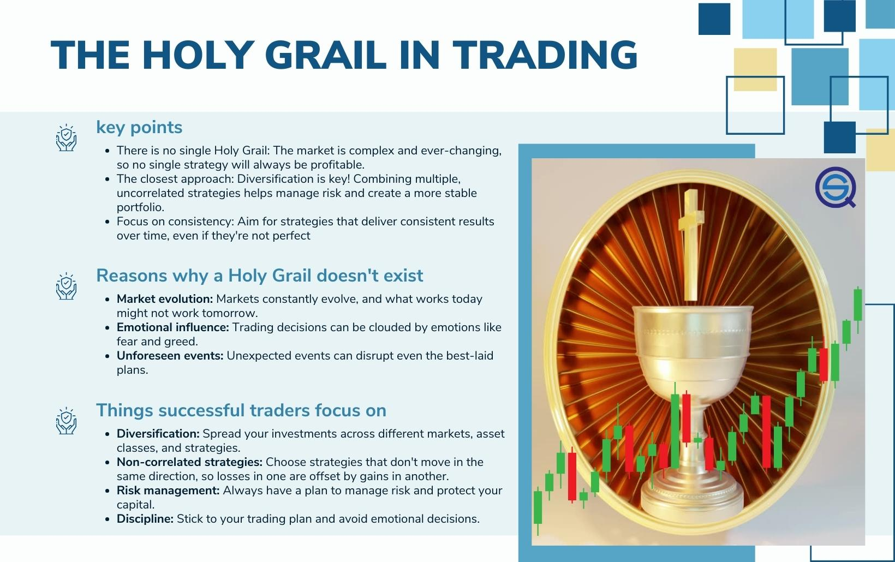

The concept of a 'Holy Grail' strategy in algorithmic trading is often perceived as the epitome of success, an elusive formula promising traders unwavering prosperity and consistent profits. This notion captivates many within the trading community, driving an ongoing pursuit of the ultimate strategy that could potentially defy market uncertainties. However, in the pragmatic world of trading, such an infallible strategy remains a myth.

In actuality, the trading landscape is characterized by its inherent unpredictability, making it impossible for any single strategy to continuously deliver success under all market conditions. Each trading algorithm is subject to varying risks, market dynamics, and unforeseen external factors, which can influence its effectiveness. This realization prompts traders to reconsider the quest for a singular perfect strategy and instead directs attention toward cultivating a diversified portfolio of trading strategies. By doing so, traders can harness the strengths of multiple approaches to mitigate risks and enhance the potential for steady returns.



This article will explore the myths and realities surrounding the idea of a 'Holy Grail' strategy in algorithmic trading. It will emphasize the significance of diversification as a pivotal component in crafting robust trading strategies. Through diversification, traders can navigate market fluctuations more effectively, balancing risks and rewards across a variety of non-correlated strategies. This approach not only minimizes the potential for significant losses but also capitalizes on diverse market opportunities, presenting a more realistic pathway to achieving consistent profitability.

## Table of Contents

## Understanding the Myth of the Holy Grail in Trading

The concept of a "Holy Grail" in trading refers to the elusive strategy that consistently delivers profits without any risk. Traders and investors are often lured by the promise of such a strategy, hoping to unlock the secret to perpetual gains. However, the reality of financial markets, with their inherent volatility and unpredictability, renders this idea a mere myth. 

Markets are influenced by a myriad of factors, ranging from economic indicators and geopolitical events to investor sentiment and technological advancements. These dynamic and often unpredictable elements mean that a single strategy, no matter how successful in the short term, cannot withstand all market conditions indefinitely. For instance, a trend-following strategy may perform exceptionally well in a bull market but falter during a sideways or bearish market. Similarly, a strategy focused on mean reversion might experience losses in a market exhibiting strong directional moves.

Many traders, particularly those new to the field, fall into the trap of seeking or developing a "perfect" trading algorithm. This pursuit often involves extensive backtesting and optimization against historical data to create a strategy that demonstrates high past performance. While this might lead to impressive backtest results, it often results in overfitting—where the strategy is tailored too closely to historical data, making it ineffective in live trading. 

A significant drawback of focusing on a single strategy is the lack of adaptability. Market conditions can change rapidly, and a previously successful strategy might start underperforming. Traders who have invested considerable time and resources into perfecting a lone strategy often face frustration when confronted with changing market dynamics. The emotional and financial costs can be substantial, leading to potential losses as they cling to a strategy that no longer works optimally.

The key to avoiding these pitfalls lies in recognizing the limitations of a single-strategy approach and embracing diversification. By spreading investments across multiple strategies and instruments, traders can mitigate the risk of any one strategy's failure. This balanced approach not only provides a buffer against market [volatility](/wiki/volatility-trading-strategies) but also increases the chances of capturing diverse market opportunities, ultimately steering traders away from the illusion of a trading "Holy Grail" towards a more sustainable path.

## Diversification: The Real Holy Grail

Diversification stands as one of the most effective means to navigate the unpredictable waters of financial markets, offering a pathway to consistent risk-adjusted returns. Instead of relying on a singular strategy that might falter when market conditions shift, traders who harness multiple non-correlated strategies are better positioned to endure volatility and extract gains across various economic environments.

In practice, diversification in [algorithmic trading](/wiki/algorithmic-trading) entails constructing a robust portfolio comprising strategies that are individually tailored to exploit opportunities within distinct markets and asset classes. By doing so, traders can effectively spread risk, thereby diminishing the potential for significant losses from any one strategy or market movement. For instance, incorporating strategies that focus on equities, commodities, foreign exchange, and fixed income can provide a well-rounded exposure, minimizing reliance on the performance of a single asset class.

A diversified approach leverages the power of correlation—or the lack thereof. When the trading strategies in a portfolio are non-correlated, the likelihood that they will all underperform simultaneously is significantly reduced. This non-correlation can be mathematically represented through the correlation coefficient $\rho$. If $\rho$ is close to zero between two strategies, they are deemed to provide effective diversification benefits.

Moreover, diversification enables the seizing of a broader spectrum of market opportunities. Market conditions that negatively impact a trend-following strategy, for instance, might simultaneously create opportunities for a mean-reversion strategy. By maintaining a strategic mix that encompasses various trading styles such as [momentum](/wiki/momentum), [carry](/wiki/carry-trading) trades, and [arbitrage](/wiki/arbitrage), traders can capture a wider array of market inefficiencies.

In sum, while no single trading strategy can be dubbed the "Holy Grail," diversification brings traders as close as possible to achieving this ideal. It reduces exposure to any one source of risk, balances overall portfolio returns, and enhances the potential for sustained profitability. Without diversification, traders are left vulnerable to the vicissitudes of market conditions, but with it, they fortify their capacity to stay resilient and prosperous.

## Key Elements of a Diversified Trading Strategy

A diversified trading strategy aims to spread investment risk by exposure across multiple markets, strategies, and time frames. This approach helps traders navigate various market conditions while attempting to smooth out potential volatility in their returns. Here are the key elements involved in forming a diversified trading strategy:

1. **Trade Multiple Markets**: By diversifying investments across various markets such as forex, commodities, metals, indices, and more, traders can minimize the impact of adverse movements in any single market. This cross-market exposure reduces concentration risk, ensuring that poor performance in one market does not overly affect the overall portfolio. For instance, a downturn in equity indices may not simultaneously affect commodities, which might behave quite differently under the same economic conditions.

2. **Employ Various Strategies**: A balanced portfolio utilizes a mix of trading strategies, including but not limited to trend-following, momentum, and mean reversion. Trend-following strategies, for example, capitalize on extended price movements in one direction, whereas mean reversion strategies bet on prices returning to their average over time. This variety ensures that the portfolio is not overly dependent on a single market condition or trading philosophy, thereby enhancing robustness. Here's a basic example of how these strategies can be implemented in Python using simple moving averages (SMA):

   ```python
   def trend_following_signal(prices, short_window=40, long_window=100):
       short_sma = prices.rolling(window=short_window).mean()
       long_sma = prices.rolling(window=long_window).mean()
       signal = (short_sma > long_sma).astype(int)
       return signal
   ```

3. **Combine Long and Short Positions**: Incorporating both long and short positions allows traders to hedge against market downturns and capitalize on declining markets. A long position profits from price increases, while a short position benefits from price decreases. Balancing these positions helps protect the portfolio from unilateral market trends and reduces potential losses during market corrections.

4. **Use Different Time Frames**: Employing strategies across various time frames, such as intraday, daily, or weekly, provides a comprehensive market view and improves risk management. This diversification across time dimensions allows traders to capture opportunities that manifest over different durations and adjust for varying volatility patterns. For instance, an intraday strategy might exploit short-term price anomalies, while a longer-term strategy might focus on macroeconomic trends.

By incorporating these elements into a trading strategy, traders aim to achieve a more stable performance profile. Diversification mitigates the risks associated with any single strategy or market condition, making it an essential component of successful algorithmic trading.

## The Role of Quantitative Trading

Quantitative trading, often referred to as quant trading, leverages mathematical models and computational algorithms to optimize trading strategies. This approach facilitates simultaneous execution of multiple trading strategies, effectively reducing the burden and complexity typically associated with the vast amount of market data. By automating the decision-making process, quant trading helps minimize emotional biases that can cloud judgment and lead to suboptimal decisions.

The primary advantage of quant trading lies in its ability to promote diversification among trading strategies. Diversification is achieved by developing non-correlated strategies that can be executed concurrently, each catering to different market scenarios and asset classes. This ensures a balanced portfolio that is less vulnerable to individual market fluctuations.

Automation plays a pivotal role in the efficacy of [quantitative trading](/wiki/quantitative-trading). It allows for [backtesting](/wiki/backtesting) of strategies across historical data, providing insights into potential performance and risk factors associated with each strategy. Traders can implement automation through various programming languages, with Python being a popular choice due to its libraries and frameworks specifically designed for financial analysis and algorithmic trading.

Here is a simple example of a backtesting function in Python that evaluates a moving average crossover strategy:

```python
import pandas as pd

def backtest_moving_average(data, short_window=40, long_window=100):
    signals = pd.DataFrame(index=data.index)
    signals['price'] = data['close']
    signals['short_ma'] = data['close'].rolling(window=short_window, min_periods=1).mean()
    signals['long_ma'] = data['close'].rolling(window=long_window, min_periods=1).mean()

    # Generate signals
    signals['signal'] = 0.0
    signals['signal'][short_window:] = np.where(signals['short_ma'][short_window:] > signals['long_ma'][short_window:], 1.0, 0.0)
    signals['positions'] = signals['signal'].diff()

    # Calculate returns
    signals['portfolio'] = signals['signal'].shift(1) * (data['close'].pct_change())
    signals['cumulative_returns'] = (1 + signals['portfolio']).cumprod()

    return signals

# Example usage with historical stock data
# data = pd.read_csv('historical_stock_data.csv', index_col='date', parse_dates=True)
# result = backtest_moving_average(data)
```

In the function above, the `backtest_moving_average` calculates simple moving averages over specified windows to determine buy and sell signals. By using these signals, traders can quantitatively assess the performance of the strategy across various time frames before deploying it in live markets.

Overall, quantitative trading empowers traders to enhance their strategy portfolios efficiently. By leveraging automation and computational tools, it reduces the psychological impact of trading, enabling traders to focus on the continual refinement and adaptation of strategies to achieve consistent and optimal results.

## Conclusion

The quest for a single Holy Grail trading strategy is a persistent myth in algorithmic trading. However, reality dictates that no singular strategy can consistently outperform in the ever-fluctuating financial markets. The path to stable profitability lies in building a diversified portfolio of strategies.

Diversification stands at the core of consistent trading success. By spreading investments across various strategies that are non-correlated, traders can effectively manage risk. This approach mitigates potential losses that might arise when market conditions change unfavorably for a particular strategy. Non-correlation ensures that when one strategy underperforms, others may thrive, balancing the overall portfolio performance.

Quantitative trading further supports this diversified approach, allowing traders to simultaneously manage multiple strategies without the cognitive overload of processing extensive market data manually. Automation facilitates objective decision-making, helping to eliminate emotional biases which often impair trading performance. Through rigorous backtesting, traders can refine their strategies to enhance reliability and performance over time.

Together, diversification, non-correlation, and quantitative trading create a robust foundation for traders seeking a sustainable edge in volatile markets, transforming the elusive notion of a Holy Grail strategy into a practical, achievable methodology.

## References & Further Reading

[1]: Bergstra, J., Bardenet, R., Bengio, Y., & Kégl, B. (2011). ["Algorithms for Hyper-Parameter Optimization."](https://papers.nips.cc/paper/4443-algorithms-for-hyper-parameter-optimization) Advances in Neural Information Processing Systems 24.

[2]: ["Advances in Financial Machine Learning"](https://www.amazon.com/Advances-Financial-Machine-Learning-Marcos/dp/1119482089) by Marcos Lopez de Prado

[3]: ["Evidence-Based Technical Analysis: Applying the Scientific Method and Statistical Inference to Trading Signals"](https://www.amazon.com/Evidence-Based-Technical-Analysis-Scientific-Statistical/dp/0470008741) by David Aronson

[4]: ["Machine Learning for Algorithmic Trading"](https://github.com/stefan-jansen/machine-learning-for-trading) by Stefan Jansen

[5]: ["Quantitative Trading: How to Build Your Own Algorithmic Trading Business"](https://books.google.com/books/about/Quantitative_Trading.html?id=j70yEAAAQBAJ) by Ernest P. Chan