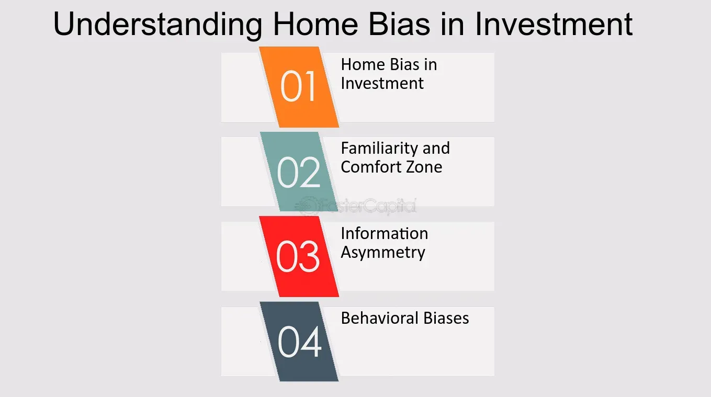

## Table of Contents

## What is home bias in the context of investment and economics?

Home bias in investment and economics refers to the tendency of investors to prefer investing in their own country's assets, like stocks and bonds, over foreign assets. This preference can lead to a situation where a large portion of an investor's portfolio is concentrated in their home country, even when there might be better investment opportunities abroad. It's a common behavior, but it can limit the diversification of an investor's portfolio, which is important for managing risk.

This bias can be influenced by several factors. One reason is that investors feel more comfortable with what they know, and they are more familiar with companies and economic conditions in their own country. Another factor is the perceived higher risk of investing in foreign markets, due to things like currency fluctuations, different regulations, and political instability. While home bias is natural, understanding and overcoming it can help investors build a more balanced and potentially more profitable portfolio.

## How does home bias affect individual and institutional investors?

Home bias can have a big impact on both individual and institutional investors. For individual investors, it often means they put most of their money into companies and assets in their own country. This can make their investments less diverse, which means they might miss out on good opportunities in other countries. It can also make their investments riskier because if something bad happens to their country's economy, their whole portfolio could be affected. 

Institutional investors, like big pension funds or insurance companies, also feel the effects of home bias. They manage a lot of money and are supposed to spread it out to reduce risk. But if they stick too much to their home market, they might not be doing the best job for their clients. Just like individual investors, they could lose out on better returns from other countries and their portfolios might be more vulnerable to problems in their home economy.

## What are the common reasons behind the occurrence of home bias?

One big reason for home bias is that people feel more comfortable investing in what they know. If you live in a country, you probably know more about its companies and how its economy works. This familiarity makes people feel safer putting their money into their own country's assets, even if there might be good opportunities elsewhere. It's like choosing to eat at a restaurant you know instead of trying a new one.

Another reason is the fear of the unknown. Investing in foreign countries can seem riskier because of things like currency changes, different rules, and political problems. These uncertainties can scare investors away from putting their money in other countries. It's like not wanting to travel to a place where you don't speak the language or know the customs.

Lastly, there are practical reasons too. It can be harder and more expensive to invest in foreign markets because of things like taxes and extra fees. Sometimes, it's just easier to invest at home. It's like choosing to shop locally instead of ordering something from far away because it's simpler and might cost less.

## Can you explain the psychological factors contributing to home bias?

One big psychological [factor](/wiki/factor-investing) behind home bias is something called "familiarity bias." This means people tend to like things they know well. When it comes to investing, people feel more comfortable putting their money into companies and markets they understand. If you live in a country, you probably know more about its businesses and economy than those in other countries. This makes you feel safer investing at home, even if there might be better opportunities abroad. It's like choosing to buy a product from a brand you trust instead of trying something new.

Another psychological factor is the fear of the unknown, which is called "ambiguity aversion." People don't like uncertainty, and investing in foreign markets can seem very uncertain. There are lots of things that can make foreign investments feel risky, like changes in currency values, different laws, and political issues. These uncertainties can make people nervous about putting their money in other countries. It's like not wanting to go on a trip to a place where you don't know the language or the customs because it feels too risky and unknown.

## What role does familiarity play in the development of home bias?

Familiarity plays a big role in why people prefer to invest in their own country. When you know a lot about something, you feel more comfortable with it. So, if you live in a country, you probably know more about its businesses and how its economy works. This makes you feel safer putting your money into companies and markets you understand. It's like choosing to eat at a restaurant you've been to before instead of trying a new one. You trust what you know, and that trust makes you more likely to invest at home.

This preference for what's familiar can lead to home bias because people might miss out on good investment opportunities in other countries. If you only invest in what you know, you might not look at other places where you could make more money or spread out your risk. It's like staying in your hometown your whole life because you know it well, even though there might be exciting places to explore elsewhere. Familiarity makes home bias feel safe and easy, but it can also limit your investment choices.

## How does information asymmetry contribute to home bias?

Information asymmetry means that people in one country know more about their own markets than about markets in other countries. This difference in knowledge can make investors feel more comfortable putting their money into their home country because they understand it better. It's like choosing to play a game you know the rules to instead of one where you're not sure what to do. Because of this, investors might not look at other countries where they could find good investments, leading to home bias.

This lack of information about foreign markets can make them seem riskier. If you don't know as much about a foreign company or economy, it can feel like a bigger gamble to invest there. This fear of the unknown can keep investors from spreading their money around the world, even though doing so could help them make more money and reduce risk. It's like not wanting to try a new food because you don't know if you'll like it, so you stick to what you know.

## What are the potential economic impacts of home bias on a country's market?

Home bias can have big effects on a country's market. When most investors in a country choose to put their money only into their own country's companies and assets, it can make the market grow faster. More money flowing into the market can help businesses get the funds they need to expand and create jobs. This can make the economy stronger and more stable. But, if everyone is investing at home, it can also make the market less diverse. If something bad happens to the economy, like a recession, everyone's investments could be hurt at the same time because they're all in the same place.

On the other hand, home bias can also make it harder for a country to attract money from other countries. If investors from other places see that everyone in a country is only investing at home, they might think the market is too risky or not open to outside money. This can limit how much foreign investment comes in, which can slow down economic growth. It's like if a store only sells to local people and doesn't welcome customers from other towns; it might miss out on a lot of business. So, while home bias can help the local market in some ways, it can also make it harder for the country to grow and connect with the global economy.

## How can home bias be measured and quantified in investment portfolios?

Home bias in investment portfolios can be measured by looking at how much of an investor's money is invested in their own country compared to how much they have in foreign countries. One way to do this is to compare the percentage of a portfolio that's in the home market to the percentage of the world's total market value that the home market represents. For example, if a country's stock market makes up 10% of the world's total stock market value, but an investor has 70% of their portfolio in that country, they have a strong home bias.

Another way to measure home bias is by using something called the "home bias index." This index looks at how much an investor's portfolio differs from what it would look like if they invested in the world's markets according to their size. If the home bias index is high, it means the investor is putting a lot more money into their home market than they would if they were following the world's market proportions. By using these methods, investors can see how much home bias they have and think about if they want to change their investment strategy to be more diverse.

## What strategies can investors use to mitigate the effects of home bias?

One way investors can reduce home bias is by learning more about foreign markets. They can read about other countries' economies, study international companies, and maybe even travel to get a better feel for different places. By understanding more about what's going on in other parts of the world, investors might feel more comfortable putting some of their money into foreign assets. It's like trying new foods; the more you know about them, the more likely you are to give them a try.

Another strategy is to use investment funds that focus on international markets. These funds, like global mutual funds or ETFs, let investors spread their money across many different countries without having to pick each investment themselves. This can help reduce the risk of having all their money in one place and can open up more opportunities for growth. It's like joining a group trip to explore new places instead of going alone; it can be easier and less scary.

Lastly, investors can work with financial advisors who have experience in international investing. These experts can help guide investors through the process of diversifying their portfolios and can provide advice on how to balance investments between home and abroad. With professional help, investors can feel more confident about trying new markets and reducing their home bias. It's like having a coach to help you learn a new sport; they can show you the best ways to play and improve your game.

## Are there any regulatory or policy measures that address home bias?

Some countries have rules and policies to help reduce home bias in investing. For example, they might encourage pension funds or other big investors to put some of their money into foreign markets. This can be done by setting rules that say a certain part of their investments has to be in other countries. Governments might also offer tax breaks or other benefits to investors who put money into foreign assets. These kinds of rules and incentives can help make it easier and more appealing for investors to look beyond their own country.

Another way governments can address home bias is by working together with other countries to make it easier to invest across borders. This can include making agreements that lower the costs and risks of investing in foreign markets. For example, they might agree to reduce taxes on foreign investments or make it easier to trade stocks between countries. By making it simpler and less risky to invest abroad, these policies can help investors feel more comfortable spreading their money around the world.

## How does home bias vary across different countries and cultures?

Home bias can be different in different countries and cultures. In some places, people might feel really safe and comfortable investing in their own country because they trust their government and economy a lot. For example, in the United States, many investors have a big part of their money in U.S. stocks and bonds because they know a lot about American companies and feel good about the economy. But in other countries, where the economy might not be as strong or there might be more political problems, people might be more open to investing in other places. They might see their home market as too risky and look for better opportunities abroad.

Culture also plays a big role in home bias. In some cultures, people might stick to what they know and feel safer keeping their money at home. They might not trust foreign markets as much because they don't understand them as well. In other cultures, people might be more adventurous and open to trying new things, including investing in other countries. They might see the world as a big place full of opportunities and want to spread their money around to different markets. So, home bias can be stronger or weaker depending on where you live and the culture you're part of.

## What are the latest research findings on the long-term effects of home bias on global investment patterns?

Recent research shows that home bias can have big effects on how people invest around the world over a long time. When investors keep most of their money in their own country, it can make their home market grow faster because more money is going into it. But this can also make the market less diverse. If something bad happens to the economy, like a big drop in stock prices, everyone's investments could be hurt at the same time because they're all in the same place. This can make the economy less stable and more risky for everyone.

On the other hand, home bias can also make it harder for countries to get money from other places. If investors from other countries see that everyone in a country is only investing at home, they might think the market is too risky or not open to outside money. This can slow down economic growth because less foreign money is coming in. Over time, this can make it harder for countries to connect with the global economy and might limit their chances to grow and develop.

## References & Further Reading

[1]: Barber, B. M., & Odean, T. (2000). ["Trading is Hazardous to Your Wealth: The Common Stock Investment Performance of Individual Investors."](https://faculty.haas.berkeley.edu/odean/Papers%20current%20versions/Individual_Investor_Performance_Final.pdf) Journal of Finance, 55(2), 773-806.

[2]: Kahneman, D., & Tversky, A. (1979). ["Prospect Theory: An Analysis of Decision under Risk."](https://www.jstor.org/stable/1914185) Econometrica, 47(2), 263-291.

[3]: Lopez de Prado, M. (2018). ["Advances in Financial Machine Learning."](https://www.amazon.com/Advances-Financial-Machine-Learning-Marcos/dp/1119482089) Wiley.

[4]: Thaler, R. H. (1999). ["The End of Behavioral Finance."](https://www.researchgate.net/publication/2593983_The_End_of_Behavioral_Finance) Financial Analysts Journal, 55(6), 12-17.

[5]: Chan, E. P. (2009). ["Quantitative Trading: How to Build Your Own Algorithmic Trading Business."](https://github.com/ftvision/quant_trading_echan_book) Wiley.  

[6]: Jansen, S. (2018). ["Machine Learning for Algorithmic Trading."](https://github.com/stefan-jansen/machine-learning-for-trading) Packt Publishing.