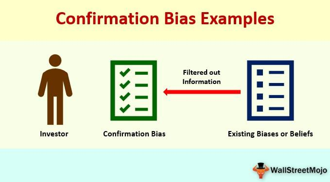

The intersection of financial psychology, home bias, investment behavior, and algorithmic trading offers a compelling exploration into how emotions and biases can influence investment decisions. Financial psychology provides a foundation for understanding abnormal patterns in financial decision-making that conventional economic theories often overlook. Home bias, an essential aspect of this framework, describes the tendency of investors to disproportionately allocate their portfolios in favor of domestic equities, potentially leading to suboptimal diversification and heightened risk exposure.

This article explores these concepts both individually and collectively, shedding light on their individual impacts on investors—both amateur and professional. Recognizing these elements is essential for enhancing investment outcomes and effectively leveraging algorithmic strategies. Financial psychology, for instance, acts as a critical underpinning of home bias by explaining why investors exhibit preferences for familiar, domestic markets, often due to perceived security.



Conversely, algorithmic trading presents opportunities to mitigate these emotional biases through data-driven insights and objective decision-making processes. By incorporating algorithms that factor in global market trends, investors can minimize the emotional sway inherent in traditional trading practices. The role of algorithms extends beyond merely counteracting biases; they serve as tools through which investors can formulate more globally diversified portfolios, aligning with broader financial goals and risk mitigation strategies.

The subsequent sections of this article will further break down these intersecting areas, presenting strategies for overcoming home bias. Through this examination, we aim to provide investors with the tools and knowledge needed to adopt a more comprehensive approach to their investment portfolios, maximizing potential returns while minimizing undue risks.

## Table of Contents

## Understanding Financial Psychology and Home Bias

Financial psychology is a field that explores the complex interplay between emotions, cognitive biases, and financial decision-making. It posits that investors are often influenced by cognitive biases rather than purely logical analysis. One of the most prevalent biases observed in financial markets is home bias, where investors exhibit a preference for domestic investments over foreign ones. This inclination is largely driven by familiarity and perceived safety, as investors tend to gravitate towards options they are comfortable with and believe to be less risky.

Home bias is a significant concern as it can result in suboptimal investment portfolios that are insufficiently diversified. A lack of diversification can expose investors to higher levels of risk, as opportunities for mitigating volatility through a broader asset allocation might be missed. This bias is often overlooked but crucial in understanding why investors might not achieve optimal financial outcomes.

Several psychological factors underpin home bias. Familiarity plays a substantial role as investors prefer countries or regions they know well, assuming less risk in nations where they understand the political and economic landscape. Overconfidence is another [factor](/wiki/factor-investing) where investors believe their knowledge of domestic markets gives them an edge, when in reality, this can lead to underestimating the potential of international investments. Loss aversion, the tendency to prefer avoiding losses to acquiring equivalent gains, further cements home bias as investors fear potential losses in less familiar international markets more than they seek gains.

Historically, the manifestation of home bias can be observed in numerous financial crises where investors' inclination to heavily invest in domestic markets contributed to systemic risks and economic downturns. For example, during the 2008 financial crisis, many investors suffered significant losses due to over-reliance on domestic real estate and stock markets. Case studies from this period highlight the dangers of concentrated investments and the need for diversification to buffer against localized economic shocks.

In conclusion, understanding the psychological foundations of home bias is essential for developing strategies that promote more diversified and resilient investment portfolios. Recognizing and addressing these biases can lead to more balanced decision-making processes and improved financial outcomes.

## Investment Behavior: The Impact of Behavioral Biases

Investment behavior frequently deviates from the rational models proposed by traditional economic theories, largely due to psychological biases such as overconfidence and herding. These biases can distort judgment and decision-making processes, leading investors to make choices that are not in their best financial interest.

### Overconfidence Bias

Overconfidence bias occurs when individuals overestimate their knowledge, abilities, or the precision of their information. In investment scenarios, overconfident investors might underestimate risks or overrate their ability to predict market movements. This can lead to excessive trading, as investors believe they can outperform the market, often resulting in increased transaction costs and reduced overall returns. Research by Barber and Odean (2000) shows that individual investors who trade excessively underperform the market after accounting for fees and costs, primarily due to overconfidence in their market predictions.

### Herding Behavior

Herding is the tendency of investors to follow the actions of a larger group, often ignoring their own analysis or beliefs. This behavior is driven by the comfort of group consensus and fear of missing out or the negative consequences of acting independently. Herding can amplify market trends, contributing to phenomena like asset bubbles and subsequent crashes. A classic example is the dot-com bubble of the late 1990s, where investors piled into tech stocks without substantial individual analysis, driven by the fear of missing out on the tech boom.

### Familiarity and Loss Aversion

Familiarity bias leads investors to favor investments they are familiar with, such as domestic companies or local markets, possibly at the expense of diversification. Loss aversion, a concept detailed by Kahneman and Tversky's Prospect Theory, underscores that investors experience the pain of losses more intensely than the pleasure of equivalent gains. This can result in aversion to selling losing investments, hoping to avoid realizing a loss, or hesitating to invest in unfamiliar assets that might provide better returns.

### Manifestation in Individual Investors and Fund Managers

Both individual investors and fund managers can fall prey to these biases. While individuals may make non-rational choices based on personal judgments, professional fund managers, despite having more information and tools at their disposal, are not immune. The pressure to perform relative to peer groups can lead fund managers to engage in herding behavior, aligning their strategies with market trends rather than contrarian approaches that may be more beneficial in the long term. Studies indicate that fund managers might even exhibit overconfidence, impacting the portfolios they manage, as they rely heavily on their perceived expertise.

### Real-world Examples

The 2008 financial crisis provides insight into the ramifications of these biases. Excessive confidence in rising housing market prices led to increased borrowing and risky financial products, eventually culminating in market collapse. Similarly, during the GameStop stock surge in early 2021, herd behavior was evident as investors rushed to buy shares based on hype rather than intrinsic value, driving prices to unsustainable levels.

### Mitigation Strategies

Several strategies can help mitigate the influence of behavioral biases on investment decisions. Incorporating systematic decision-making processes, like maintaining a diversified portfolio and setting predefined investment criteria, can reduce the impact of biases. Behavioral training for investors and fund managers can raise awareness and help recognize when decisions are being influenced by irrational biases. Additionally, [algorithmic trading](/wiki/algorithmic-trading) systems can offer a more unbiased approach by relying on data-driven decisions rather than human emotions. These algorithms are programmed to make trades based on pre-set rules and market data, which can counteract biases like overconfidence and herding by removing the emotional component from trading activities.

By understanding and addressing behavioral biases, investors can improve decision-making processes, ultimately enhancing investment outcomes and achieving more stable returns over time.

## Role of Algorithmic Trading in Modern Investment Decisions

Algorithmic trading leverages sophisticated algorithms and financial models to automate the trading process, reducing the necessity for human involvement. This approach offers a significant advantage in minimizing the influence of emotional and psychological biases that often cloud investment decisions. By relying on data-driven insights, algorithmic strategies foster an objective trading environment, paving the way for more rational and consistent decision-making.

Algorithmic trading systems can be specifically designed to address home bias by integrating comprehensive global market data into investment strategies. These systems evaluate information from multiple sources and make real-time decisions that consider international opportunities, thereby enhancing portfolio diversification. Advanced algorithms can assess a wide range of economic indicators, market trends, and asset performance metrics from global markets, guiding investors towards more geographically balanced portfolios.

One of the primary benefits of algorithmic trading is its ability to optimize portfolio diversification and asset allocation efficiently. This is achieved through sophisticated techniques such as mean-variance optimization, which aims to maximize returns for a given level of risk. The algorithm continuously adjusts the investment mix, ensuring alignment with the desired risk-reward profile while also keeping transaction costs minimal. For instance, algorithms can automatically rebalance portfolios to maintain a specific allocation across asset classes, ensuring that investments remain diversified.

Case studies in algorithmic trading highlight its capability to mitigate the emotional biases inherent in human traders. For example, during periods of market [volatility](/wiki/volatility-trading-strategies), human investors may exhibit behaviors such as panic selling or irrational exuberance. In contrast, algorithmic systems adhere strictly to predefined criteria and risk management protocols, making unemotional decisions based solely on statistical and computational models. In practice, this means executing trades that a human might overlook or avoid due to cognitive biases.

Additionally, algorithmic trading can be tailored to execute specific investment strategies such as [momentum](/wiki/momentum) trading, [arbitrage](/wiki/arbitrage), and [statistical arbitrage](/wiki/statistical-arbitrage). These strategies exploit inefficiencies and patterns in the market that are often imperceptible to human traders but can be identified and acted upon by algorithms. For instance, statistical arbitrage employs mathematical models to identify price discrepancies across various markets or instruments, making it possible to execute profitable trades before the market adjusts.

In conclusion, algorithmic trading plays a pivotal role in modern investment decisions by enhancing objectivity, precision, and efficiency. By addressing home bias and optimizing asset allocation, algorithms support superior portfolio management strategies, ultimately contributing to improved investment outcomes.

## Integrating Global Diversification Strategies

Global diversification is a critical strategy in minimizing risks associated with home bias, ensuring investors are not overly reliant on their domestic markets. Home bias often leads to under-diversification, where investors miss out on opportunities offered by international markets. By expanding investment horizons to include foreign assets, investors can enhance portfolio performance and reduce risk exposure.

### Importance of Diversified Funds
Investors are advised to explore international investment opportunities through diversified funds such as Exchange-Traded Funds (ETFs) and mutual funds. These investment vehicles are designed to provide exposure to a broad range of global markets without requiring significant individual market knowledge. ETFs and mutual funds typically offer lower costs, professional management, and the benefit of pooling resources, making them attractive options for individual investors seeking international diversification.

### Tax Benefits and Barriers
Investing internationally may offer tax benefits, such as potential tax deferrals or credits provided through double taxation agreements between countries. However, investors must also navigate potential barriers like foreign transaction fees, currency exchange risks, and regulatory differences. Understanding these factors is vital for minimizing costs and optimizing returns. For example, investors can leverage tax-efficient investment accounts like tax-free savings accounts or utilize foreign tax credit systems to offset international taxes.

### Tools and Strategies for Global Diversification
Several tools and strategies can assist investors in crafting a globally diversified portfolio. Financial software tools and platforms offer comprehensive data analysis, enabling investors to assess global market trends and asset correlations effectively. Strategic asset allocation models can also aid in ensuring diversified exposure across various regions and sectors. Below is a basic Python script example that demonstrates calculating the correlation matrix among various international assets, which is crucial for diversification analysis:

```python
import numpy as np
import pandas as pd

# Sample data - returns from international assets
data = {
    'US': [0.1, 0.15, -0.05, 0.07],
    'EU': [0.08, -0.1, 0.12, 0.05],
    'Asia': [0.12, 0.11, -0.08, -0.05],
    'EM': [0.15, -0.05, 0.1, 0.03]  # Emerging Markets
}

df = pd.DataFrame(data)

# Calculate the correlation matrix
correlation_matrix = df.corr()

print(correlation_matrix)
```

### Real-Life Examples
Successful global diversification can significantly enhance portfolio returns. For instance, during periods of economic downturns in the U.S., investors with international exposure have benefited from growth in emerging markets, which often experience different economic cycles. This international diversification offers a buffer against local market volatility and improves risk-adjusted returns.

Historical data support that globally diversified portfolios tend to outperform those that are domestically focused alone, especially during financial crises when individual markets experience downturns at different times or magnitudes. Investors can utilize these insights by rebalancing portfolios to maintain global diversification, ensuring stable growth and reduced volatility over time.

In conclusion, integrating global diversification into investment strategies is vital for countering home bias. By leveraging diversified funds, understanding tax implications, and utilizing analytical tools, investors can build robust portfolios that optimize returns and reduce risks associated with domestic market dependence.

## Practical Tips for Investors to Overcome Home Bias

Investors seeking to overcome home bias and improve their investment outcomes can adopt several practical strategies. Regularly reviewing and rebalancing their portfolio is a fundamental step. This process involves assessing the performance of various assets and comparing them against original investment objectives. By reallocating resources to maintain the desired level of asset diversification, investors can ensure they are not overly concentrated in domestic assets, thereby mitigating the risks associated with home bias.

Seeking professional financial advice is another effective strategy. Financial advisors can offer valuable insights into global market trends and help investors make informed decisions that align with their risk tolerance and investment goals. These professionals are skilled at identifying opportunities for international diversification, which is crucial for reducing exposure to domestic market volatility.

Incorporating algorithmic trading tools can also be beneficial in counteracting behavioral biases. These tools provide an objective approach to trading by leveraging data-driven models to make decisions. This minimizes human emotional influence on trading actions. Algorithmic trading can be particularly useful in enforcing disciplined investment strategies, as it systematically applies pre-defined rules to buy or sell assets, thereby reducing the likelihood of bias-driven decisions.

Education on global markets and the benefits of diversification plays a crucial role in overcoming home bias. Investors who are well-informed about international opportunities are more equipped to diversify their portfolios beyond domestic borders. Resources such as online courses, financial news platforms, and investment seminars can enhance an investor's understanding of global markets and the various instruments available for diversification, like index funds and international ETFs.

Setting long-term investment goals and adhering to a disciplined strategy can further mitigate the influence of emotional biases. This involves defining clear financial objectives and developing a roadmap to achieve them, which might include investment in a mix of asset classes and geographies. Sticking to this plan, even in times of market turbulence, promotes rational decision-making over impulsive reactions to short-term market movements.

In conclusion, by engaging in regular portfolio reviews, seeking professional guidance, utilizing algorithmic tools, pursuing continuous education, and maintaining a disciplined long-term approach, investors can effectively reduce home bias. This broadened perspective not only enhances portfolio diversification but also positions investors to capitalize on global growth opportunities. Resources such as financial planning software, global market reports, and educational workshops can further support these efforts in refining investment strategies.

## Conclusion

Navigating the complexities of financial psychology, home bias, and algorithmic trading is crucial in the modern investment landscape. Investors are often swayed by emotional and cognitive biases, which can adversely affect portfolio performance. By recognizing these biases and implementing strategies to mitigate them, investors stand a better chance of optimizing returns. Emotional biases, such as loss aversion and overconfidence, often lead to irrational decision-making, which can be counterproductive to achieving financial goals. 

Algorithmic trading emerges as a powerful antidote to these biases, offering an objective, data-driven approach to investment decisions. By leveraging sophisticated algorithms, investors can minimize human error and emotional influence, thus enhancing decision-making accuracy and efficiency. This approach allows the exploitation of market opportunities based on real-time data and eliminates the delay and emotional biases often present in human judgment.

In addition to mitigating biases, global diversification continues to be a cornerstone strategy for achieving stability and growth in investment portfolios. A well-diversified portfolio reduces risk exposure to any single market or economic event, thus providing a buffer against volatility. Exploring international markets through instruments like ETFs and mutual funds can enhance portfolio resilience and performance.

The future of investing rests on the synergy between human insight and advanced technology. By harmonizing investment strategies with algorithmic tools, investors can achieve a more robust methodology that accounts for both the emotional nuances of human behavior and the precision of technology. This integrated approach enables investors to make smarter, more informed financial decisions, ensuring a balanced and comprehensive investment strategy.

## References & Further Reading

[1]: Barber, B. M., & Odean, T. (2000). ["Trading is Hazardous to Your Wealth: The Common Stock Investment Performance of Individual Investors."](https://faculty.haas.berkeley.edu/odean/Papers%20current%20versions/Individual_Investor_Performance_Final.pdf) Journal of Finance, 55(2), 773-806.

[2]: Kahneman, D., & Tversky, A. (1979). ["Prospect Theory: An Analysis of Decision under Risk."](https://www.jstor.org/stable/1914185) Econometrica, 47(2), 263-291.

[3]: Lopez de Prado, M. (2018). ["Advances in Financial Machine Learning."](https://www.amazon.com/Advances-Financial-Machine-Learning-Marcos/dp/1119482089) Wiley.

[4]: Thaler, R. H. (1999). ["The End of Behavioral Finance."](https://www.researchgate.net/publication/2593983_The_End_of_Behavioral_Finance) Financial Analysts Journal, 55(6), 12-17.

[5]: Chan, E. P. (2009). ["Quantitative Trading: How to Build Your Own Algorithmic Trading Business."](https://github.com/ftvision/quant_trading_echan_book) Wiley.  

[6]: Jansen, S. (2018). ["Machine Learning for Algorithmic Trading."](https://github.com/stefan-jansen/machine-learning-for-trading) Packt Publishing.