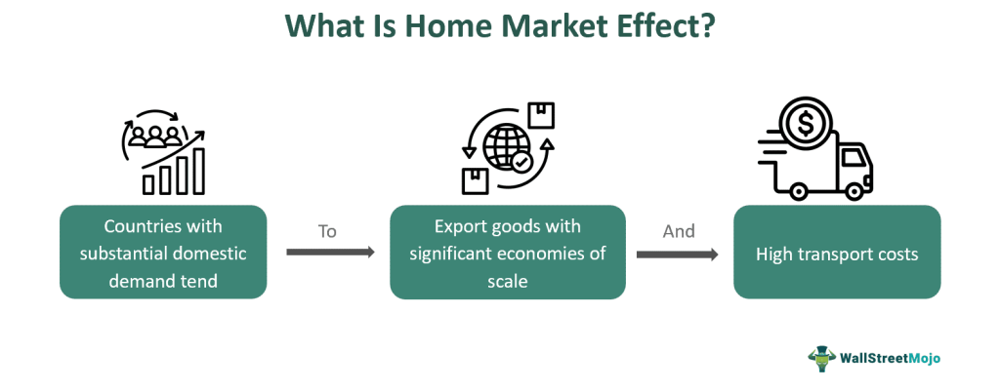

## Table of Contents

## What is the Home Market Effect?

The Home Market Effect is an economic idea that says a country will produce and export more of a product if there are a lot of people in that country who want to buy it. This happens because when there are many customers at home, it becomes cheaper for companies to make the product there. They can then sell it both at home and abroad, making more profit.

For example, if a lot of people in a country like cars, car companies in that country will grow bigger and produce more cars. They can sell these cars to people in their own country and also send them to other countries. This makes the country a big car producer and exporter. So, the size of the home market can really affect what a country makes and sells to the world.

## How does the Home Market Effect influence local economies?

The Home Market Effect can really help local economies grow. When a lot of people in a country want to buy a certain product, companies in that country start making more of it. This means they need more workers, so they hire more people from the local area. More jobs mean more money for people, and they can spend that money on other things in their community. This helps other local businesses too, because when people have more money, they buy more stuff.

But the Home Market Effect can also have some challenges for local economies. If a country is really good at making one thing because of the Home Market Effect, it might focus too much on that one product. This can be risky because if something happens, like a drop in demand for that product, the local economy might struggle. Also, if companies grow big because of the Home Market Effect, they might start moving some of their business to other countries where it's cheaper to make things. This could mean fewer jobs for people in the local area over time.

## Can you explain the basic economic principles behind the Home Market Effect?

The Home Market Effect is based on the idea of economies of scale. This means that the more a company makes of something, the cheaper it becomes to make each piece. When a lot of people in a country want to buy a certain product, companies in that country can make more of it. Because they are making more, the cost to make each item goes down. This makes it easier for them to sell the product at a lower price, both at home and in other countries.

Another important principle is the idea of market size. A bigger market at home means more customers, which can lead to more sales. When companies have a big home market, they can grow bigger and become more efficient. This efficiency helps them compete better in other countries too. So, the size of the home market can really affect what a country makes and sells to the world, helping local companies grow and become strong in the global market.

## What are some real-world examples of the Home Market Effect?

One real-world example of the Home Market Effect is the car industry in Germany. A lot of people in Germany want to buy cars, so German car companies like Volkswagen and BMW make a lot of cars. Because they make so many, it's cheaper for them to make each car. They can sell these cars in Germany and also send them to other countries. This makes Germany a big car producer and exporter.

Another example is the tech industry in the United States. Many people in the U.S. use computers and smartphones, so companies like Apple and Microsoft make a lot of tech products. They can make these products cheaper because they make so many of them. They sell these products in the U.S. and also send them to other countries. This makes the U.S. a big tech producer and exporter.

The Home Market Effect can also be seen in the wine industry in France. A lot of people in France like to drink wine, so French wine producers make a lot of wine. Because they make so much, it's cheaper for them to make each bottle. They can sell this wine in France and also send it to other countries. This makes France a big wine producer and exporter.

## How does the size of a domestic market affect the Home Market Effect?

The size of a domestic market is really important for the Home Market Effect. When a lot of people in a country want to buy something, it makes it easier for companies in that country to make more of it. This is because a bigger market means more customers, so companies can make more things and sell them at home. When they make more, it becomes cheaper to make each thing. This helps companies grow bigger and become more efficient.

Because companies can make things cheaper at home, they can also sell them to other countries for a good price. This makes the country a big producer and exporter of that product. For example, if a lot of people in a country like cars, car companies there will make a lot of cars. They can sell these cars at home and also send them to other countries. So, the size of the domestic market can really help a country become good at making and selling things to the world.

## What role do trade policies play in enhancing or mitigating the Home Market Effect?

Trade policies can really change how the Home Market Effect works. If a country has rules that make it easier to sell things to other countries, like lower taxes on exports, it can help companies grow bigger because they can sell more of what they make. This can make the Home Market Effect stronger because companies can take advantage of their big home market and also sell a lot to other countries. For example, if a country lowers taxes on car exports, car companies there can make more cars and sell them abroad, making their home market even more important.

On the other hand, trade policies can also make the Home Market Effect weaker. If a country has high taxes on things coming in from other countries, it might make it harder for companies at home to get the things they need to make their products. This can make it more expensive for them to make things, even if they have a big home market. Also, if other countries put up barriers to stop imports, it can be harder for companies to sell their products abroad, which can limit how much they can grow because of the Home Market Effect.

## How does the Home Market Effect impact international trade?

The Home Market Effect can really change how countries trade with each other. When a country has a big home market for a product, companies there can make a lot of it. This makes it cheaper for them to make each piece because they can spread out their costs. When they can make things cheaper, they can sell them at a good price both at home and in other countries. This means the country can become a big exporter of that product, sending a lot of it to other countries. So, the Home Market Effect can help a country sell more things abroad, making international trade bigger.

But the Home Market Effect can also make international trade harder in some ways. If a country is really good at making one thing because of its big home market, it might focus too much on that product. This can make it harder for other countries to sell their own products in that market because they can't compete with the low prices. Also, if a country grows big in one industry, it might put up trade barriers to protect its companies. This can make it harder for other countries to sell their things there, which can lead to trade disagreements and less trade overall.

## What are the implications of the Home Market Effect for multinational corporations?

The Home Market Effect can really help multinational corporations grow. When a company has a big market at home, it can make a lot of products and sell them there. This makes it cheaper to make each thing because they can spread out their costs. When they can make things cheaper, they can also sell them to other countries at a good price. This helps multinational corporations become big exporters and grow their business all over the world. For example, a car company in a country where a lot of people buy cars can use its home market to make a lot of cars and then sell them abroad, making more money.

But the Home Market Effect can also make things harder for multinational corporations. If a company grows big because of its home market, it might focus too much on making one thing. This can be risky because if something happens, like people stop wanting that product, the company might struggle. Also, if a company grows big at home, it might have to deal with trade barriers from other countries that want to protect their own businesses. This can make it harder for the company to sell its products in other countries, which can slow down its growth. So, while the Home Market Effect can help multinational corporations grow, it can also bring some challenges.

## How can countries use the Home Market Effect to their advantage in global competition?

Countries can use the Home Market Effect to their advantage in global competition by focusing on products that a lot of people at home want to buy. When there is a big demand for a product in the country, companies can make a lot of it. This makes it cheaper to make each thing because they can spread out their costs. When they can make things cheaper, they can sell them at a good price both at home and in other countries. This helps the country become a big exporter of that product, making it strong in the global market. For example, if a lot of people in a country like cars, the country can help its car companies grow big and sell cars all over the world.

But countries also need to be careful about how they use the Home Market Effect. If a country focuses too much on making one thing because of its big home market, it can be risky. If something happens, like people stop wanting that product, the country's economy might struggle. Also, other countries might put up trade barriers to stop imports, which can make it harder for the country to sell its products abroad. So, while the Home Market Effect can help a country compete better in the global market, it's important for the country to keep an eye on other industries and be ready to change if it needs to.

## What are the criticisms and limitations of the Home Market Effect theory?

Some people say the Home Market Effect theory has problems. One big problem is that it can make a country focus too much on making one thing. If a country only makes one thing because a lot of people at home want it, it can be risky. If people stop wanting that thing, the country's economy might struggle. Also, the theory doesn't always work the same way in every country. Some countries might not have the right resources or technology to make a lot of something, even if a lot of people want it at home.

Another criticism is that the Home Market Effect might not help a country as much if other countries put up trade barriers. If other countries make it hard for the country to sell its products abroad, the Home Market Effect can be weaker. Also, the theory can be hard to use in real life because it's hard to predict what people will want in the future. If a country bets on the wrong product, it might not do well in the global market. So, while the Home Market Effect can help a country, it's important to think about these limitations and criticisms.

## How do technological advancements influence the Home Market Effect?

Technological advancements can make the Home Market Effect stronger. When a country has new technology, it can make things faster and cheaper. If a lot of people in the country want to buy a certain product, companies can use the new technology to make a lot of that product. This makes it even cheaper for them to make each thing because they can make more of them quickly. When they can make things cheaper, they can sell them at a good price both at home and in other countries. This helps the country become a big exporter of that product, making it strong in the global market.

But technological advancements can also change what people want to buy. If new technology makes a new product popular, companies might start making that product instead of the old one. This can make the Home Market Effect weaker for the old product because fewer people want it. Also, if other countries have better technology, they might be able to make things cheaper than the country with the big home market. This can make it harder for the country to sell its products abroad, which can limit how much the Home Market Effect helps it. So, while technology can help the Home Market Effect, it can also bring new challenges.

## What future trends might affect the relevance of the Home Market Effect?

Future trends like more globalization and new technology might change how important the Home Market Effect is. As the world gets more connected, companies might start making things in different countries instead of just at home. This can make the Home Market Effect less important because companies won't need a big home market as much. They can make things where it's cheapest and sell them all over the world. Also, new technology can make it easier for companies to make things quickly and cheaply, no matter where they are. This means the Home Market Effect might not help as much if other countries can make things even cheaper.

Another trend that might affect the Home Market Effect is changes in what people want to buy. As the world changes, people might start wanting different things. If a country's home market doesn't want the same products anymore, the Home Market Effect won't help as much. Companies will have to find new things to make that people want. Also, if more people start caring about where things come from and how they're made, the Home Market Effect might not be as strong. People might choose to buy things from companies that are good to the environment or treat workers well, even if those companies don't have a big home market. So, the Home Market Effect might become less important as these trends change how companies work and what people want.

## What is the relationship between Trade Theory and Economic Geography?

Trade theory offers valuable insights into the mechanisms guiding countries in their commercial engagements, leaning heavily on core principles such as comparative advantage and economies of scale. At its essence, comparative advantage explains how and why countries benefit from specializing in the production of goods for which they have lower opportunity costs, thereby maximizing efficiency and economic gains for trading partners. Meanwhile, economies of scale describe how the per-unit cost of production decreases as the [volume](/wiki/volume-trading-strategy) of production increases, creating an incentive for countries to focus on sectors where large-scale production yields a competitive edge.

Economic geography complements trade theory by examining how the spatial distribution of economic activities is organized and influences trade patterns. This distribution is largely affected by factors such as market size and [factor](/wiki/factor-investing) mobility. Market size influences the concentration of industries, as regions with larger consumer bases attract more businesses looking to minimize transportation costs and maximize market reach. Factor mobility, the ease with which labor and capital can move within and between regions, also plays a significant role by determining the adaptability and growth potential of different economic areas.

The gravitational model of trade provides a quantitative framework to analyze how proximity between regions impacts trade intensity. This model posits that the trade flow between two regions is directly proportional to their economic mass (often represented by GDP) and inversely proportional to the distance between them. The basic formula is expressed as:

$$
T_{ij} = \frac{G \times M_i \times M_j}{D_{ij}^b}
$$

where $T_{ij}$ represents the trade volume between region $i$ and region $j$, $M_i$ and $M_j$ are the economic masses of the respective regions, $D_{ij}$ is the distance between them, and $G$ and $b$ are constants to be empirically determined.

By integrating these concepts, countries can better understand and optimize their roles in the global trade network, leveraging geographic and economic advantages to enhance trade relationships. This analytical framework aids governments and policymakers in formulating strategic decisions that align with geographic and economic realities, fostering environments that promote sustainable economic growth through trade.

## References & Further Reading

[1]: Krugman, P. R. (1991). ["Increasing Returns and Economic Geography."](https://pr.princeton.edu/pictures/g-k/krugman/krugman-increasing_returns_1991.pdf) The Journal of Political Economy, 99(3), 483-499.

[2]: Krugman, P. (1980). ["Scale Economies, Product Differentiation, and the Pattern of Trade."](https://www.aeaweb.org/aer/top20/70.5.950-959.pdf) The American Economic Review, 70(5), 950-959.

[3]: Fujita, M., Krugman, P., & Venables, A. J. (1999). ["The Spatial Economy: Cities, Regions, and International Trade."](https://direct.mit.edu/books/monograph/2525/The-Spatial-EconomyCities-Regions-and) MIT Press.

[4]: Lopez de Prado, M. (2018). ["Advances in Financial Machine Learning."](https://www.amazon.com/Advances-Financial-Machine-Learning-Marcos/dp/1119482089) Wiley.

[5]: Chan, E. (2009). ["Quantitative Trading: How to Build Your Own Algorithmic Trading Business."](https://github.com/ftvision/quant_trading_echan_book) Wiley.

[6]: Jansen, S. (2020). ["Machine Learning for Algorithmic Trading: Predictive Models to Extract Signals from Market and Alternative Data for Systematic Trading Strategies with Python."](https://github.com/stefan-jansen/machine-learning-for-trading) Packt Publishing.

[7]: Head, K., & Mayer, T. (2004). ["The Empirics of Agglomeration and Trade."](https://www.sciencedirect.com/science/article/pii/S1574008004800166) Handbook of Regional and Urban Economics, 4, 2609-2669.