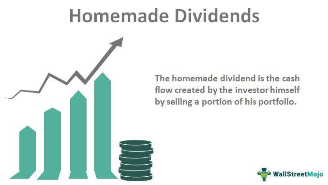

In today's investment landscape, creating a diversified portfolio that generates income is both challenging and rewarding. Investors often grapple with the complexities of balancing risk and return while aiming for steady income growth. Four key strategies are currently at the forefront of maximizing investment returns: homemade dividends, portfolio management, investment income diversification, and algorithmic trading.

Homemade dividends is a concept where investors generate income by strategically selling portions of their investment portfolio, rather than relying solely on company-issued dividends. This approach offers greater control over cash flow, allowing investors to tailor their income to suit personal needs rather than depending on the dividend policies of the companies in which they invest.



Portfolio management is another critical component, involving the systematic selection and supervision of a diverse range of investments to meet an investor's specific financial goals and risk tolerance. Within this context, active and passive management strategies offer different paths to portfolio optimization. Active management involves making dynamic investment decisions to outperform market indices, whereas passive management typically follows a more stable, index-tracking approach. Effective portfolio management incorporates practices like rebalancing, risk assessment, and strategic asset allocation to ensure optimal performance over time.

Investment income can be derived from various sources such as dividends, interest, and capital gains. By combining homemade dividends with traditional income-generating methods, investors can create a robust income strategy. This integration requires careful consideration of tax implications and techniques to maximize net income.

Algorithmic trading further enhances investment potential by utilizing computer programs to execute trades based on pre-set criteria, thereby minimizing human error and emotional biases associated with trading. This method allows for the rapid execution of trades, ensuring optimal pricing and timing in volatile markets. A range of tools and platforms are available to facilitate the use of algorithmic strategies in personal investment practices.

The objective of this article is to provide investors with a comprehensive understanding of these strategies and demonstrate how they can be combined to effectively manage and grow an investment income stream. By leveraging these advanced techniques, investors can aim for tailored financial outcomes, ensuring resilience and adaptability to market changes.

## Table of Contents

## Understanding Homemade Dividends

Homemade dividends are a sophisticated investment strategy enabling investors to produce cash flow by liquidating select portions of their investment holdings. Unlike traditional dividends, which are distributed at the discretion of a company’s board of directors, homemade dividends provide investors with the autonomy to determine the timing and amount of income they derive from their portfolios. This flexibility is particularly appealing to investors seeking a consistent income stream without being tethered to a company's specific dividend policy.

### Benefits

1. **Control**: Investors have full authority over how much and when they sell their assets. This control can be especially advantageous in tailoring cash flows to personal financial goals and needs.

2. **Flexibility**: By choosing which assets to sell, investors can strategically liquidate underperforming assets or capitalize on assets that have appreciated significantly in value, aligning with broader investment strategies.

3. **Customization**: Homemade dividends can be customized to fit specific income goals. Investors can determine their income requirements and adjust their selling activities to meet those needs, providing a bespoke income experience.

### Limitations

1. **Transaction Costs**: Selling assets often incurs transaction fees, which can accumulate over time and offset some of the income generated.

2. **Market Risks**: The need to sell in varying market conditions can impact income predictability and amount. A declining market may force sales at unfavorable prices, potentially eroding capital.

3. **Tax Considerations**: Unlike dividends, which may benefit from favorable tax treatment, capital gains from asset sales can incur significant tax liabilities. Investors must navigate complex tax implications to optimize net income.

### Integration into Income Strategy

Homemade dividends can serve as a valuable component in a diversified income strategy. By supplementing traditional dividends, interest, and rental income, homemade dividends can enhance overall yield and provide a hedge against erratic income streams from companies. To maximize their potential, investors might consider:

- **Balancing Dividends and Sales**: A hybrid approach where traditional dividends are complemented by strategic asset sales can lead to optimized cash flow while maintaining investment growth.

- **Periodic Review**: Regular re-evaluation of the portfolio ensures the strategy aligns with changing market conditions and personal financial goals, allowing for agile and informed decision-making.

- **Utilizing Financial Tools**: Investment in software and tools that track market trends and portfolio performance can facilitate informed decisions on asset liquidation while considering tax implications and transaction costs.

## Portfolio Management Strategies

Effective portfolio management involves selecting a combination of investments that align with an investor's goals and risk tolerance. This requires a structured approach where various management strategies are assessed and strategically applied.

### Active vs. Passive Management Strategies

Active management entails a hands-on approach where fund managers or investors make specific investments with the aim to outperform an index or benchmark. This strategy relies on market research, forecasts, and the expertise of the managers or investors. Despite its potential for higher returns, it often involves higher fees and greater risk due to frequent trading and the costs associated with research and analysis.

Conversely, passive management focuses on maintaining a diversified portfolio that mirrors the performance of a market index. This strategy is usually associated with lower fees and lower risks due to its buy-and-hold nature. Exchange-Traded Funds (ETFs) and index funds are common vehicles for passive management.

Homemade dividends can fit into both strategies. In an active context, investors may sell specific assets to generate cash based on their performance outcomes. In a passive strategy, investors might systematically sell a proportional amount of their holdings to create a steady income stream, aligning with their broader portfolio strategy.

### Rebalancing Practices, Risk Assessment, and Asset Allocation

Rebalancing involves periodically realigning the proportions of assets in a portfolio to maintain the original desired level of asset allocation. For example, if an initial allocation is 60% stocks and 40% bonds, market fluctuations may alter these weights. Rebalancing ensures that the portfolio returns to its intended allocation, which can protect against risk and ensure that the portfolio remains aligned with the investor's risk tolerance and investment horizon.

Risk assessment is an ongoing process where investors evaluate the risks associated with their portfolio holdings. This assessment usually considers market risk, credit risk, and [liquidity](/wiki/liquidity-risk-premium) risk, among others. Implementing risk assessment involves using quantitative measures such as standard deviation, beta, and [value at risk](/wiki/var-value-at-risk) (VaR) to understand potential losses in adverse conditions.

Asset allocation is the strategic distribution of assets across various categories such as stocks, bonds, real estate, and cash. It plays a crucial role in portfolio management and is guided by the investor’s risk tolerance, time horizon, and investment goals. A well-diversified allocation is key to optimizing returns and minimizing risks.

### Role of Financial Tools and Software

The modern investment landscape provides numerous financial tools and software platforms that aid in effective portfolio management. These tools enable investors to automate rebalancing, assess risk dynamically, and efficiently allocate assets. Platforms like Bloomberg Terminal, Morningstar Direct, and personal finance apps facilitate data analysis, trend monitoring, and cost-effective trading. Moreover, software tools can simulate various market scenarios to forecast potential outcomes and guide decision-making processes.

Using these tools can enhance an investor’s capability to implement homemade dividends strategically, whether through active repositioning based on market insights or passive alignment with broader market indices. Understanding the interplay between these components equips investors with the ability to optimize their investment portfolios effectively.

## Generating Investment Income

Investment income arises from dividends, interest, and capital gains—each playing a distinct role in enhancing an investor's financial returns. A key approach to optimizing these income streams is by integrating homemade dividends with traditional income-generating methods.

Homemade dividends allow investors to actively create income by selectively liquidating a portion of their portfolio holdings. This provides flexibility and enables investors to tailor their income streams to meet specific financial needs. Traditional dividends, distributed by companies, offer a more passive income flow but may be subject to the company’s financial health and its dividend policies.

Incorporating homemade dividends with other strategies like bonds or interest-bearing accounts can enhance diversification. For instance, while regular dividends provide cash flow based on a company's profits, interest payments from bonds or certificates of deposit (CDs) offer predictable income, often independent of market [volatility](/wiki/volatility-trading-strategies).

Capital gains, realized when selling an asset for more than its purchase price, further complement income strategies. Homemade dividends align well with capital gains, as investors can strategically time transactions to realize gains based on market conditions or tax considerations.

### Tax Implications and Strategies

A crucial component of maximizing net investment income is understanding taxation. Different income types are taxed at varying rates. For instance, qualified dividends and long-term capital gains often benefit from lower tax rates compared to ordinary income from interest or short-term gains.

Tax strategies to optimize income include:
- **Tax-Loss Harvesting:** This involves selling securities at a loss to offset capital gains, thereby reducing taxable income. For example, if an investor has a capital gain of $10,000 and a loss of $4,000, their taxable gain is reduced to $6,000.
- **Utilizing Tax-Advantaged Accounts:** Contributing to accounts like Roth IRAs or 401(k)s can shelter income from immediate taxation. Such accounts allow investments to grow tax-free or tax-deferred, depending on the account type.
- **Strategic Asset Location:** Placing income-generating assets within tax-advantaged accounts can minimize taxable income. For example, placing bonds, which generate interest income taxed at higher rates, into an IRA can defer taxes until withdrawal.

### Example Calculation

Consider a portfolio comprising stocks, bonds, and mutual funds. If an investor receives $5,000 in dividends, earns $2,000 in interest, and realizes $3,000 in long-term capital gains annually, their total income amounts to $10,000. If the dividends and capital gains are taxed at 15% and the interest at 22%, the tax liabilities are:

- Dividends: $5,000 x 0.15 = $750
- Interest: $2,000 x 0.22 = $440
- Capital Gains: $3,000 x 0.15 = $450

Thus, the total tax owed is $1,640, and the after-tax income is $8,360.

Investors can enhance these outcomes by timing the sale of assets (for capital gains), choosing efficient investment vehicles, and possibly opting for tax-exempt bonds, which can provide interest income without federal tax liabilities.

Understanding and strategically managing these tax implications allows investors to not only enhance their net returns but also sustain their investment cash flows effectively.

## Leveraging Algorithmic Trading

Algorithmic trading employs computer algorithms to automatically execute trades based on predetermined criteria, enhancing portfolio performance and income potential. By leveraging complex mathematical models, these algorithms analyze vast datasets to identify trading opportunities with precision and speed, surpassing the capabilities of human traders. This automation reduces the impact of human errors and emotional biases, fostering more disciplined trading strategies.

### Enhancing Portfolio Performance and Income Potential

Algorithmic trading enhances portfolio performance by facilitating high-frequency trading ([HFT](/wiki/high-frequency-trading-strategies)), which allows for swift decision-making and execution in liquid markets. Strategies such as statistical [arbitrage](/wiki/arbitrage) and market-making benefit from the algorithms' ability to process information rapidly. Algorithms can optimize trade execution, reduce transaction costs, and improve risk management, ultimately increasing the investment portfolio's income potential.

For instance, consider a simple moving average crossover strategy, a popular algorithmic approach:

```python
import pandas as pd

# Assuming 'data' is a DataFrame with historical price data
data['Short_MA'] = data['Close'].rolling(window=20).mean()
data['Long_MA'] = data['Close'].rolling(window=50).mean()

data['Signal'] = 0
data['Signal'][20:] = np.where(data['Short_MA'][20:] > data['Long_MA'][20:], 1, 0)
data['Position'] = data['Signal'].diff()
```

This Python code snippet sets up a simple moving average crossover strategy by comparing short-term and long-term moving averages. The strategy generates buy signals when the short-term average crosses above the long-term average, illustrating how [algorithmic trading](/wiki/algorithmic-trading) can systematically generate buy/sell signals without human intervention.

### Advantages of Algorithmic Trading

1. **Speed and Efficiency**: Algorithms execute trades at speeds unmatched by human capabilities, handling large trade volumes efficiently.

2. **Precision**: Algorithms ensure accurate trade execution, minimizing slippage and market impact, beneficial for large-scale orders.

3. **Quantitative Analysis**: Algorithms process and analyze extensive historical and real-time data, identifying profitable patterns and trends.

4. **Backtesting**: Algorithms can be rigorously tested against historical data to assess their effectiveness, aiding strategy refinement before deployment.

### Limitations of Algorithmic Trading

Despite their advantages, algorithmic trading systems face limitations:

1. **Technical Failures**: Algorithmic systems depend on technology; hardware or software failures can result in significant losses.

2. **Market Dynamics**: Algorithms operate based on predefined criteria and may struggle to adapt to sudden market changes or unexpected events.

3. **Regulatory Concerns**: Compliance with financial regulations poses challenges, especially concerning market manipulation and transparency.

### Tools and Platforms for Integration

Various platforms and tools enable investors to integrate algorithmic strategies into personal investment practices. Platforms like MetaTrader 5, [Interactive Brokers](/wiki/interactive-brokers-api), and QuantConnect offer diverse functionalities for algorithmic traders. These platforms provide APIs for custom strategy development, extensive [backtesting](/wiki/backtesting) capabilities, and access to multiple markets.

For those new to algorithmic trading, open-source programming languages like Python offer versatile libraries such as Pandas for data manipulation, NumPy for numerical calculations, and TA-Lib for technical analysis. These resources support the development of sophisticated trading algorithms tailored to individual investment goals.

In conclusion, algorithmic trading's potential to optimize trading strategies and enhance portfolio performance makes it a valuable asset for modern investors. By carefully selecting appropriate tools and being mindful of their limitations, investors can effectively integrate algorithmic trading into their broader investment strategies.

## Combining Strategies for Optimal Returns

In the pursuit of crafting optimal investment portfolios, investors often blend various strategies, such as homemade dividends, strategic portfolio management, and algorithmic trading. Each approach contributes unique benefits that can enhance overall portfolio performance.

### Integration of Homemade Dividends, Strategic Management, and Algorithmic Trading

Homemade dividends provide investors with tailored income flexibility by allowing them to sell portions of their investment holdings to generate cash flow, rather than relying solely on company-issued dividends. This flexibility becomes a crucial tool when combined with robust portfolio management strategies. 

Strategic portfolio management involves the meticulous selection and adjustment of asset allocation to meet specific financial goals, all while monitoring risk tolerance and market conditions. Investors who actively rebalance their portfolios according to pre-determined criteria can improve their ability to generate consistent returns.

Algorithmic trading, on the other hand, introduces automation and precision into the investment process. Algorithms can execute trades based on pre-set market conditions, thus ensuring fast and emotionally-detached decision-making, and optimizing buy/sell decisions. The efficiency and effectiveness of algorithmic trading can further enhance the homemade dividends strategy by pinpointing optimal times to sell assets for income generation without incurring significant transaction costs or market impact.

### Case Studies and Real-World Examples

Several empirical studies and case analyses underline the confluence of these strategies:

1. **Case Study: Institutional Wealth Management**
   An investment firm integrated algorithmic trading with a customized homemade dividends approach. By analyzing market data continuously, the algorithms identified periods of high stock valuation, prompting the sale of select shares to generate cash flow. This strategy enabled the firm to achieve a balance between income generation and maintaining capital growth, aligning with their clients' objectives. 

2. **Example: Balanced Income and Growth Portfolio**
   A private investor utilized available financial software to manage a diversified portfolio. By employing algorithmic triggers, the investor could automatically rebalance the portfolio to maintain specific asset allocations, while selling particular assets that exceeded a certain return threshold, effectively creating homemade dividends. This method provided a stable cash flow without overexposing the portfolio to any single market risk.

### Mathematical and Computational Integration

To further illustrate, let's consider a simple Python example showcasing how algorithmic trading might interact with a homemade dividends strategy:

```python
import numpy as np

# Hypothetical portfolio values over time
portfolio_values = np.array([100, 105, 110, 115, 120, 125])

# Criteria for selling to create homemade dividends
threshold = 115

# Determine when to sell assets
sell_points = portfolio_values[portfolio_values > threshold]

# Output the points where homemade dividends are generated
print(f"Sell assets at points: {sell_points}")
```

This script identifies when the portfolio value exceeds a certain threshold, recommending the sale of assets to generate income. This basic illustration forms the groundwork upon which more sophisticated trading algorithms can be developed.

Overall, integrating homemade dividends with algorithmic trading and strategic portfolio management facilitates a dynamic environment where investors can continuously adapt to market changes, optimizing their portfolios for both growth and income. The combination of these strategies has proven effective in real-world applications, offering both institutional and individual investors a framework for achieving optimal returns.

## Conclusion

In the investment world, strategies like homemade dividends, effective portfolio management, and algorithmic trading can significantly impact an investor's growth and income streams. By understanding and applying these techniques, investors can tailor their financial outcomes to meet specific objectives, such as enhancing income, managing risk, or achieving long-term capital appreciation. Homemade dividends allow investors to generate cash flow by selectively liquidating portions of their portfolio, offering greater flexibility and control over income timing and amounts compared to traditional dividends.

Effective portfolio management remains crucial for maintaining the balance between risk and return. It involves strategic asset allocation, regular rebalancing, and selecting investments that align with both market conditions and the investor's goals. Incorporating algorithmic trading into this mix can further enhance portfolio performance. By leveraging pre-programmed trading strategies, investors can potentially reduce human error, capitalize on market opportunities swiftly, and execute trades with precision.

Continuous learning and adaptation to changing market environments are essential for maintaining a competitive edge in portfolio management. This involves staying informed about emerging technologies, market trends, and regulatory changes that may influence investment strategies. By integrating these approaches, investors can construct a dynamic investment strategy that is resilient to market fluctuations while optimizing for growth and income. Consequently, tailored financial outcomes become more attainable for those willing to adapt their investment practices to changing conditions.

## References & Further Reading

[1]: Bergstra, J., Bardenet, R., Bengio, Y., & Kégl, B. (2011). ["Algorithms for Hyper-Parameter Optimization."](https://dl.acm.org/doi/10.5555/2986459.2986743) Advances in Neural Information Processing Systems 24.

[2]: ["Advances in Financial Machine Learning"](https://www.amazon.com/Advances-Financial-Machine-Learning-Marcos/dp/1119482089) by Marcos Lopez de Prado

[3]: ["Evidence-Based Technical Analysis: Applying the Scientific Method and Statistical Inference to Trading Signals"](https://www.amazon.com/Evidence-Based-Technical-Analysis-Scientific-Statistical/dp/0470008741) by David Aronson

[4]: ["Machine Learning for Algorithmic Trading"](https://github.com/stefan-jansen/machine-learning-for-trading) by Stefan Jansen

[5]: ["Quantitative Trading: How to Build Your Own Algorithmic Trading Business"](https://www.amazon.com/Quantitative-Trading-Build-Algorithmic-Business/dp/1119800064) by Ernest P. Chan