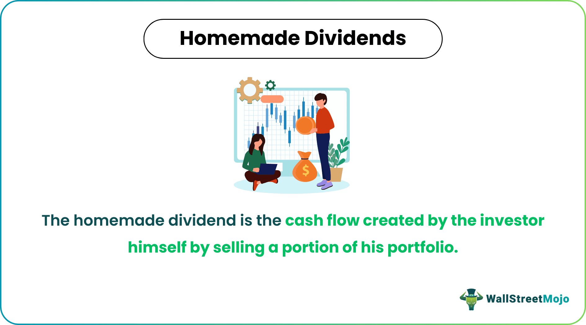

## Table of Contents

## What are homemade dividends?

Homemade dividends are a way for investors to create their own cash flow from their investments, even if the company they've invested in doesn't pay regular dividends. Instead of waiting for a company to distribute profits, an investor can sell a portion of their shares to get cash whenever they need it. This approach gives investors more control over when and how much money they take out of their investments.

For example, if you own 100 shares of a company and need some cash, you can sell 10 shares. The money you get from selling those shares is like a dividend you made yourself. This way, you don't have to depend on the company's dividend schedule. Homemade dividends can be useful for people who want flexibility in managing their money and investments.

## How do homemade dividends differ from regular dividends?

Homemade dividends and regular dividends are two different ways to get money from your investments. Regular dividends are payments that a company gives to its shareholders from its profits. These payments usually happen at set times, like every quarter or year. When you get a regular dividend, you don't have to sell any of your shares. The company just sends you the money based on how many shares you own.

On the other hand, homemade dividends are when you decide to sell some of your shares to get cash. This way, you can choose when and how much money you want to take out of your investment. You're not waiting for the company to pay you; you're making your own "dividend" by selling a part of your investment. This gives you more control and flexibility, but it also means you'll own fewer shares after you sell some.

In short, regular dividends come from the company's profits and follow a schedule, while homemade dividends are created by you selling your shares whenever you need money. Both methods can help you get cash from your investments, but they work in different ways and offer different levels of control.

## What is the basic mechanism behind creating homemade dividends?

Creating homemade dividends is simple. If you own stocks in a company and need some cash, you can sell a few of your shares. The money you get from selling those shares is your homemade dividend. You decide when to do this and how many shares to sell, so you have control over your money.

For example, let's say you own 100 shares of a company. If you need $500, you can sell enough shares to get that amount. If each share is worth $50, you would sell 10 shares. Now you have $500 in cash, and you still own 90 shares. This way, you don't have to wait for the company to pay you a dividend; you make your own.

## Can you explain the concept of homemade dividends using a simple example?

Let's say you own 100 shares of a company called ABC Inc. You bought each share for $10, so your total investment is $1,000. Now, you need some money for a new laptop that costs $200. Instead of waiting for ABC Inc. to pay you a dividend, you decide to sell some of your shares to get the cash you need.

You check the current price of ABC Inc. shares and see that they are now worth $20 each. To get $200, you only need to sell 10 shares. So, you sell those 10 shares and get your $200. Now, you have the money for your laptop, and you still own 90 shares of ABC Inc. This is how you create a homemade dividend – by selling a part of your investment whenever you need cash.

## What are the potential benefits of using homemade dividends for investors?

Using homemade dividends can give investors more control over their money. Instead of waiting for a company to pay out dividends on a set schedule, investors can decide when they need cash and sell shares to get it. This means they can take money out of their investments whenever they want, not just when the company decides to pay dividends. This flexibility can be really helpful for people who need money at different times or for different reasons.

Another benefit is that investors can keep their money working for them. If they don't need all their money right away, they can leave most of their shares invested and only sell what they need. This way, the rest of their investment can keep growing. Plus, if the stock price goes up, they might get more money from selling fewer shares than they would have if they waited for a regular dividend.

## Are there any risks or drawbacks associated with homemade dividends?

There are some risks to using homemade dividends. One big risk is that when you sell shares to get cash, you end up owning fewer shares. This means you might miss out on future growth if the stock price goes up a lot. Also, if you need to sell shares when the stock price is low, you might not get as much money as you hoped for. This can be a problem if you need a certain amount of cash and the stock price isn't high enough.

Another drawback is that selling shares can lead to taxes. When you sell shares, you might have to pay capital gains tax on the profit you made. This can eat into the money you get from your homemade dividend. Plus, if you're selling shares often, you might end up paying more in taxes than if you just waited for regular dividends, which might be taxed differently. So, while homemade dividends give you more control, they also come with some risks and costs that you need to think about.

## How can an investor calculate the amount needed to create homemade dividends?

To figure out how much you need to sell to make a homemade dividend, you first need to know how much cash you want. Let's say you need $300. Next, you check the current price of the shares you own. If each share is worth $30, you would need to sell 10 shares to get $300. It's that simple: divide the amount of cash you need by the current price per share to find out how many shares to sell.

But there's another thing to think about: the cost of selling those shares. You might have to pay fees to your broker, and if you make a profit, you might owe taxes on it. These costs can eat into the money you get from your homemade dividend. So, when you're figuring out how many shares to sell, remember to think about these extra costs too. That way, you'll have a better idea of how many shares you really need to sell to get the cash you want.

## What role does portfolio management play in the strategy of homemade dividends?

Portfolio management is really important when you're using homemade dividends. It's all about keeping track of your investments and making sure you're selling the right shares at the right time. If you have a lot of different stocks, you need to think about which ones to sell to get the cash you need. You might want to sell shares that aren't doing as well or ones that you think won't grow as much in the future. This way, you can keep your best investments working for you while still getting the money you need.

Also, good portfolio management helps you balance the risks and rewards of homemade dividends. You need to think about how selling shares will affect your overall investment plan. If you sell too many shares, you might not have enough left to grow your money over time. But if you manage your portfolio well, you can sell just enough to get the cash you need without hurting your long-term goals. This means keeping an eye on your investments and making smart choices about when and what to sell.

## How do tax considerations affect the strategy of homemade dividends?

When you use homemade dividends, taxes can play a big role in how much money you actually get to keep. If you sell shares and make a profit, you might have to pay capital gains tax on that profit. The tax rate depends on how long you held the shares before selling them. If you held them for a year or less, you might pay a higher short-term capital gains tax. If you held them for more than a year, you might pay a lower long-term capital gains tax. So, it's important to think about these taxes when you decide to sell shares for a homemade dividend, because they can reduce the amount of cash you end up with.

Also, if you're selling shares often to create homemade dividends, you might end up paying more in taxes than if you just waited for regular dividends. Regular dividends might be taxed at a different rate, sometimes lower, depending on your income and the type of dividend. So, when you're planning your investment strategy, you need to think about how taxes will affect your homemade dividends. This can help you decide if it's better to sell shares or wait for the company to pay you dividends, based on which option will leave you with more money after taxes.

## In what scenarios might homemade dividends be more advantageous than receiving traditional dividends?

Homemade dividends can be more helpful than traditional dividends if you need money at a specific time that doesn't match when the company pays out dividends. For example, if you need cash for an emergency or a big purchase, you can sell shares whenever you want instead of waiting for the company's dividend schedule. This gives you more control over your money and helps you meet your needs right away.

Another situation where homemade dividends might be better is if you think the stock price will go up a lot in the future. If you sell a few shares now for cash, you still keep most of your investment, which can grow over time. With traditional dividends, you get the same amount no matter what happens to the stock price. So, homemade dividends let you take some money out while still keeping your investment working for you.

## How can homemade dividends be integrated into a long-term investment strategy?

Homemade dividends can be a smart part of a long-term investment plan if you use them the right way. Instead of selling all your shares at once, you can sell just a few when you need some cash. This way, you keep most of your investment growing over time. For example, if you need money for a big expense, you can sell a small number of shares to get the cash you need without messing up your long-term goals. By doing this, you can still enjoy the benefits of your investments growing while also having the flexibility to use some of your money when you need it.

Another important thing to think about is how homemade dividends fit into your overall investment strategy. You need to balance the need for cash now with the potential for your investments to grow in the future. If you're always selling shares to get money, you might end up with fewer shares and miss out on big gains later. But if you plan carefully and only sell shares when it makes sense, you can use homemade dividends to help you reach your long-term goals. This means keeping an eye on your investments and making smart choices about when and how much to sell.

## What advanced techniques can be used to optimize the use of homemade dividends?

To make the most out of homemade dividends, you can use a strategy called dollar-cost averaging. This means selling a small number of shares at different times instead of all at once. By doing this, you can spread out the risk of selling when the stock price is low. For example, if you need $1,000, you might sell shares worth $200 every few months. This way, you're not betting everything on the stock price at one moment, and you can still keep most of your investment growing.

Another smart technique is to pay attention to market trends and your portfolio's performance. If you see that a stock is doing really well and you think it will keep going up, you might want to sell fewer shares or wait a bit longer before selling. On the other hand, if a stock isn't doing so great, it might be a good time to sell some shares to get cash and then put that money into a different investment that looks more promising. By keeping an eye on these things, you can make better choices about when to create homemade dividends and how to use them to help your overall investment strategy.

## References & Further Reading

[1]: Bergstra, J., Bardenet, R., Bengio, Y., & Kégl, B. (2011). ["Algorithms for Hyper-Parameter Optimization."](https://dl.acm.org/doi/10.5555/2986459.2986743) Advances in Neural Information Processing Systems 24.

[2]: ["Advances in Financial Machine Learning"](https://www.amazon.com/Advances-Financial-Machine-Learning-Marcos/dp/1119482089) by Marcos Lopez de Prado

[3]: ["Evidence-Based Technical Analysis: Applying the Scientific Method and Statistical Inference to Trading Signals"](https://www.amazon.com/Evidence-Based-Technical-Analysis-Scientific-Statistical/dp/0470008741) by David Aronson

[4]: ["Machine Learning for Algorithmic Trading"](https://github.com/stefan-jansen/machine-learning-for-trading) by Stefan Jansen

[5]: ["Quantitative Trading: How to Build Your Own Algorithmic Trading Business"](https://www.amazon.com/Quantitative-Trading-Build-Algorithmic-Business/dp/1119800064) by Ernest P. Chan