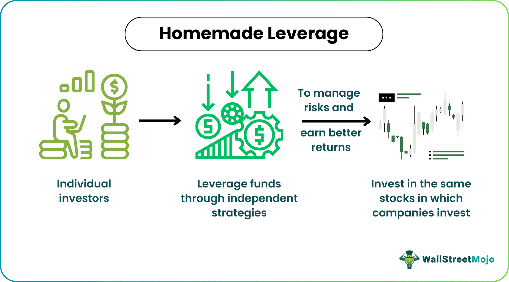

Financial strategies have evolved significantly, with interconnected elements such as homemade leverage, corporate capital structure, and algorithmic trading playing pivotal roles in modern financial management practices. These strategies collectively enhance investment outcomes and optimize portfolio management.

Homemade leverage allows individual investors to adjust the leverage of their personal portfolios independently of any corporate decisions. This strategy is grounded in the Modigliani-Miller theorem, which suggests that in a perfect market, a firm’s value is unaffected by its capital structure. Thus, investors can mimic corporate leverage effects through personal borrowing or lending, modifying their investment risk and return profiles.

Corporate capital structure involves a mix of financing sources—equity, debt, and hybrid securities—that affect a company's overall valuation and risk profile. The strategic use of financial leverage within this structure can amplify potential returns, although it involves trade-offs, such as increased financial risk. Companies must balance these factors to achieve sustainable growth and optimize their capital structures.

Algorithmic trading introduces another layer of sophisticated strategy. It enables the execution of high-speed, high-volume trades based on predefined criteria, improving market efficiency and capital allocation while minimizing human error. This approach not only enhances volatility forecasting and risk management but also influences strategic financial decisions.

Together, these elements form a comprehensive framework for leveraging financial strategies. Investors seeking optimized portfolio management must understand the interactions among homemade leverage, corporate capital structure, and algorithmic trading. This knowledge empowers individuals to replicate the effects of corporate leverage through bespoke personal strategies, guided by principles such as the Modigliani-Miller theorem.

The interconnectedness of these financial strategies signifies important advancements in strategic financial management. By examining these mechanisms—the strategic use of borrowed funds, the precision of algorithmic trading, and individual investors' ability to emulate corporate leverage—investors and firms alike can craft more refined and effective decision-making processes. The ultimate goal is to leverage these strategies to optimize financial outcomes across diverse market conditions.

## Table of Contents

## Understanding Homemade Leverage

Homemade leverage is a financial strategy employed by individual investors to adjust the leverage of their portfolios, independently from corporate financing decisions. This concept allows investors to alter the risk-return profile of their investments by using personal borrowing or lending to mimic the effects of corporate leverage.

### Modigliani-Miller Theorem

The foundation of homemade leverage rests on the Modigliani-Miller theorem, formulated by Franco Modigliani and Merton Miller in the 1950s. This theorem states that, in a perfect market without taxes, bankruptcy costs, or asymmetric information, the value of a firm is unaffected by its capital structure. Essentially, whether a firm is financed through debt or equity makes no difference to its overall value. The theorem implies that investors can replicate corporate leverage by adjusting their personal financial positions, as the firm's leverage does not inherently provide additional value.

### Mimicking Corporate Leverage

Investors can mimic corporate leverage by engaging in personal borrowing or lending. For example, if a company does not use leverage, but an investor desires a levered return, the investor can borrow funds to invest in the equity of the company. Conversely, if a company employs a high level of debt, but an investor prefers less leveraged exposure, they can lend money to offset the company's high leverage.

### Implications and Tax Considerations

While homemade leverage offers flexibility, it also comes with implications. One critical aspect is the potential tax discrepancy between personal and corporate borrowing. Interest expenses at the corporate level are usually tax-deductible, reducing the effective cost of debt. In contrast, individual investors may not benefit from such deductions, potentially leading to higher after-tax costs of borrowing.

### Advantages and Risks

Homemade leverage provides investors the ability to customize their portfolios according to personal risk appetites and financial goals. This customization enhances individual control over investment strategies, allowing for tailored risk management.

However, the strategy also carries significant risks. By borrowing to increase leverage, investors face amplified losses if investments underperform. The magnification of potential losses necessitates careful consideration and robust risk management practices.

In conclusion, while homemade leverage can offer strategic flexibility and personal portfolio customization, careful assessment of associated risks and tax implications is vital for optimal financial management. The interplay between personal borrowing and corporate leverage strategies remains an essential consideration for individual investors seeking to maximize their investment outcomes.

## Corporate Capital Structure and Financial Leverage

Corporate capital structure is a critical component of a firm's financial architecture and consists of a mix of financing sources such as equity, debt, and hybrid securities. The structure a company selects can significantly influence its risk profile, expected returns, and overall valuation.

At the core of determining a company's value is the balance between risk and return. Equity financing, which involves selling shares of the company, typically carries no obligation to repay stakeholders, while debt financing requires regular interest payments and repayment of principal. The trade-off for companies lies in leveraging the lower cost of debt—the tax shield benefit due to interest expense deductions—against the higher risk of financial distress that debt may bring in periods of downturn. 

Financial leverage, a key part of capital structure, involves the strategic use of debt to augment potential returns on equity. This effect is encapsulated in the leverage ratio, represented as:

$$
\text{Leverage Ratio} = \frac{\text{Total Debt}}{\text{Equity}}
$$

The leverage ratio indicates the relative proportion of debt and equity financing. A higher ratio suggests greater reliance on debt, which can amplify returns during profitable periods. However, it also increases vulnerability during economic stress. Companies such as Tesla and Amazon have employed specific leverage strategies to support rapid growth while managing their business-specific risks, like volatile revenue streams or high R&D expenditure.

A critical aspect of a corporate financial strategy is optimizing the capital structure to achieve sustainable growth. This involves managing the proportions of debt and equity to balance risk and cost effectively. Ideally, firms strive for a structure that minimizes the weighted average cost of capital (WACC):

$$
\text{WACC} = \frac{E}{V} \cdot r_e + \frac{D}{V} \cdot r_d \cdot (1 - T)
$$

where $E$ is the market value of equity, $D$ is the market value of debt, $V = E + D$ is the total market value of the company (equity plus debt), $r_e$ is the cost of equity, $r_d$ is the cost of debt, and $T$ is the tax rate. By minimizing the WACC, firms can maximize their market value.

In practical application, companies must evaluate their unique market conditions, business models, revenue stability, and competitive pressures to define the optimal capital structure. Firms like Google and Microsoft, with consistent cash flows and strong market positioning, tend to feature lower financial leverage, preferring equity-based financing to maintain flexibility and limit risk.

Overall, understanding corporate capital structure and financial leverage is essential in navigating the complex landscape of corporate finance, fostering sound strategic decision-making, and supporting long-term business objectives.

## Algorithmic Trading: Enhancing Financial Strategy

Algorithmic trading is a method of executing orders using automated, pre-programmed trading instructions that account for variables such as time, price, and [volume](/wiki/volume-trading-strategy). It leverages computer algorithms to manage the buying and selling of securities, allowing traders to conduct high-speed, high-volume trades that would be practically impossible to execute manually. These algorithms are designed to identify lucrative market opportunities quickly and efficiently, relying on mathematical models and sophisticated quantitative analyses to make trading decisions.

Algorithmic trading enhances financial strategy by improving market efficiency. By automating the execution process, it reduces transaction costs and sharpens price discovery, leading to more precise asset pricing and tighter spreads. Furthermore, the ability to analyze large volumes of data instantaneously enables more effective capital allocation, ensuring that funds are employed in the most optimal way based on the current market conditions. The reduction of human error is another significant benefit, as automated systems can operate without the emotional biases that often plague human decision-making, thereby increasing the consistency and reliability of trading outcomes.

The impact of [algorithmic trading](/wiki/algorithmic-trading) on financial markets includes substantial improvements in [volatility](/wiki/volatility-trading-strategies) forecasting and risk management. Algorithms can detect patterns and insights from historical and real-time data, which allows traders to predict market volatility with greater accuracy. By continuously monitoring and adjusting to market conditions, algorithmic trading systems support dynamic risk management strategies that can adapt to rapidly changing financial environments. This capability is vital for strategic financial decision-making, as it allows firms to respond proactively to evolving risks and opportunities.

Numerous firms have successfully implemented algorithmic trading to achieve financial gains. For example, quantitative hedge funds such as Renaissance Technologies have leveraged complex algorithms to generate significant returns, outperforming traditional asset managers. These firms use algorithms not only for trade execution but also for developing and back-testing new trading strategies, leading to sustained competitive advantages and superior market performance.

Moreover, algorithmic trading can be integrated with leverage and capital structure optimization to refine trading strategies further. By dynamically adjusting the leverage based on market signals, firms can enhance their risk-adjusted returns. This integration allows for a more strategic approach to capital structure management, optimizing the use of debt and equity in line with the predicted market trends and the firm's risk tolerance.

In summary, algorithmic trading is a powerful tool in modern financial markets, enabling high-speed decision-making and efficient trade execution. Its role in enhancing market efficiency, improving capital allocation, and reducing human errors positions it as a crucial element in the optimization of financial strategies. As technological advancements continue to evolve, the integration of algorithmic trading with other financial concepts, such as leverage and capital structure optimization, promises further enhancements in strategic financial management.

## Integrating Financial Concepts for Optimized Outcomes

The integration of homemade leverage, corporate capital structure, and algorithmic trading is pivotal for strategic financial management, offering a comprehensive approach to optimizing investment outcomes. Homemade leverage allows individual investors to tailor their portfolio's risk and return characteristics by adjusting personal borrowing or lending, effectively mirroring corporate leverage strategies. This personalized financial flexibility augments decision-making by enabling investors to align their investments with specific financial goals and risk tolerance.

Corporate capital structure, comprising a firm's mix of equity, debt, and hybrid securities, significantly influences company valuation and risk profile. A well-optimized capital structure enhances financial stability and growth potential, providing a critical framework within which businesses operate. Financial managers must carefully calibrate leverage ratios to balance risk and return, ensuring sustainable growth without compromising financial health.

Algorithmic trading leverages computing power to execute trades at high speed and volume based on precise, pre-defined criteria. This approach enhances market efficiency and reduces human error, contributing to improved capital allocation and risk management. Algorithmic strategies, particularly those using [machine learning](/wiki/machine-learning), offer refined decision-making capabilities by analyzing vast datasets to predict market movements and optimize trading operations.

The interplay between these financial concepts can yield substantial benefits, including increased investment precision, enhanced risk management, and strategic resource allocation. However, integrating these strategies poses challenges, such as navigating regulatory requirements and addressing technological limitations, including data processing capabilities and cybersecurity concerns.

Future trends indicate an increasing reliance on technology, particularly advanced data analytics and machine learning, to further refine financial strategies. These innovations promise to improve decision-making precision, allowing for more accurate forecasting and responsive financial management. The ongoing evolution of technology in finance necessitates continuous adaptation, encouraging firms and investors to embrace new tools and methodologies for optimized outcomes. 

In conclusion, the convergence of homemade leverage, capital structure optimization, and algorithmic trading presents a multifaceted approach to financial strategy, driving efficiency and adaptability in a dynamic market environment.

## Challenges and Considerations

Regulatory compliance is a critical component when engaging in leveraging and trading strategies. Financial regulations, such as those stipulated by the Dodd-Frank Act, and the SEC’s oversight in the United States, among others globally, are instrumental in establishing guidelines that protect investors and maintain market integrity. These regulations ensure that financial institutions maintain adequate capital to cover their activities, mitigating systemic risks. Compliance with these regulations can be resource-intensive, requiring robust reporting systems and transparency in financial practices.

Technological limitations present significant challenges in the execution of sophisticated financial strategies. The sheer volume of data processed daily in financial markets requires advanced technological infrastructure. Limitations in data processing capabilities can hinder the ability to execute trades efficiently and develop complex algorithms needed for predictive analytics in trading. Furthermore, cybersecurity concerns are paramount, as financial systems are prime targets for cyber-attacks. Ensuring that systems are secure and resilient against breaches is crucial for protecting sensitive data and maintaining trust in financial institutions.

Developing effective strategies for risk management is essential in the financial landscape. This involves creating a robust risk management framework that identifies, assesses, and mitigates various risks associated with leveraging strategies and algorithmic trading. Quantitative methods, such as Value at Risk (VaR) and stress testing, are commonly employed to quantify potential losses in adverse scenarios. Regular audits and compliance checks are necessary to ensure that risk management practices evolve with market conditions and regulatory changes.

The dynamic nature of financial markets necessitates continuous evaluation and adjustment of financial strategies. Market volatility, economic shifts, and changes in investor sentiment require agile strategy adjustments to maintain performance targets. Utilizing adaptive algorithms that can learn from and respond to market shifts offers an advantage in sustaining profitable outcomes. Machine learning and [artificial intelligence](/wiki/ai-artificial-intelligence) can play a significant role in adapting strategies in real-time by analyzing vast datasets to discern patterns and predict potential market movements.

To overcome the technological and regulatory challenges faced by financial entities, several solutions can be adopted. Investing in advanced financial technology and upgrading IT infrastructure is essential to handle large datasets and execute trades at high speeds. Enhancements in cybersecurity measures, such as adopting blockchain technology for secure transactions, can mitigate risks of data breaches. Collaborating with regulators through fintech sandboxes can offer insights into compliance while allowing innovation. By remaining proactive and receptive to technological advancements and regulatory frameworks, financial strategies can be optimized for enhanced performance and resilience.

## Conclusion

Understanding and effectively employing the financial strategies of homemade leverage, corporate capital structure, and algorithmic trading is crucial for optimizing financial performance. Each component plays a vital role in shaping sound financial management practices and amplifying investment outcomes. The integration of these elements allows for a holistic approach to financial strategy, providing the agility and precision needed to navigate complex market environments.

Aligning homemade leverage allows investors to achieve customized financial leverage, independent of corporate capital decisions. By doing so, they can tailor their portfolios to meet specific risk and return profiles, although it is essential to be aware of the tax implications and potential risks associated with these strategies. A firm understanding of capital structure aids corporations in determining the best mix of debt, equity, and hybrid securities to minimize capital costs and maximize firm value. Meanwhile, algorithmic trading offers unmatched speed and efficiency in executing trades, improving market [liquidity](/wiki/liquidity-risk-premium) and allowing for precise implementation of complex trading strategies.

As financial markets evolve rapidly, continuous learning and adaptation of financial strategies are indispensable. New technological advancements, particularly in machine learning and artificial intelligence, offer promising enhancements in the precision of financial decision-making. These innovations are likely to drive deeper integrations of leverage, capital structure, and algorithmic trading, improving efficiencies and decision quality in financial management.

There is a significant potential for future innovations to foster more sophisticated synergies between these financial components. Further research into advanced models is essential to fully harness their potential, potentially leading to sustained success. By fostering a broader understanding and adaptive approach, organizations and individual investors can remain competitive and achieve optimal financial outcomes in the ever-changing financial landscape.

## References & Further Reading

[1]: Modigliani, F., & Miller, M. H. (1958). ["The Cost of Capital, Corporation Finance and the Theory of Investment."](https://www.aeaweb.org/aer/top20/48.3.261-297.pdf) The American Economic Review, 48(3), 261-297.

[2]: Brealey, R. A., Myers, S. C., & Allen, F. (2020). ["Principles of Corporate Finance."](https://www.amazon.com/Principles-Corporate-Finance-Richard-Brealey/dp/1260565556) McGraw-Hill Education.

[3]: Lopez de Prado, M. (2018). ["Advances in Financial Machine Learning."](https://www.amazon.com/Advances-Financial-Machine-Learning-Marcos/dp/1119482089) Wiley.

[4]: Chan, E. P. (2008). ["Quantitative Trading: How to Build Your Own Algorithmic Trading Business."](https://github.com/egorpe/EPChan-QuantitativeTrading/blob/master/example7_6.m) Wiley.

[5]: Jansen, S. (2020). ["Machine Learning for Algorithmic Trading."](https://github.com/stefan-jansen/machine-learning-for-trading) Packt Publishing.

[6]: Aronson, D. R. (2007). ["Evidence-Based Technical Analysis: Applying the Scientific Method and Statistical Inference to Trading Signals."](https://onlinelibrary.wiley.com/doi/book/10.1002/9781118268315) Wiley.