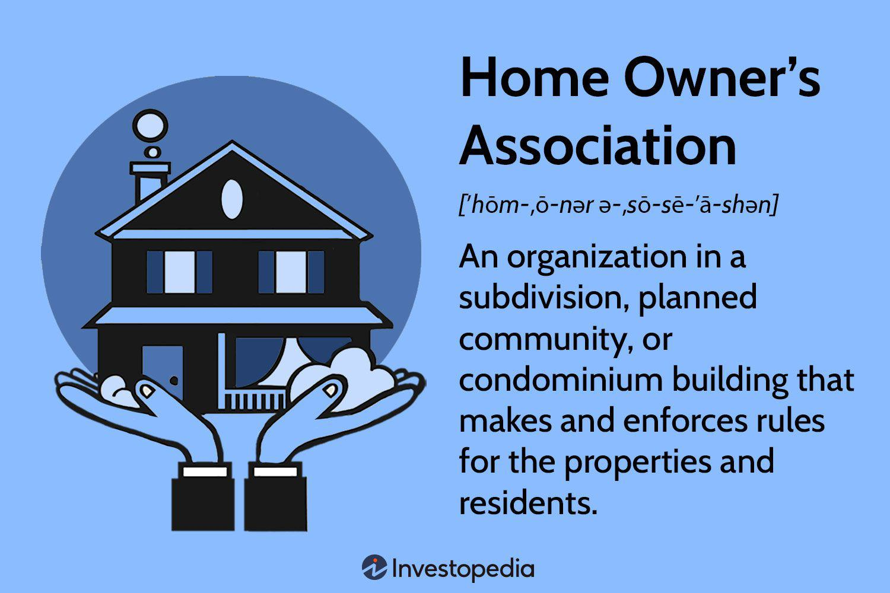

Understanding the roles of Homeowners Associations (HOAs) and Community Managers is essential in today's real estate landscape. These entities significantly influence community management and property value, making them vital components of residential settings. HOAs are non-profit organizations formed by a community of homeowners to manage communal areas and enforce regulations aimed at maintaining property values. They dictate various aspects of neighborhood living, including architectural guidelines, maintenance of shared amenities, and community development projects. By doing so, HOAs often ensure that the property values within their jurisdiction remain stable or even increase over time.

Community managers, often employed by HOAs, are responsible for the day-to-day operations of these communities. They handle administrative tasks, financial management, and the implementation of the community's Covenants, Conditions, and Restrictions (CC&Rs). Their efficiency directly impacts the quality of life within the community and the overall perception of the neighborhood, thereby influencing property values positively.



In recent years, technological advancements have introduced new dimensions to property management. One of the emerging technologies in this sector is algorithmic trading, a technique traditionally associated with financial markets but now finding relevance in property management. Algorithmic trading, or algo trading, uses complex algorithms to automate decision-making processes. When applied to property management, these algorithms can optimize financial tactics, such as the efficient allocation of reserve funds, and enhance investment strategies for maintaining and improving community infrastructures.

The integration of algorithmic trading in property management presents a promising opportunity to optimize the financial health of HOAs. This cutting-edge approach can lead to more informed decision-making, better resource allocation, and ultimately, an increase in property values. However, it also introduces new risks and challenges, such as the need for data security and the potential for over-reliance on technology. Despite these challenges, embracing such innovations and engaging fully with their HOA management can empower homeowners to maintain and enhance their community’s standards.

## Table of Contents

## What is a Homeowners Association?

A Homeowners Association (HOA) is an organization established within a residential community or condominium complex. Its primary purpose is to govern and maintain shared spaces and amenities while ensuring that all properties within its jurisdiction adhere to specific standards and guidelines. HOAs aim to preserve and enhance property values by fostering a well-maintained and aesthetically pleasing environment, which can be appealing to current and prospective homeowners.

The organizational structure of an HOA typically includes a board of directors, which is comprised of elected members from the community. These individuals are responsible for making key decisions on behalf of the homeowners, overseeing the community's common areas, and implementing the rules and guidelines set forth in the association's governing documents. The board's roles and responsibilities may include, but are not limited to, budget management, maintenance coordination, and community representation in legal matters.

HOAs establish and enforce community rules through a set of documents known as Covenants, Conditions, and Restrictions (CC&Rs). These documents lay out the regulations for property use and behavior within the community, aiming to maintain a cohesive and orderly environment. HOAs may employ a combination of regular inspections, transparent communication with residents, and a structured process for handling violations to ensure compliance with these rules.

By playing a pivotal role in the community governance, HOAs not only work to sustain property values but also to enhance the overall quality of life for residents. Through organized management and enforcement of community standards, HOAs contribute to creating a harmonious living experience for their members.

## Functions of Community Management in HOAs

Community Association Managers (CAMs) play a pivotal role in the effective functioning of Homeowners Associations (HOAs). Their primary responsibilities encompass a wide array of tasks aimed at ensuring the smooth management and operation of the community. A comprehensive understanding of these functions can significantly impact the success and efficiency of HOA governance.

One of the core responsibilities of CAMs is administrative management. This includes maintaining accurate records of the HOA's activities and managing communication between the board of directors and homeowners. CAMs ensure that all legal documents, such as meeting minutes and community guidelines, are properly documented and disseminated to relevant parties. This fosters transparency and keeps everyone informed about the association's activities and decisions.

Financial management is another critical task for CAMs, involving the meticulous handling of the community's funds. They oversee budgeting, which requires balancing the community's income, predominantly from HOA fees, with operational expenses. Monthly or quarterly financial reports are prepared to track the community’s financial health. CAMs must also manage the collection of dues and oversee any delinquent accounts, ensuring the association maintains a stable financial footing.

A significant aspect of community management is the maintenance and enforcement of Covenants, Conditions, and Restrictions (CC&Rs). These are legal documents that set forth the rights and obligations of the homeowners and the association. CAMs play an essential role in ensuring compliance with CC&Rs, which can include architectural guidelines, landscaping requirements, and noise restrictions. This enforcement helps maintain the community’s aesthetic standards and property values.

Facilitating board meetings is another responsibility that CAMs undertake. They organize and coordinate these meetings, prepare agendas, and ensure that they are conducted efficiently. CAMs also provide guidance on best practices and help the board address any issues that arise. By facilitating effective communication and decision-making, CAMs help the board fulfill its duty to the community.

In conclusion, CAMs are indispensable to the successful operation of HOAs, providing essential administrative and financial support while maintaining community standards through CC&Rs and facilitating board meetings. Their role is crucial in fostering a harmonious and well-managed community.

## Homeowners Association Fees and Budgeting

Homeowners Association (HOA) fees are a critical component of living in a community governed by an HOA. These fees are collected from homeowners to cover the costs associated with managing and maintaining shared areas and services within the community. HOA fees typically include expenses for landscaping, security, insurance for common areas, maintenance of recreational facilities such as pools and clubhouses, and administrative costs. 

The determination of HOA fees is a strategic process that involves careful planning and consideration by the HOA board of directors. The board typically reviews past financial reports, evaluates current and future maintenance needs, and anticipates upcoming projects or potential liabilities. Based on this analysis, they set a budget that outlines necessary expenditures. This budget forms the basis for calculating the HOA fees each member must pay, ensuring all anticipated costs are covered.

An essential aspect of financial planning for HOAs is the establishment and maintenance of reserve funds. Reserve funds are savings accumulated over time to address significant repair or replacement projects, such as roofing, asphalt resurfacing, or infrastructure upgrades. These funds are crucial as they help avoid unexpected financial burdens on the community members when large expenditures arise. 

Effective reserve fund management involves conducting regular reserve studies, typically every three to five years, to assess the lifespan and replacement costs of the community’s assets. This practice ensures that the reserve fund is adequately funded, thereby maintaining the financial health of the HOA and minimizing the need for abrupt increases in fees.

Despite careful budgeting and the existence of reserve funds, unanticipated expenses can still occur. In such instances, HOAs may levy special assessments. Special assessments are additional charges imposed on homeowners to cover unforeseen costs that exceed the budget or reserve fund. These could result from emergencies like natural disasters, unexpected legal issues, or non-routine repairs. The imposition of special assessments is often subject to approval by the community members or may require a vote, depending on the HOA's governing documents.

In conclusion, understanding the makeup and determination of HOA fees, the strategic planning involved in maintaining reserve funds, and the process for implementing special assessments is key to grasping the financial dynamics of homeowners associations. Effective budgeting and financial management are essential to sustaining and enhancing the value and quality of life in HOA-governed communities.

## Advantages and Challenges of HOAs

Homeowners Associations (HOAs) offer a structured approach to community living, with numerous advantages that can enhance the quality of life for residents. One of the primary benefits of residing in an HOA-managed community is access to shared amenities. These can include swimming pools, clubhouses, tennis courts, and landscaped gardens. The collective management of these facilities allows residents to enjoy them at a fraction of the cost it would take to maintain them individually.

Another significant advantage is the maintenance of property values. HOAs enforce standards through Covenants, Conditions, and Restrictions (CC&Rs), ensuring that the community's appearance is consistent and well-maintained. This consistency helps preserve and potentially enhance property values, as prospective buyers are often attracted to the uniform aesthetic and maintenance of an HOA community. Furthermore, HOAs often provide services such as landscaping and exterior maintenance, reducing the burden on individual homeowners and ensuring a cohesive community appearance.

However, living in an HOA-managed community also presents certain challenges. One such challenge is the cost associated with HOA membership. Homeowners must pay regular HOA fees, which are used for the maintenance of common areas and the provision of services. These fees can increase over time or might not cover unforeseen expenses, leading to special assessments that require additional payments from homeowners.

Restrictive regulations can also pose downsides. HOAs are empowered to enforce rules that might limit how homeowners modify their properties or use communal spaces. For homeowners who value autonomy or wish to personalize their living spaces extensively, these regulations can be a source of frustration.

Effective communication and management are crucial in overcoming these challenges. Transparent communication between the HOA board and community members can mitigate misunderstandings and foster a cooperative environment. This includes regular updates on financial matters, clear explanations of rule enforcement, and opportunities for homeowner participation in decision-making processes. Moreover, professional community management can streamline operations, ensuring that community needs are met efficiently and that homeowner concerns are addressed promptly.

Overall, while HOAs can provide significant benefits in terms of amenities and property values, they also require homeowners to navigate financial obligations and regulatory frameworks. The success of an HOA often hinges on its ability to effectively manage these aspects and maintain open lines of communication with the community it serves.

## The Role of Algo Trading in Property Management

Technology is increasingly shaping the landscape of property management, and [algorithmic trading](/wiki/algorithmic-trading), or algo trading, is one of the emerging trends. Originally used in financial markets, algorithmic trading applies complex algorithms to automate decision-making processes. In property management, this innovation is slowly gaining traction, offering unique ways to enhance financial management and operational efficiency.

A notable application of algo trading in property management lies in the efficient allocation of reserve funds. Homeowners Associations (HOAs) maintain reserve funds to address future repair and replacement of community assets. Traditionally, these funds are managed conservatively, but algo trading can optimize these investments within risk parameters defined by the HOA. Algorithms can continually analyze market conditions in real-time, adjusting investment strategies to maximize returns while maintaining an appropriate level of risk. For example, a Python script could be written to assess market trends and automatically rebalance a portfolio to enhance yield:

```python
import numpy as np
import pandas as pd
from scipy.optimize import minimize

# Mock data for reserve fund asset prices
asset_prices = pd.DataFrame({
    'Stocks': [100, 102, 105, 103, 106],
    'Bonds': [100, 101, 102, 102, 103]
})

# Calculate daily returns
returns = asset_prices.pct_change().dropna()

# Define mean-variance optimization function
def portfolio_volatility(weights, returns):
    portfolio_return = np.dot(weights, returns.mean())
    portfolio_vol = np.sqrt(np.dot(weights.T, np.dot(returns.cov(), weights)))
    return portfolio_vol

# Constraints: Sum of weights is 1
constraints = ({'type': 'eq', 'fun': lambda x: np.sum(x) - 1})

# Bounds: Weights should be between 0 and 1
bounds = tuple((0, 1) for _ in range(len(asset_prices.columns)))

# Initial guess
init_guess = [1./len(asset_prices.columns) for _ in range(len(asset_prices.columns))]

# Optimize portfolio to minimize volatility
optimized = minimize(portfolio_volatility, init_guess, args=(returns,), method='SLSQP', bounds=bounds, constraints=constraints)

# Print the optimized weights for the least volatile portfolio
print(f"Optimized Portfolio Weights: {optimized.x}")
```

However, while algo trading offers potential benefits, including increased accuracy and reduced human error in fund management, it also carries certain risks. Transaction costs, technical failures, and the complexity of market behavior are potential challenges. Moreover, excessive reliance on algorithms without proper oversight can lead to significant financial losses due to unforeseen market fluctuations.

Incorporating algo trading strategies requires careful consideration and robust governance frameworks to ensure decisions align with the community's financial objectives and risk tolerance. The adoption of such technology entails not only an understanding of its mechanisms but also a critical evaluation of its fit within existing property management practices. By embracing innovation, HOAs can potentially achieve better long-term financial stability and community well-being.

## Conclusion

In today's increasingly complex real estate environment, effective management by Homeowners Associations (HOAs) plays a crucial role in ensuring community well-being. HOAs are instrumental in maintaining property values and enhancing the quality of life for residents. By establishing and enforcing community standards, they foster a harmonious living environment that balances individual freedoms with collective needs.

The integration of technology into property management is rapidly changing how HOAs operate. Algorithmic trading (algo trading), traditionally associated with financial markets, is beginning to find applications in property management. This technological innovation has the potential to improve the efficiency of financial management within HOAs, such as optimizing reserve fund allocations. However, with these advancements come certain risks, including potential over-reliance on automated systems and the need for robust cybersecurity measures to protect sensitive financial data.

As technology continues to transform community management, it is vital for homeowners to actively participate in their HOAs. Engaging with these associations not only empowers residents to influence decision-making processes but also encourages the adoption of innovative solutions that can address contemporary challenges. By staying informed and involved, homeowners can ensure their communities are both well-managed and forward-thinking, ultimately enhancing their property's value and quality of life.

## References & Further Reading

[1]: McKenzie, E. (1994). ["Privatopia: Homeowner Associations and the Rise of Residential Private Government."](https://www.jstor.org/stable/j.ctt32bdrv) Yale University Press.

[2]: Siddiqi, M. (2020). ["The HOA Guidebook: Avoiding Hassles in the Homeowners Association Lifestyle."](https://www.allpropertymanagement.com/resources/hoa-management/hoa-management-101-a-guide-for-hoa-board-members/)

[3]: [Community Associations Institute (CAI)](https://www.caionline.org/): A resource for homeowners, community managers, and HOA board members providing educational materials and advocacy tools.

[4]: Babaians, C. (2019). ["HOA Warrior: Battle Tactics for Obtaining Your HOA Rights."](https://www.barnesandnoble.com/w/hoa-warrior-i-shelly-marshall/1136275670) Phalanx Publishing.

[5]: ["Algorithmic Trading: Winning Strategies and Their Rationale"](https://www.wiley.com/en-us/Algorithmic+Trading%3A+Winning+Strategies+and+Their+Rationale-p-9781118460146) by Ernie Chan

[6]: ["Homeowners Association and You: The Ultimate Guide to Harmonious Community Living"](https://www.amazon.com/Homeowners-Association-You-Harmonious-Community/dp/1572485515) by Marlene Coleman and William Evans