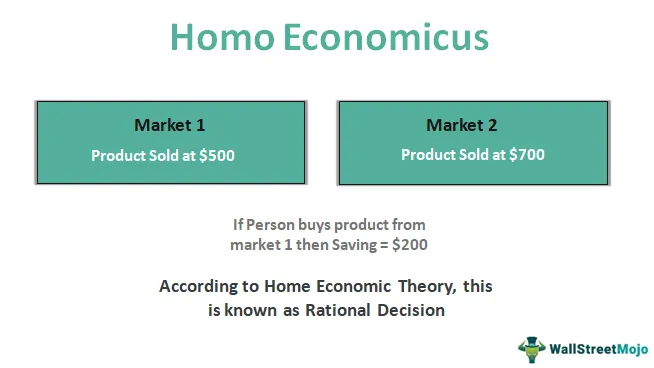

In economic theory, Homo Economicus represents the ideal individual who consistently makes rational decisions aimed at maximizing personal utility and profit. This conceptual model, deeply rooted in classical economics, serves as a cornerstone in the development of various economic models and theories. Classical thinkers such as Adam Smith and John Stuart Mill laid the groundwork for this model, envisioning economic agents as entities with unlimited cognitive capacities, perfect information access, and decision-making driven purely by self-interest.

The delineation of Homo Economicus has significantly influenced microeconomics and game theory by providing a simplified framework that assumes rationality and consistency in human behavior. However, this notion has faced increasing criticism from modern economists and behavioral psychologists. Critics argue that the Homo Economicus model oversimplifies the complexities of human decision-making by neglecting factors such as emotions, cognitive biases, and social influences that play crucial roles in real-world economic decisions. Notably, Nobel laureates like Daniel Kahneman and behavioral economists highlight that actual human behavior often deviates from the rational and self-interested assumptions of Homo Economicus because individuals do not always act in their own best interest, nor do they possess complete information.



Algorithmic trading, a recent innovation in financial markets, illustrates the modern application and inherent limitations of the Homo Economicus model. This approach relies heavily on algorithmic programs that assume rational market behavior, akin to the characteristics of Homo Economicus. Yet, the assumption that market participants consistently behave rationally can lead to potential inefficiencies and challenges, particularly when confronted with the irrationalities and anomalies of human behavior that are not captured by conventional models.

This article examines the criticisms leveled against the Homo Economicus model, its association with rationality in economics, and the resultant implications for algorithmic trading in financial markets. By exploring these dynamics, it aims to offer insight into the evolving discourse on economic modeling and the integration of behavioral insights to address the complexities of human decision-making.

## Table of Contents

## The Traditional View of Homo Economicus

Homo Economicus, a foundational concept in classical economics, traces its origins to the works of thinkers like John Stuart Mill and Adam Smith. This model portrays individuals as perfectly rational agents, making decisions to maximize their utility and profit. It is anchored in the assumption that individuals possess unlimited cognitive capacities and access to perfect information, allowing them to make consistent decisions that serve their self-interest. 

The idealized nature of Homo Economicus implies that individuals can continually process vast amounts of data to determine the optimal choice in any given situation. This model has been particularly influential in microeconomics and game theory, where rational behavior underpins many theoretical frameworks and analyses.

Despite its utility in developing economic theories, the Homo Economicus model has been scrutinized for its lack of consideration of emotional and social factors that influence human behavior. Critics argue that the assumption of pure rationality overlooks the complexity of human decision-making, where emotions, biases, and social contexts play significant roles. Consequently, while Homo Economicus continues to offer valuable insights in economic modeling, it is increasingly viewed as an oversimplification of real human behavior.

## Criticisms of the Homo Economicus Model

The Homo Economicus model, which postulates that individuals act with perfect rationality and self-interest, has been a cornerstone of classical economic theory. However, this model has faced significant criticisms for its oversimplification of human behavior. Critics argue that Homo Economicus inadequately represents real human actions, which are frequently guided by irrationality and emotions. These inconsistencies arise from various factors, including cognitive limitations and incomplete information.

John Maynard Keynes, a prominent economist, acknowledged the limitations of human rationality, emphasizing that people do not always make decisions that are in their own self-interest. Keynes suggested that economic actors are often swayed by emotional responses and psychological influences, leading to decisions that deviate from purely rational calculations. These deviations are not mere exceptions but are intrinsic to human nature.

Behavioral economists have expanded on these critiques by elucidating how cognitive biases and heuristics influence decision-making. For instance, the availability heuristic leads individuals to overestimate the likelihood of events that are more readily recalled from memory, irrespective of their actual probability. Such cognitive shortcuts can result in systematic deviations from rational decision-making models.

Herbert Simon's concept of bounded rationality offers further insight into the limitations of Homo Economicus. Simon posited that humans, contrary to possessing unlimited cognitive resources, have bounded cognitive capacities. This constraint forces individuals to make "satisficing" rather than "optimizing" decisions—settling for a solution that is good enough rather than the absolute best. Bounded rationality acknowledges that individuals operate under limitations of time, information, and processing power, rendering the classical notion of perfect rationality unrealistic.

The criticisms of the Homo Economicus model underscore the need for economic theories and models to account for the complexities of human behavior. Understanding that individuals may act irrationally, driven by factors such as emotions and cognitive biases, can lead to more nuanced and accurate economic models that better reflect real-world decision-making processes.

## Behavioral Economics and Human Decision-Making

Behavioral economics emerged as a key field addressing the inadequacies of the Homo Economicus model by incorporating psychological insights into economic decision-making. Pioneering researchers such as Daniel Kahneman and Amos Tversky laid the foundation for behavioral economics, illustrating that human behavior is often influenced by cognitive biases and social factors, which affect decision-making processes.

Kahneman and Tversky's Prospect Theory, for example, highlights how individuals evaluate potential losses and gains asymmetrically, a significant departure from the traditional rational actor model. This theory demonstrates that people are more sensitive to losses than to gains, a phenomenon known as loss aversion. In mathematical terms, utility $U(x)$ for gains and losses can be expressed as:

$$
U(x) =
\begin{cases} 
x^\alpha & \text{if } x \geq 0 \\
-\lambda (-x)^\beta & \text{if } x < 0 
\end{cases}
$$

where $\lambda > 1$ signifies loss aversion and both $\alpha$ and $\beta$ are parameters that describe diminishing sensitivity.

Cognitive biases such as overconfidence, anchoring, and herd behavior play crucial roles in economic decisions, often leading individuals away from the utility-maximizing choices predicted by the Homo Economicus model. Social influences, including the desire for conformity and the impact of social norms, further complicate the decision-making landscape.

To more accurately describe human behavior, alternative models like Homo Heuristicus and Homo Sociologicus have been proposed. Homo Heuristicus suggests that individuals rely on heuristics, or mental shortcuts, to make decisions under conditions of uncertainty. This model reflects the limitations in cognitive processing power and information availability, providing a more realistic depiction of human decision-making in complex environments.

Homo Sociologicus, on the other hand, emphasizes the influence of social structures and relationships on economic behavior. This model recognizes that decisions are often driven by social context and interactions rather than isolated self-interest, accounting for behaviors motivated by collective welfare and identity.

These developments in behavioral economics underscore the complexities of human decision-making and challenge the simplistic assumptions of perfectly rational [agents](/wiki/agents). By incorporating elements of psychology and sociology, behavioral economics provides a richer, more nuanced understanding of how individuals and groups navigate economic choices, paving the way for more realistic and effective economic theories and models.

## Algorithmic Trading and Homo Economicus

Algorithmic trading employs computer algorithms to execute trading decisions, fundamentally assuming that financial markets operate under principles of rational behavior. The underlying premise is that market participants, akin to Homo Economicus, will act consistently and rationally to maximize their utility. Consequently, these algorithms often utilize models based on efficient market hypotheses and rational choice theories.

However, real-world financial markets frequently deviate from the perfectly rational model, introducing potential inefficiencies into [algorithmic trading](/wiki/algorithmic-trading) systems. Behavioral economics suggests that market participants are often influenced by cognitive biases, such as overconfidence, loss aversion, and herd behavior, which can lead to irrational market movements.

For example, in Python, a simple trading algorithm might rely on moving averages to make buy or sell decisions:

```python
def moving_average_strategy(prices, short_window=40, long_window=100):
    short_avg = prices.rolling(window=short_window, min_periods=1).mean()
    long_avg = prices.rolling(window=long_window, min_periods=1).mean()

    # Generate trading signals: 1 means buy, -1 means sell, 0 means hold
    signals = (short_avg > long_avg).astype(int) - (short_avg < long_avg).astype(int)

    return signals
```

While the above algorithm assumes rational reactions to price trends, it may not account for sudden market anomalies driven by investor sentiment. Therefore, recognizing the role of psychology in financial decision-making can lead to improved algorithmic trading systems, which better anticipate these anomalies.

Incorporating behavioral insights can enhance algorithms by implementing mechanisms to identify and respond to non-rational behavior. For instance, integrating sentiment analysis and [machine learning](/wiki/machine-learning) techniques can allow algorithms to detect and adjust to irrational market dynamics more effectively. This understanding helps refine trading strategies to maintain profitability even when market conditions deviate from rational expectations.

## The Future of Economic Modeling

Economists and financial analysts are now recognizing the significance of human irrationality in shaping economic behavior, prompting a shift in how economic models are developed. Traditional models, largely based on the Homo Economicus paradigm, often assume rational decision-making processes, limiting their effectiveness in predicting real-world outcomes. However, the integration of behavioral insights is paving the way for more nuanced models that better capture the intricacies of human behavior.

Behavioral economics, which includes psychological factors influencing decision-making, provides a more realistic framework by identifying cognitive biases and emotional influences. For instance, Prospect Theory, developed by Daniel Kahneman and Amos Tversky, identifies how individuals value potential gains and losses, deviating from expected utility theory. Incorporating such behavioral insights into economic and trading models can result in more accurate predictions and strategies, reflecting the complex motivations driving human actions.

As technology progresses, economists face the challenge of developing models that can effectively incorporate behavioral complexities. Machine learning and [artificial intelligence](/wiki/ai-artificial-intelligence) offer tools for modeling such intricacies, using vast datasets to discern patterns indicative of irrational behaviors. For example, algorithmic models can be programmed to anticipate market fluctuations caused by herd behavior or overconfidence among traders. These models can be refined through continuous learning processes, adapting to new information and shifting behaviors in the market.

Consider the following Python example that illustrates a simple model incorporating behavioral factors:

```python
import numpy as np

def prospect_theory_utility(x, alpha=0.88, beta=0.88, lambda_param=2.25):
    """Calculate utility from gains and losses using Prospect Theory."""
    return np.where(x >= 0, x ** alpha, -lambda_param * (-x) ** beta)

# Example of calculating utility for a range of gains and losses
gains_and_losses = np.array([-100, -50, 0, 50, 100])
utility = prospect_theory_utility(gains_and_losses)
```

In this code, the `prospect_theory_utility` function computes utility values based on whether an outcome is perceived as a gain or a loss, incorporating realistic behavioral responses.

The future of economic modeling lies in harnessing interdisciplinary approaches that transcend traditional economic assumptions. By blending insights from psychology, technology, and economics, models can be crafted to encompass the full spectrum of human behavior, leading to strategies that are robust and adaptable to the complexities of real-world environments. This evolution not only enhances the accuracy of economic forecasts but also paves the way for more sustainable and effective financial strategies.

## Conclusion

While Homo Economicus has served as a foundational framework for understanding economic theory, it fundamentally lacks accuracy in depicting actual human decision-making behavior. The model's core assumption of perfect rationality overlooks the complexity and oftentimes irrational nature of human actions, which are influenced by emotions, cognitive biases, and social dynamics. This oversimplification has prompted critiques and the development of behavioral economics, which strives to incorporate these psychological insights into more realistic models of behavior.

Algorithmic trading exemplifies the practical implementation of economic theories rooted in the Homo Economicus model. These trading algorithms rely heavily on the assumption that market participants behave in perfectly rational ways to make predictions and execute trades. However, as evidenced by instances of market inefficiencies and anomalies, this approach can be problematic. When models fail to consider irrational behavior, they can lead to significant inaccuracies in trading decisions, thereby illustrating the limitations of traditional economic frameworks.

The ongoing evolution of economic models is essential to address these discrepancies. By integrating behavioral economics, which acknowledges the influence of cognitive limitations and emotional factors, improved financial strategies can emerge. This integration is vital for enhancing the predictive quality of economic models and trading algorithms, enabling them to better accommodate the complexities of human behavior. As technology continues to advance, the challenge will be to design systems that reconcile the traditional assumptions of rationality with the empirical realities of human irrationality, ultimately leading to more robust and effective economic and trading models.

## References & Further Reading

[1]: Mill, J. S. (1874). ["Essays on Some Unsettled Questions of Political Economy,"](https://archive.org/details/essaysonsomeunse00millrich) John W. Parker.

[2]: Smith, A. (1776). ["An Inquiry into the Nature and Causes of the Wealth of Nations,"](https://archive.org/details/inquiryintonatur01smit_0/) W. Strahan and T. Cadell.

[3]: Kahneman, D., & Tversky, A. (1979). ["Prospect Theory: An Analysis of Decision under Risk,"](https://www.jstor.org/stable/1914185) Econometrica, 47(2), 263-291.

[4]: Simon, H. A. (1955). ["A Behavioral Model of Rational Choice,"](https://www.jstor.org/stable/1884852) Quarterly Journal of Economics, 69(1), 99-118.

[5]: Keynes, J. M. (1936). ["The General Theory of Employment, Interest, and Money,"](http://keynes-general-theory.com/generaltheory.pdf) Macmillan Cambridge University Press.

[6]: Thaler, R. H. (1980). ["Toward a Positive Theory of Consumer Choice,"](https://www.sciencedirect.com/science/article/pii/0167268180900517) Journal of Economic Behavior & Organization, 1(1), 39-60.

[7]: Kahneman, D. (2011). ["Thinking, Fast and Slow,"](https://link.springer.com/article/10.1007/s00362-013-0533-y) Farrar, Straus and Giroux.

[8]: Shiller, R. J. (2000). ["Irrational Exuberance,"](https://press.princeton.edu/books/paperback/9780691173122/irrational-exuberance) Princeton University Press.

[9]: Barberis, N., & Thaler, R. (2003). ["A Survey of Behavioral Finance,"](https://www.sciencedirect.com/science/article/pii/S1574010203010276) Handbook of the Economics of Finance.