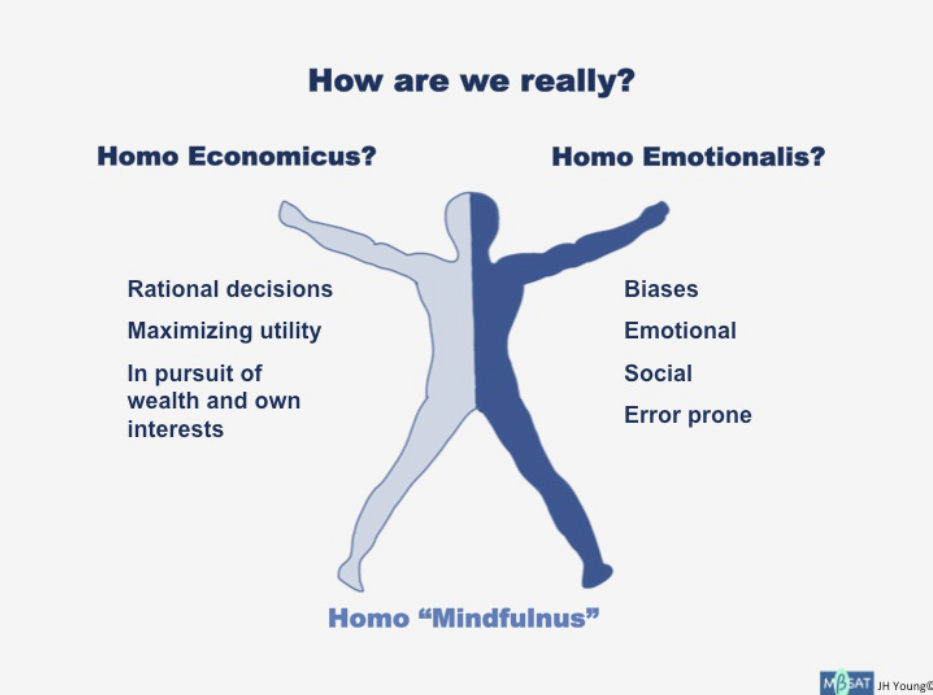

## Table of Contents

## What is the concept of Homo Economicus?

Homo Economicus is a term used in economics to describe a person who makes decisions based purely on rational self-interest. This concept assumes that people always try to maximize their own benefits, like money or happiness, while minimizing costs. In this model, people are seen as having perfect information and the ability to make the best choices for themselves every time.

However, the idea of Homo Economicus is often criticized because real people don't always act this way. Emotions, social influences, and limited information can affect our decisions. For example, someone might choose to help a friend even if it costs them time or money, which goes against the self-interest model. Despite these criticisms, the concept is still useful for economists to predict how people might behave in certain situations.

## How did the idea of Homo Economicus originate?

The idea of Homo Economicus started a long time ago with philosophers and economists trying to understand how people make choices. One of the earliest mentions was by John Stuart Mill in the 1800s. He talked about an "economic man" who always makes decisions based on what's best for them. This idea became popular because it helped economists predict how people might act in markets and other situations.

Over time, the concept of Homo Economicus became more detailed. Economists like Adam Smith and later thinkers added to the idea, suggesting that people are driven by self-interest but also influenced by things like social norms and laws. Even though the idea has been criticized for not being realistic, it's still used today as a simple way to understand economic behavior.

## What are the key assumptions of Homo Economicus?

The main idea behind Homo Economicus is that people always make choices based on what's best for them. They want to get the most benefit, like money or happiness, while spending the least amount of time, effort, or money. This means they are always thinking about what will help them the most and are good at figuring out what that is.

Another big assumption is that people have all the information they need to make the best choice. They know everything about the options they have and can predict what will happen in the future. This makes them very good at deciding what to do because they never have to guess or take risks. Even though these ideas help economists predict how people might act, real people often don't have all the information and don't always act in their own best interest.

## How does Homo Economicus behave in economic models?

In economic models, Homo Economicus always tries to get the most out of every situation. They look at all their choices and pick the one that gives them the biggest benefit for the least cost. For example, if they are buying something, they will choose the item that gives them the most value for their money. They are very good at figuring out what is best for them and always make choices based on what they know will make them happier or richer.

Homo Economicus also has all the information they need to make these choices. They know everything about the options they have and can predict what will happen in the future. This means they never have to guess or take risks because they always know the best thing to do. Economists use this idea to predict how people might act in markets and other situations, even though real people often don't have all the information and don't always act in their own best interest.

## What are some common critiques of the Homo Economicus model?

Many people think the Homo Economicus model doesn't show how real people actually act. It says that people always make choices based on what's best for them, but in real life, people often make decisions based on feelings, what their friends think, or what they believe is right. For example, someone might choose to help a friend even if it costs them time or money, which doesn't fit with the idea of always doing what's best for yourself.

Another problem with the Homo Economicus model is that it assumes people have all the information they need to make the best choice. But in real life, people often don't know everything about their options and have to guess or take risks. This means they can't always pick the best thing for them because they don't have all the facts. Even though the model helps economists predict how people might act, it doesn't always match up with how people really behave.

## Can you explain the concept of bounded rationality in relation to Homo Economicus?

Bounded rationality is an idea that says people can't always make the best choices because they don't have all the information they need and they can't think through every possible option. This is different from Homo Economicus, which says people always make the best choice for themselves because they know everything and can figure out what's best. Bounded rationality is more realistic because it admits that people have limits on their time, knowledge, and ability to think.

In real life, people often use shortcuts or rules of thumb to make decisions instead of thinking through everything perfectly. This is called satisficing, which means choosing an option that is good enough instead of the best possible one. For example, someone might buy a product because it's on sale and seems like a good deal, even if they don't know if it's the absolute best choice. This is very different from the Homo Economicus model, which doesn't think people would ever settle for "good enough" when they could find the perfect choice.

## How does behavioral economics challenge the assumptions of Homo Economicus?

Behavioral economics looks at how people really make choices, not just how they should make them. It says that people don't always act in their own best interest like Homo Economicus says. Instead, people can be influenced by emotions, what their friends do, and other things that don't fit with the idea of always choosing what's best for themselves. For example, someone might buy something just because it's on sale, even if they don't need it, which goes against the idea of always making the best choice.

Behavioral economics also shows that people don't have all the information they need to make perfect choices. They often have to guess or take risks because they can't know everything about their options. This is different from Homo Economicus, which says people always know everything and can predict the future. By studying how people actually behave, behavioral economics helps us understand why people might not always do what seems rational or in their best interest.

## What role does altruism and social preferences play in critiquing Homo Economicus?

Altruism and social preferences show that people don't always act in their own best interest like Homo Economicus says. Altruism means doing things to help others, even if it costs you something. For example, someone might give money to a charity even though it means they have less money for themselves. This goes against the idea of always choosing what's best for yourself. Social preferences mean that people care about what others think and want to be fair or kind. People might choose to share something with a friend even if they could keep it all for themselves. These behaviors show that Homo Economicus doesn't explain everything about how people make choices.

Because of altruism and social preferences, many people think the Homo Economicus model is too simple. It doesn't take into account that people often care about more than just their own happiness or money. Real people might make choices that help others or make them feel good about themselves, even if it's not the best choice for them personally. This is why economists who study behavioral economics say we need to look at these other reasons for why people do what they do. They help us understand that people are more complex than just trying to get the most for themselves.

## How have experimental economics findings impacted the validity of Homo Economicus?

Experimental economics has shown that people don't always act like Homo Economicus says they should. In experiments, people often make choices based on emotions or what others are doing, not just what's best for them. For example, in games where people can share money, many choose to give some away even if they could keep it all. This shows that people care about fairness and helping others, which isn't part of the Homo Economicus model. These findings make it clear that the idea of people always acting in their own best interest is too simple and doesn't match how people really behave.

Because of these experiments, many economists now think that Homo Economicus is not a good way to predict how people will act in real life. The experiments show that people have limits on their information and time, and they often use shortcuts or rules of thumb to make choices. This is different from the idea that people always know everything and can pick the best option. As a result, the field of behavioral economics has grown, trying to understand and predict how people actually make decisions, taking into account things like emotions and social influences.

## What are some alternative models to Homo Economicus proposed in economic theory?

One alternative to Homo Economicus is the idea of Bounded Rationality. This model says that people can't always make the best choices because they don't have all the information they need and they can't think through every possible option. Instead of always picking the best thing for themselves, people often use shortcuts or rules of thumb to make decisions. This is called satisficing, which means choosing an option that is good enough, even if it's not perfect. Bounded Rationality is more realistic because it admits that people have limits on their time, knowledge, and ability to think.

Another alternative is the concept of Behavioral Economics, which looks at how people actually make choices, not just how they should make them. Behavioral economists study how emotions, social influences, and other factors affect our decisions. For example, people might buy something just because it's on sale, even if they don't need it. This shows that people don't always act in their own best interest. Behavioral Economics helps us understand why people might not always do what seems rational or in their best interest, challenging the idea of Homo Economicus.

A third alternative is the idea of Social Preferences, which says that people care about more than just their own happiness or money. They might make choices that help others or make them feel good about themselves, even if it's not the best choice for them personally. For example, someone might give money to a charity even though it means they have less money for themselves. This model shows that people are more complex than just trying to get the most for themselves, and it helps explain why people might act altruistically or in ways that benefit others.

## How does the concept of Homo Economicus apply in real-world policy making?

In real-world policy making, the concept of Homo Economicus is often used as a starting point to predict how people might react to new laws or policies. Policymakers assume that people will make choices based on what's best for them, like trying to save money or increase their happiness. For example, if a government wants to encourage people to save more for retirement, they might offer tax breaks or other incentives, thinking that people will take advantage of these benefits because it's in their best interest. This model helps policymakers design policies that they think will work well because they believe people will respond in predictable ways.

However, because Homo Economicus doesn't always match how people really behave, policymakers also need to consider other factors. Real people often make decisions based on emotions, social influences, and limited information, which can lead to different outcomes than what the model predicts. For instance, even with tax breaks, some people might not save more for retirement if they don't trust the system or if they prioritize spending on immediate needs. As a result, policymakers often use insights from behavioral economics and other alternative models to create more effective policies that take into account the complexities of human behavior.

## What future directions might economic theory take regarding the concept of Homo Economicus?

In the future, economic theory might move away from the idea of Homo Economicus because it doesn't fully explain how people really make choices. Economists might focus more on behavioral economics, which looks at how emotions, social influences, and limited information affect our decisions. They could develop new models that show how people use shortcuts or rules of thumb to make choices, instead of always picking the best option. This would help economists understand and predict how people will react to things like new laws or policies better, because these models would be more realistic.

Another direction economic theory might take is to include more about social preferences and altruism. This means understanding that people often care about helping others or being fair, not just about what's best for themselves. Economists might create models that show how these factors influence our decisions, which could lead to better policies that work with how people really behave. By considering these other reasons for why people do what they do, economic theory could become more accurate and useful for predicting and shaping human behavior.

## How do Behavioral Economics influence Human Decision-Making?

Behavioral economics emerged as a key field addressing the inadequacies of the Homo Economicus model by incorporating psychological insights into economic decision-making. Pioneering researchers such as Daniel Kahneman and Amos Tversky laid the foundation for behavioral economics, illustrating that human behavior is often influenced by cognitive biases and social factors, which affect decision-making processes.

Kahneman and Tversky's Prospect Theory, for example, highlights how individuals evaluate potential losses and gains asymmetrically, a significant departure from the traditional rational actor model. This theory demonstrates that people are more sensitive to losses than to gains, a phenomenon known as loss aversion. In mathematical terms, utility $U(x)$ for gains and losses can be expressed as:

$$
U(x) =
\begin{cases} 
x^\alpha & \text{if } x \geq 0 \\
-\lambda (-x)^\beta & \text{if } x < 0 
\end{cases}
$$

where $\lambda > 1$ signifies loss aversion and both $\alpha$ and $\beta$ are parameters that describe diminishing sensitivity.

Cognitive biases such as overconfidence, anchoring, and herd behavior play crucial roles in economic decisions, often leading individuals away from the utility-maximizing choices predicted by the Homo Economicus model. Social influences, including the desire for conformity and the impact of social norms, further complicate the decision-making landscape.

To more accurately describe human behavior, alternative models like Homo Heuristicus and Homo Sociologicus have been proposed. Homo Heuristicus suggests that individuals rely on heuristics, or mental shortcuts, to make decisions under conditions of uncertainty. This model reflects the limitations in cognitive processing power and information availability, providing a more realistic depiction of human decision-making in complex environments.

Homo Sociologicus, on the other hand, emphasizes the influence of social structures and relationships on economic behavior. This model recognizes that decisions are often driven by social context and interactions rather than isolated self-interest, accounting for behaviors motivated by collective welfare and identity.

These developments in behavioral economics underscore the complexities of human decision-making and challenge the simplistic assumptions of perfectly rational [agents](/wiki/agents). By incorporating elements of psychology and sociology, behavioral economics provides a richer, more nuanced understanding of how individuals and groups navigate economic choices, paving the way for more realistic and effective economic theories and models.

## References & Further Reading

[1]: Mill, J. S. (1874). ["Essays on Some Unsettled Questions of Political Economy,"](https://archive.org/details/essaysonsomeunse00millrich) John W. Parker.

[2]: Smith, A. (1776). ["An Inquiry into the Nature and Causes of the Wealth of Nations,"](https://archive.org/details/inquiryintonatur01smit_0/) W. Strahan and T. Cadell.

[3]: Kahneman, D., & Tversky, A. (1979). ["Prospect Theory: An Analysis of Decision under Risk,"](https://www.jstor.org/stable/1914185) Econometrica, 47(2), 263-291.

[4]: Simon, H. A. (1955). ["A Behavioral Model of Rational Choice,"](https://www.jstor.org/stable/1884852) Quarterly Journal of Economics, 69(1), 99-118.

[5]: Keynes, J. M. (1936). ["The General Theory of Employment, Interest, and Money,"](http://keynes-general-theory.com/generaltheory.pdf) Macmillan Cambridge University Press.

[6]: Thaler, R. H. (1980). ["Toward a Positive Theory of Consumer Choice,"](https://www.sciencedirect.com/science/article/pii/0167268180900517) Journal of Economic Behavior & Organization, 1(1), 39-60.

[7]: Kahneman, D. (2011). ["Thinking, Fast and Slow,"](https://link.springer.com/article/10.1007/s00362-013-0533-y) Farrar, Straus and Giroux.

[8]: Shiller, R. J. (2000). ["Irrational Exuberance,"](https://press.princeton.edu/books/paperback/9780691173122/irrational-exuberance) Princeton University Press.

[9]: Barberis, N., & Thaler, R. (2003). ["A Survey of Behavioral Finance,"](https://www.sciencedirect.com/science/article/pii/S1574010203010276) Handbook of the Economics of Finance.