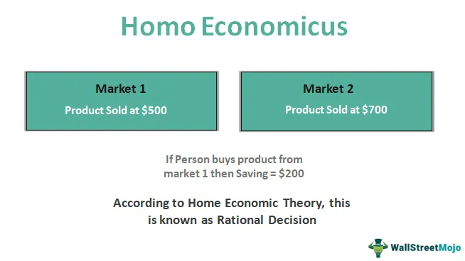

The concept of Homo Economicus represents individuals in economic theories as rational, self-interested actors, capable of making decisions that maximize their utility based on complete and accurate information. This theoretical model forms a crucial foundation for many economic theories, which rely on the assumption of consistent rational behavior and perfect information to predict and explain economic outcomes. However, in practical applications, especially within financial markets and algorithmic trading, these assumptions are often scrutinized.

Algorithmic trading exemplifies the application of Homo Economicus assumptions by automating trading strategies that are theoretically rooted in rational decision-making processes. Algorithms analyze complex datasets to identify market trends, acting swiftly on opportunities with an assumed rational response to financial signals. The model's simplicity enables the creation of mathematically precise economic models and predictions, yet it also invites criticism due to its deviation from actual human behavior.



This article investigates the intricate relationship between rational behavior, the model of Homo Economicus, economic theory, and algorithmic trading. Emphasizing their roles in shaping financial markets and decision-making, we aim to illuminate how the idealized rational actor influences not only theoretical economic frameworks but also practical trading systems deployed in real-world markets. As we explore these intersections, we will see how they affect economic stability and innovation, challenging conventional assumptions and inviting adaptations that reflect the complexities of human decision-making.

## Table of Contents

## Understanding Homo Economicus

Homo Economicus, often referred to as the economic man, is a theoretical construct integral to neoclassical economics. It represents individuals as rational actors who make decisions aimed at maximizing their utility or profit. The model assumes that individuals possess perfect information and possess the ability to process this information to make decisions that align with their self-interest. This simplification of human behavior permits economists to predict economic outcomes with mathematical precision and formulate economic theories that underpin many aspects of modern economic thought.

The conceptual roots of Homo Economicus can be traced back to the 19th century, most notably to the works of philosopher and economist John Stuart Mill. Mill's writings emphasized individuals as rational and self-interested, which formed part of the foundation of classical and neoclassical economic models. The model suggests that individuals evaluate choices by considering the costs and benefits, ultimately selecting the option that provides the greatest net benefit.

Despite its widespread application in economic modeling, the Homo Economicus model has not been without its detractors. Critics, particularly from the field of behavioral economics, argue that the model fails to capture the complexities and nuances of human behavior. People do not always act rationally; they are subject to cognitive biases, emotional influences, and other psychological factors that can lead to decisions that deviate from strict utility maximization.

Research by scholars such as Daniel Kahneman and Amos Tversky has demonstrated systematic deviations from rational behavior, challenging the assumption of complete rationality embedded in the Homo Economicus model. These insights have prompted the development of alternative models that incorporate elements like social preferences, fairness concerns, and bounded rationality, acknowledging that human decision-making is often more complex than traditional economic models suggest.

In summary, while Homo Economicus provides a foundational framework for economic modeling, recognizing its limitations and incorporating the insights from behavioral economics is crucial for advancing economic theory and improving its applicability to real-world scenarios.

## Criticisms of Homo Economicus

Critics of the Homo Economicus model argue that it fails to accurately represent real human behavior. The model, which posits that humans are perfectly rational and consistently self-interested economic [agents](/wiki/agents), often overlooks the complexities and nuances of human decision-making. Behavioral economics has challenged this paradigm by illustrating that human choices are frequently influenced by cognitive biases and irrational tendencies. Research by Daniel Kahneman and Amos Tversky, notably their Prospect Theory, provides empirical evidence of these deviations from rational behavior. Their work demonstrates that people value gains and losses differently, leading to decisions that diverge from what would be expected in a purely rational framework.

Cognitive biases such as overconfidence, anchoring, and loss aversion play significant roles in shaping economic decisions. For example, loss aversion suggests that individuals experience the pain of losses more acutely than the pleasure of equivalent gains, which can result in risk-averse behavior that contradicts the risk-neutral assumptions of Homo Economicus. Furthermore, alternative models such as the Behavioral Economic Model propose that decisions are also influenced by social norms, emotions, and other psychological factors that are not accounted for in the traditional economic theories.

Recognizing these limitations is essential for enhancing the accuracy of economic models and predictions. By incorporating insights from behavioral economics, economists can develop more comprehensive models that better reflect actual human behavior. This understanding is not only crucial for academic purposes but also for practical applications, such as formulating policies that account for human irrationality and developing financial instruments that cater to the behavioral tendencies of market participants.

Ultimately, the dialogue between traditional economic theories and behavioral insights holds the potential to create a more robust and nuanced understanding of economic phenomena, bridging the gap between the theoretical optimal and the practical reality.

## Economic Theory and Rational Behavior

Rational behavior is a core principle in economic theories and models, positing that individuals, corporations, and markets make decisions aimed at maximizing personal advantage. This principle is integral to neoclassical economics, forming the basis for many predictive models and policy formulations. In economic theory, rationality implies that individuals have clear preferences and can process all available information to rank these preferences based on utility. Consequently, individuals are expected to choose the option that offers the highest utility or profit.

The rational behavior model is not confined to individual decision-making but extends to organizational and market dynamics. Organizations, perceived as rational agents, strive to optimize operational efficiencies and profit margins. Market behavior, underpinned by this rationality assumption, is expected to reflect aggregate individual behaviors, where market equilibrium is achieved through the balancing of supply and demand forces.

Economists employ the rational behavior assumption to develop robust policies and forecast market responses to economic stimuli. The presumption is that individuals and markets will react predictably to changes in economic variables such as interest rates, taxes, and subsidies. This predictability allows for mathematical modeling of economic phenomena, which aids in the crafting of strategic economic policies.

However, the recognition of human irrationality presents opportunities to refine economic models. Behavioral economics provides insights into how cognitive biases, emotions, and social influences can lead individuals away from purely rational decision-making. Incorporating these insights can lead to the development of more nuanced economic models that better capture actual human behavior. By acknowledging that deviations from strict rationality occur, economists can enhance the accuracy and reliability of their predictions, ultimately leading to more effective policies and interventions in the economic sphere.

## Algorithmic Trading: Bridging Theory and Practice

Algorithmic trading harnesses economic theories to create automated systems that optimize trading strategies. At its core, [algorithmic trading](/wiki/algorithmic-trading) presupposes that market participants engage in rational decision-making, reacting predictably to financial signals. This presumption is founded on the Homo Economicus model, a concept suggesting that individuals operate with complete rationality and full access to information to maximize their utility or profit.

In practice, algorithmic trading systems use sophisticated algorithms to analyze massive datasets. These datasets encompass various market elements such as historical price data, trade [volume](/wiki/volume-trading-strategy), economic indicators, and even news sentiment. For instance, a typical algorithm might use time-series analysis to identify trends or [machine learning](/wiki/machine-learning) models to predict price movements and execute trades automatically based on these predictions. Here is a simple Python example illustrating a basic moving average crossover strategy, commonly used in algorithmic trading:

```python
import numpy as np
import pandas as pd

# Assume 'data' is a DataFrame containing historical price data
data['Short_MA'] = data['Close'].rolling(window=40).mean()
data['Long_MA'] = data['Close'].rolling(window=120).mean()

data['Signal'] = 0
data['Signal'][40:] = np.where(data['Short_MA'][40:] > data['Long_MA'][40:], 1, 0)
data['Position'] = data['Signal'].diff()
```

In this example, a buy signal is generated when the short-term moving average crosses above the long-term moving average, illustrating a potential bullish trend.

However, real-world market conditions often diverge from these theoretical assumptions of rational behavior. Factors such as investor psychology, misinformation, and unexpected geopolitical events can lead to irrational market movements that traditional models may not predict. Understanding these market anomalies emphasizes the necessity to integrate insights from behavioral finance, which studies how psychological influences and cognitive biases impact financial decisions, into algorithmic trading strategies.

Integrating behavioral insights is becoming increasingly essential to improve the accuracy of algorithmic trading. By accounting for common cognitive biases—like overconfidence or loss aversion—algorithms can better anticipate irrational market behaviors and adjust trading strategies accordingly. This shift necessitates a more nuanced approach, incorporating behavioral patterns into the quantitative models traditionally used in algorithmic trading.

As the field evolves, we observe a growing trend towards creating hybrid models that blend classical economic theories with behavioral finance principles. These models are expected to enhance predictive power and align more closely with actual market dynamics, promising a future where algorithmic trading systems can adapt rapidly to both rational signals and the subtleties of human behavior.

## Implications for Financial Markets

The assumption of rational behavior holds significant importance in the design of financial markets and instruments. This foundational concept suggests that market participants make decisions that maximize their utility, leading to efficient markets described by the Efficient Market Hypothesis (EMH). However, behavioral economics challenges this assumption by presenting evidence of consistent deviations from rational behavior, which have crucial implications for financial market stability and regulation.

One of the essential roles of understanding deviations from rationality is preventing economic crises and enhancing market stability. The 2008 financial crisis underscored the fragility of markets built on rational assumptions, where investors ignored systematic risks and overvalued assets. Recognizing human biases and irrational behaviors can lead to better risk management strategies and the development of robust financial systems that withstand market shocks.

Regulators are increasingly incorporating insights from behavioral economics to develop more effective frameworks. Traditional market regulations based on the assumption of rational actors may fail to anticipate or mitigate market anomalies caused by herd behavior, overconfidence, or loss aversion. By acknowledging these behavioral tendencies, regulators can design policies that curb irrational exuberance, enhance transparency, and promote investor education, thus improving market resilience.

Algorithmic trading systems exemplify the intersection of economic theory and market practice. While these systems are traditionally based on the principles of rational decision-making and the rapid analysis of market data, they are also evolving to incorporate insights from behavioral finance. For instance, by identifying patterns that signal irrational exuberance or panic selling, algorithms can adjust trading strategies to mitigate potential losses or exploit temporary mispricing. This integration of behavioral insights is essential for optimizing algorithmic performance and aligning trading strategies with actual market behaviors.

Future innovations in financial markets are likely to blend traditional economic theories with a deeper understanding of human behavior. By doing so, financial models will become more reflective of real-world complexities, allowing for the development of instruments and frameworks that better serve both individual and institutional investors. These innovations will not only improve market efficiency and stability but also increase the robustness of financial predictions in an ever-evolving economic landscape.

In conclusion, while the assumption of rational behavior remains a cornerstone in financial market design, acknowledging and integrating behavioral insights are crucial steps in aligning economic theories with actual market conditions. As algorithms and financial systems evolve, the synergy between traditional and behavioral economics will foster more effective and adaptive market mechanisms.

## Conclusion

The Homo Economicus model represents a significant yet imperfect pillar in economic theory. This theoretical construct simplifies the complexity of human decision-making to predict and understand economic outcomes. However, its limitations become evident when juxtaposed against real-world behaviors that frequently deviate from assumed rationality. Integrating behavioral insights into economic theories can significantly enhance their predictive accuracy. Behavioral economics has shown that cognitive biases and emotions often influence decisions, which traditional models may overlook. By embracing these insights, economists can develop more robust frameworks that better account for actual human behavior.

Algorithmic trading exemplifies the convergence of theoretical assumptions with practical application. These algorithms often rely heavily on the Homo Economicus model, making decisions based on the notion of rational market actors. Nevertheless, real-world market conditions often display irrational behaviors and unexpected deviations. As a result, algorithmic systems are increasingly incorporating behavioral finance principles to improve their adaptability and accuracy in trading strategies. Understanding the nuances of human behavior enriches these systems, allowing them to navigate the complexities of financial markets more effectively.

Continuous research into human behavior and decision-making processes remains crucial for advancing economic models and frameworks. As new findings emerge, incorporating them into existing constructs allows for a more comprehensive understanding of market dynamics and individual decision-making. This ongoing exploration is vital for bridging the gap between traditional economic models and modern behavioral insights.

The future of economic modeling and trading systems lies in the harmonic integration of traditional and behavioral insights. By acknowledging and addressing the limitations of Homo Economicus, while embracing the complexity and variability of human behavior, future models will likely achieve greater efficacy and relevance. Such an integration promises more accurate predictions and innovative solutions that align better with actual market behaviors and economic realities.

## References & Further Reading

[1]: Kahneman, D., & Tversky, A. (1979). ["Prospect Theory: An Analysis of Decision under Risk."](http://web.mit.edu/curhan/www/docs/Articles/15341_Readings/Behavioral_Decision_Theory/Kahneman_Tversky_1979_Prospect_theory.pdf) Econometrica, 47(2), 263-291.

[2]: Mill, J. S. (1909). ["Principles of Political Economy with some of their Applications to Social Philosophy."](https://oll.libertyfund.org/titles/mill-principles-of-political-economy-ashley-ed) (7th ed.). Longmans, Green and Co.

[3]: Thaler, R. H. (1994). ["Quasi Rational Economics."](https://books.google.com/books/about/Quasi_Rational_Economics.html?id=BgGs1Lx3oDEC) Russell Sage Foundation.

[4]: DeLong, J. B., Shleifer, A., Summers, L. H., & Waldmann, R. J. (1990). ["Noise Trader Risk in Financial Markets."](https://ms.mcmaster.ca/~grasselli/DeLongShleiferSummersWaldmann90.pdf) The Quarterly Journal of Economics, 105(2), 703-738.

[5]: Shleifer, A. (2000). ["Inefficient Markets: An Introduction to Behavioral Finance."](https://academic.oup.com/book/27761) Oxford University Press.