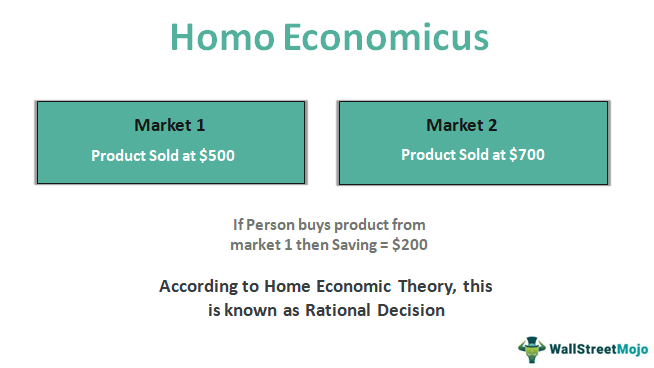

## Table of Contents

## What is the basic definition of Homo Economicus?

Homo Economicus is a term used in economics to describe a person who makes decisions based purely on rational thinking. This means that they always try to get the most benefit for themselves while using the least amount of resources. They are seen as someone who carefully weighs the costs and benefits of every choice they make.

In reality, people don't always act this way. Emotions, social pressures, and other factors can influence decisions. However, the idea of Homo Economicus is useful because it helps economists predict how people might behave in certain situations. It simplifies the complex nature of human decision-making into a model that can be studied and analyzed.

## How does Homo Economicus differ from real human behavior?

Homo Economicus assumes that people always make choices that give them the most benefit for the least cost. They think about everything logically and don't let feelings or other people's opinions affect their decisions. They are like perfect decision-makers who always know what's best for them and act accordingly.

In real life, people don't always act like Homo Economicus. They often make choices based on emotions, habits, or what others think. For example, someone might buy a product because it's popular, even if it's not the best value. Or they might choose to help a friend even if it's not the most rational choice. These behaviors show that real people are influenced by many factors that Homo Economicus doesn't consider.

## What are the key assumptions underlying the concept of Homo Economicus?

The concept of Homo Economicus is based on a few important ideas. One main idea is that people always make decisions that help them the most. They think about all the choices they have and pick the one that gives them the biggest benefit for the smallest cost. This means they are always trying to do what's best for themselves.

Another key assumption is that people have all the information they need to make these choices. They know everything about the options they have and can predict what will happen with each choice. They also think logically and don't let feelings or other people's opinions affect their decisions. This makes them very different from real people, who often don't have all the facts and can be influenced by many things.

## Who first introduced the concept of Homo Economicus?

The idea of Homo Economicus was first talked about by John Stuart Mill in the 1800s. He used the term to describe a person who always makes choices based on what's best for them. Mill thought that people act like they are trying to get the most happiness or benefit from their decisions.

Later, economists like Vilfredo Pareto and Lionel Robbins helped develop the idea more. They used it to explain how people make choices in a way that can be studied and understood. Even though it's not a perfect way to describe how real people act, it's still an important part of economic theory.

## In which fields is the concept of Homo Economicus most commonly used?

The concept of Homo Economicus is most commonly used in the field of economics. Economists use it to make models and theories about how people make choices. They assume that people always try to get the most benefit for themselves. This helps economists predict how people might act in different situations, like buying things or choosing jobs. It's a simple way to understand the complex world of human decisions.

The idea is also used in other areas like finance and business. In finance, people use it to understand how investors make choices about where to put their money. They think investors always try to get the best return on their investments. In business, managers might use the idea to predict how customers will react to new products or prices. Even though it's not a perfect way to describe real people, it's a useful tool in these fields.

## How has the concept of Homo Economicus evolved over time?

The concept of Homo Economicus started with John Stuart Mill in the 1800s. He used it to describe people who always make choices based on what's best for them. Over time, economists like Vilfredo Pareto and Lionel Robbins helped develop the idea more. They used it to explain how people make decisions in a way that can be studied and understood. The idea became a key part of economic theory, helping economists predict how people might act in different situations.

As time went on, people started to see that Homo Economicus was not a perfect way to describe how real people act. Real people often make choices based on emotions, habits, or what others think, which the original idea didn't consider. This led to new ideas in economics, like behavioral economics, which looks at how real people make decisions. Even though Homo Economicus is still used, it's now seen as a simple model that doesn't capture all the complexities of human behavior.

## What are the main criticisms of the Homo Economicus model?

One main criticism of the Homo Economicus model is that it doesn't match how real people act. Real people often make choices based on emotions, habits, or what others think. For example, someone might buy a product because it's popular, even if it's not the best value. The model assumes people always think logically and have all the information they need, but in real life, people often don't know everything and can be influenced by many things.

Another criticism is that the model is too simple. It doesn't consider things like social norms, fairness, or how people might act differently in different situations. For example, someone might choose to help a friend even if it's not the most rational choice. This shows that real people care about more than just their own benefit. While the Homo Economicus model is useful for making predictions, it doesn't capture the full range of human behavior.

## Can you provide examples of economic theories that rely on the Homo Economicus assumption?

One economic theory that relies on the Homo Economicus assumption is the theory of consumer choice. This theory says that people always choose the things that give them the most happiness or benefit. They look at all the options and pick the one that gives them the biggest bang for their buck. Economists use this idea to predict how people will spend their money. For example, if the price of a product goes down, the theory says more people will buy it because it gives them more benefit for less cost.

Another theory is the theory of supply and demand. This theory assumes that people act like Homo Economicus when they buy and sell things. Buyers always try to get the lowest price, and sellers always try to get the highest price. The theory says that the price of a product will be where the amount people want to buy equals the amount people want to sell. This balance happens because everyone is trying to get the most benefit for themselves. Even though real people don't always act this way, the theory helps economists understand how prices are set in markets.

## How do behavioral economics challenge the assumptions of Homo Economicus?

Behavioral economics challenges the assumptions of Homo Economicus by showing that people don't always make choices based on logic and perfect information. Instead, real people often make decisions influenced by emotions, habits, and social pressures. For example, someone might buy a product because it's popular or because they feel good about it, even if it's not the best value. Behavioral economists study these real-world behaviors and find that people often act in ways that don't fit the rational model of Homo Economicus.

One key way behavioral economics challenges Homo Economicus is by looking at cognitive biases. These are mistakes in thinking that can lead people to make choices that aren't in their best interest. For instance, people might overvalue things they already own, a bias called the endowment effect. This shows that people don't always weigh costs and benefits perfectly, as Homo Economicus would. By studying these biases, behavioral economists can better understand and predict how people really make decisions, which is different from the simple model of Homo Economicus.

## What are some alternative models to Homo Economicus proposed in economic theory?

One alternative to Homo Economicus is the idea of Bounded Rationality, which was introduced by Herbert Simon. This model says that people want to make good choices, but they can't always think through everything perfectly. They have limits on their time, information, and ability to think. So, instead of finding the best choice, people often pick the first option that seems good enough. This is called satisficing. Bounded Rationality helps explain why people sometimes make choices that don't seem perfectly rational, but are still reasonable given their limits.

Another alternative is the concept of Prospect Theory, developed by Daniel Kahneman and Amos Tversky. This theory focuses on how people make choices under uncertainty and how they perceive gains and losses. It says that people feel the pain of losing something more than the joy of gaining something of the same value. This is called loss aversion. Prospect Theory also shows that people can be influenced by how choices are presented to them, which is called framing. These ideas help explain why people might act differently from what Homo Economicus would predict, especially when they're dealing with risk and uncertainty.

## How does the concept of Homo Economicus apply to modern economic policy-making?

The concept of Homo Economicus is still used in modern economic policy-making because it helps policymakers predict how people might act. They assume that people will always try to get the most benefit for themselves. This idea is used to make rules about taxes, prices, and other economic policies. For example, if the government wants to encourage people to save more money, they might use the Homo Economicus model to predict how people will respond to changes in interest rates or tax breaks.

However, policymakers also know that real people don't always act like Homo Economicus. They understand that emotions, habits, and social pressures can affect people's choices. This is why they also use ideas from behavioral economics, which looks at how real people make decisions. By combining both models, policymakers can make more effective rules that consider both the rational and the human sides of decision-making. This helps them create policies that work better in the real world.

## What are the implications of moving away from the Homo Economicus model in economic research?

Moving away from the Homo Economicus model in economic research means that economists are trying to understand how real people make choices, not just how a perfect, rational person would. This change can help economists make better predictions about how people will act in different situations. For example, instead of assuming everyone will always pick the cheapest option, economists might look at how people's emotions or habits affect their choices. This can lead to more accurate models that take into account things like social norms, fairness, and cognitive biases.

By using these new models, economic research can become more useful for making policies that work in the real world. Governments and businesses can create rules and products that fit how people actually behave, not just how they should behave according to a simple model. This can lead to better outcomes for everyone, like more effective public policies or products that people are more likely to buy. While the Homo Economicus model is still useful for some things, moving away from it can help economists understand the full range of human behavior and make more informed decisions.

## References & Further Reading

[1]: Kahneman, D., & Tversky, A. (1979). ["Prospect Theory: An Analysis of Decision under Risk."](http://web.mit.edu/curhan/www/docs/Articles/15341_Readings/Behavioral_Decision_Theory/Kahneman_Tversky_1979_Prospect_theory.pdf) Econometrica, 47(2), 263-291.

[2]: Mill, J. S. (1909). ["Principles of Political Economy with some of their Applications to Social Philosophy."](https://oll.libertyfund.org/titles/mill-principles-of-political-economy-ashley-ed) (7th ed.). Longmans, Green and Co.

[3]: Thaler, R. H. (1994). ["Quasi Rational Economics."](https://books.google.com/books/about/Quasi_Rational_Economics.html?id=BgGs1Lx3oDEC) Russell Sage Foundation.

[4]: DeLong, J. B., Shleifer, A., Summers, L. H., & Waldmann, R. J. (1990). ["Noise Trader Risk in Financial Markets."](https://ms.mcmaster.ca/~grasselli/DeLongShleiferSummersWaldmann90.pdf) The Quarterly Journal of Economics, 105(2), 703-738.

[5]: Shleifer, A. (2000). ["Inefficient Markets: An Introduction to Behavioral Finance."](https://academic.oup.com/book/27761) Oxford University Press.