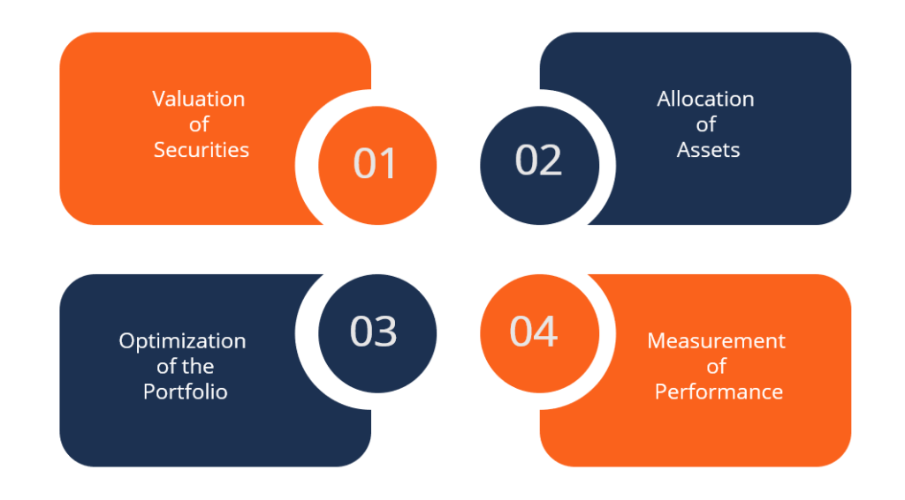

In the fast-paced world of finance, crafting successful investment strategies is fundamentally dependent on a comprehensive understanding of both theoretical and technological advances. Theoretical foundations, such as economic theories, provide the essential framework upon which these strategies are built. A key component in this regard is the concept of homogeneous expectations, originating from Harry Markowitz's Modern Portfolio Theory (MPT). This theory suggests that all investors predict similar outcomes for the performance of securities, reinforcing the idea of investors as rational actors making decisions based purely on available information.

Parallel to these theoretical constructs, technological advancements have dramatically reshaped the landscape of financial investments. One of the most significant technological innovations in this sphere is algorithmic trading. Leveraging computational power, algorithmic trading enables high-speed trading decisions based on pre-defined criteria. This approach not only streamlines trading strategies but also capitalizes on price movements and market trends, incorporating assumptions of homogeneous expectations to enhance decision-making processes.



This article will explore how these elements come together to inform robust investment strategies in today's financial landscape. By analyzing the integration of economic theories and technological advancements, it will highlight the importance of balancing foundational concepts with cutting-edge technologies. This synergy enables investors to optimize portfolios and achieve greater precision and reliability in their strategies.

## Table of Contents

## Understanding Homogeneous Expectations in Economic Theory

Homogeneous expectations is a central concept in Harry Markowitz's Modern Portfolio Theory (MPT). It presupposes that all investors have the same expectations regarding the future performance of securities. This assumption simplifies the modeling of investment decisions, predicated on the rationale that investors act purely on available information, aiming to maximize returns while minimizing risks. The idea of homogeneous expectations posits an investment environment where all market participants operate with a unified foresight, thus eliminating discrepancies in perceived asset values.

This theoretical framework positions investors as rational actors, adhering to the Efficient Market Hypothesis (EMH). Under this premise, securities prices reflect all known information at any given time, and investors leverage this comprehensive dataset to make informed portfolio choices. The expectation of universal consensus among investors reinforces the predictability and competitiveness of markets, leading to efficient capital allocation.

Nevertheless, the assumption of homogeneous expectations has been met with critique. Its inherent simplicity is often at odds with the complex and varied behaviors observed in real-world investors. Investors have unique preferences, goals, information access, and interpretations, affecting their expectations and decision-making processes. Behavioral finance research has demonstrated that cognitive biases, emotions, and social factors frequently drive investor actions, contrasting sharply with the rational, homogeneous actor model.

Moreover, the assumption does not account for asymmetry in information distribution, where some investors might have access to more or better information than others, leading to strategic advantages. Such divergence from theory raises questions about the applicability of homogeneous expectations in capturing the intricacies of modern financial markets.

In conclusion, while homogeneous expectations offer a structured approach to portfolio optimization within MPT, acknowledging its limitations is crucial. The recognition that investors may behave unpredictably, driven by disparate expectations and information, invites a reevaluation of traditional models to better align with the nuanced realities of investment behavior.

## Advantages and Criticisms of Homogeneous Expectations

The concept of homogeneous expectations plays a pivotal role in simplifying investment modeling, which is central to developing efficient portfolios. In economic theory, this assumption posits that all investors have identical expectations regarding the future performance of securities. This premise aligns with the foundation of Harry Markowitz's Modern Portfolio Theory (MPT), which seeks to optimize portfolio allocations by statistically balancing expected returns against risk. The simplicity introduced by homogeneous expectations allows modelers to focus on optimizing portfolios without accounting for a diverse range of investor forecasts, thus facilitating the mathematical tractability of models such as the Capital Asset Pricing Model (CAPM).

However, this simplification is not without critique. Behavioral finance studies, spearheaded by pioneers like Daniel Kahneman and Amos Tversky, have demonstrated that investors often behave irrationally and possess varied goals that extend beyond simple risk-return analyses. These studies highlight cognitive biases and emotional reactions that significantly influence investment decisions, leading to deviations from the rational behavior assumed by traditional financial models. For example, phenomena such as overconfidence, loss aversion, and herding behavior complicate the assumption that all market participants share the same expectations.

Critics of homogeneous expectations also note that this assumption fails to account for the diverse informational landscapes faced by investors. In reality, investors have differing access to information, risk tolerance levels, and investment horizons, which challenge the idea of uniform expectations across all market actors. The variance in expectations can lead to different interpretations of the same data, affecting asset pricing and market [volatility](/wiki/volatility-trading-strategies).

The limitations of homogeneous expectations are further compounded by the dynamic nature of market conditions. Factors such as economic shifts, geopolitical events, and technological advances contribute to market complexities that are not easily encapsulated by a single set of investor expectations. Hence, while homogeneous expectations contribute to the elegance of theoretical models, their applicability in capturing real-world investor psychology and market dynamics remains constrained. Emerging approaches in finance advocate for models that incorporate behavioral insights and recognize the heterogeneous nature of investor expectations, striving for a more nuanced understanding of the market landscape.

## Algorithmic Trading and Its Role in Modern Investment Strategies

Algorithmic trading harnesses advanced computational techniques to execute trades rapidly based on specific algorithms or pre-defined criteria. This approach utilizes mathematical models and statistical analyses to identify and capitalize on fleeting trading opportunities that might be imperceptible to human traders. By integrating extensive data processing capabilities, [algorithmic trading](/wiki/algorithmic-trading) can analyze vast volumes of market data in real time, responding to market movements with precision and speed that manual trading methods cannot achieve.

One of the key features of algorithmic trading is its ability to incorporate assumptions such as homogeneous expectations. This simplifies the trading process by assuming that all market participants have the same outlook on future security performances, allowing for streamlined decision-making. Under this framework, trading algorithms focus primarily on detecting and acting on price movements and trends. This standardized approach enables the algorithms to swiftly execute buy or sell orders when specific market conditions are met, thereby optimizing trading efficiency and effectiveness.

Algorithms are particularly adept at risk and return prediction through consistent frameworks. They utilize quantitative models to assess the risk-reward profile of trades, adjusting portfolios dynamically in response to evolving market conditions. For instance, algorithms can be programmed to adjust positions based on market volatility levels, expected returns, or other risk factors, thereby aligning with predefined investment strategies. This adaptability is crucial in environments characterized by rapid fluctuations in market conditions.

The Python programming language is often employed in algorithmic trading for its extensive libraries and ease of handling complex data sets. For example, Python's libraries such as NumPy and pandas facilitate numerical data manipulation, while tools like matplotlib enable data visualization, contributing to the development and testing of trading strategies. Here's a simple example of how Python might be used to implement a basic trading strategy:

```python
import numpy as np
import pandas as pd
import matplotlib.pyplot as plt

# Generate a random set of price data
np.random.seed(0)
price_data = np.random.normal(loc=0.001, scale=0.02, size=1000).cumsum()

# Calculate moving average
window_size = 50
moving_average = pd.Series(price_data).rolling(window=window_size).mean()

# Simple trading signal: buy when price crosses above moving average, sell when below
signals = np.where(price_data > moving_average, 1, -1)

plt.figure(figsize=(14,7))
plt.plot(price_data, label='Price Data')
plt.plot(moving_average, label=f'{window_size}-Day Moving Average', color='orange')
plt.scatter(np.arange(len(price_data)), price_data, c=signals, cmap='coolwarm', label='Trading Signal', alpha=0.7)
plt.legend()
plt.show()
```

In this example, the code generates synthetic price data, computes a moving average, and uses this average to trigger buy or sell signals. Such straightforward strategies can be further refined and expanded into more sophisticated models by incorporating factors like transaction costs, risk management constraints, and multi-asset analysis, showcasing the versatility and potential of algorithmic trading in crafting effective investment strategies.

As financial markets continue to evolve and become more data-driven, the integration of algorithmic trading within investment strategies is likely to deepen, reflecting a broader trend toward leveraging technology to enhance decision-making and return on investment.

## Real-World Applications and Case Studies

Investment firms like BlackRock and Renaissance Technologies employ sophisticated platforms and strategies that embody the integration of theoretical and technological advancements in finance. These real-world applications highlight the practical value of aligning economic theories with advanced computational methods to drive successful investment decisions. 

BlackRock's Aladdin system is a prime example of this integration. Aladdin stands for Asset Liability and Debt and Derivative Investment Network, and it is a comprehensive portfolio management software that employs economic theories alongside big data analytics and [machine learning](/wiki/machine-learning) algorithms. This platform manages over $21 trillion in assets and helps investment professionals in risk management, trading, and operational functions. By incorporating homogeneous expectations and risk-return optimization principles, Aladdin helps evaluate scenarios and forecast potential investment outcomes more accurately. Its ability to process vast amounts of data allows for real-time updates and decision-making, keeping the investments aligned with market changes.

Similarly, Renaissance Technologies, a quantitative [hedge fund](/wiki/hedge-fund-trading-strategies), is renowned for its Medallion Fund, which has achieved remarkable success by leveraging algorithmic trading. Founded by Jim Simons, Renaissance employs mathematicians, physicists, and computer scientists who specialize in developing predictive models for market behaviors. The firm uses algorithms that base trading decisions on patterns and statistical correlations rather than conventional market expectations. This approach reflects an advanced application of homogeneous expectations through algorithmic models, which recognize and exploit inefficiencies in the market. The Medallion Fund maintains a profound emphasis on data analysis, assessing historical trends, and applying machine learning techniques to refine its trading strategies continuously.

These case studies underscore the significance of aligning theoretical foundations with cutting-edge technology to achieve superior investment performance. The integration of such methods not only optimizes decision-making processes but also ensures that strategies remain robust amidst volatile market conditions. As financial markets become increasingly complex, the ability to synthesize economic theories with technological tools like Aladdin and the approaches employed by Renaissance Technologies will likely become even more critical. This ongoing fusion affirms the importance of innovation and adaptability within the investment landscape.

## Integrating Economic Theory with Technology: The Future

The integration of economic theory with technological advancements is reshaping the landscape of investment strategies, notably through combining homogeneous expectations with algorithmic trading. This fusion offers novel opportunities to enhance model sophistication and address emerging challenges in financial markets.

As computational power and technology evolve, models are poised to better account for the diversity of investor behaviors and preferences, deviating from the traditional notion of homogeneous expectations. This shift is facilitated by advancements in machine learning and [artificial intelligence](/wiki/ai-artificial-intelligence), which allow for the analysis of vast datasets to uncover complex patterns in investor actions and preferences. These technologies enable more nuanced risk assessments and tailored investment solutions, aligning theoretical predictions with real-world diversity.

Algorithmic trading, enhanced by sophisticated algorithms, leverages these insights to optimize portfolio management effectively. Algorithms can be programmed to consider a broader array of market dynamics and investor behaviors, transitioning from static models, such as those assuming homogeneous expectations, to dynamic, adaptive systems. The algorithms use predictive analytics to anticipate market movements, adapting their strategies in real-time. Python, due to its robust libraries, such as Pandas and scikit-learn, is often used to develop these algorithms. A sample code for implementing a basic predictive model might look like this:

```python
import pandas as pd
from sklearn.model_selection import train_test_split
from sklearn.ensemble import RandomForestRegressor

# Load market data
data = pd.read_csv('market_data.csv')

# Features and target variable
X = data.drop('target', axis=1)
y = data['target']

# Splitting data
X_train, X_test, y_train, y_test = train_test_split(X, y, test_size=0.2, random_state=42)

# Model training
model = RandomForestRegressor(n_estimators=100, random_state=42)
model.fit(X_train, y_train)

# Predictions
predictions = model.predict(X_test)
```

Future innovations are expected to blur the lines between theoretical and practical applications further, creating rich, data-informed investment strategies. These advancements will facilitate deeper integration between economic principles and practical trading strategies, leading to more responsive and accurate models that better serve diverse investor portfolios.

As the financial industry continues to adapt and integrate these technologies, investment strategies of the future will likely become more personalized, data-centric, and aligned with the complex realities of financial markets. This paves the way for a more dynamic interaction between economic theory and technology, offering promising potential for enhanced investment outcomes.

## Conclusion

Investment strategies today are increasingly being informed by both economic theories and technological advancements such as algorithmic trading. The application of these elements enhances the robustness and efficiency of financial decision-making processes. Homogeneous expectations, derived from foundational economic theories like Modern Portfolio Theory, provide a simplified framework for understanding investor behavior and market dynamics. Although this assumption aids in developing efficient portfolios, recognizing its limitations is crucial for creating more precise and reliable investment strategies. The simplicity of homogeneous expectations is often a double-edged sword; while it facilitates straightforward calculations and model development, it overlooks the diverse behaviors and objectives of individual investors, a [factor](/wiki/factor-investing) emphasized by behavioral finance studies.

The convergence of theoretical frameworks and advanced technology propels the evolution of investment strategies. Algorithmic trading exemplifies this integration by using computational power to execute high-speed trading based on systematic, pre-defined criteria. This approach allows for the incorporation of traditional theoretical assumptions while adapting to real-time market conditions, thereby optimizing portfolio management with minimal human intervention.

As technological capabilities expand, the potential for developing sophisticated models that account for investor diversity and psychology increases. Machine learning and artificial intelligence provide new avenues for understanding complex market phenomena, making it possible to devise strategies that more accurately reflect the heterogeneity of market participants. Such innovations promise to refine the precision of investment models, resulting in strategies that are both theoretically sound and practically adaptable.

The ongoing convergence of economic theory with cutting-edge technology is reshaping the financial landscape. This integrative approach not only enhances the efficiency and effectiveness of current investment strategies but also sets the stage for future innovations. As theory and technology continue to advance, the potential for more nuanced and informed decision-making in financial markets grows, promising a future where investment strategies are increasingly tailored to individual investor needs and market behaviors.

## References & Further Reading

[1]: Markowitz, H. (1952). ["Portfolio Selection."](https://onlinelibrary.wiley.com/doi/abs/10.1111/j.1540-6261.1952.tb01525.x) The Journal of Finance, 7(1), 77-91.

[2]: Malkiel, B. G. (2003). ["The Efficient Market Hypothesis and Its Critics."](https://www.princeton.edu/~ceps/workingpapers/91malkiel.pdf) Journal of Economic Perspectives, 17(1), 59-82.

[3]: Kahneman, D., & Tversky, A. (1979). ["Prospect Theory: An Analysis of Decision under Risk."](https://www.jstor.org/stable/1914185) Econometrica, 47(2), 263-291.

[4]: Lopez de Prado, M. (2018). ["Advances in Financial Machine Learning."](https://www.amazon.com/Advances-Financial-Machine-Learning-Marcos/dp/1119482089) Wiley.

[5]: Chan, E. P. (2008). ["Quantitative Trading: How to Build Your Own Algorithmic Trading Business."](https://github.com/ftvision/quant_trading_echan_book) Wiley.

[6]: Simons, J. (2019). ["The Man Who Solved the Market: How Jim Simons Launched the Quant Revolution."](https://www.amazon.com/Man-Who-Solved-Market-Revolution/dp/073521798X) Portfolio.

[7]: Aronson, D. R. (2006). ["Evidence-Based Technical Analysis: Applying the Scientific Method and Statistical Inference to Trading Signals."](https://www.amazon.com/Evidence-Based-Technical-Analysis-Scientific-Statistical/dp/0470008741) Wiley.

[8]: Jansen, S. (2020). ["Machine Learning for Algorithmic Trading."](https://github.com/stefan-jansen/machine-learning-for-trading) Packt Publishing.