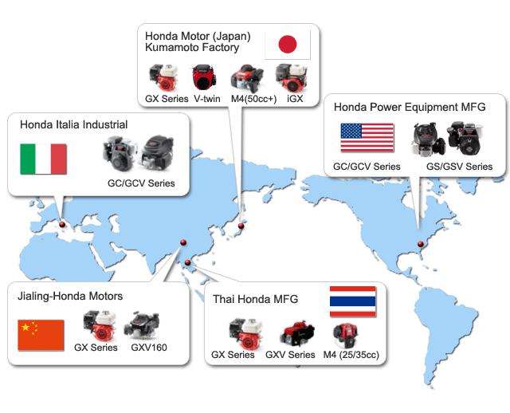

## Table of Contents

## What are Honda's main suppliers?

Honda works with many companies to get the parts they need to make their cars, bikes, and other products. Some of the main suppliers are Denso, which makes car parts like air conditioning systems and electronics. Another big supplier is Bridgestone, which makes tires for Honda vehicles. Honda also gets parts from companies like Magna International, which supplies things like seats and body parts.

Honda tries to have good relationships with their suppliers. They work together to make sure the parts are good quality and come on time. This helps Honda make their products better and keep their customers happy. By working closely with suppliers like Aisin Seiki, which makes parts for engines and transmissions, Honda can keep improving their vehicles.

Overall, Honda's main suppliers help them a lot. Companies like Panasonic, which supplies batteries and electronics, play a big role in making Honda's products work well. With the help of these suppliers, Honda can focus on making great cars and other products that people enjoy using.

## How does Honda select its suppliers?

Honda picks its suppliers by looking at a few important things. They want suppliers who can give them good quality parts at a fair price. Honda also checks if the supplier can deliver the parts on time, because this is very important for making cars and other products. They look at the supplier's technology and how they make their parts to see if it matches what Honda needs.

Another thing Honda thinks about is how well they can work with the supplier. They want to have a good relationship and work together to make things better. Honda also cares about the environment, so they choose suppliers who are trying to be green and reduce waste. By [picking](/wiki/asset-class-picking) suppliers carefully, Honda can make sure they get the best parts to build their products.

## What types of products do Honda's main suppliers provide?

Honda's main suppliers provide many different types of products that help Honda make their cars, bikes, and other things. Denso gives Honda parts like air conditioning systems and electronics. Bridgestone makes tires for Honda vehicles. Magna International supplies seats and body parts, which are important for building cars.

Another big supplier is Aisin Seiki, which makes parts for engines and transmissions. These parts help the car move and work properly. Panasonic supplies batteries and electronics, which are needed for many of Honda's products, like electric cars and hybrid vehicles.

By working with these suppliers, Honda gets all the parts they need to build good quality products. Each supplier helps with different parts of the car or bike, making sure everything fits together well and works as it should.

## Which of Honda's suppliers have the longest-standing relationships with the company?

Honda has been working with some suppliers for a very long time. One of the oldest relationships is with Denso. They started working together many years ago, and Denso has been giving Honda important parts like air conditioning systems and electronics ever since. This long relationship helps Honda make sure their cars and other products have good quality parts.

Another supplier with a long history with Honda is Bridgestone. They have been making tires for Honda vehicles for a long time. This partnership helps Honda because Bridgestone knows exactly what kind of tires Honda needs. Having a long relationship with suppliers like Denso and Bridgestone means Honda can trust them to deliver good parts on time, which is very important for making cars and keeping customers happy.

## How do Honda's supplier relationships impact its supply chain efficiency?

Honda's long relationships with suppliers like Denso and Bridgestone make its supply chain more efficient. When Honda works with the same suppliers for a long time, they know each other well. This helps them talk easily and solve problems quickly. For example, if Honda needs more parts fast, their long-time suppliers can help right away because they understand Honda's needs. This makes it easier for Honda to get the parts they need on time, which keeps their factories running smoothly.

Having good relationships with suppliers also helps Honda save money and make better products. When suppliers like Aisin Seiki and Panasonic work closely with Honda, they can find ways to make parts cheaper and of higher quality. This helps Honda keep their costs down and make cars that people like. By working together for many years, Honda and their suppliers can keep improving how they do things, which makes the whole supply chain work better.

## What are the geographical locations of Honda's main suppliers?

Honda's main suppliers are spread out in different places around the world. Denso, which makes air conditioning systems and electronics, is based in Japan. Bridgestone, the tire maker, also has its main office in Japan. Aisin Seiki, which supplies engine and transmission parts, is another Japanese company. These Japanese suppliers are important because they are close to Honda's headquarters and can work closely with them.

In addition to Japan, Honda works with suppliers in other countries too. Magna International, which makes seats and body parts, is based in Canada. Panasonic, known for its batteries and electronics, is from Japan but has factories in many other countries. This spread of suppliers helps Honda get the parts they need from different places, which can make their supply chain stronger and more reliable.

## How do Honda's main suppliers contribute to its sustainability goals?

Honda's main suppliers help the company reach its sustainability goals by working on green practices. For example, Denso, which makes air conditioning systems and electronics, focuses on making parts that use less energy and create less waste. This helps Honda make cars that are better for the environment. Bridgestone, the tire maker, also works on making tires that last longer and can be recycled, which helps reduce waste and pollution.

Another way suppliers contribute is by using sustainable materials and processes. Aisin Seiki, which makes engine and transmission parts, tries to use materials that are easier on the environment. They also work on making their factories use less energy. Panasonic, which supplies batteries and electronics, focuses on making products that are more energy-efficient and can be recycled. By working with these suppliers, Honda can make its products more sustainable and help protect the planet.

## What is the financial impact of Honda's main suppliers on its operations?

Honda's main suppliers help the company save money and make more profit. When Honda works closely with suppliers like Denso and Bridgestone, they can get parts at a good price. This is because they have been working together for a long time and know how to make things cheaper. For example, Denso might find a way to make air conditioning systems that cost less to produce. This helps Honda keep the price of their cars down, which can attract more customers and increase sales.

The financial impact also comes from the quality of the parts. When suppliers like Aisin Seiki and Panasonic give Honda high-quality parts, it means fewer problems and less need for repairs. This saves Honda money because they don't have to fix as many cars. It also makes customers happier, which can lead to more sales and a better reputation for Honda. Overall, the strong relationships with their main suppliers help Honda run their business more smoothly and make more money.

## How does Honda manage quality control with its suppliers?

Honda makes sure the parts from their suppliers are good by working closely with them. They check the parts often to see if they meet Honda's high standards. If there is a problem, Honda talks to the supplier right away to fix it. This helps keep the cars and other products safe and reliable. Honda also helps their suppliers get better at making parts by sharing ideas and technology.

By having a good relationship with suppliers like Denso and Bridgestone, Honda can trust that the parts will be good. They visit the suppliers' factories to see how the parts are made. Honda also does tests on the parts to make sure they work well. This way, Honda can make sure their cars are of high quality and their customers are happy.

## What are the technological innovations introduced by Honda's main suppliers?

Honda's main suppliers have introduced many cool new technologies that help make Honda's cars better. Denso has made air conditioning systems that use less energy, which helps save gas and is better for the environment. They also make advanced electronics, like sensors and control units, that make cars safer and easier to drive. Bridgestone has come up with new kinds of tires that last longer and can be recycled, which helps reduce waste. They also make tires that work better in different weather, making driving safer.

Aisin Seiki has been working on new ways to make engine and transmission parts that are more efficient and use less fuel. They use new materials and designs to make parts lighter and stronger. Panasonic has introduced new batteries that last longer and can charge faster, which is important for electric and hybrid cars. They also make electronics that help cars connect to the internet and use smart technology, making them more convenient for drivers. All these innovations help Honda make cars that are more advanced, safer, and better for the environment.

## How do Honda's main suppliers adapt to global market changes?

Honda's main suppliers adapt to global market changes by always looking for new ways to make their parts better and cheaper. They watch what is happening in the world, like new rules about the environment or changes in what people want. For example, if more people want electric cars, suppliers like Panasonic work on making better batteries. They also use new technology to make their factories work better and make parts that are easier to recycle. This helps them keep up with what Honda needs and stay competitive in the market.

Another way suppliers adapt is by working closely with Honda. They talk a lot and share ideas about how to make things better. If there is a big change in the market, like a new law about emissions, they work together to find a solution. This close relationship helps them react quickly to changes. By being flexible and ready to change, Honda's suppliers can keep giving Honda the parts they need, even when the world around them is changing fast.

## What strategies does Honda employ to mitigate risks associated with its suppliers?

Honda works hard to make sure they don't have big problems with their suppliers. They do this by spreading out where they get their parts from. Instead of getting all their parts from just one place, they work with suppliers in different countries. This way, if something goes wrong in one place, like a factory closing because of a storm, Honda can still get parts from somewhere else. They also keep a close eye on how their suppliers are doing, checking things like if they are making good quality parts and if they can deliver them on time.

Honda also tries to have strong relationships with their suppliers. They talk a lot and work together to solve problems quickly. If a supplier is having trouble, Honda helps them fix it. This makes the supply chain stronger because everyone is working together. Honda also plans for the future, thinking about what might go wrong and making plans to stop it from happening. By doing all these things, Honda can keep making cars even when things get tough.

## References & Further Reading

[1]: Liker, J. K., & Choi, T. Y. (2004). ["Building Deep Supplier Relationships."](https://hbr.org/2004/12/building-deep-supplier-relationships) Harvard Business Review.

[2]: Gopalakrishnan, S., & Damanpour, F. (1997). ["A Review of Innovation Research in Economics, Sociology, and Technology Management."](https://www.sciencedirect.com/science/article/pii/S0305048396000436) Journal of Management.

[3]: Nair, A., & Vidal, J. (2011). ["Supply Network Topology and Robustness Against Disruptions – An Investigation of Structural and Cognitive Properties."](https://www.sciencedirect.com/science/article/pii/S2949824424002519) International Journal of Production Economics.

[4]: ["Advances in Financial Machine Learning"](https://www.amazon.com/Advances-Financial-Machine-Learning-Marcos/dp/1119482089) by Marcos Lopez de Prado.

[5]: ["Lean Thinking: Banish Waste and Create Wealth in Your Corporation"](https://www.researchgate.net/publication/200657172_Lean_Thinking_Banish_Waste_and_Create_Wealth_in_Your_Corporation) by James P. Womack and Daniel T. Jones.

[6]: ["Just-in-Time: Making It Happen: Unleashing the Power of Continuous Improvement"](https://www.amazon.com/Just-Time-Unleashing-Continuous-Improvement/dp/0471132667) by Pascal Dennis.

[7]: ["The Toyota Way: 14 Management Principles from the World's Greatest Manufacturer"](https://www.mhebooklibrary.com/doi/book/10.1036/9781260468526) by Jeffrey K. Liker.