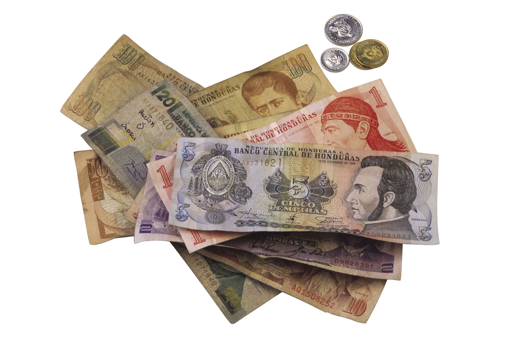

## Table of Contents

## What is the Honduran Lempira?

The Honduran Lempira is the official currency of Honduras, a country in Central America. It is named after Lempira, a famous leader who fought against the Spanish conquistadors in the 16th century. The currency is abbreviated as HNL and is often represented with the symbol 'L'. 

The Lempira was introduced on March 1, 1931, replacing the Honduran peso at a rate of 1 Lempira to 5 pesos. Banknotes and coins come in various denominations, with banknotes ranging from 1 to 1000 Lempiras and coins from 1 centavo to 20 Lempiras. The Honduran Lempira is managed by the Central Bank of Honduras, which works to maintain the stability and value of the currency.

## When was the Honduran Lempira first introduced?

The Honduran Lempira was first introduced on March 1, 1931. Before this, Honduras used the Honduran peso as its currency. The Lempira replaced the peso at a rate of 1 Lempira to 5 pesos.

The currency is named after Lempira, a leader who fought against the Spanish in the 1500s. The Central Bank of Honduras manages the Lempira. They make sure the money stays stable and valuable.

## What is the symbol and abbreviation of the Honduran Lempira?

The symbol of the Honduran Lempira is 'L'. It looks like the letter 'L' and people use it to show prices in Honduras.

The abbreviation for the Honduran Lempira is HNL. This is used in banks and on computers to talk about the currency.

## How is the exchange rate of the Lempira determined?

The exchange rate of the Honduran Lempira is determined by the Central Bank of Honduras, along with market forces. The Central Bank can influence the rate by buying or selling Lempiras in the foreign exchange market. If they want to make the Lempira stronger, they might buy more Lempiras with other currencies. If they want to make it weaker, they might sell more Lempiras.

Market forces also play a big role in setting the exchange rate. This means that if many people want to buy Lempiras, the value might go up because there is more demand. If fewer people want Lempiras, the value might go down because there is less demand. Things like how well Honduras's economy is doing, what other countries' economies are doing, and even big events like natural disasters can affect how much people want to buy or sell Lempiras.

## What are the denominations of Lempira banknotes and coins?

Lempira banknotes come in different amounts. You can find them in 1, 2, 5, 10, 20, 50, 100, 200, 500, and 1000 Lempiras. These banknotes are used every day in Honduras for buying things that cost more money.

Coins are also part of the Lempira currency. They come in smaller amounts like 1 centavo, 5 centavos, 10 centavos, 20 centavos, 50 centavos, 1 Lempira, 2 Lempiras, 5 Lempiras, and 20 Lempiras. People use these coins for buying things that cost less money.

## What economic factors influence the value of the Lempira?

The value of the Honduran Lempira is affected by many things in the economy. One big [factor](/wiki/factor-investing) is how well Honduras's economy is doing. If the country is making more things and people are working more, the Lempira might become more valuable. But if the economy is not doing well, like if there are fewer jobs or if the country is having trouble, the Lempira might lose value. Another thing that matters is how much other countries want to buy things from Honduras. If they want to buy a lot, the Lempira could go up in value because more people need it to buy Honduran goods.

Another important factor is the [interest rate](/wiki/interest-rate-trading-strategies) set by the Central Bank of Honduras. If the interest rate goes up, it can make the Lempira more attractive to investors because they can earn more money by keeping their savings in Lempiras. This can make the Lempira stronger. On the other hand, if the interest rate goes down, it might make the Lempira less attractive, and its value could drop. Also, big events like natural disasters can change how people see the Lempira. If a disaster happens, people might think the Lempira will lose value, and this can make it actually lose value because fewer people want to hold onto it.

## How does inflation affect the Honduran Lempira?

Inflation means that prices for things go up over time. When inflation happens in Honduras, it can make the Honduran Lempira less valuable. If prices keep going up, people need more Lempiras to buy the same things they used to buy with less money. This means the Lempira can buy less, so its value goes down.

The Central Bank of Honduras tries to keep inflation under control to help the Lempira stay strong. If inflation gets too high, the bank might change interest rates or do other things to slow down the rise in prices. But if inflation is too low, it can also be bad because it might mean the economy is not growing. So, the bank has to find a balance to keep the Lempira stable.

## What are the major challenges faced by the Honduran Lempira?

The Honduran Lempira faces several big challenges. One major problem is inflation. When prices go up a lot, the Lempira loses value. This means people need more Lempiras to buy the same things. The Central Bank of Honduras tries to control inflation, but it can be hard. Another challenge is how well the economy is doing. If the economy is not growing or if there are fewer jobs, the Lempira can become weaker. People might not want to use or save Lempiras if they think the economy is doing badly.

Another big challenge is the country's trade with other countries. If Honduras sells a lot of things to other countries, the Lempira can become stronger. But if other countries don't want to buy as much from Honduras, the Lempira can lose value. Natural disasters like hurricanes also hurt the Lempira. These disasters can damage the economy and make people think the Lempira will lose value, which can make it actually lose value. So, the Lempira has to deal with many different problems that can make it harder for it to stay strong.

## How does the Honduran government manage the Lempira's stability?

The Honduran government, through the Central Bank of Honduras, works hard to keep the Lempira stable. They do this by controlling how much money is in the economy. If there's too much money, prices can go up too fast, which is called inflation. To stop this, the Central Bank might raise interest rates. This makes it more expensive to borrow money, so people spend less, and prices don't go up as fast. They can also buy or sell Lempiras in the foreign exchange market to change its value. If they want to make the Lempira stronger, they might buy more of it with other currencies.

Another way the government helps keep the Lempira stable is by watching the economy closely. If the economy is doing well, with more jobs and more things being made, the Lempira can stay strong. But if the economy is not doing well, the government might do things to help it grow, like building new roads or helping businesses. They also have to deal with big problems like natural disasters, which can hurt the economy and make the Lempira weaker. So, the government always has to be ready to take action to keep the Lempira stable and help the economy grow.

## What role does the Central Bank of Honduras play in managing the Lempira?

The Central Bank of Honduras is very important for taking care of the Lempira. They make sure the Lempira stays strong by controlling how much money is in the country. If there is too much money, prices can go up too fast, which is called inflation. To stop this, the Central Bank can raise interest rates. This makes it more expensive to borrow money, so people spend less, and prices don't go up as fast. The bank can also buy or sell Lempiras in the foreign exchange market. If they want the Lempira to be stronger, they might buy more of it with other currencies.

The Central Bank also watches the economy closely. They look at things like how many people have jobs and how much stuff the country is making. If the economy is doing well, the Lempira can stay strong. But if the economy is not doing well, the Central Bank might do things to help it grow, like building new roads or helping businesses. They also have to deal with big problems like natural disasters, which can hurt the economy and make the Lempira weaker. So, the Central Bank always has to be ready to take action to keep the Lempira stable and help the economy grow.

## How does the Lempira's performance compare to other Central American currencies?

The Honduran Lempira's performance can be compared to other Central American currencies like the Costa Rican Colón, the Guatemalan Quetzal, and the Salvadoran Colón. The Lempira has often been seen as less stable than some of these other currencies. For example, the Guatemalan Quetzal is usually more stable because Guatemala's economy is bigger and more diverse. The Costa Rican Colón also tends to be more stable because Costa Rica has a strong tourism industry and exports a lot of goods. The Salvadoran Colón was replaced by the US Dollar in 2001, which makes it very stable but not a good comparison to the Lempira.

The Lempira's value can change a lot because Honduras's economy depends a lot on things like agriculture and remittances from people working abroad. This makes the Lempira more sensitive to changes in these areas. For example, if there is a bad harvest or fewer remittances, the Lempira can lose value quickly. On the other hand, countries like Costa Rica and Guatemala have more varied economies, which can help their currencies stay more stable. So, while the Lempira can be affected by many things, other Central American currencies often have more stability because of their stronger and more diverse economies.

## What are the future prospects and potential reforms for the Honduran Lempira?

The future of the Honduran Lempira depends a lot on how well Honduras's economy does. If the country can grow its economy by making more things and creating more jobs, the Lempira could become stronger. One way to do this is by getting more people to invest in Honduras. The government could make it easier for businesses to start and grow by changing some rules. They could also work on making the country safer and improving things like roads and schools. If these things happen, more people might want to use and save Lempiras, which would help its value.

There are also some big changes that could happen to the Lempira. Some people think Honduras might decide to use the US Dollar instead of the Lempira, like what happened in El Salvador. This is called dollarization. It could make the currency more stable because the US Dollar is very strong. But it would also mean Honduras would lose control over its own money. Another idea is to make the Lempira a digital currency. This could make it easier to use and might help stop some problems like money laundering. But it would need a lot of new technology and rules. So, the future of the Lempira could go in different directions, depending on what the government decides to do.

## References & Further Reading

[1]: ["Advances in Financial Machine Learning"](https://www.amazon.com/Advances-Financial-Machine-Learning-Marcos/dp/1119482089) by Marcos Lopez de Prado

[2]: ["The Central Bank of Honduras: Policy Measures & Announcements"](https://garciabodan.com/en/central-bank-of-honduras-increases-monetary-policy-rate-to-strengthen-the-economy/) - The official website of the Central Bank of Honduras offers insights into monetary policy measures impacting the Lempira's stability.

[3]: ["History of Currency in Honduras"](https://en.wikipedia.org/wiki/Honduran_lempira) - Honduras National Museum: Provides historical context and detailed accounts of the currency evolution in the nation.

[4]: ["Algorithmic Trading and Its Impact on Financial Markets"](https://ijrpr.com/uploads/V5ISSUE6/IJRPR30540.pdf) by Álvaro G. Adatsi, Brian Lee, & Linda Alemán - A research paper that explores the implications of algorithmic trading in emerging markets.

[5]: ["Quantitative Trading: How to Build Your Own Algorithmic Trading Business"](https://www.amazon.com/Quantitative-Trading-Build-Algorithmic-Business/dp/1119800064) by Ernest P. Chan