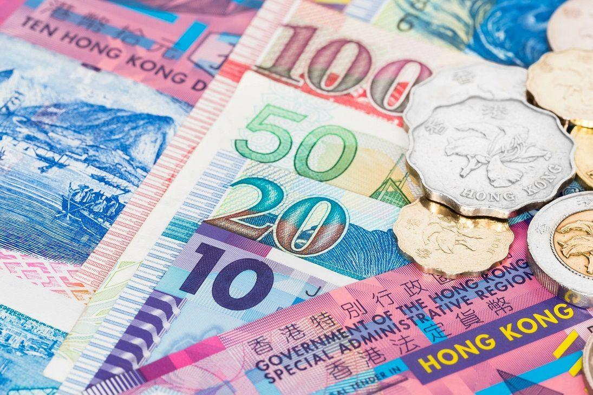

## Table of Contents

## What is the Hong Kong Dollar?

The Hong Kong Dollar, often written as HKD, is the official money used in Hong Kong. It is used every day by people in Hong Kong to buy things like food, clothes, and other stuff. The symbol for the Hong Kong Dollar is $ or HK$, and it is divided into 100 cents. The Hong Kong Monetary Authority, which is like a bank for banks, controls the Hong Kong Dollar.

The Hong Kong Dollar has been used since 1863. Before that, people in Hong Kong used different kinds of money, like the Spanish Dollar. The Hong Kong Dollar is special because it is linked to the US Dollar. This means that the value of the Hong Kong Dollar stays steady compared to the US Dollar. This helps keep prices stable in Hong Kong, which is good for the economy.

## How is the Hong Kong Dollar abbreviated?

The Hong Kong Dollar is abbreviated as HKD. Sometimes, people also use HK$ or just $ when they are in Hong Kong and it's clear they mean the Hong Kong Dollar.

This abbreviation is used in banks, shops, and on price tags. It helps everyone know they are talking about Hong Kong's money.

## What is the history of the Hong Kong Dollar?

The Hong Kong Dollar started being used in 1863. Before that, people in Hong Kong used different kinds of money, like the Spanish Dollar and the Mexican Dollar. These were called "chop dollars" because merchants would stamp them to show they were good. In 1863, the British government in Hong Kong made the Hong Kong Dollar the official money. They did this to make trading easier and to have more control over the money used in the area.

Over the years, the Hong Kong Dollar went through many changes. In the early 1900s, the Hong Kong government started making its own coins and banknotes. During World War II, when Japan took over Hong Kong, they used their own money called the Japanese Military Yen. After the war, the Hong Kong Dollar came back. In 1983, something important happened: the Hong Kong Dollar was linked to the US Dollar. This meant that the value of the Hong Kong Dollar would stay steady compared to the US Dollar. This helped keep prices stable in Hong Kong, which was good for the economy.

## What are the denominations of the Hong Kong Dollar?

The Hong Kong Dollar comes in different sizes for both coins and banknotes. For coins, you can find 10 cents, 20 cents, 50 cents, 1 dollar, 2 dollars, 5 dollars, and 10 dollars. The 10 cent coin is the smallest, and the 10 dollar coin is the biggest. People use these coins every day to buy small things like snacks or to pay for bus rides.

For banknotes, there are 10 dollars, 20 dollars, 50 dollars, 100 dollars, 500 dollars, and 1000 dollars. The 10 dollar note is the smallest, and the 1000 dollar note is the biggest. These banknotes are used for bigger purchases, like buying groceries or paying rent. Some banknotes even have different designs and colors to make them easy to tell apart.

## How is the Hong Kong Dollar managed?

The Hong Kong Dollar is managed by the Hong Kong Monetary Authority (HKMA). The HKMA is like a big bank that looks after all the other banks in Hong Kong. They make sure that the Hong Kong Dollar stays strong and that people can trust it. One important thing the HKMA does is to keep the Hong Kong Dollar linked to the US Dollar. This means that the value of the Hong Kong Dollar stays steady compared to the US Dollar. This helps keep prices stable in Hong Kong, which is good for everyone.

The HKMA also controls how much money is in Hong Kong. They do this by buying and selling Hong Kong Dollars. If there are too many Hong Kong Dollars, they might sell some to make the value go up. If there are not enough, they might buy some to make the value go down. This way, they can keep the money supply just right. The HKMA works hard to make sure the Hong Kong Dollar is always reliable and useful for people in Hong Kong.

## What is the role of the Hong Kong Monetary Authority?

The Hong Kong Monetary Authority, or HKMA, is like a big bank that looks after all the other banks in Hong Kong. Its main job is to make sure the Hong Kong Dollar stays strong and that people can trust it. The HKMA does this by keeping the Hong Kong Dollar linked to the US Dollar. This means that the value of the Hong Kong Dollar stays steady compared to the US Dollar. This helps keep prices stable in Hong Kong, which is good for everyone.

The HKMA also controls how much money is in Hong Kong. They do this by buying and selling Hong Kong Dollars. If there are too many Hong Kong Dollars, they might sell some to make the value go up. If there are not enough, they might buy some to make the value go down. This way, they can keep the money supply just right. The HKMA works hard to make sure the Hong Kong Dollar is always reliable and useful for people in Hong Kong.

## How does the Linked Exchange Rate System work?

The Linked Exchange Rate System is a way to keep the Hong Kong Dollar steady compared to the US Dollar. It started in 1983. The system works by making sure that the Hong Kong Dollar stays at about 7.8 to one US Dollar. This means if you have 7.8 Hong Kong Dollars, you can trade them for one US Dollar. The Hong Kong Monetary Authority, or HKMA, is in charge of this system. They do this by buying and selling Hong Kong Dollars to keep the exchange rate the same.

When there are too many Hong Kong Dollars, the HKMA sells them to make the value go up. When there are not enough Hong Kong Dollars, the HKMA buys them to make the value go down. This helps keep the money supply just right and keeps prices stable in Hong Kong. The Linked Exchange Rate System makes it easier for people and businesses in Hong Kong to plan because they know the value of their money will stay about the same compared to the US Dollar.

## What are the advantages of pegging the Hong Kong Dollar to the US Dollar?

Pegging the Hong Kong Dollar to the US Dollar helps keep prices stable in Hong Kong. When the value of money stays the same, people and businesses can plan better. They know how much things will cost in the future, so they can save money or make big purchases without worrying about sudden changes in prices. This stability is good for the economy because it makes people feel more confident about spending and investing.

Another advantage is that it makes trading easier. Many businesses in Hong Kong buy and sell things with other countries, especially the United States. When the Hong Kong Dollar is linked to the US Dollar, it's easier to know how much things will cost in both places. This helps businesses make deals and plan their budgets. It also makes Hong Kong a good place for international trade because people from other countries know the value of the Hong Kong Dollar will stay steady.

## What are the potential risks associated with the Hong Kong Dollar's peg to the US Dollar?

One risk of pegging the Hong Kong Dollar to the US Dollar is that Hong Kong can't control its own interest rates. When the US changes its interest rates, Hong Kong has to follow. If the US raises interest rates, borrowing money in Hong Kong becomes more expensive. This can slow down the economy because people and businesses might borrow less. On the other hand, if the US lowers interest rates, borrowing money in Hong Kong becomes cheaper, which can lead to too much borrowing and possibly inflation.

Another risk is that the peg can make the Hong Kong Dollar overvalued or undervalued compared to other currencies. If the US Dollar gets stronger, the Hong Kong Dollar gets stronger too, even if Hong Kong's economy isn't doing well. This can make Hong Kong's exports more expensive and less competitive in the global market. If the US Dollar gets weaker, the Hong Kong Dollar gets weaker too, which can make imports more expensive and lead to higher prices in Hong Kong.

## How does the Hong Kong Dollar function in international trade?

The Hong Kong Dollar plays an important role in international trade because it is linked to the US Dollar. This link makes it easier for businesses in Hong Kong to buy and sell things with other countries, especially the United States. When the Hong Kong Dollar stays steady compared to the US Dollar, businesses know how much things will cost in both places. This helps them make deals and plan their budgets. It also makes Hong Kong a good place for international trade because people from other countries know the value of the Hong Kong Dollar will stay steady.

However, the peg to the US Dollar can also create challenges. If the US Dollar gets stronger, the Hong Kong Dollar gets stronger too, even if Hong Kong's economy isn't doing well. This can make Hong Kong's exports more expensive and less competitive in the global market. On the other hand, if the US Dollar gets weaker, the Hong Kong Dollar gets weaker too, which can make imports more expensive and lead to higher prices in Hong Kong. So, while the peg helps with stability, it can also affect how well Hong Kong can trade with the rest of the world.

## What impact do global economic changes have on the Hong Kong Dollar?

Global economic changes can have a big effect on the Hong Kong Dollar because it is linked to the US Dollar. When the US economy does well, the US Dollar usually gets stronger. This means the Hong Kong Dollar gets stronger too, even if Hong Kong's own economy isn't doing as well. This can make things Hong Kong sells to other countries more expensive, which might make it harder for Hong Kong businesses to compete in the global market. On the other hand, if the US economy is not doing well and the US Dollar gets weaker, the Hong Kong Dollar also gets weaker. This can make things Hong Kong buys from other countries more expensive, which can lead to higher prices in Hong Kong.

The Hong Kong Monetary Authority, or HKMA, tries to manage these effects by buying and selling Hong Kong Dollars. If there are too many Hong Kong Dollars, they might sell some to make the value go up. If there are not enough, they might buy some to make the value go down. This helps keep the money supply just right and keeps prices stable in Hong Kong. But even with these efforts, big changes in the global economy can still shake things up. For example, if there's a big financial crisis in the US, it can cause problems for the Hong Kong Dollar too, because they are so closely linked.

## How does the Hong Kong Dollar compare to other major Asian currencies in terms of stability and usage?

The Hong Kong Dollar is known for being very stable because it is linked to the US Dollar. This means its value stays steady compared to the US Dollar, which helps keep prices in Hong Kong stable too. Compared to other major Asian currencies like the Chinese Yuan, Japanese Yen, and Singapore Dollar, the Hong Kong Dollar is less likely to have big changes in its value. The Chinese Yuan, for example, can change a lot because China's government controls it. The Japanese Yen can also go up and down a lot because Japan's economy is affected by many global factors. The Singapore Dollar is also pretty stable, but it's managed differently, using a basket of currencies instead of being pegged to just one.

In terms of usage, the Hong Kong Dollar is mainly used in Hong Kong, which is a big financial center. It's used for everyday buying and selling, and it's important in international trade because of Hong Kong's role as a trading hub. The Chinese Yuan is used in mainland China and is becoming more important in global trade as China's economy grows. The Japanese Yen is used in Japan and is also used a lot in international finance because Japan has a big economy. The Singapore Dollar is used in Singapore, another important financial center, and it's also used in international trade because Singapore is a big port. So, while the Hong Kong Dollar is very stable, its usage is mostly limited to Hong Kong, unlike some other Asian currencies that are used more widely.

## References & Further Reading

[1]: Hauge, J., & Johannessen, S. (2020). ["The Evolution of Algorithmic Trading: Trends and Drivers."](https://www.josteinhauge.com/research) Journal of Futures Markets, 40(10), 1562-1579.

[2]: Bank for International Settlements. (2019). ["Triennial Central Bank Survey: Global Foreign Exchange Market Turnover."](https://www.bis.org/statistics/rpfx19_fx.pdf) Retrieved from https://www.bis.org/statistics/rpfx19.htm

[3]: Hong Kong Monetary Authority. (n.d.). ["Linked Exchange Rate System."](https://www.hkma.gov.hk/eng/key-functions/money/linked-exchange-rate-system/) Retrieved from https://www.hkma.gov.hk/eng/key-functions/monetary-stability/the-linked-exchange-rate-system/

[4]: Frino, A., Mollica, V., & Webb, R. I. (2014). ["The Impact of Algorithmic Trading on Liquidity: Evidence from the Australian Securities Exchange."](https://link.springer.com/article/10.1007/s11408-013-0213-1) Journal of International Financial Markets, Institutions & Money, 33(C), 55-69.

[5]: Hasbrouck, J., & Saar, G. (2013). ["Low-Latency Trading."](https://www.sciencedirect.com/science/article/abs/pii/S1386418113000165) The Review of Financial Studies, 26(9), 2585-2624.