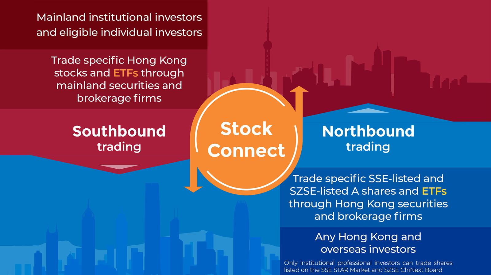

## Table of Contents

## What are Exchange-Traded Funds (ETFs)?

Exchange-Traded Funds, or ETFs, are a type of investment that combines the benefits of stocks and mutual funds. They are baskets of securities, like stocks, bonds, or commodities, that you can buy and sell on a stock exchange, just like individual stocks. This means you can trade ETFs throughout the day at market prices, which can change from moment to moment.

ETFs are popular because they offer a way to diversify your investments easily. Instead of buying many different stocks or bonds one by one, you can buy shares in an ETF that already holds a variety of them. This can help spread out your risk. Plus, ETFs often have lower fees than mutual funds, making them a cost-effective choice for many investors.

## How do ETFs work?

ETFs work by pooling money from many investors to buy a collection of assets, like stocks, bonds, or commodities. This collection is designed to track the performance of a specific index, like the S&P 500, or a particular sector, like technology. When you buy shares of an ETF, you're essentially buying a small piece of all the assets in that collection. The price of an ETF share changes throughout the day as it is bought and sold on the stock exchange, reflecting the value of the underlying assets.

To keep the [ETF](/wiki/etf-trading-strategies)'s price in line with the value of its assets, a process called creation and redemption is used. Authorized participants, usually large financial institutions, can create new ETF shares by delivering the required basket of securities to the ETF issuer. In return, they receive ETF shares which they can then sell to the public. Conversely, if the ETF's price is higher than the value of its assets, these participants can buy ETF shares on the market and redeem them for the underlying securities, helping to bring the ETF's price back in line. This mechanism helps ensure that the ETF's market price stays close to its net asset value.

## What is the Hong Kong stock market?

The Hong Kong stock market is where people buy and sell shares of companies in Hong Kong. It's run by the Hong Kong Exchanges and Clearing Limited (HKEX). This market is very important because it's one of the biggest in Asia and helps businesses get money to grow. People from all over the world can invest in the Hong Kong stock market, making it a global place for trading.

The main part of the Hong Kong stock market is called the Hang Seng Index. This index shows how well the biggest and most important companies in Hong Kong are doing. When the Hang Seng Index goes up, it usually means the market is doing well, and when it goes down, it means the market is not doing as well. People watch this index to see if they should buy or sell stocks.

## What are Hong Kong Exchange-Traded Funds?

Hong Kong Exchange-Traded Funds, or ETFs, are a type of investment you can buy and sell on the Hong Kong stock market. They are like baskets that hold a bunch of different investments, like stocks or bonds. When you buy shares of a Hong Kong ETF, you're getting a small piece of all the things inside that basket. This makes it easy for you to invest in many companies or assets at once without having to buy each one separately.

These ETFs are popular in Hong Kong because they let you spread your money across different investments, which can help lower your risk. Plus, they often cost less than other types of funds. You can find ETFs in Hong Kong that focus on different things, like the Hang Seng Index, which tracks the biggest companies in Hong Kong, or other specific areas like technology or real estate. This gives you lots of choices to match your investment goals.

## What are the benefits of investing in Hong Kong ETFs?

Investing in Hong Kong ETFs can be a smart move because they offer a lot of benefits. One big advantage is that they help you spread your money across many different investments easily. Instead of buying lots of different stocks one by one, you can just buy shares in a Hong Kong ETF that already holds a bunch of them. This can help lower your risk because if one company doesn't do well, it won't hurt your whole investment as much. Plus, Hong Kong ETFs often have lower fees than other types of funds, which means you get to keep more of your money.

Another benefit is that Hong Kong ETFs give you a lot of choices. You can find ETFs that focus on different things, like the Hang Seng Index, which tracks the biggest companies in Hong Kong, or specific areas like technology or real estate. This means you can pick an ETF that matches what you want to invest in. Also, because Hong Kong is a big financial hub, you can invest in ETFs that give you access to markets all over Asia and the world. This can be a great way to grow your money over time.

## What are the risks associated with Hong Kong ETFs?

Investing in Hong Kong ETFs can be risky because the value of the ETF can go up and down a lot. This is because the ETF is made up of many different investments, and if the market in Hong Kong or the specific sector the ETF focuses on does badly, the value of your ETF can drop. For example, if there's a big economic problem in Hong Kong or if the companies in the ETF don't do well, your investment could lose money.

Another risk is that ETFs can be affected by things happening in other countries. Since Hong Kong is a big financial center, events in other parts of the world can impact the Hong Kong market and, in turn, the ETFs you invest in. This means you need to keep an eye on global news and events, not just what's happening in Hong Kong. Also, even though ETFs usually have lower fees, you still need to pay attention to the costs because they can add up over time and eat into your returns.

## How can one start investing in Hong Kong ETFs?

To start investing in Hong Kong ETFs, you first need to open a brokerage account with a firm that lets you trade in the Hong Kong stock market. Many big brokers around the world offer this service, so you can choose one that fits your needs. Once you have your account set up, you'll need to put money into it. This is called funding your account. After that, you can start looking for the Hong Kong ETFs you want to buy.

Once you've found the ETF you're interested in, you can place an order to buy it through your brokerage account. You'll need to decide how many shares you want to buy and at what price. After you've made your purchase, it's important to keep an eye on your investment. The value of your ETF can go up and down, so you might want to check it regularly and think about whether you should buy more, sell some, or hold onto what you have. Remember, investing always carries some risk, so it's good to do your homework and maybe talk to a financial advisor if you're not sure.

## What are some popular Hong Kong ETFs?

Some popular Hong Kong ETFs include the Hang Seng Index ETF and the Tracker Fund of Hong Kong (TraHK). The Hang Seng Index ETF is designed to track the performance of the Hang Seng Index, which is made up of the biggest and most important companies in Hong Kong. This ETF is a good choice if you want to invest in the overall Hong Kong market. The Tracker Fund of Hong Kong, or TraHK, is also very popular and tracks the same Hang Seng Index. It's been around for a long time and is known for its low fees, which makes it a favorite among many investors.

Another popular ETF in Hong Kong is the iShares MSCI Hong Kong ETF, which focuses on companies listed in Hong Kong but also includes some from China. This ETF gives you a broader exposure to the region's economy. For those interested in specific sectors, the CSOP Hang Seng TECH Index ETF is a good option. It tracks the Hang Seng TECH Index, which includes major tech companies in Hong Kong and China. This can be a great way to invest in the growing tech industry in the region.

## How do Hong Kong ETFs compare to other global ETFs?

Hong Kong ETFs are similar to other global ETFs in that they let you buy a basket of investments easily. Just like ETFs in the U.S. or Europe, Hong Kong ETFs can focus on different things, like a whole market or a specific sector. But, Hong Kong ETFs give you a special way to invest in Asia, especially in Hong Kong and sometimes China. This can be good if you want to spread your money across different parts of the world.

One big difference is that Hong Kong ETFs can be more affected by what's happening in Asia. If there's a big change in the Hong Kong or Chinese economy, it can really move the value of these ETFs. On the other hand, ETFs from places like the U.S. might be more influenced by what's happening in America. Also, the fees for Hong Kong ETFs can be different from those in other countries. Some might be cheaper, while others might cost more, so it's important to check before you invest.

## What factors should be considered when choosing a Hong Kong ETF?

When choosing a Hong Kong ETF, you should think about what you want to invest in. Do you want to put your money in the whole Hong Kong market, or are you more interested in a specific part like technology or real estate? Hong Kong ETFs can focus on different things, so [picking](/wiki/asset-class-picking) one that matches your goals is important. You also need to look at the fees. Some ETFs might have lower fees, which means you get to keep more of your money. Make sure to compare the costs because they can add up over time.

Another thing to consider is how much risk you're okay with. Hong Kong ETFs can go up and down a lot, especially if something big happens in the Hong Kong or Chinese economy. If you don't like a lot of risk, you might want to pick an ETF that's more stable. Also, think about how easy it is to buy and sell the ETF. Some ETFs might be harder to trade than others, so make sure you can get in and out of your investment when you need to.

## How have Hong Kong ETFs performed historically?

Hong Kong ETFs have had ups and downs over the years. They've done well when the Hong Kong economy is strong and the big companies in the Hang Seng Index are making a lot of money. For example, during times when China's economy is growing fast, Hong Kong ETFs that focus on the whole market or specific sectors like technology often see good returns. But they can also lose value when things aren't going so well. If there's a big problem in Hong Kong or China, like a financial crisis or political issues, these ETFs can drop a lot.

Looking at specific ETFs, the Tracker Fund of Hong Kong (TraHK) has been around for a long time and has seen different periods of growth and decline. It tracks the Hang Seng Index, so its performance goes up and down with the biggest companies in Hong Kong. The iShares MSCI Hong Kong ETF, which includes companies from both Hong Kong and China, has also had its share of good and bad times. Overall, investing in Hong Kong ETFs can be a way to grow your money, but it's important to be ready for some bumps along the way.

## What are the tax implications of investing in Hong Kong ETFs?

When you invest in Hong Kong ETFs, you need to think about taxes. If you're a Hong Kong resident, you don't have to pay taxes on dividends or capital gains from ETFs. This is because Hong Kong doesn't tax these kinds of income. But, if you live in another country, you might have to pay taxes on your earnings from Hong Kong ETFs. It depends on the tax laws where you live. So, it's a good idea to check with a tax advisor to understand what you might owe.

If you're not from Hong Kong, there might be other tax issues to think about. Some countries have tax treaties with Hong Kong that can change how much tax you pay. These treaties can help lower your tax bill or stop you from being taxed twice on the same money. It's really important to know about these treaties and how they affect your investments. Talking to a tax expert can help you figure out the best way to handle your taxes when investing in Hong Kong ETFs.

## References & Further Reading

[1]: Hua, J. (2008). ["Hong Kong as a Platform for the Internationalization of the Renminbi."](https://papers.ssrn.com/sol3/papers.cfm?abstract_id=2459345) The China Quarterly, Cambridge University Press.

[2]: "ETF Handbook" by David Abner. This book offers comprehensive insights into ETFs, including their functionality and application.

[3]: Gomber, P., Arndt, B., Lutat, M., & Uhle, T. (2011). ["High-Frequency Trading."](https://papers.ssrn.com/sol3/papers.cfm?abstract_id=1858626) Business & Information Systems Engineering.

[4]: ["Advances in Financial Machine Learning"](https://www.amazon.com/Advances-Financial-Machine-Learning-Marcos/dp/1119482089) by Marcos Lopez de Prado.

[5]: Tse, Y., & Martinez, V. (2007). ["Price Discovery and Informational Efficiency of International iShares."](https://www.academia.edu/7648038/Price_discovery_and_informational_efficiency_of_international_iShares_funds) Global Finance Journal.

[6]: Petrie, D. (2013). ["The Impact of Algorithmic Trading on Paradigms of Trading and Surveillance: A Short Update."](https://www.researchgate.net/publication/378548435_Algorithmic_Trading_and_AI_A_Review_of_Strategies_and_Market_Impact) The Journal of Betting and Sports Analytics, SAGE Journals.