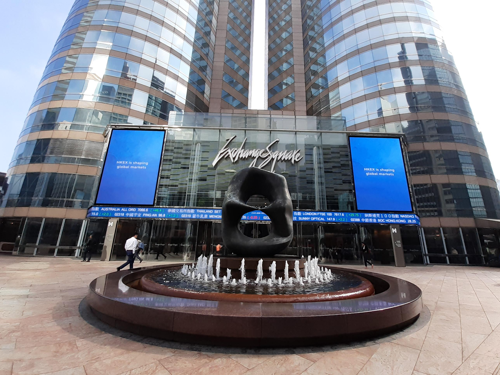

The Hong Kong Stock Exchange (HKEX), established in 1891, is one of the largest and most significant financial markets worldwide, playing a pivotal role in the global economy. Serving as a crucial bridge between mainland China and international investors, HKEX facilitates capital flow and investment opportunities in the Asia-Pacific region and beyond. The exchange offers a comprehensive platform for trading a diverse array of financial products, including equities, bonds, and derivatives, attracting participants from across the globe.

In recent years, algorithmic trading has emerged as a vital component of modern financial markets. This form of trading involves the use of computer algorithms to execute orders based on pre-defined criteria. By leveraging technology, algorithmic trading enables market participants to achieve higher speed, accuracy, and efficiency in trade executions, significantly transforming traditional trading practices. Its applications span various strategies, including market making, statistical arbitrage, and high-frequency trading, contributing to increased market liquidity and reduced transaction costs.



The growing prevalence of algorithmic trading on platforms such as HKEX underscores its importance and potential impact. The exchange has implemented technological advancements and infrastructural changes to support the evolving trading landscape, ensuring that it remains competitive on the global stage. This article aims to explore the role of algorithmic trading within the HKEX, examining its development, benefits, strategies, and associated challenges. Through this analysis, we aim to understand how algorithmic trading shapes the future of financial markets in Hong Kong and its potential implications for global investors.

## Table of Contents

## Understanding the Hong Kong Stock Exchange (HKEX)

## Understanding the Hong Kong Stock Exchange (HKEX)

The Hong Kong Stock Exchange (HKEX), one of the largest and most significant financial hubs in the world, has a rich history and plays a critical role in both regional and global markets. Its historical evolution, combined with its strategic geographical location, has enabled the HKEX to become a pivotal trading platform in Asia and beyond.

### Historical Background and Development

The roots of the Hong Kong Stock Exchange trace back to 1891, when informal securities trading began with the establishment of the Association of Stockbrokers in Hong Kong. This eventually formalized into the Hong Kong Stock Exchange in 1914. Over the decades, the HKEX underwent significant transformations to modernize and integrate itself into the global financial ecosystem. The merger of the stock exchange with the Hong Kong Futures Exchange and the Hong Kong Securities Clearing Company in 2000 marked a significant milestone, forming a single-tier structure that streamlined the trading process.

The introduction of electronic trading systems in the 1990s and the subsequent Launch of the Automatic Order Matching and Execution System (AMS) laid a foundation for high-speed trading, crucial for both domestic and international investors. This technological evolution has been a driving force behind HKEX’s ability to handle increasing trading volumes over the years.

### Role in Asia-Pacific and Global Markets

HKEX serves as a gateway between mainland China and the rest of the world, facilitating cross-border investment through initiatives like Stock Connect programs (launched in partnership with Shanghai and Shenzhen stock exchanges). As a result, HKEX has attracted numerous international companies seeking access to Chinese capital markets and vice versa. The dual listing framework provided by HKEX is highly appealing to multinational corporations wishing to access Asian capital without compromising their presence on Western stock exchanges.

Globally, HKEX ranks among the top exchanges by market capitalization, and it continues to draw companies from various sectors, including technology, finance, and commodities. The exchange's robustness and extensive network reinforce Hong Kong’s status as a leading financial center, influencing trading trends across continents.

### Key Features and Functionalities of the Trading Platform

The HKEX trading platform is known for its technological sophistication and regulatory frameworks that support high-frequency and [algorithmic trading](/wiki/algorithmic-trading). The AMS/3.8 system, part of HKEX’s comprehensive trading solution, offers an efficient trading environment characterized by low latency and high throughput. This supports a wide range of trading strategies and complex financial instruments.

Key features of the HKEX platform include:

1. **Multi-Asset Trading**: Facilitating transactions in equities, fixed income, and derivatives under one umbrella, which enhances capital efficiency.

2. **Real-Time Data Dissemination**: Providing traders with instant access to market data, which is crucial for algorithmic trading strategies.

3. **Robust Risk Management Systems**: Ensuring financial stability through measures like circuit breakers and a well-defined clearing and settlement infrastructure.

4. **Connectivity Programs**: Such as the Bond Connect and Stock Connect, which integrate HKEX with mainland China markets, offering international investors broader access to Chinese securities.

5. **Market Expansion Initiatives**: Regular updates to market infrastructure and product offerings, which reflect evolving investor demands and technological advancements.

These features enable HKEX to maintain a competitive edge in the ever-evolving financial markets, supporting a diverse array of traders ranging from traditional stockbrokers to modern algorithmic trading firms. As HKEX continues to innovate and expand its reach, it remains a central pillar in the global financial market network.

## The Rise of Algorithmic Trading

Algorithmic trading, often referred to as algo trading, involves the use of computer algorithms to automate the process of buying and selling financial securities. These algorithms are designed to execute trades at optimal times based on a predefined set of rules involving variables such as timing, price, and quantity. The emergence of algorithmic trading can be traced back to the late 20th century when technological advancements in computing enabled the processing of large volumes of data at unprecedented speeds.

The transformation of trading practices by technology has been profound. Traditionally, trading in financial markets was conducted via human brokers who would manually complete transactions. This process was not only time-consuming but also prone to human error and emotional decision-making. With the advent of algorithmic trading, decisions can be executed in milliseconds without direct human intervention. Technologies such as high-frequency trading ([HFT](/wiki/high-frequency-trading-strategies)) further exemplify this transformation, allowing for the execution of thousands of orders in fractions of a second.

One of the primary benefits of algorithmic trading is speed. Algo trading systems can scan multiple markets and exchanges for trading opportunities and execute orders faster than any human trader could. This rapid execution ensures that traders can capitalize on market conditions almost instantaneously. Additionally, the efficiency brought about by algorithmic trading means that trades can be executed at the best possible prices, leading to cost savings and improved profitability margins.

Moreover, algorithmic trading reduces human error. By relying on predefined rules and logic, these algorithms minimize the potential for mistakes that could arise from manual trading. They also mitigate the impact of emotional and impulsive decision-making, which can adversely affect trading outcomes. This reduction in human error is particularly significant in volatile markets where conditions can change rapidly.

In conclusion, algorithmic trading represents a significant technological evolution in financial markets, offering enhanced speed, efficiency, and accuracy. As technology continues to advance, it is likely that algo trading will become even more sophisticated, further shaping the landscape of modern trading practices.

## Algorithmic Trading Strategies in HKEX

Algorithmic trading has become a crucial facet of the Hong Kong Stock Exchange (HKEX), employing a variety of strategies that leverage technology and data analysis to execute trades more efficiently. These strategies can be broadly categorized into several types.

**Common Types of Algorithms Used in HKEX**

1. **Statistical Arbitrage**: This strategy involves identifying price discrepancies between related financial instruments and exploiting these inefficiencies. Traders create mathematical models to predict average prices and execute trades when securities deviate from these averages.

2. **Market Making**: Algorithms execute high-frequency trades by simultaneously placing buy and sell orders to profit from the bid-ask spread. This strategy contributes significantly to market liquidity.

3. **Trend Following**: This approach uses algorithms to identify and capitalize on market momentum, predicting future movements based on past price trends. Traders often use technical indicators such as moving averages to inform their algorithms.

4. **Mean Reversion**: Based on the assumption that asset prices will revert to their historical mean, this strategy focuses on identifying overbought or oversold conditions in the market and executing trades accordingly.

5. **Pairs Trading**: Involving simultaneous buying and selling of correlated securities, pairs trading capitalizes on the idea that the price movements of these securities will converge over time.

**The Role of Data Analysis in Shaping Trading Strategies**

Data analysis is central to algorithmic trading, providing the foundation upon which algorithms are constructed and optimized. Advanced statistical techniques and [machine learning](/wiki/machine-learning) models analyze vast datasets to forecast market movements and enhance decision-making. Traders utilize historical data, real-time market feeds, and other economic indicators to refine their strategies and improve prediction accuracy.

For example, time series analysis techniques like ARIMA (AutoRegressive Integrated Moving Average) are commonly used to model and forecast price trends:

```python
import pandas as pd
from statsmodels.tsa.arima.model import ARIMA

# Assuming 'stock_prices' is a pandas DataFrame containing historical stock data
model = ARIMA(stock_prices['price'], order=(5, 1, 0))
model_fit = model.fit()
forecast = model_fit.forecast(steps=10)
print(forecast)
```

**Case Studies/Examples of Successful Algorithmic Trading on HKEX**

One notable example of successful algorithmic trading on HKEX is the application of high-frequency trading (HFT) by global hedge funds. These entities have optimized their trading engines to leverage market microstructure information, capturing profit opportunities within milliseconds. Such strategies often rely on co-location services provided by HKEX, which enable direct access to the exchange's proximity hosting services, reducing latency to minimal levels.

In recent years, the incorporation of [artificial intelligence](/wiki/ai-artificial-intelligence) and machine learning has further enhanced these algorithms. For instance, machine learning models have been deployed to classify and predict market conditions with improved precision, allowing traders to adjust positions faster than traditional manual methods would allow.

Overall, the strategic use of algorithms has significantly transformed trading on HKEX, offering traders enhanced speed and accuracy while contributing to overall market efficiency through increased [liquidity](/wiki/liquidity-risk-premium). As the [volume](/wiki/volume-trading-strategy) of data and computational power continue to grow, the sophistication and effectiveness of these strategies are expected to evolve, creating new opportunities and challenges within the trading ecosystem.

## Challenges and Risks of Algo Trading in HKEX

Algorithmic trading, which includes high-frequency trading (HFT), brings a range of challenges and risks, especially within markets like the Hong Kong Stock Exchange (HKEX). High-frequency trading specifically involves the rapid execution of a large number of orders at extremely high speeds. While it offers advantages, such as increased liquidity and efficient price discovery, it also poses several potential risks and challenges that have garnered significant attention from regulators, market participants, and technology developers.

### Potential Risks Associated with High-Frequency Trading

1. **Market Volatility**: One of the most prominent risks of high-frequency trading is the potential to exacerbate market volatility. The rapid execution and cancellation of large volumes of orders can lead to abrupt price swings, destabilizing financial markets. This volatility is particularly concerning during periods of market stress when liquidity may already be compromised.

2. **Liquidity Concerns**: While HFT is often praised for providing liquidity, the reality is more nuanced. Liquidity provided by HFT firms may be less reliable in volatile or stressed market conditions, leading to liquidity vacuums. Furthermore, liquidity provision is often concentrated in the most liquid securities, potentially leaving other parts of the market deprived.

3. **Systemic Risk**: The interconnected nature of global financial markets means that disruptions in one area, particularly through algorithmic trading, can have cascading effects on others. The potential for technical glitches, such as algorithm failures or flash crashes, poses systemic risks that could impact the broader market infrastructure.

4. **Market Manipulation**: There are concerns about HFT practices contributing to market manipulation. Techniques such as spoofing, where traders place orders with the intention of canceling them before execution to mislead other market participants, can distort market prices and undermine market integrity.

### Regulatory Challenges and the Role of HKEX in Monitoring Algo Trading

Regulatory bodies, including those overseeing HKEX, face the challenge of developing frameworks that ensure a level playing field while preventing market abuses associated with algorithmic trading. The rapid pace of technological advancement often outstrips the ability of regulatory frameworks to keep up, creating potential gaps.

1. **Monitoring and Surveillance**: HKEX employs sophisticated surveillance systems to detect unusual trading patterns and behaviors indicative of market manipulation. These systems need constant upgrading to handle the complexity and speed of modern algorithmic strategies.

2. **Regulatory Coordination**: Given the global nature of financial markets, regulatory coordination among different jurisdictions is essential. HKEX collaborates with international regulators to develop harmonized rules that mitigate cross-border risks while fostering fair trading practices.

3. **Market Infrastructure**: The HKEX has implemented regulatory measures that require high-frequency traders to have adequate risk controls, such as circuit breakers and order throttle mechanisms, intended to prevent market disruptions from algorithmic malfunctions.

### Strategies to Mitigate Risks in Algorithmic Trading

Mitigating the risks associated with algorithmic trading requires a multi-faceted approach that combines regulatory oversight, technological innovation, and firm-level risk management.

1. **Robust Risk Frameworks**: Traders and firms engaged in algorithmic trading should establish comprehensive risk management frameworks that include stress testing and scenario analysis of trading algorithms under different market conditions.

2. **Algorithm Testing and Validation**: Prior to deployment, trading algorithms should be rigorously tested in simulated market environments to ensure they function as intended and do not pose unexpected risks.

3. **Real-Time Monitoring and Control**: Implementing real-time monitoring systems that allow firms to oversee algorithm performance and intervene when necessary can help prevent potential malfunctions or manipulative behaviors.

4. **Regulatory Compliance and Reporting**: Maintaining transparency and complying with reporting requirements can enhance the ability of regulators to monitor and manage the risks associated with algorithmic trading. Firms should ensure proper documentation of trading algorithms and their updates.

In conclusion, while algorithmic trading is an indispensable component of the modern trading landscape, its associated challenges necessitate a balanced approach involving regulatory vigilance, technological advancement, and proactive risk management strategies.

## Technological Infrastructure Supporting HKEX Algo Trading

The Hong Kong Stock Exchange (HKEX) is recognized for its advanced technological infrastructure, which plays a crucial role in facilitating algorithmic trading. As one of the leading global financial centers, HKEX has invested significantly in robust IT systems and state-of-the-art data centers to ensure efficient and secure trading environments. This section explores the components and significance of HKEX's technological framework and anticipates future advancements poised to enhance trading operations further.

Strong IT systems are the backbone of HKEX's algorithmic trading environment, providing reliability and resilience necessary for high-frequency trading activities. The exchange employs a sophisticated trading engine that processes large volumes of transactions swiftly, minimizing latency—a critical [factor](/wiki/factor-investing) for algorithmic trading success. Moreover, HKEX utilizes advanced networking technologies to facilitate seamless communication between market participants and the trading platform, ensuring data integrity and synchronization across various nodes in the network.

HKEX's data centers are integral to sustaining its algorithmic trading ecosystem. These centers are equipped with cutting-edge hardware and robust security measures, safeguarding sensitive trading information and maintaining uninterrupted market access. Data centers are strategically geographically distributed, employing redundancy techniques to ensure operational continuity in case of unexpected failures or disasters. The implementation of ultrafast connections and reliable backup systems highlights the exchange's commitment to sustaining high availability and performance, essential for executing complex trading strategies without disruptions.

As technological innovation progresses, HKEX is poised to embrace several advancements that can further enhance its trading infrastructure. The incorporation of artificial intelligence (AI) and machine learning algorithms is anticipated to refine data analytics, offering more profound insights into market trends and aiding in the development of more sophisticated trading strategies. Additionally, advancements in quantum computing hold the potential to revolutionize trade execution speeds and predictive analytics, offering exceptional computational power to tackle complex financial models and simulations.

Furthermore, the advent of blockchain technology could significantly influence HKEX's trading infrastructure by providing a decentralized, transparent ledger for recording transactions. This would enhance security measures against fraud and contribute to more efficient settlement processes.

In conclusion, HKEX's technological infrastructure is designed to support the demands of modern algorithmic trading through robust IT systems and advanced data centers. By embracing future technological advancements, such as AI, machine learning, quantum computing, and blockchain, HKEX is well-positioned to maintain its status as a leading global financial hub, addressing evolving market needs and ensuring sustained market competitiveness.

## The Future of Algo Trading in HKEX

Algorithmic trading has become an integral component of the Hong Kong Stock Exchange (HKEX), with its growth and evolution being closely monitored by market participants and regulators alike. As technology continues to advance, predictions indicate a significant growth trajectory for algorithmic trading in the HKEX.

Emerging technologies such as artificial intelligence (AI) and machine learning (ML) are increasingly influencing algorithmic trading strategies. These technologies enhance the ability of trading algorithms to learn from historical data, analyze complex patterns, and make real-time decisions with improved accuracy. AI and ML algorithms can process vast amounts of financial data, extract useful insights, and adapt to changing market conditions more dynamically than traditional algorithms.

One of the primary impacts of AI and ML in algo trading is their potential to improve market liquidity. By facilitating faster and more efficient trade executions, these technologies can help reduce bid-ask spreads, increase trading volumes, and enhance the overall liquidity of the HKEX. However, there is also the potential for increased market [volatility](/wiki/volatility-trading-strategies). As algorithms become more prevalent and complex, their rapid trading decisions can amplify price swings, particularly in response to unexpected market events or anomalies.

Looking ahead, the integration of AI and ML into algorithmic trading is expected to continue, with firms investing heavily in research and development to gain competitive advantages. According to industry forecasts, the global algorithmic trading market is projected to grow significantly, driven by technological advancements and the increasing demand for automated trading solutions.

The future landscape of algo trading in HKEX could also see the rise of more sophisticated strategies that leverage big data analytics, natural language processing, and quantitative finance models. These advanced strategies might focus on harnessing [alternative data](/wiki/best-alternative-data) sources, such as social media sentiment and other non-traditional data inputs, to gain insights into market trends and investor behavior.

In conclusion, the future of algorithmic trading in HKEX appears promising, with emerging technologies such as AI and machine learning playing a pivotal role in shaping innovative trading strategies. While these developments offer the potential to enhance market efficiency and liquidity, they also pose challenges related to volatility and regulatory oversight. Continuous advancements in technology and risk management will be essential to maintaining a balance between innovation and market stability in the evolving landscape of algo trading.

## Conclusion

Algorithmic trading has become a critical component of the Hong Kong Stock Exchange (HKEX), fostering a dynamic interaction between advanced technology and financial markets. By leveraging sophisticated algorithms, traders on HKEX can execute orders at speeds and efficiencies unattainable through traditional methods. This technological evolution has bolstered HKEX's standing as a pivotal player within both the Asia-Pacific and global financial arenas, enabling it to handle substantial trading volumes with enhanced precision and reduced human error.

The integration of algorithmic trading signifies a balance between pioneering innovation and stringent regulation. As algorithms become more intricate, regulatory bodies must ensure that these trading mechanisms do not compromise market integrity or stability. The HKEX plays a vital role in crafting regulations that promote innovation while safeguarding against the risks associated with high-frequency trading, such as market manipulation or flash crashes. This delicate balance fosters a transparent and secure trading environment, vital for maintaining investor confidence and market credibility.

The financial landscape continually evolves, with algorithmic trading strategies at its core. Emerging technologies, such as artificial intelligence and machine learning, are redefining how data is processed and analyzed, offering more nuanced insights and predictive accuracy. These advancements are poised to influence market liquidity and volatility, potentially reshaping how markets operate. As these technologies advance, traders and institutions must adapt and innovate, ensuring that their strategies remain relevant and effective.

In conclusion, algorithmic trading is not just a technological enhancement but a transformative force within HKEX and the broader financial ecosystem. It underscores the ongoing evolution of markets, challenging traditional paradigms while offering unprecedented opportunities for efficiency and growth. As trading strategies continue to evolve, striking a balance between innovation and regulation will be critical in shaping the future of global financial markets, ensuring that they are robust, fair, and resilient.

## Additional Resources

### Additional Resources

To further understand the Hong Kong Stock Exchange (HKEX) and the intricacies of algorithmic trading, the following resources can provide valuable insights:

#### Books, Articles, and Papers

1. **"Algorithmic Trading and DMA: An Introduction to Direct Access Trading Strategies" by Barry Johnson**  
   This book presents a detailed look at algorithmic trading, covering strategies and execution. It is ideal for both beginners and experienced traders looking to enhance their understanding of algorithmic strategies in various markets, including HKEX.

2. **"Trading and Exchanges: Market Microstructure for Practitioners" by Larry Harris**  
   This comprehensive guide examines the mechanics of modern trading systems and the market microstructure, which can be crucial for understanding how algorithmic trading functions within exchanges like HKEX.

3. **"High-Frequency Trading: A Practical Guide to Algorithmic Strategies and Trading Systems" by Irene Aldridge**  
   Aldridge’s book offers insights into high-frequency trading strategies and the systems that enable them, providing important context for algorithmic trading environments such as HKEX.

#### Websites, Blogs, and Forums

1. **HKEX Official Website (www.hkex.com.hk)**  
   The official HKEX site offers updates on market developments, corporate announcements, and regulatory changes that impact trading on the exchange.

2. **Quantitative Finance Stack Exchange (quant.stackexchange.com)**  
   A forum where professionals and enthusiasts discuss quantitative finance, trading strategies, and algorithmic trading techniques, which can be relevant to understanding trends and practices on HKEX.

3. **Bloomberg Markets (www.bloomberg.com/markets)**  
   Bloomberg's website provides financial news, in-depth analysis, and data that can be essential for following trends in global equities, including those related to algorithmic trading on HKEX.

#### Contact Information for Professionals and Experts

1. **Hong Kong Securities and Futures Commission (SFC)**  
   The SFC is the regulatory body overseeing HKEX and can be a key point of contact for regulatory inquiries. They can be reached at www.sfc.hk for further communication.

2. **CFA Institute Hong Kong Chapter**  
   The CFA Institute in Hong Kong provides professional development opportunities in finance, including topics on algorithmic trading. More information can be found at www.cfasocietyhongkong.org.

3. **Trading Firms Specializing in HKEX**  
   Contacting trading firms that specialize in HKEX, such as CITIC Securities or Haitong International, can provide practical insights into current trading strategies and market conditions.

These resources serve as foundational materials for those interested in expanding their understanding of algorithmic trading and the operational dynamics of the HKEX.

## References & Further Reading

[1]: Johnson, B. (2010). ["Algorithmic Trading and DMA: An Introduction to Direct Access Trading Strategies."](https://archive.org/details/algorithmictradi0000john) 4Myeloma Press.

[2]: Harris, L. (2002). ["Trading and Exchanges: Market Microstructure for Practitioners."](https://www.acsu.buffalo.edu/~keechung/MGF743/Readings/Trading-Exchanges-Market-Microstructure-Practitioners%20Draft%20Copy.pdf) Oxford University Press.

[3]: Aldridge, I. (2013). ["High-Frequency Trading: A Practical Guide to Algorithmic Strategies and Trading Systems."](https://www.amazon.com/High-Frequency-Trading-Practical-Algorithmic-Strategies/dp/1118343506) Wiley.

[4]: Lopez de Prado, M. (2018). ["Advances in Financial Machine Learning."](https://www.amazon.com/Advances-Financial-Machine-Learning-Marcos/dp/1119482089) Wiley.

[5]: Jansen, S. (2020). ["Machine Learning for Algorithmic Trading."](https://github.com/stefan-jansen/machine-learning-for-trading) Packt Publishing.

[6]: Chan, E. P. (2009). ["Quantitative Trading: How to Build Your Own Algorithmic Trading Business."](https://github.com/ftvision/quant_trading_echan_book) Wiley.