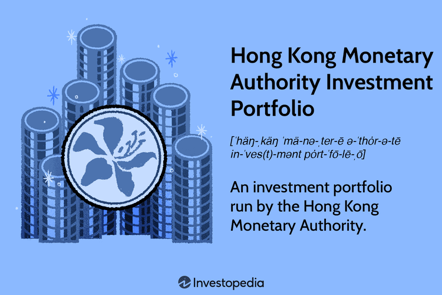

The Hong Kong Monetary Authority (HKMA) is pivotal in upholding the financial stability of Hong Kong, a leading global financial hub. Central to HKMA's function is the management of its Investment Portfolio, which is integral to maintaining currency stability and supporting the local financial system. This portfolio encompasses substantial assets, reflecting HKMA's strategic approaches to wealth management and financial security.

Algorithmic trading emerges as a significant element within this framework, offering a sophisticated mechanism to enhance the efficiency and performance of financial operations. Through predefined algorithms and computer programs, algorithmic trading allows for the automation of complex trading strategies, which are instrumental in optimizing investment returns. This leverages technology to execute trades at high speeds and with improved accuracy, reducing human error and emotional bias.

By examining the deployment of algorithmic trading within HKMA's investment practices, we gain a clearer understanding of how these technological advancements aim to maximize investment yields. This exploration sheds light on HKMA's efforts to integrate cutting-edge technologies with traditional financial management practices, positioning itself as a forward-thinking authority in global finance.

## Table of Contents

## Understanding the HKMA Investment Portfolio

The Hong Kong Monetary Authority (HKMA) plays a pivotal role in maintaining Hong Kong's monetary and financial stability, and a key component of its responsibilities is the management of the Investment Portfolio. As part of the HKMA’s Exchange Fund, the Investment Portfolio is crucial for sustaining the local currency and financial system stability. The Exchange Fund's primary objectives are monetary stability, financial system integrity, and sovereign wealth investment performance. This strategic approach positions the HKMA as a manager of one of the largest sovereign wealth funds globally.

The HKMA's Investment Portfolio is governed by a multifaceted composition and strategic objectives that pivot around risk management and return optimization. The portfolio consists mainly of bonds and equities, with significant investments in Organization for Economic Co-operation and Development (OECD) countries. This asset allocation strategy is indicative of a prudent investment philosophy that emphasizes stable returns and safeguarding against volatility.

Bonds generally represent a significant portion of the HKMA's Investment Portfolio, central to its risk-averse strategy. Bond investments predominantly include government and quasi-government bonds from OECD countries, known for their credit reliability and economic stability. Such allocation ensures a steady income stream and serves as a hedge against market fluctuations.

Equities, while traditionally more volatile, are included in the HKMA's investment strategy to enhance returns and provide growth potential. The HKMA invests in equities across developed markets, leveraging market upswings while adhering to stringent risk management protocols.

Strategically, the Investment Portfolio's objectives focus on achieving a balance between risk and return, ensuring sufficient [liquidity](/wiki/liquidity-risk-premium) to support monetary undertakings, and enhancing capital growth through systematic asset allocation. The HKMA seeks to align its asset allocation decisions with economic conditions and market opportunities, ensuring investment flexibility and a robust financial system.

In summary, the HKMA's management of the Investment Portfolio reflects a commitment to maintaining monetary stability and enhancing sovereign wealth. Through careful allocation of assets, primarily invested in stable OECD countries, the HKMA upholds its mandate to support currency stability and achieve sustainable financial returns.

 to Algorithmic Trading

Algorithmic trading refers to the use of computer algorithms to automate the execution of trading strategies. These algorithms are designed to make decisions on the quantities and timing of orders, allowing market participants to execute trades with minimal human intervention. The basic principles of [algorithmic trading](/wiki/algorithmic-trading) involve leveraging historical and real-time market data to identify profitable opportunities based on predefined trading criteria and strategies.

Technology plays a fundamental role in algorithmic trading. Advanced computer programs process vast amounts of data at high speeds, enabling traders to exploit even minuscule price discrepancies across markets. These programs use sophisticated mathematical models and statistical analyses to provide a systematic approach to trading. Algorithms can encompass a range of strategies—from simple [volume](/wiki/volume-trading-strategy)-weighted average price (VWAP) strategies to complex high-frequency trading ([HFT](/wiki/high-frequency-trading-strategies)) that involves executing millions of trades each day based on small price movements.

The benefits of algorithmic trading are significant. The foremost advantage is speed. Where human traders may require seconds or even minutes to analyze market data and execute a trade, algorithms can perform these tasks in microseconds. This rapid execution is crucial in markets where price changes are swift, and delays could lead to significant differences in trade prices.

Accuracy is another benefit. Algorithms consistently adhere to pre-set trading rules and parameters, reducing the likelihood of human errors that could occur due to emotional or psychological factors. This adherence ensures consistent trading practices and can lead to more reliable and predictable outcomes.

Furthermore, algorithmic trading offers the ability to backtest strategies using historical data. This involves simulating how a trading strategy would have performed in the past, allowing traders to optimize the strategy based on potential outcomes before it is deployed in live markets. Additionally, algorithmic trading enhances efficiency by managing large volumes of orders across diverse asset classes and markets, achieving better execution than manual processes could manage.

In summary, algorithmic trading revolutionizes financial markets by employing technology to automate and optimize trading strategies. Its primary benefits lie in its speed, accuracy, and efficiency, which contribute to improved market liquidity and reduced transaction costs.

## The Role of Algorithmic Trading in the HKMA Portfolio

The Hong Kong Monetary Authority (HKMA) leverages algorithmic trading as a fundamental component of its approach to achieving strategic and tactical asset allocation objectives within its Investment Portfolio. This method employs mathematical algorithms and sophisticated computer programs to facilitate efficient trading, enabling HKMA to manage expansive portfolios while aiming for optimal investment returns.

Algorithmic trading is crucial for managing large volumes of transactions, which is a defining characteristic of sovereign wealth funds like the HKMA's Exchange Fund. By employing algorithms, the HKMA ensures trades are executed at the most advantageous times, minimizing market impact and reducing costs. This capability is especially important for achieving the Exchange Fund's mandate of maintaining the stability of the local currency and financial system, as algorithmic trading provides speed and precision unattainable through manual methods.

The adoption of algorithmic trading is aligned with HKMA's strategic asset allocations and performance benchmarks. Algorithms are designed to execute trades based on specific criteria, such as price, volume, and timing, which are established in accordance with the HKMA's investment strategies. These algorithms are crafted to meet the fund's financial goals, which include maximizing returns while adhering to risk management parameters. 

For instance, algorithmic trading allows for the innovative execution of complex strategies like statistical [arbitrage](/wiki/arbitrage), index fund rebalancing, and order spreading. Algorithms are also beneficial in navigating the global financial markets, which are known for their liquidity and [volatility](/wiki/volatility-trading-strategies), particularly in the OECD countries where the HKMA predominantly invests. By placing and managing orders rapidly across international exchanges, algorithmic trading tools maintain competitive advantage and adherence to policy constraints.

Through algorithmic trading, HKMA not only seeks to generate returns aligned with predefined benchmarks but also to adjust the portfolio's composition dynamically in response to changing market conditions. This is accomplished by integrating strategic insights with algorithm-driven trades, allowing the HKMA to precisely time market entry and [exit](/wiki/exit-strategy) points, thereby capitalizing on transient market opportunities while maintaining portfolio integrity.

## Risk Management in Algorithmic Trading

The Hong Kong Monetary Authority (HKMA) employs a robust set of risk management practices to manage the intricacies of algorithmic trading. These practices are critical to ensuring the effective execution of trading strategies, while maintaining the overall stability and integrity of the financial markets.

One of the primary concerns associated with algorithmic trading is the potential for errors in automated systems that can lead to significant market disruptions. To address this, HKMA implements stringent system integrity protocols. Regular testing and validation of algorithms are conducted to ensure that the trading strategies operate as intended without causing unintended market volatility or compliance breaches. This involves stress testing of algorithms under different market conditions to evaluate performance and potential points of failure.

Maintaining market stability is equally crucial. Rapid, large-volume transactions are characteristic of algorithmic trading, which can amplify market movements if not managed carefully. HKMA employs measures such as circuit breakers and real-time monitoring of trades to mitigate the risks of excessive market volatility. These tools help in detecting irregular trading patterns and executing rapid interventions when abnormal activities are identified.

Regulatory compliance is another cornerstone of HKMA's risk management framework. Given the complex nature of algorithmic trading, staying abreast of the regulatory landscape is vital. HKMA ensures adherence to both local and international regulations by maintaining a transparent operation with detailed audit trails of all algorithmic transactions. This transparency enables thorough regulatory reviews and compliance checks, reducing the risk of legal and financial penalties.

The management of risks in automated trading systems also involves the implementation of robust cybersecurity protocols. With the increasing sophistication of cyber threats, HKMA prioritizes the protection of its trading infrastructure against potential breaches. Advanced security measures, including encryption and network segmentation, are employed to safeguard sensitive trading data and prevent unauthorized access.

To summarize, the risk management practices applied by the HKMA in algorithmic trading are geared towards preserving system integrity and market stability while ensuring stringent regulatory compliance. These practices are essential for mitigating the inherent risks associated with automated trading and protecting the interests of Hong Kong’s financial system.

## Future Outlook

The landscape of algorithmic trading within sovereign wealth funds such as the Hong Kong Monetary Authority (HKMA) is poised for notable developments. As technology continues to evolve, algorithmic trading is expected to advance, impacting the financial management of significant investment portfolios. These changes are primarily driven by developments in [artificial intelligence](/wiki/ai-artificial-intelligence) (AI), [machine learning](/wiki/machine-learning), and high-frequency trading systems.

AI and machine learning have the potential to revolutionize algorithmic trading by enhancing decision-making processes through improved pattern recognition and predictive capabilities. These technologies can analyze vast datasets more efficiently and swiftly than traditional methods, identifying market trends and generating optimized trading strategies. This could lead to a more dynamic and adaptable approach to asset management, allowing entities like the HKMA to respond rapidly to market changes and optimize returns.

Another key trend shaping the future is the increased importance of data analytics. The integration of big data analytics into trading algorithms offers the potential to extract actionable insights from diverse data sources. By leveraging these insights, sovereign wealth funds can achieve a more granular understanding of market dynamics and investor behavior, facilitating more informed investment decisions.

Additionally, the adoption of blockchain technology may influence the transparency and security of trading operations. Blockchain can offer an immutable decentralized ledger for transactions, potentially reducing risks associated with intermediaries and enhancing the robustness of algorithmic systems against fraud and cyber threats.

The HKMA continues to adapt by incorporating these technological advancements into its investment strategies. This ongoing adaptation is characterized by a commitment to innovation and a proactive approach to regulatory compliance and system integrity. By aligning its efforts with cutting-edge technologies, the HKMA aims to maintain its competitive edge in global financial markets and set a benchmark for other sovereign wealth funds in algorithmic trading and financial management.

As these technologies mature, sovereign wealth funds like the HKMA are likely to see a transformative impact on their investment operations. The synergy between advanced technologies and algorithmic trading presents opportunities for more efficient, transparent, and profitable financial management strategies, ensuring robust performance and stability in increasingly complex financial environments.

## Conclusion

The Hong Kong Monetary Authority (HKMA) Investment Portfolio stands as a critical pillar in sustaining Hong Kong's financial resilience, with algorithmic trading serving as a pivotal component in maximizing its performance. By employing sophisticated algorithms, the HKMA efficiently manages its extensive assets, ensuring that the enormous volume of transactions is handled with precision and speed. This technological integration enables the HKMA to align its investments with strategic benchmarks, optimizing returns while maintaining market stability.

The advancement of technology-driven strategies within the HKMA does not eliminate the importance of traditional investment principles. Instead, it represents a harmonious blend where algorithmic efficiency complements human judgment and strategic insights. This balance ensures that while the HKMA leverages cutting-edge techniques, it remains grounded in established economic and financial frameworks. As such, the HKMA demonstrates that the future of financial management lies in the synergy between automated and manual strategies.

Furthermore, the HKMA sets a notable precedent for other financial authorities globally. By successfully incorporating algorithmic trading into its operations, it exemplifies how institutions can navigate the complexities of modern financial markets through innovation and adaptability. The HKMA's approach not only enhances its investment portfolio's performance but also offers a model for embracing technology in financial management. This leadership role is crucial as the financial landscape continues to evolve, encouraging other authorities to explore similar advancements in their quest for financial stability and efficiency.

## References & Further Reading

[1]: ["Advances in Financial Machine Learning"](https://www.amazon.com/Advances-Financial-Machine-Learning-Marcos/dp/1119482089) by Marcos Lopez de Prado

[2]: ["Evidence-Based Technical Analysis: Applying the Scientific Method and Statistical Inference to Trading Signals"](https://www.amazon.com/Evidence-Based-Technical-Analysis-Scientific-Statistical/dp/0470008741) by David Aronson

[3]: ["Machine Learning for Algorithmic Trading"](https://github.com/stefan-jansen/machine-learning-for-trading) by Stefan Jansen

[4]: ["Quantitative Trading: How to Build Your Own Algorithmic Trading Business"](https://www.amazon.com/Quantitative-Trading-Build-Algorithmic-Business/dp/1119800064) by Ernest P. Chan

[5]: Bergstra, J., Bardenet, R., Bengio, Y., & Kégl, B. (2011). ["Algorithms for Hyper-Parameter Optimization."](https://dl.acm.org/doi/10.5555/2986459.2986743) Advances in Neural Information Processing Systems 24.